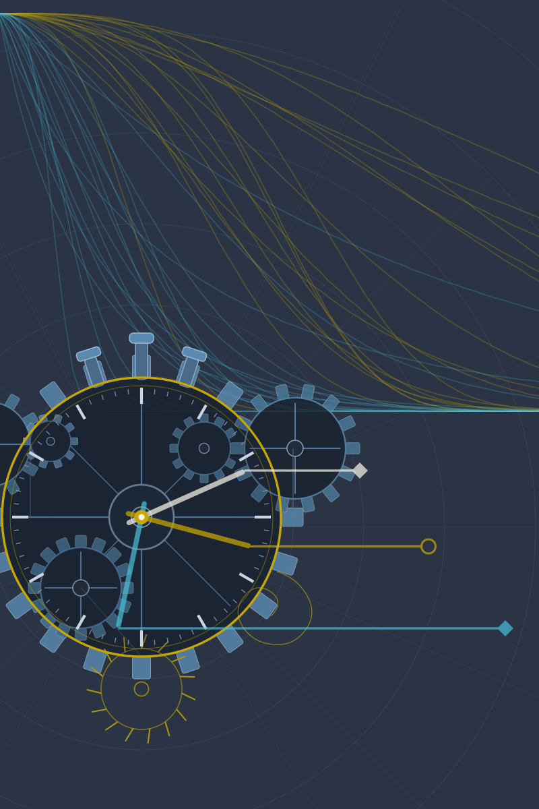

# Machine Learning in Survival Analysis

<!--
Source - https://stackoverflow.com/a/72317451
Posted by brc-dd, modified by community. See post 'Timeline' for change history
Retrieved 2026-06-12, License - CC BY-SA 4.0
-->

<picture>
  <source media="(prefers-color-scheme: dark)" srcset="book/Figures/cover-new-inverse.svg" align="right" width="200">
  
</picture>

This book is a work in progress, the final work will be published by Chapman and Hall/CRC.
This electronic version will always be free and open access ([CC BY-NC-SA 4.0](https://creativecommons.org/licenses/by-nc-sa/4.0/)).

We will endeavor to update this version after publication to correct mistakes (big and small) and to potentially make minor and major additions.

## Citing this book

Please cite this book as:

```
Bender, A., Sonabend, R.  (2026).
"Machine Learning in Survival Analysis". CRC Press. ISBN: {coming soon}
https://www.mlsabook.com.
```

Or in BibTeX format:

```
@book{MLSA2026,
    title = {Machine Learning in Survival Analysis},
    author = {Bender, Andreas and Sonabend, Raphael},
    url = {https://www.mlsabook.com/},
    year = {2026},
    isbn = {coming soon},
    publisher = {CRC Press}
}
```

## Contributing to this book

We welcome contributions to the electronic copy of the book, whether they're picking up typos or suggesting new content, please open an [issue](https://github.com/mlsa-book/MLSA/issues) to get in touch.
Contributions may be acknowledged in the preface of the online book.
Before making any contributions please read our [code of conduct](https://github.com/mlsa-book/MLSA?tab=coc-ov-file#readme).
