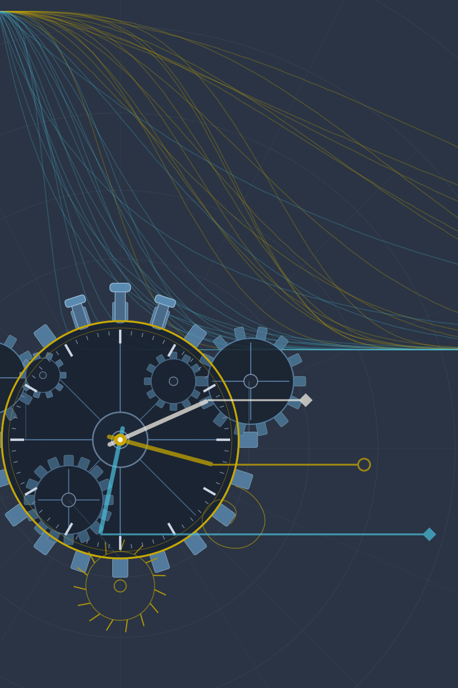

# Machine Learning for Survival Analysis

<!--
Source - https://stackoverflow.com/a/72317451
Posted by brc-dd, modified by community. See post 'Timeline' for change history
Retrieved 2026-06-12, License - CC BY-SA 4.0
-->

<picture>
  <source media="(prefers-color-scheme: dark)" srcset="book/Figures/cover-new-inverse.svg" align="right" width="200">
  
</picture>

This electronic version will always be free and open access ([CC BY-NC-SA 4.0](https://creativecommons.org/licenses/by-nc-sa/4.0/)).
[Buying the book](https://www.routledge.com/Machine-Learning-for-Survival-Analysis/Bender-Sonabend/p/book/9781032537498) will be the greatest indicator to us that a second edition may be useful in the future.
We will strive to update this version after publication to correct mistakes (big and small).
If you notice any mistakes, please feel free to [open an issue](https://github.com/mlsa-book/MLSA/issues).

## Citing this book

Please cite this book as:

```
Bender, Andreas, & Sonabend, Raphael. (2027).
Machine Learning for Survival Analysis.
Chapman and Hall/CRC.
```

Or in BibTeX format:

```
@book{MLSA2027,
    title = {Machine Learning for Survival Analysis},
    author = {Bender, Andreas and Sonabend, Raphael},
    url = {https://www.mlsabook.com/},
    year = {2027},
    isbn = {9781032537498},
    publisher = {Chapman and Hall/CRC}
}
```

## Contributing to this book

We welcome contributions to the electronic copy of the book, whether they're picking up typos or suggesting new content, please open an [issue](https://github.com/mlsa-book/MLSA/issues) to get in touch.
Contributions may be acknowledged in the preface of the online book.
Before making any contributions please read our [code of conduct](https://github.com/mlsa-book/MLSA?tab=coc-ov-file#readme).
