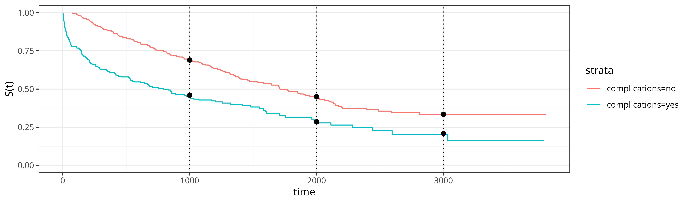
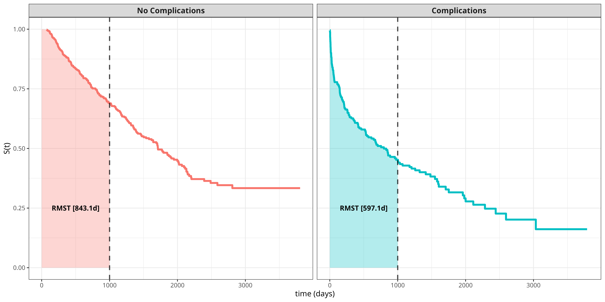

::: {.content-visible when-format="html"}

:::

# Pseudo-Value Regression {#sec-pseudo-value-reduction}

Pseudo-value-based approaches were introduced to survival analysis by @andersen2003generalisedlinear and have since gained traction due to their flexibility and ease of application.
This approach allows standard regression learners to be applied to censored survival data by transforming the original outcomes into _pseudo-values_.\index{pseudo-values}
The term 'pseudo-value' reflects the fact that these quantities are not identical to the outcome of interest but behave similarly in expectation.\index{reduction!pseudo-value regression}

Formally, let $\psi(\tau \mid \xx)$ denote the (population) quantity of interest, for example the survival probability, $S(\tau \mid \xx)$, or restricted mean survival time, $\RMST(\tau \mid \xx)$.
Let $\psi(\tau)$ denote the corresponding marginal quantity and $\hat\psi(\tau)$ its estimate, for example the Kaplan-Meier estimate fitted on all $n$ observations in the training data.
Let $\hat\psi^{-i}(\tau)$ denote the same estimator computed after omitting the $i$th observation from the dataset.

The pseudo-value for observation $i$ is defined using the jackknife procedure,\index{jackknife}

$$
\tildey_i(\tau) = n\hat\psi(\tau) - (n-1)\hat\psi^{-i}(\tau).
$${#eq-pseudo-value}

Computing all pseudo-values, $\tildey_1(\tau), \ldots, \tildey_n(\tau)$, requires $n+1$ evaluations of the univariate estimator ($n$ evaluations of $\hat\psi^{-i}(\tau)$ and one evaluation of $\hat\psi(\tau)$) for each of the $m$ time points of interest, resulting in $m(n+1)$ evaluations in total.
Although this may seem computationally demanding, univariate estimators are typically very fast to compute, and efficient approximations have been proposed in the literature [@bouaziz2023fastapproximations; @parnerRegressionModelsCensored2023].
Furthermore, pseudo-value methods are most commonly used when only a small number of time points are of interest, so $m$ is usually small.

A key property of pseudo-values is that under mild conditions on $\hat\psi$, the conditional population quantity is well approximated by the conditional expectation of a pseudo-value, treated as a random variable in the underlying sample [@andersen2003generalisedlinear; @Andersen2010]:

$$
\psi(\tau \mid \xx_i) \;\approx\; \EE[\tildey_i(\tau) \mid \xx_i].
$$ {#eq-pseudo-value-expectation-1}

This approximate unbiasedness motivates regressing $\tildey_i$ on $\xx_i$ in this reduction.
The relationship between features $\xx_i$ and pseudo-values $\tildey_i(\tau)$ can then be learned through regression, with a separate model fitted for a given time point of interest $\tau$,

$$
\EE[\tildey_i(\tau)\mid\xx_i] = g(\xx_i\mid\bstheta_\tau),
$$ {#eq-pseudo-value-expectation-2}

where $g(\xx_i\mid \bstheta_\tau)$ is the model's output for time point $\tau$, learned by optimizing the parameters $\bstheta_\tau$, for example, $g(\xx_i\mid \bstheta_\tau) = \xx_i^\trans\bstheta_\tau$ for linear regression.\index{linear regression}
The parameters $\bstheta_\tau$, and hence the function, differ for each time point $\tau$.

It follows from (@eq-pseudo-value-expectation-1) and (@eq-pseudo-value-expectation-2) that the fitted regression models can be used to make predictions of the quantity of interest conditional on covariates,

$$
\hat{\psi}(\tau\mid\xx_i) \approx \hat{\tilde{y}}_i = g(\xx_i\mid\hat{\bstheta}_\tau).
$$

Going forward, when referring to the fitted model, this notation is simplified to:

$$
\hat{\psi}(\tau \mid \xx_i) = g(\xx_i\mid\hat{\bstheta}_\tau).
$$

Rather than learning $g(\cdot)$ directly, the model often learns a *predictor function*, $\eta(\xx_i\mid\bstheta_\tau)$, combined with a transformation via a known *response function*, $r(\cdot)$, such that 

$$
g(\xx_i\mid\bstheta_\tau) = r(\eta(\xx_i\mid\bstheta_\tau)).
$$ {#eq-pseudo-value-response-function}

The response function maps the predictor $\eta$ to the target space (as with neural networks; @sec-nnet-activations).
Its inverse $r^{-1}(\cdot)$ is the *link function*, commonly used in generalized linear models.\index{link function}
A response function is often required as pseudo-values can take any value on $\Reals$ but the target quantity of interest might be constrained to a smaller set, for example survival probabilities must be within $[0,1]$.
The model may be estimated with the response function embedded in the fitting process, as in generalized estimating equations [@hardinGeneralizedEstimatingEquations2012], or the response may be applied to the predictions, as in many machine learning methods.
The choice of response function, and consequences for estimation and interpretation, are discussed in @sec-pseudo-value-response-function.

The following sections introduce two common applications of pseudo-values: survival probability prediction (@sec-pseudo-value-S) and restricted mean survival time prediction (@sec-pseudo-value-rmst).
Finally, @sec-pseudo-value-eha extends this reduction to competing risks and multi-state models.

## Pseudo-values for survival probabilities {#sec-pseudo-value-S}

This section details the use of pseudo-values for survival probability predictions at selected time points.\index{reduction!pseudo-value regression!survival probabilities}
For illustration, consider the tumor dataset (introduced in @tbl-surv-data-tumor), which contains right-censored data for $n=776$ observations on time-until-death after operation (in days) and features 'age' and 'complications', which indicates whether complications occurred during tumor removal.
For this example, a simple linear model is used for (@eq-pseudo-value-expectation-2) but any (machine learning) regression model could be used in practice.

Say a clinician is interested in the conditional survival probability of tumor patients at time points $\tau \in \{1000, 2000, 3000\}$ days. 
The true quantity of interest is $\psi(\tau \mid \xx_i) = S(\tau \mid \xx_i)$, for which a commonly used univariate estimator is the Kaplan-Meier estimator, $\psi(\tau) = S_{KM}(\tau)$.
Pseudo-values are then calculated as

$$
\tildey_i(\tau) = n\KMS(\tau) - (n-1)\KMS^{-i}(\tau).
$$ {#eq-pseudo-value-calculation-S}

The resulting estimates and calculated pseudo-values are shown for the first 4 subjects of the data in @tbl-pseudo-value-calculation for $\tau = 1000$ days.
While the differences in leave-one-out Kaplan-Meier estimates may appear small ($<0.01$ difference), these lead to larger differences in pseudo-values once plugged into (@eq-pseudo-value-calculation-S).

| complications | age | $i$| $t_i$| $\delta_i$| $\KMS(\tau)$| $\KMS^{-i}(\tau)$| $\tildey_i(\tau)$|
|:-------|-------:|-------:|-------:|-------:|-------:|-------:|-------:|
|  no | 58 |       1|  579|      0|     0.6175|     0.6172|       0.8597|
|  yes | 52  |       2| 1192|      0|     0.6175|     0.6169|       1.0600|
|  no | 74          |       3|  308|      1|     0.6175|     0.6184|      -0.0442|
|  yes | 57        |       4|   33|      1|     0.6175|     0.6183|      -0.0119|

: Illustration of pseudo-value calculation for the first 4 subjects from the tumor dataset at time point $\tau = 1000$ days. The table shows the overall Kaplan-Meier estimate $\KMS(\tau)$ calculated for all $776$ subjects, the leave-one-out Kaplan-Meier estimate $\KMS^{-i}(\tau)$ (obtained by omitting subject $i$), and the calculated pseudo-value $\tildey_i(\tau)$. The features age and complications are not used for the calculation of the pseudo-values but are included in the regression step. {#tbl-pseudo-value-calculation}

A linear model is then fit to these pseudo-values (@tbl-pseudo-value-calculation), giving

$$
\hat{S}(\tau \mid \xx_i) = \hat{\tilde{y}}_i(\tau) = \xx_i^\trans\hat{\bsbeta}_{\tau}.
$$ {#eq-pseudo-value-S-lm}

To illustrate some of the main advantages of this method, consider fitting the pseudo-values using a linear model of the form:

$$
\hat{S}(\tau \mid \xx_i) = \hat{\beta}_{\tau,0} + \hat{\beta}_{\tau,1} x_{i,1},\quad x_{i,1} = \II(\text{complications}_i = \text{`yes'}),
$$ {#eq-pseudo-value-S-lm-complications}

for time points $\tau \in \{1000, 2000, 3000\}$ days. 

The results are shown in @fig-pseudo-lm, where the black dots indicate the survival probability predictions from (@eq-pseudo-value-S-lm-complications) and the solid curves are Kaplan-Meier estimates of the survival probabilities stratified by the 'complications' variable.
Despite the pseudo-values being computed from a single, *unstratified* Kaplan-Meier estimator, the predictions still closely match the *stratified* estimates.
The reason is that a separate regression is fitted at each time point $\tau$, with the coefficients estimated independently, so the difference between groups is free to vary over time.
The separation between the curves suggests the proportional hazards assumption may not hold for this data, which the pseudo-value approach accommodates naturally, since the group effect $\hat{\beta}_{\tau,1}$ is not constrained to be constant across $\tau$.

In this example the identity response function is used, so the model places no constraint on the target space, $g(\xx\mid\bstheta_\tau) = \eta(\xx\mid\bstheta_\tau) = \xx^\trans\bstheta_\tau$, and the predictions could in principle fall outside $[0,1]$.
Nonetheless, all of the estimated survival probabilities lay within the valid range.
A practical advantage of this parametrization is that the fitted coefficients are directly interpretable on the survival-probability scale, unlike a Cox model, whose coefficients are interpretable only as hazard ratios. 
For example, $\hat{\beta}_{1000,1} \approx -0.23$, so at $\tau = 1000$ days the expected survival probability for patients with complications is around 23 percentage points lower than for those without complications.
This interpretability also carries to other time points, for example at $\tau = 2000$ days, $\hat{\beta}_{2000,1} \approx -0.18$, and at $\tau = 3000$ days, $\hat{\beta}_{3000,1} \approx -0.13$; thus, the average effect of complications depends on $\tau$ and decreases over time (complications have a time-varying effect).\index{time-varying effects}

{#fig-pseudo-lm fig-alt="Two Kaplan-Meier curves with S(t) on y-axis and time from 0 to 3000 days on the x-axis. Curves are stratified by no complications (red line) and complications (blue line). The red line runs in parallel above the blue line indicating lower overall risk. At times 1000, 2000, and 3000, there are black dots on the Kaplan-Meier curves, indicating that the pseudo-value predictions align well with the Kaplan-Meier estimates."}

In practice, if the data only contained a single, discrete feature, then a stratified Kaplan-Meier estimator could be used instead of the pseudo-value approach.
Thus, as a final illustration, consider adding age to the model,

$$
\begin{aligned}
\hat{S}(\tau \mid \xx_i) = \hat{\beta}_{\tau,0} + \hat{\beta}_{\tau,1} x_{i,1} + \hat{\beta}_{\tau,2} x_{i,2},\\ \quad x_{i,1} = \II(\text{complications}_i = \text{`yes'}), x_{i,2} = \text{age}_i,
\end{aligned}
$$

and again the response function, $r(\cdot)$, is the identity function.
The resulting estimates are in @tbl-pseudo-lm-age, where the effects of age and complications are calculated for each time point $\tau \in \{1000, 2000, 3000\}$ days separately.

| $\tau$|     $\hat{\beta}_{\tau,1}$| $\hat{\beta}_{\tau,2}$|
|--------:|-------------:|-------:|
|     1000|       -0.2205| -0.0032|
|     2000|       -0.1428| -0.0070|
|     3000|       -0.1050| -0.0071|
: Estimates of the effects of complications, $\hat{\beta}_{\tau,1}$, and age, $\hat{\beta}_{\tau,2}$, on the survival probability at different time points $\tau \in \{1000, 2000, 3000\}$ days. {#tbl-pseudo-lm-age}

Conditional on $\tau$, the interpretation is equivalent to a standard multiple linear regression model. For example, at $\tau = 1000$ days, the effect of age is $\hat{\beta}_{1000,2} \approx -0.0032$, which means that, holding the other covariates fixed, the expected survival probability is reduced by around 0.32 percentage points per additional year of age.
In contrast, at $\tau=2000$ days, the survival probability is reduced by around 0.70 percentage points per additional year of age (7 percentage points for a 10-year difference), meaning age has more than double the impact for later time points.
Therefore, even as the number of covariates increases, the pseudo-value approach remains a highly interpretable reduction.

## Pseudo-values for RMST {#sec-pseudo-value-rmst}

Another common use for the pseudo-value approach is the restricted mean survival time (RMST; @sec-survtsk), for which the standard plug-in estimator is \index{reduction!pseudo-value regression!restricted mean survival time}\index{restricted mean survival time}

$$
\RMST(\tau) = \int_0^\tau S_{KM}(y) \ \dy,
$$

giving the calculated pseudo-values

$$
\tildey_i(\tau) = n \widehat{\RMST}(\tau) - (n-1)\widehat{\RMST}^{-i}(\tau),
$$

where $\tildey_i(\tau)$ is the pseudo-value of the restricted mean survival time at time $\tau$ for observation $i$.

Continuing the tumor data example from @sec-pseudo-value-S, consider how the RMST depends on features. 
The general idea is illustrated in @fig-pseudo-rmst, which displays survival curves for each group (complications vs. no complications) with the RMST shown as the area under the curve up to $\tau = 1000$ days.
Thus, within the first 1000 days after operation, patients with complications are expected to live 246 days less than patients without complications (the difference between the areas under the two curves).

{#fig-pseudo-rmst fig-alt="Two-panel faceted plot showing survival curves for patients with and without complications. Each panel displays a survival curve with the area under the curve up to 1000 days shaded in a transparent color, representing the Restricted Mean Survival Time (RMST). The RMST on the left plot (no complications) is 843.1 days, the RMST on the right plot (complications) is 597.1 days."}

To compare the RMST estimates to the pseudo-value approach, fit the linear model 

$$
\widehat{\RMST}(\tau \mid \xx_i) = \hat{\tilde{y}}_i(\tau) = \hat{\beta}_{\tau,0} + \hat{\beta}_{\tau,1} x_{i,1},\quad x_{i,1} = \II(\text{complications}_i = \text{`yes'}),
$$

again assuming the identity function for the response.

For time point $\tau = 1000$ days, the estimated coefficient is $\hat{\beta}_{1000,1} \approx -239$. 
Thus, the expected RMST for patients with complications is reduced by around 239 days, which is close to the result obtained from the Kaplan-Meier analysis in @fig-pseudo-rmst. 
Once again, this model can be extended to include age such that

$$
\widehat{\RMST}(\tau \mid \xx_i) = \hat{\beta}_{\tau,0} + \hat{\beta}_{\tau,1} x_{i,1} + \hat{\beta}_{\tau,2} x_{i,2},\quad x_{i,1} = \II(\text{complications}_i = \text{`yes'}), x_{i,2} = \text{age}_i,
$$

where $x_{i,1}$ as before and $x_{i,2}$ is the age of subject $i$.
The respective estimates are $\hat{\beta}_{1000,1} \approx -230$ and $\hat{\beta}_{1000,2} \approx -3$, such that, holding the other covariates fixed, the expected RMST is reduced by around 3 days per year of age.
The effect of complications, $\hat{\beta}_{1000,1}$, is slightly reduced when age is included and can be interpreted as the effect of complications on RMST adjusted for age.

## Choice of response function {#sec-pseudo-value-response-function}

The examples in @sec-pseudo-value-S and @sec-pseudo-value-rmst assumed the identity response for simplicity.\index{response function}
In general, the response function $r(\cdot)$ in (@eq-pseudo-value-response-function) is a modeling choice with two distinct but related consequences: how the model is estimated, and how covariate effects are interpreted.

### Post-hoc vs. embedded applications

The simplest approach is to apply $r(\cdot)$ post-hoc, meaning a regression model is fit on the raw pseudo-values (for example, minimizing squared error) and then the predictions are transformed.
This is straightforward and works with any off-the-shelf regression method, but the optimization objective no longer corresponds to the final target space.
For example, when $r(\cdot)$ is the sigmoid, a model trained with squared error on pseudo-values $\tildey_i \in \Reals$ will not necessarily minimize the error of the final probabilities $r(\hat\eta(\xx)) \in [0,1]$.

The alternative is to embed $r(\cdot)$ into the fitting process by modifying the loss function.
This works particularly well for models that support custom loss functions, such as gradient boosting machines (@sec-boost) and neural networks (@sec-nnet).
For example, when the target is a survival probability, one can use the binary log loss (@sec-rules),
$$
\ell(\tildey_i, \eta(\xx_i\mid\bstheta_\tau)) = -\left[\tildey_i \log r(\eta(\xx_i\mid\bstheta_\tau)) + (1 - \tildey_i) \log(1 - r(\eta(\xx_i\mid\bstheta_\tau)))\right],
$$

where $r(\cdot)$ is the sigmoid function and $\eta(\xx_i\mid\bstheta_\tau)$ is the model output on the logit scale (@tbl-pseudo-link-interpretation).
This approach ensures the gradient updates during training are consistent with the final probability scale, which can improve calibration and estimation [@Hothorn2021].
For RMST targets, which take values in $[0, \tau]$, the exponential response is a natural choice to guarantee positive fitted values.
Using this response function yields coefficients interpretable as log-RMST ratios [@andersen2004regressionanalysis; @Sachs2022].

Although alternative response functions are available, the identity response (or a post-hoc transformation) is often sufficient in practice and may be preferred for its simplicity, particularly when only predictive performance is of interest.
This works best when $\tau$ is not too close to the start or end of follow-up, as the pseudo-values then stay away from the boundary of the target space (for example, near $0$ or $1$ when estimating probabilities).
This was seen in @fig-pseudo-lm, where the predictions remained within the required $[0,1]$ range despite the use of the identity response function.

### Interpretation of covariate effects

The response function determines how estimated feature effects should be interpreted.
@tbl-pseudo-link-interpretation summarizes the most common choices when estimating survival probabilities, along with their interpretations after the response function is applied; all assume a linear predictor $\hat\eta$, with estimated coefficients $\hat{\bsbeta}_\tau$.

| Link $r^{-1}(\hat{\psi})$ | Response $r(\hat\eta(\xx))$ | Interpretation of $\hat{\beta}_{\tau,j}$ |
|---|---|---|
| Identity $\hat{\psi}$ | Identity $\hat\eta(\xx)$ | Absolute difference in $\hat{\psi}(\tau\mid\xx)$ per unit increase in $x_j$ |
| Logit $\log\frac{\hat{\psi}}{1-\hat{\psi}}$ | Sigmoid $\left[1+\exp(-\hat\eta(\xx))\right]^{-1}$ | Log-odds ratio for the event at $\tau$; $e^{\hat{\beta}_{\tau,j}}$ is an odds ratio |
| Complementary log-log $\log(-\log(\hat{\psi}))$ | Complementary log-log inverse $\exp(-\exp(\hat\eta(\xx)))$ | Log-hazard ratio; $e^{\hat{\beta}_{\tau,j}}$ is a hazard ratio, equivalent to Cox PH at $\tau$ |
| Log $\log(\hat{\psi})$ | Exponential $\exp(\hat\eta(\xx))$ | Log-survival ratio; $e^{\hat{\beta}_{\tau,j}}$ is a survival ratio |

: Common response functions for pseudo-value regression on estimated survival probability targets ($\hat{\psi} = \hat{S}(\tau \mid \xx)$) and the associated interpretation of their corresponding covariate effects. {#tbl-pseudo-link-interpretation}

A particular link function to note is the complementary log-log link.\index{complementary log-log}
For survival probability $\hat{S}(\tau \mid \xx)$, applying the complementary log-log link gives

$$
\begin{aligned}
\hat\eta(\xx)
&= \log\left(-\log(\hat{S}(\tau \mid \xx))\right) \\
&= \log\left(\hat{H}(\tau \mid \xx)\right) \\
&= \log\left(\hat{H}_0(\tau)\exp(\xx^\trans\hat{\bsbeta}_\tau)\right) \\
&= \log\left(\hat{H}_0(\tau)\right) + \xx^\trans\hat{\bsbeta}_\tau,
\end{aligned}
$$ {#eq-cloglog-ph}

where the second equality follows from the usual relationships between the survival and cumulative hazard functions (@eq-surv-haz), and the third follows by parameterizing $\hat{H}(\tau \mid \xx)$ using a proportional-hazards-type form with baseline cumulative hazard $\hat{H}_0(\tau)$.
If the estimated coefficients were equal at all time points, $\hat{\bsbeta}_\tau = \hat{\bsbeta}, \forall \tau$, then (@eq-cloglog-ph) recovers the proportional hazards form (@eq-ph-cum) and $\exp(\hat{\beta}_j)$ can be interpreted as a hazard ratio for feature $j$.\index{proportional hazards}
Therefore, (@eq-cloglog-ph) provides a convenient way to investigate the proportional hazards assumption: substantial variation in $\hat{\bsbeta}_\tau$ across $\tau$ suggests a violation of proportional hazards [@Andersen2010].
The form in (@eq-cloglog-ph) demonstrates how the pseudo-value framework generalizes the proportional hazards formulation by allowing departures from proportionality through time-varying effects.\index{time-varying effects}

For RMST targets, the identity link yields coefficients directly interpretable as differences in expected survival time (for example, days), whereas the log link gives log-RMST-ratios [@royston2011use].
The former is more common in practice due to its direct clinical interpretability [@tian2014predicting].

## Pseudo-values in event history analysis {#sec-pseudo-value-eha}

The pseudo-value approach can be extended to more complex event history settings, including competing risks and multi-state models [@andersen2003generalisedlinear; @Andersen2010; @parnerRegressionModelsCensored2023]. The key idea remains the same: use univariate, non-parametric estimators of the quantity of interest to calculate pseudo-values, which can then be used as target variables in regression models.

### Pseudo-values for competing risks {#sec-pseudo-value-cr}

In the competing risks setting (@sec-competing-risks), a quantity of particular interest is the cumulative incidence function (CIF) $F_q(\tau)$.\index{reduction!pseudo-value regression!competing risks}\index{competing risks}
A consistent estimator for the CIF is the Aalen-Johansen estimator (@sec-aalen-johansen) and pseudo-values for the CIF are thus given by:

$$
\tildey_{i,q}(\tau) = n\hat{F}_{AJ,q}(\tau) - (n-1)\hat{F}_{AJ,q}^{-i}(\tau),
$$

where $\hat{F}_{AJ,q}^{-i}(\tau)$ is the Aalen-Johansen estimate of the CIF for event type $q$ obtained by omitting the $i$th observation from the dataset.

Once calculated, these pseudo-values can be used as target variables in regression models to estimate the conditional CIF, $F_q(\tau \mid \xx_i)$, via (@eq-pseudo-value-expectation-2).
Using the identity function for the response, one can directly interpret the feature effects on the cumulative incidence of a specific event type.

### Pseudo-values for multi-state models {#sec-pseudo-value-occupation-prob}

In multi-state settings (@sec-multi-state), pseudo-values can be used to estimate state occupation probabilities conditional on features.\index{reduction!pseudo-value regression!multi-state models}
These represent the probability of being in state $q$ at time $\tau$.
Non-parametric estimators for state occupation probabilities can be obtained via the Aalen-Johansen estimator for multi-state models (@sec-ms-state-occupation).
The pseudo-values for state occupation probabilities are then defined as:

$$
\tildey_{i,q}(\tau) = n\hat{P}_{AJ,q}(\tau) - (n-1)\hat{P}_{AJ,q}^{-i}(\tau),
$$

where $\hat{P}_{AJ,q}(\tau)$ is the Aalen-Johansen estimate of the state occupation probability for state $q$ at time $\tau$, and $\hat{P}_{AJ,q}^{-i}(\tau)$ is the same estimate obtained by omitting the $i$th observation.

These pseudo-values can be used to model conditional state occupation probabilities $P_q(\tau \mid \xx_i)$ using standard regression techniques. This approach is particularly flexible as it allows for modeling state occupation probabilities directly, without the need to specify and estimate all transition hazards [@andersen2003generalisedlinear].

## Conclusion

:::: {.callout-warning icon=false}

## Key takeaways

* The pseudo-value regression reduction estimates quantities of interest at specific time points conditional on covariates by transforming censored survival outcomes into regression targets derived from univariate estimators.
* The approach avoids strong assumptions such as proportional hazards and accelerated failure time, naturally accommodates time-varying effects, and extends to competing risks and multi-state settings.
* When the identity response is used, feature effects are directly interpretable on the scale of the target quantity, and standard survival analysis metrics can be used for model evaluation.
* Pseudo-values are not independent, can fall outside the natural range of the target quantity, and may be computationally expensive to calculate for many time points, although response functions and efficient approximations can mitigate these limitations.

::::

:::: {.callout-tip icon=false}

## Further reading

* @andersen2003generalisedlinear is the foundational paper introducing pseudo-value regression via generalized estimating equations (GEE), with applications to multi-state models.
* @andersen2004regressionanalysis extends the pseudo-value approach to RMST targets.
* @Andersen2010 provides a comprehensive overview of pseudo-value methods in survival analysis.
* @parnerRegressionModelsCensored2023 and @bouaziz2023fastapproximations specifically discuss pseudo-value calculations in the context of different censoring types.
* @Sachs2022 describe computational approaches and provide an implementation in the R package `eventglm`.
* @mogensen2013randomforestb extend the pseudo-value idea to random forests in the competing risks setting.
* @Zhao2020 and @Schenk2025 illustrate how pseudo-values can be used as targets for deep neural networks and random forests, respectively.

::::

