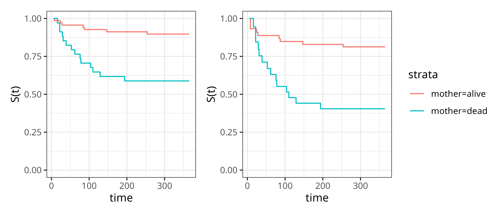

::: {.content-visible when-format="html"}

:::

# Survival Analysis {#sec-surv}

*Survival analysis*\index{survival analysis} is the study of data where the outcome is the time until an event takes place (a 'time-to-event').
Because the collection of such data takes place in the temporal domain (it takes time to observe a duration), the event of interest is often unobservable, for example because it did not occur by the end of the data collection period.
In survival analysis terminology this is referred to as *right-censoring*,\index{censoring!right} one of several censoring\index{censoring} mechanisms introduced below.

This chapter defines basic terminology and mathematical definitions in survival analysis, which are used throughout this book.
Building upon this chapter, @sec-eha introduces event history analysis\index{event history analysis}, which is a generalization to settings with multiple, potentially competing or recurrent events\index{competing risks}\index{recurrent events}, including multi-state outcomes\index{multi-state models}.
Concluding this part of the book, @sec-survtsk defines different prediction tasks\index{tasks} in survival analysis.

These definitions and concepts are standard in survival analysis, but are presented explicitly here as precise familiarity with them is essential for building successful models.
Evaluation functions\index{evaluation} (Part II) can identify if one model is better suited than another to minimize a given objective function.
However, they cannot identify whether the objective function itself is correctly specified as that specification depends on assumptions about the data-generating process.
For example, the type(s) of censoring/truncation present\index{censoring}\index{truncation}, whether the censoring time $C$ is independent of the event time $Y$ (marginally or conditionally on covariates $X$), and whether competing events are present.
Misstating these assumptions yields a mismatched estimand: evaluating under these assumptions produces meaningless (even if plausible looking) results.
It is therefore vital for practitioners to be able to identify and specify the survival problem present in their data to ensure models are correctly fit and evaluated.

## Quantifying the distribution of event times {#sec-distributions}

This section introduces functions that can be used to fully characterize a probability distribution\index{probability distribution}, with particular focus on functions that are important in survival analysis.

In the temporal domain, events can either be recorded in discrete or continuous time.
For example, the number of rounds of chemotherapy before remission would be recorded as a discrete-time value\index{discrete-time survival analysis}.
The number of rounds, while still measured over time, can only take values in the positive naturals, $\PNaturals$.
In contrast, if a practitioner were instead recording the time to remission from the first round of chemotherapy, then this may be recorded as the elapsed time between the first treatment and remission, which is a continuous-time measurement over the non-negative reals, $\NNReals$.

In practice, the differences between continuous and discrete time measurements are often blurred.
Time measurements are naturally discretized at some level and precision beyond some resolution is often not of interest.
For example, length of stay in hospital could be interesting up to days or even hours, but not minutes and seconds.
Software implementations of survival analysis techniques usually rely on continuous-time theory, and continuous-time methods are typically applied even when the underlying data are technically discrete.
It is nevertheless important to make the distinction as it informs mathematical treatment and definition of the different quantities introduced below.
Moreover, discrete-time methods can be applied to continuous-time data (@sec-partition-based-reductions) and separate discussion is therefore important to understand those techniques \index{reductions}.

::: {.callout-note icon=false}

# Handling events at $\tau = 0$

In the literature, continuous-time outcomes are usually defined on the non-negative Reals, $\tau \in \NNReals$, which allows events to occur at $\tau = 0$.
In practice, most model implementations assume time lies on the positive Reals, $\tau \in \PReals$, and therefore cannot accommodate events at $\tau = 0$.

Although relatively uncommon, observations with $\tau = 0$ do arise in real data and must be addressed during data preprocessing before model fitting.
Some strategies include:

1. Removing observations with $t_i = 0$;
2. Replacing $t_i = 0$ with a small positive constant $\epsilon>0$;
3. Setting $t_i$ to the smallest observed event time greater than zero.

These choices are context-dependent and it is essential that any decisions are clearly documented and justified.

:::

### Continuous time {#sec-distributions-continuous}

For this section, assume a continuous random variable $Y$ taking values in $\NNReals$.
A standard representation of the distribution of $Y$ is given by the probability density function\index{probability density function}, $f_Y: \NNReals \rightarrow \NNReals$, and cumulative distribution function\index{cumulative distribution function}, $F_Y: \NNReals \rightarrow [0,1]; F_Y(\tau) = \Pr(Y \leq \tau)$.

In survival analysis, it is more common to describe the distribution of event times $Y$ via the *survival function*\index{survival function} and *hazard function* (or *hazard rate*)\index{hazard function} rather than the probability density function or cumulative distribution function. The survival function is defined as
$$
S_Y(\tau) = \Pr(Y > \tau) = \int^\infty_\tau f_Y(u) \ \du,
$$ {#eq-surv-prob}

which is the probability that an event has not occurred by $\tau \geq 0$ and thus the complement of the cumulative distribution function: $S_Y(\tau) = 1-F_Y(\tau)$.
By definition, $S_Y(0)=1$ and $S(\tau)\rightarrow 0$ as $\tau \rightarrow \infty$ for a _proper_ event-time distribution; _improper_ distributions, for which this limit is positive, are discussed at the end of this section.\index{proper distribution}\index{improper distribution}

The hazard function is given by,
$$
\begin{aligned}
h_Y(\tau) &= \lim_{\dtau \searrow 0}\frac{\Pr(\tau  \leq Y < \tau + \dtau \mid Y \geq \tau)}{\dtau} \\
          &= \lim_{\dtau \searrow 0}\frac{\Pr(Y \in [\tau, \tau + \dtau) \mid Y \geq \tau)}{\dtau}\\
          & = \frac{f_Y(\tau)}{S_Y(\tau)},
\end{aligned}
$$ {#eq-continuous-hazard}

where $\dtau$ denotes a time-interval.
The hazard rate is often interpreted as the instantaneous risk of observing an event at $\tau$, given that the event has not been observed before $\tau$.
This is not a probability and $h_Y$ can be greater than one.

It is worth noting two particular points about the hazard function.
First, the hazard is a rate per unit time, which means its numerical value depends on the scale on which $\tau$ is measured.
A hazard of $0.01$ on a daily scale equals $3.65$ on an annual scale for the same underlying process. 
Second, hazards are the natural modeling target in survival analysis because censoring affects them locally.
At a given $\tau$, only the subjects still at risk contribute to the hazard rate, so it can be estimated from the event and risk-set counts at that time point alone.
The full survival trajectory up to $\tau$ is not required, which would itself require uncensored follow-up over $[0, \tau]$.
For a book-length treatment of the hazard rate and its uses, see @rinneHazardRateTheory2014.

The cumulative hazard function\index{cumulative hazard function} can be derived from the hazard function by,

$$
H_Y(\tau) = \int^\tau_0 h_Y(u) \ \du,
$$ {#eq-cumu-hazard}

and relates to the survival function via,

$$
\begin{aligned}
H_Y(\tau) & = \int^\tau_0 h_Y(u) \ \du = \int^\tau_0 \frac{f_Y(u)}{S_Y(u)} \ \du\\
          & = \int^\tau_0 -\frac{S'_Y(u)}{S_Y(u)} \ \du = -\log(S_Y(\tau)).
\end{aligned}
$$

These last relationships are particularly important, as many methods estimate the hazard function, which is then used to calculate the cumulative hazard and survival probability,

$$
S_Y(\tau) = \exp(-H_Y(\tau)) = \exp\left(-\int_0^\tau h_Y(u)\ \du\right).
$$ {#eq-surv-haz}

<!-- TODO (ANDREAS): I THINK USEFUL TO THEN REFERENCE IN LATER CHAPTERS; REMOVE IF YOU DISAGREE (BUT THEN REMOVE THE REFERENCE IN SCORING RULES) -->
Unless necessary to avoid confusion, subscripts are dropped from $S_Y, h_Y$, and other distribution functions going forward.
@tbl-dist-transformations summarizes the transformations between the distribution functions.
As discussed in @sec-intro, the survival and hazard functions are the natural target for predicted survival models.
In practice, if the survival function is targeted by a model then the density function is estimated through linear interpolation and the remaining functions follow through (@eq-surv-prob)-(@eq-surv-haz).
Otherwise, if the hazard function is the target then the cumulative hazard can be estimated through numerical integration, and again the other functions follow through (@eq-surv-prob)-(@eq-surv-haz).

| | $f(\tau)$ | $h(\tau)$ | $H(\tau)$ | $S(\tau)$ |
|---|---|---|---|---|
| $f(\tau)$ | — | $\frac{f(\tau)}{\int^\infty_\tau f(u)\ \du}$ | $-\log\left(\int^\infty_\tau f(u)\ \du\right)$ | $\int^\infty_\tau f(u)\ \du$ |
| $h(\tau)$ | $h(\tau)\exp\left(-\int_0^\tau h(u)\ \du\right)$ | — | $\int_0^\tau h(u)\ \du$ | $\exp\left(-\int_0^\tau h(u)\ \du\right)$ |
| $H(\tau)$ | $H'(\tau)\exp(-H(\tau))$ | $H'(\tau)$ | — | $\exp(-H(\tau))$ |
| $S(\tau)$ | $-S'(\tau)$ | $-\frac{S'(\tau)}{S(\tau)}$ | $-\log(S(\tau))$ | — |

: Transformations from one distribution function (rows) to another (columns). {#tbl-dist-transformations}

#### Proper and improper event times {.unnumbered .unlisted}

The formal definitions above take $Y$ to be a *proper* random variable\index{proper distribution}, which means $S_Y(\tau) \to 0$ as $\tau \to \infty$.
However, many real-world events are *improper* at the population level\index{improper distribution}, $S_Y(\infty) = \pi_0 > 0$, which practically means the event is not guaranteed to occur.
To continue an example from the introduction, when modeling the time between relapses from multiple sclerosis, not every patient will experience a relapse.
The value $\pi_0$ is known as the _cure fraction_, for a full treatment of _cure models_ see [@Maller1996; @Lambert2007]\index{cure models}.

In practice, for the predictive targets in this book, improper distributions are rarely an obstacle as predictions live on a finite horizon $[0, \tau^*]$ on which $S(\tau)$ and $h(\tau)$ are well-defined regardless of properness of $Y$ when $\tau \in [0, \tau^*]$.
A quantity that is particularly sensitive to properness is the *mean* survival time $\EE[Y] = \int_0^\infty S_Y(u)\,\du$, which diverges for improper $Y$.
The *restricted mean survival time* (RMST)\index{restricted mean survival time} $\int_0^{\tau^*} S_Y(u)\,\du$ is often used as a finite-horizon replacement (@sec-survtsk-time).
Informal phrasings later in the chapter such as "the event may occur later in life" should be read as "later than the observation window", not as an assertion that $Y$ is proper.

### Discrete time {#sec-distributions-discrete}

Now let $\tilde{Y}$ be a random variable that represents discrete or discretized time, taking values in $\PNaturals$\index{discrete-time survival analysis}.

The discrete-time hazard function is defined as,

$$
h_{\tilde{Y}}(\tau) = \Pr(\tilde{Y}=\tau \mid \tilde{Y} \geq \tau).
$$ {#eq-discrete-hazard}

Thus, in contrast to the continuous-time hazard (@eq-continuous-hazard), the discrete-time hazard is an actual (conditional) probability, rather than a rate and can therefore be easier to interpret.

The cumulative discrete-time hazard is given by,

$$
H_{\tilde{Y}}(\tau) = \sum_{k=1}^{\tau}h_{\tilde{Y}}(k).
$$ {#eq-discrete-cumu-hazard}

The probability of surviving beyond $\tau$ given survival until $\tau$, is given by,

$$
s_{\tilde{Y}}(\tau) = \Pr(\tilde{Y}> \tau \mid \tilde{Y} \geq \tau).
$$ {#eq-discrete-surviving}

Conditional on survival to $\tau$, the event either occurs at or after $\tau$, and hence (@eq-discrete-surviving) is the complement of (@eq-discrete-hazard):

$$
s_{\tilde{Y}}(\tau) = 1 - h_{\tilde{Y}}(\tau).
$$

It follows that the unconditional probability to survive beyond time point $\tau$ is given by,

<!--  -->
$$
S_{\tilde{Y}}(\tau) = \Pr(\tilde{Y} > \tau) = \prod_{k\leq\tau} s_{\tilde{Y}}(k) = \prod_{k\leq\tau}(1-h_{\tilde{Y}}(k)),
$$ {#eq-discrete-surv-prob}
<!--  -->
and the unconditional probability for an event at time $\tau$ is
<!--  -->
$$
\Pr(\tilde{Y}=\tau) = S_{\tilde{Y}}(\tau-1) h_{\tilde{Y}}(\tau).
$$ {#eq-discrete-prob}
<!--  -->
When applied to continuous time $Y$, the follow-up is divided in $J$ disjoint intervals $[a_0,a_{1}), \ldots, [a_{j-1},a_j), \ldots, [a_{J-1},a_{J}]$, such that
<!--  -->
$$
Y \in [a_{j-1}, a_j) \Leftrightarrow \tilde{Y} = j
$$

Thus,

$$
h_{\tilde{Y}}(j) = \Pr(Y \in [a_{j-1},a_j) \mid Y \geq a_{j-1})
$$

and

$$
S_{\tilde{Y}}(j) = \Pr(Y > a_{j}) = S_Y(a_{j})
$$

#### Definitions of discrete-time cumulative hazard {.unnumbered .unlisted}
Before moving on, note that the discrete-time cumulative hazard $H_{\tilde{Y}}(\tau)$ may be defined in one of two ways in the literature.
The additive form (@eq-discrete-cumu-hazard) is the conventional choice, and the one used in this book.
Under this definition, the continuous-time identity $S(\tau) = \exp(-H(\tau))$ no longer holds, and survival is recovered through the product (@eq-discrete-surv-prob) instead.
An alternative convention defines

$$
H_{\tilde{Y}}(\tau) := -\log S_{\tilde{Y}}(\tau) = -\sum_{k=1}^{\tau}\log\bigl(1 - h_{\tilde{Y}}(k)\bigr),
$$

which preserves $S = \exp(-H)$ exactly.

The two coincide in the small-hazard limit, where $-\log(1 - h_{\tilde{Y}}(k)) \approx h_{\tilde{Y}}(k)$, and both converge to the continuous-time integral $H(\tau) = \int_0^\tau h(u)\,\du$ as the discretization is refined; for a unified product-integral treatment, see @aalen2008survivalevent [§3.2.4].

## Single-event, right-censored data {#sec-data-rc}

The complexity of survival analysis compared to other fields arises from the fact that the outcome of interest is often only partially observed. 
Formally, let

* $X$ taking values in $\Reals^p$ be the generative random variable representing the data *features* (also known as *covariates* or *independent variables*);
* $Y$ taking values in $\NNReals$ be the (partially unobservable) *true survival time*; and
* $C$ taking values in $\NNReals$ be the (partially unobservable) *true censoring time*.

In the presence of censoring,\index{censoring} $C$, it is impossible to fully observe the true outcome of interest, $Y$.
Instead, the observable variables are defined by the random variables,

* $T := \min\{Y,C\}$, the *outcome time* (realizations are referred to as the *observed outcome time*); and
* $\Delta := \II(Y = T) = \II(Y \leq C)$, the *event indicator*\index{event indicator} (also known as the *censoring* or *status* indicator).

Together $(T,\Delta)$ is referred to as the *survival outcome* or *survival tuple*\index{survival outcome} and they form the dependent variables.
The survival outcome provides a concise mechanism for representing the outcome time and indicating which outcome (event or censoring) took place.

A single-event right-censored *survival dataset*\index{survival dataset} is defined by $\calD = \{(\xx_i, t_i, \delta_i)\}_{i=1}^n$, where $(t_i,\delta_i)$ are realizations of $(T_i, \Delta_i)$ and $\dvec{x_i}{p}$ is a vector of features.

A useful quantity to define is the set of unique, ordered event times\index{unique event times}.
For example, given survival data, $\{(t_1=6, \delta_1=0)$, $(t_2=1, \delta_2=1)$, $(t_3=10,\delta_3=1)$, $(t_4=5,\delta_4=0)$, $(t_5 =10,\delta_5=1)\}$ the unique ordered event times are $\{t_{(1)},  t_{(2)}\} = \{1,10\}$ as the censored observations and duplicated times are all removed.
Formally, let $m\leq n$ be the number of unique, observed event times.
Then the *unique, ordered event times* are,

$$
t_{(1)}<\cdots<t_{(m)}, \qquad m\le n.
$$ {#eq-unique-ordered-event-times}

A common short-hand is to use the subscript '$(k)$' as an index referring to the observation that experienced the event at time $t_{(k)}$.
For example, $(\xx_{(k)}, \tbk, \delta_{(k)})$ would be the features and outcome for the observation that experienced the event at $\tbk$, the $k$th ordered event time.

Finally, the following quantities are used frequently throughout this book and survival analysis literature more generally.
Let $\{(t_i, \delta_i)\}^n_{i=1}$ be observed survival outcomes.

The *risk set at $\tau$*\index{risk set}, is the index-set of observation units at risk for the event just before $\tau$

$$
\calR_\tau := \{i: t_i \geq \tau\},
$$ {#eq-risk-set}

where $i$ is the index of an observation in the data.
In a continuous setting, 'just before' refers to an infinitesimally smaller time than $\tau$.
This infinitesimal window is unobservable in reality and as such the risk set at $\tau$ includes observations that experience the event (or are censored) at $\tau$.
For right-censored data, the risk set contains all observations in the initial state, $\calR_0 = \{1,\ldots,n\}$, and the risk set decreases over time, $\calR_{\tau} \subseteq \calR_{\tau'}, \forall \tau > \tau'$.

The *number of observations at risk at $\tau$*\index{number at risk} is the cardinality of the risk set at $\tau$,

$$
n_\tau := \sum_i \II(t_i \geq \tau) = \vert \calR_\tau \vert.
$$ {#eq-risk-set-n}

Finally, the *number of events at $\tau$*\index{number of events} is defined by,

$$
d_\tau := \sum_i \II(t_i = \tau, \delta_i = 1)
$$ {#eq-risk-set-d}

For truly continuous variables, one might expect only one event to occur at each observed event time: $d_{t_{(k)}} = 1,\forall k$.
In practice, ties\index{ties} are often observed due to finite measurement precision, such that $d_{\tau} > 1$ occurs frequently in real-world datasets.

The quantities $\calR_\tau$, $n_\tau$, and $d_\tau$ underlie many models and measures in survival analysis.
Several non-parametric\index{non-parametric estimator} and semi-parametric\index{semi-parametric models} methods (@sec-classical) like the Kaplan-Meier\index{Kaplan-Meier estimator} estimator (see @sec-surv-km) are based on the ratio $d_\tau / n_\tau$.

Applied to the `tumor` example in @tbl-surv-data-tumor, these quantities are:

* $\calR_{1217} = \{1, 3, 5\}$
* $n_{1217} = \vert \calR_{1217} \vert = 3$
* $d_{1217} = 1$

| **id** ($i$) | **age** $(\xx_{\cdot 1})$ | **sex** $(\xx_{\cdot 2})$ | **complications** $(\xx_{\cdot 3})$ | **days** ($\tt$) | **status** ($\bsdelta$) |
|---:|---:|:------|:-------------|----:|------:|
|  1|  71|female |no            | 1217|      1|
|  2|  70|male   |no            |  519|      0|
|  3|  67|female |yes           | 2414|      0|
|  4|  58|male   |no            |  397|      1|
|  5|  39|female |yes           | 1217|      0|
|  6|  59|female |no            |  268|      1|

: Subset of the `tumor`  [@pkgpammtools] time-to-event dataset.
Rows are individual observations (ID), $\xx_{\cdot j}$ columns are features, $t$ is observed time-to-event, $\delta$ is the event indicator. {#tbl-surv-data-tumor}

:::: {.callout-note icon=false}

## Time-varying covariates and immortal time bias

This book focuses on prediction using baseline covariates, where all covariate values are assumed known at a fixed starting point.

In some applications, covariates may change during follow-up, for example due to repeated measurements, treatment changes, or disease progression.
These are commonly referred to as *time-varying*\index{time-varying covariates} or *time-dependent covariates*.

Time-varying covariates require particular care as their misuse can introduce biases, including _immortal time bias_\index{immortal time bias}.
For example, suppose a treatment can only be received after three years of survival.
Knowing that a patient received the treatment therefore guarantees that they survived long enough to receive it.
If patients are incorrectly assigned to the treatment group at baseline ($\tau=0$) rather than when treatment actually begins ($\tau=3$), the model learns an artificial survival advantage for treated patients, as they must have survived the initial untreated period.

More generally, the same bias arises whenever a baseline covariate is defined using information from after baseline (a form of temporal leakage), for example a retrospective dataset that records `treatment = 1` for any patient who was ever treated.
The standard remedy is to model treatment as a time-varying covariate that switches on only at the actual treatment time, so the immortal pre-treatment period is correctly attributed to the untreated state [@Suissa2008; @Levesque2010]; a landmark analysis is an alternative [@Suissa2008].
Equivalently, the process can be represented as a multi-state model with a transition into the treated state at time of treatment, although this makes the estimation of the treatment effect less direct.

Full discussion of time-varying covariates is outside the current scope and requires extensions to the standard survival analysis framework, often involving more complex data structures and modeling assumptions.
Although, note that the reductions introduced in part IV, particularly partition-based reductions @sec-partition-based-reductions, lend themselves to modeling time-varying covariates.
For classic texts on time-dependent covariates, see @datapbcseq and @Kalbfleisch1980; for a specific focus on predictive modeling, see @vanHouwelingen2011.

::::

## Types of censoring {#sec-types-of-censoring}

Three types of censoring are commonly defined in survival analysis: right-censoring\index{censoring!right}, left-censoring\index{censoring!left}, and interval-censoring\index{censoring!interval}.
The latter can be viewed as the most general case.
Multiple types of censoring and/or truncation\index{truncation} (@sec-truncation) can occur in any given dataset and it is important to identify which types are present to correctly select and specify models and measures for the data.

### Right-censoring {#sec-types-of-censoring-right}

Right-censoring is the most common form of censoring in survival data\index{censoring!right}.
It occurs when the event of interest was not experienced during the observation period, which may happen because it was no longer observable (for example, due to withdrawal from the study) or because the event did not happen until study end.
The exact event time is unknown but it *is* known that the event happened after the observed censoring time, hence *right*-censoring (imagine a timeline from left to right as in @fig-survset-censor).

![Right-censoring for four subjects. Solid lines mark observed periods, dotted lines mark hypothetical (unknown in reality) post-censoring continuations. The vertical dashed line marks the end of the study. Filled black circles mark observed events, filled black diamonds mark true (unobserved) event times, and open circles mark censoring. Subject 1's event is observed during the study. Subject 2 is censored during the study and would have died during the study (unobserved). Subject 3 is censored early in the study and dies after study end (unobserved). Subject 4 is administratively censored at study end and dies later (unobserved).](Figures/survival/censoring.png){#fig-survset-censor fig-alt="Time on the x-axis (study start to study end), four subjects on the y-axis. Subject 1 has a solid line until a solid black circle indicating a fully observed event. Subject 2 has a solid line until a white circle then a dashed line to a solid diamond before study end, indicating that while their event did happen within the study window it was not observed due to censoring. Subject 3 also drops out during the study period but their unobserved event time happens after the study end. Finally, subject 4 is fully observed until the end of the study and then after the study they experience the event."}

Right-censoring can be further divided into type I\index{censoring!type I}, type II\index{censoring!type II} and random censoring\index{censoring!random}.

Random censoring occurs when censoring times *randomly* follow an unknown distribution and one observes $(T_i=\min(Y_i,C_i), \Delta_i = \II(Y_i\leq C_i))$.

Type I, or *administrative*, censoring occurs at the fixed, pre-defined end of an observation period $\tau_u$, in which case the outcome is given by $(T_i = \min(Y_i, \tau_u), \Delta_i = \II(Y_i \leq \tau_u))$.
The survival outcome of these observations is represented as $(\tau_u, 0)$.
In practice, $\tau_u$ is often subject-dependent, $\tau_{u,i}$, due to *staggered entry*\index{staggered entry}, meaning that subjects enter the study at different calendar times while study end is defined by a fixed calendar end-date.
Each subject's administrative censoring time is then the difference between study closure and individual entry.

Type II censoring also occurs when the observation period ends.
However, in this case the study concludes when a pre-defined number of subjects experienced the event of interest.

Different types of right-censoring can, and do, co-occur in any given dataset.
In practice, these different types of right-censoring are usually handled the same during modeling and evaluation and so this book refers to 'right-censoring' generally.

### Left- and interval-censoring {#sec-types-of-censoring-left-interval}

Left-censoring\index{censoring!left} occurs when the event is known to have happened at some unknown time before the observation time. 
Interval-censoring\index{censoring!interval} occurs when the event is known to have happened within some time range, but the exact time is unknown.

Consider a survey in which participants are asked "how old were you when you used a smart phone for the first time?".
The possible answers from a participant are:

  * the exact age of first use; or
  * not applicable as they have never used a smart phone; or
  * they use, or previously have used, a smart phone but they do not remember their age the first time; or
  * they use, or previously have used, a smart phone but they only recall the age range of first use.

The first case represents an exactly observed event time.
The second case is right-censoring as the event may occur later in life but it is unknown when.
The third case is referred to as left-censoring, the event occurred some time before the survey.
The fourth case is an example of interval-censoring, the event occurred within some age range but the exact age is unknown.

Interval-censoring is pervasive in medicine whenever events are detectable only at follow-up visits.
For example, in HIV cohort studies the exact time of seroconversion is unknown; it lies in the interval between the last negative test and the first positive test [@Zhigang2010].
Handling of interval-censoring depends on the modeling time scale.
For example, consider a patient in the second year of the HIV cohort study who receives a positive test in July.
If a predictive model is defined at the level of calendar years, the event can be assigned to year $2$ and treated as observed, ignoring the within-year timing uncertainty that a finer time scale would have to handle as interval-censoring.
More generally, if the chosen resolution is coarser than the typical interval width, interval-censored observations can be treated as approximately observed events at that scale.
In all other cases, interval-censoring requires dedicated estimators (see @sec-surv-estimation).

### Censoring notation {#sec-types-of-censoring-notation}

In the presence of left- or interval-censoring the usual representation of survival outcomes as $(t_i, \delta_i)$ is not sufficient to denote the different types of observations in the dataset.
Instead, observations are represented as intervals in which the event occurs.
Formally, let $Y_i$ be the random variable for time until the event of interest and $L_i, R_i$ be random variables that define an interval $(L_i,R_i]$ with realizations $l_i, r_i$.
Further, let $t_i$ be the time of observation (for example age at interview in the phone use example) or last follow-up time for subject $i$.
Then, the event time of subject $i$ is:

* left-censored if $Y_i \in (L_i = 0, R_i = t_i]$; or
* right-censored if  $Y_i \in (L_i = t_i, R_i = \infty)$; or
* interval-censored if $Y_i \in (L_i = l_i, R_i = r_i]$, $l_i < r_i \leq t_i$; or
* exactly observed if $Y_i \in (L_i = t_i, R_i = t_i]$.

With this notation it is clear that right- and left-censoring are special cases of interval-censoring with left-censoring corresponding to $(0, t_i]$ and right-censoring corresponding to $(t_i, \infty)$.

In the HIV seroconversion example above, $r_i$ is the time of the first positive test and $l_i$ the time of the last negative test before $r_i$.
In the phone survey example, suppose all participants are interviewed at age $18$. 
A participant might then specify any age range between $0$ and $18$. 
Some examples are given in (@tbl-censoring-phones).

|id|$l_i$|$r_i$   | Description |
|-|-|-|:--------- |
|1 |18   |$\infty$| No use yet at $18$ (right-censored) |
|2 |15   |15      | First use at $15$ (event) |
|3 |14   |16      | First use sometime between $14$ and $16$ (interval-censored) |
|4 |0    |18      | First use sometime before $18$ (left-censored) |

: Examples of censoring notation using age at first smart phone use. {#tbl-censoring-phones}

An interesting distinction to note is that in the case of left- and interval-censoring, it is _guaranteed_ that the event occurred, either before the left-censoring time or within the given interval.
In the case of right-censoring, it is usually _assumed_ the event will occur in $(t_i, \infty)$ (@sec-distributions-continuous); under this assumption, censoring encodes uncertainty about _when_ the event occurs, not uncertainty about _whether_ the event occurs.

### Independent and dependent censoring

Censoring is sometimes described as *non-informative*\index{censoring!non-informative} if $Y$ and $C$ are independent\index{censoring!independent}, $Y \indep C$, which means that knowing the value of one gives no information about the value of the other.
However, this definition could be misleading as the term 'non-informative' may imply that $C$ is independent of both $X$ *and* $Y$, and not just $Y$.
To avoid misinterpretation, the following definitions are used in this book:

* If $C \indep X$, censoring is *feature-independent*, otherwise censoring is *feature-dependent*.\index{censoring!dependent}
* If $C \indep Y$, censoring is *event-independent*, otherwise censoring is *event-dependent*.
* If $C \indep Y  \mid  X$, censoring is conditionally independent of the event given covariates, or *conditionally event-independent*.\index{censoring!conditionally independent}
* If $C \indep (X,Y)$, censoring is _marginally independent_.

Marginally independent censoring is the strongest assumption and implies that censoring does not depend on either covariates or the event time.
In this setting, standard survival estimators can recover the underlying survival distribution without bias.
However, censored observations still contain partial information and should not be discarded as doing so reduces efficiency and can introduce bias in finite samples.

The majority of models and measures assume conditionally event-independent censoring, meaning that once conditioned on observed features, the censoring time provides no additional information about the event time.
Type I and type II\index{censoring!type I}\index{censoring!type II} censoring (@sec-types-of-censoring-right) are usually conditionally event-independent, as the censoring mechanism is determined by study design or stopping rules rather than the underlying event process.
Censoring can still depend on covariates while remaining conditionally event-independent: for example, patients with a more favorable prognosis at study entry are often more likely to remain under observation for longer and therefore have a higher probability of being censored.

In reality, the mechanisms that prevent the event of interest from being observed are rarely independent, as dropout, incomplete follow-up, and intervening events tend to be related to the outcome under study.
Two cases are especially important to distinguish: dependent censoring and competing risks.
Under _event-dependent_ censoring\index{censoring!dependent}, $C \not\!\perp\!\!\!\perp Y$, the censoring time carries information about the event time; treating censoring as independent can lead to biased estimates and miscalibrated predictions.
When this dependence is fully captured by measured covariates, that is, censoring is conditionally event-independent given those covariates, this bias can be corrected by reweighting observations [@RobinsFinkelstein2000] with inverse probability of censoring weights (@sec-surv-ipcw).
A _competing risk_\index{competing risks}, by contrast, is an event whose occurrence precludes the event of interest from ever occurring, rather than merely preventing its observation.
Which case applies depends on the precise definition of the event of interest: discharge from hospital, for example, is often treated as a competing event because the event of interest, _in-hospital death_ during the current stay, can no longer occur once a patient has been discharged.
Competing risks are discussed in more detail in @sec-eha.

## Censoring and truncation {#sec-truncation}
Censoring and truncation\index{truncation} are related but distinct concepts and require substantially different methods to handle them.
As discussed in @sec-intro, truncation in survival analysis refers to partially truncating a period of time and is quite common in the more general event history setting (@sec-eha).
In particular, left-truncation plays an important role when modeling recurrent events\index{recurrent events} or multi-state data\index{multi-state models} (@sec-multi-state).
While censored observations have incomplete information about the time-to-event, they are still part of the dataset, whereas truncation leads to observations not entering the dataset at all.
This usually introduces bias that must be resolved appropriately.

### Left-truncation {#sec-left-truncation}

Left-truncation\index{truncation!left} often arises when inclusion into a study is conditional on the occurrence of another event.
This means observations have a subject-specific entry time, $t^\ell_i$, also known as their left-truncation time.
Left-truncation has two important consequences for the observed data; let $t_i$ be the outcome time, then

1. if the subject experiences the event _before_ their entry time, $t_i < t^\ell_i$, they never enter the dataset and so the sample is systematically biased toward longer event times;
2. if the subject _does_ enter the study, $t_i \ge t^\ell_i$, then they are only observed from $t_i^\ell > 0$ (known as *delayed entry*)\index{delayed entry}\index{selection bias}.

Methods to handle these cases are discussed in @sec-surv-estimation-param and @sec-non-param-lt. 
Failing to account for left-truncation results in biased estimators.

For illustration, consider a study from the 18th century [@brostrom.influence.1987], when childhood and maternal mortality were relatively high.
The goal of the study was to establish the effect of a mother's death on infant survival.
Infants entered the study if and when their mother died.
By design, infants who died before their mothers could never enter the study.
A mother's death is the left-truncation event that determines the left-truncation time, which here is the infant's age at study entry.

This is illustrated in @fig-left-truncation for three infants.
For each infant, the upper bar shows the left-truncation time $t_i^\ell$ (age at the mother's death) and the lower bar the time-to-event $t_i$ (age at the infant's own death or, for infant 3, censoring at study end at 365 days).
Infant 1's own death occurs before the mother's, so $t_1 < t_1^\ell$ and the infant never enters the dataset; both bars are drawn dotted to indicate they are not observed.
Infants 2 and 3 enter the study at their respective $t_i^\ell$ and are then followed: infant 2 dies during the study at $t_2$, while infant 3 is alive at study end and is right-censored.
In this example, left-truncation biases the sample toward healthier infants, as frail infants die earlier and thus on average before their mothers.

![Illustration of left-truncation for three infants. For each subject, the upper steel blue bar shows the truncation time $t_i^\ell$ (age at mother's death) and the lower black bar the time-to-event $t_i$ (age at own death or censoring). Solid lines mark in-sample subjects ($t_i^\ell < t_i$); dotted lines mark the invisible subject 1 ($t_1 < t_1^\ell$, infant dies before mother). The truncation bar ends in a filled steel blue circle for in-sample subjects and a filled steel blue diamond for the unobserved subject. The vertical dashed line marks the study end at age 365 days. Filled black circles, filled black diamonds, and open circles mark observed events, unobserved events, and right-censoring respectively.](Figures/survival/left-truncation.png){#fig-left-truncation fig-alt="Three subjects on the y-axis, each with two stacked horizontal bars on an age axis 0-365 days: the upper steel blue bar shows the truncation time and the lower black bar the time-to-event. Subject 1's bars are both dotted (never enters the sample) and the truncation bar ends in a filled steel blue diamond; subjects 2 and 3's bars are solid with their truncation bars ending in a filled steel blue circle, while the time-to-event bars end at a filled black circle (observed event at ~200 days) and an open circle (censoring at study end) respectively. A vertical dashed grey line marks the study end at 365 days."}

### Right-truncation {#sec-right-truncation}

Right-truncation\index{truncation!right} often occurs in retrospective sampling based on registry data, when data is queried for cases reported by a certain cutoff time (see for example @vakulenko-lagun.inverse.2020).
A common example is the estimation of the incubation period of an infectious disease, which is the time from infection to the disease onset.
Only known, symptomatic (and/or tested) cases are entered into the database.
At a time $\tau$, one can only observe the subset of the infected population that has already experienced the disease, and not the population that is still incubating the disease, hence biasing the data to shorter incubation periods.

Formally, let $t_i^r$ be the right-truncation time (here time from infection until the time at which the database is queried), then subjects only enter the dataset when $t_i < t_i^r$.
This is illustrated in @fig-right-truncation using three subjects.
All three subjects were infected during the observation period, however,
the right-truncation time of subject 2, $t_2^r$, is shorter than the incubation period for this subject, $t_2$.
Thus, at the time of querying the database, this subject will not be included in the sample, as $t_2 > t_2^r$.

Note the difference to right-censoring\index{censoring!right}.
If subject 2 was right-censored, the subject would be in the sample with a known time of infection and the time of disease onset would be censored.
In case of right-truncation on the other hand, the subject is not included in the sample at time of data extraction, as subjects are only included in the registry after disease onset.
Overall this leads to a bias toward shorter incubation times and potentially feature values that lead to shorter incubation times.

![Illustration of right-truncation for three subjects observed retrospectively from a disease registry. The x-axis is calendar time and subjects are recruited at staggered times (subject 1 at $\tau = 0$, subject 3 at $\tau = 5$, subject 2 at $\tau = 10$). For each subject, the upper steel blue bar runs from recruitment to the database query date (truncation time, $t_i^r$) and the lower black bar runs from recruitment to the event ($t_i$). Subjects 1 and 3 have $t_i < t_i^r$ (event before query) and are included in the registry (solid bars, truncation bar ending in a filled steel blue circle). Subject 2 has $t_2 > t_2^r$ (event after query), so they are absent from the registry — both bars are drawn dotted, the truncation bar ends in a filled steel blue diamond, and the unobserved event marker (filled black diamond) lies beyond the query line. The vertical dashed line marks the database-query date.](Figures/survival/right-truncation.png){#fig-right-truncation fig-alt="Three subjects on the y-axis, calendar time 0-32 days on the x-axis. Each subject has two stacked horizontal bars starting at their recruitment time: an upper steel blue bar (truncation time, ending at the database-query date) and a lower black bar (time-to-event). Subjects 1 and 3 have solid bars with the truncation bars ending in filled steel blue circles and observed-event circles before the query; subject 2 has dotted bars with the truncation bar ending in a filled steel blue diamond and the time-to-event extending past the query line and ending in an unobserved-event black diamond. A vertical dashed grey line marks the database-query date."}

As for left-truncation\index{truncation!left}, ignoring right-truncation will lead to biased estimations.
While for left-truncated data simple adjustments of the risk set\index{risk set} (see @sec-non-param-lt) work for non- and semi-parametric methods (see @sec-classical for example), this is not the case for right-truncated data.
However, parametric methods can be employed (see @sec-surv-estimation) and generalized product limit estimators for right-truncated data exist [@akritasGeneralizedProductlimitEstimator2005].

## Estimation  {#sec-surv-estimation}

While model-specific algorithms for estimation and prediction are given in Part IV, there are general concepts that can apply across a wide range of models.
These are separated below between parametric (@sec-surv-estimation-param) and non-parametric approaches (@sec-surv-estimation-non-param).

### Parametric estimation {#sec-surv-estimation-param}
Consider for now uncensored data $(t_i, \delta_i=1), i=1,\ldots,n$, where $t_i$ is the observed realization of the random variable $Y_i$.
A standard parametric approach\index{parametric estimator} assumes $Y_i \stackrel{iid}{\sim} F_Y$ for $i=1,\ldots,n$, where $F_Y$ is a suitable parametric family with finite-dimensional parameter $\bstheta \in \Theta \subseteq \Reals^d$.
When the parameter dependence matters explicitly (for example, inside a likelihood), one denotes the cumulative distribution function\index{cumulative distribution function}, density\index{probability density function}, and survival function\index{survival function} evaluated at $\tau$ as $F_Y(\tau\mid\bstheta)$, $f_Y(\tau\mid\bstheta)$, and $S_Y(\tau\mid\bstheta)$.
The likelihood of the data is then\index{likelihood},

$$
\calL(\bstheta) = \prod_{i=1}^{n}f_Y(t_i \mid \bstheta).
$$ {#eq-likelihood}

The corresponding estimation principle is *maximum likelihood estimation (MLE)*\index{maximum likelihood estimation}, where parameters are chosen to maximize the probability of the observed data under the model,

$$
\hat{\bstheta} = \argmax_{\bstheta} \calL(\bstheta).
$$

In machine learning\index{machine learning}, models are typically trained by minimizing a loss function\index{loss function} and hence the negative log-likelihood\index{negative log-likelihood}, $-\log \calL(\bstheta)$, is the loss of an MLE-trained probabilistic model.

However, in the presence of censoring (@eq-likelihood) is incorrect as the exact event time is only known for some subjects.
For example, for right-censored data, it is only known that the event occurred after the censoring time $t_i$ and hence the likelihood contribution for such data points is $\Pr(Y_i > t_i) = S_Y(t_i)$.

Let $\calO = \{i:\delta_i = 1\}$ be the index set of observed event times and $\mathcal{RC} = \{i:\delta_i = 0\}$ the index set of censored observations. The likelihood of this data can be written as

$$
\begin{aligned}
\calL(\bstheta)
  & \propto \prod_{i \in \calO}f_Y(t_i \mid \bstheta)\prod_{i \in \mathcal{RC}}S_Y(t_i \mid \bstheta)\nonumber\\
  & = \prod_{i=1}^n f_Y(t_i \mid \bstheta)^{\delta_i}S_Y(t_i \mid \bstheta)^{1-\delta_i}\\
  & = \prod_{i=1}^n \frac{f_Y(t_i \mid \bstheta)^{\delta_i}}{S_Y(t_i \mid \bstheta)^{\delta_i}}S_Y(t_i \mid \bstheta)\\
  & = \prod_{i=1}^n h_Y(t_i \mid \bstheta)^{\delta_i}S_Y(t_i \mid \bstheta)\nonumber,
\end{aligned}
$$ {#eq-right-censoring-likelihood}

where the last equality follows from (@eq-continuous-hazard).
Equivalently, training a model on right-censored data by minimizing the negative log of (@eq-right-censoring-likelihood) is the MLE view of the same objective.

Similar adjustments to the likelihood can be made for other types of censoring and in the presence of truncation\index{censoring}\index{truncation}.
Let $\mathcal{C}_i$ denote the event-time information implied by the observed censoring pattern, such that the likelihood contribution of subject $i$ is given by [@Klein2003], 

$$
\Pr(\mathcal{C}_i \mid \bstheta) =
\begin{cases}
f_Y(t_i \mid \bstheta),  & \text{observed event}, \\
\Pr(Y_i > t_i \mid \bstheta) = S_Y(t_i \mid \bstheta),  & \text{right-censoring}, \\
\Pr(Y_i < t_i \mid \bstheta) = F_Y(t_i \mid \bstheta),  & \text{left-censoring}, \\
\Pr(l_i < Y_i \leq r_i \mid \bstheta) = S_Y(l_i \mid \bstheta) - S_Y(r_i \mid \bstheta),  & \text{interval-censoring},
\end{cases}
$$ {#eq-likelihood-censoring}

where $l_i < r_i$ are the interval censoring times (@sec-types-of-censoring-notation).

Depending on which of the above contributions occur in the dataset, the likelihood can be constructed accordingly.
Let $\mathcal{O}, \mathcal{RC}, \mathcal{LC}, \mathcal{IC}$ be non-overlapping subsets of the observed data $\mathcal{D}$ for subjects with observed event times, right-censoring, left-censoring and interval-censoring, respectively\index{censoring!right}\index{censoring!left}\index{censoring!interval}.
Assuming independence between observations and in the absence of truncation, the likelihood for the observed data can be defined as,

$$
\calL(\bstheta) \propto \prod_{i \in \mathcal{O}}f_Y(t_i \mid \bstheta) \prod_{i \in \mathcal{RC}}S_Y(t_i \mid \bstheta) \prod_{i \in \mathcal{LC}}F_Y(t_i \mid \bstheta)\prod_{i \in \mathcal{IC}}(S_Y(l_i \mid \bstheta)-S_Y(r_i \mid \bstheta)).
$$ {#eq-objective-function}

In practice, datasets will often not contain all types of censoring, in which case (@eq-objective-function) will only contain a subset of the product terms.
This has been illustrated in (@eq-right-censoring-likelihood) where $\mathcal{LC}=\mathcal{IC}=\emptyset$.

In case of truncation\index{truncation}, the likelihood contribution is conditioned on inclusion in the observation window,

$$
\calL_i(\bstheta) \propto \Pr(\mathcal{C}_i \mid \mathcal{T}_i, \bstheta) = \frac{\Pr(\mathcal{C}_i \cap \mathcal{T}_i \mid \bstheta)}{\Pr(\mathcal{T}_i \mid \bstheta)},
$$ {#eq-likelihood-combined}

where $\mathcal{C}_i$ is as defined in (@eq-likelihood-censoring) and $\mathcal{T}_i$ is the truncation condition, such that

$$
\Pr(\mathcal{T}_i \mid \bstheta) =
\begin{cases}
\Pr(Y_i \geq t_i^\ell \mid \bstheta) = S_Y(t_i^\ell \mid \bstheta), & \text{left truncation}, \\
\Pr(Y_i \leq t_i^r \mid \bstheta) = F_Y(t_i^r \mid \bstheta), & \text{right truncation}.
\end{cases}
$$ {#eq-likelihood-truncation}

The conditional contribution in (@eq-likelihood-combined) rests on an assumption of *independent truncation*\index{truncation!independent}: the truncation time is independent of the event time $Y_i$, in the same spirit as the independent-censoring assumption discussed above.
This is what justifies using the marginal event-time distribution in (@eq-likelihood-truncation) and treating the truncation bound as fixed; if the truncation time itself depended on $Y_i$, conditioning on inclusion would no longer remove the resulting selection bias.

In almost all settings encountered in practice, combining (@eq-likelihood-censoring) and (@eq-likelihood-truncation) simplifies (@eq-likelihood-combined) to:

$$
\calL_i(\bstheta) = \frac{\Pr(\mathcal{C}_i \mid \bstheta)}{\Pr(\mathcal{T}_i \mid \bstheta)},
$$

that is, the censoring contribution divided by the probability of being included in the sample.
This holds whenever every event time consistent with the observed censoring pattern already falls within the truncation window, as is the case for the common combinations such as left-truncated, right-censored data.
The simplification only breaks down for a few unusual pairings, for example left-censored *and* left-truncated observations, where the censored region extends beyond the truncation boundary; the contribution must then be obtained from the overlap $\Pr(\mathcal{C}_i \cap \mathcal{T}_i \mid \bstheta)$ in (@eq-likelihood-combined). Such cases are rarely encountered.

### Non-parametric estimation {#sec-surv-estimation-non-param}

As the name suggests, non-parametric estimation \index{non-parametric estimator} techniques do not make (strong) assumptions about the underlying distribution of event times.

A common principle for such techniques is to partition the follow-up into intervals (or to define specific time points during the follow-up) and to estimate the continuous (@eq-continuous-hazard) or discrete-time (@eq-discrete-hazard) hazards for each interval/time point.
Once the respective hazard estimates are obtained, estimates of other quantities, for example the survival probability, can be derived based on the relationships in @sec-distributions-continuous and @sec-distributions-discrete.

#### Kaplan-Meier estimator {#sec-surv-km}
The *Kaplan-Meier (KM) estimator*\index{Kaplan-Meier estimator} [@Kaplan1958] is the standard non-parametric estimator of the survival function (@eq-surv-prob) under marginally independent right-censoring.
The construction below is a concrete instance of the hazard-to-survival principle and can be motivated from a discrete-time perspective.
Recall from (@eq-unique-ordered-event-times) the definition of unique, ordered, event time $t_{(k)}, k=1,\ldots,m$. 
Define $\tilde{Y} = k \Leftrightarrow Y \in [t_{(k)},t_{(k+1)})$ as the discrete-time representation of $Y$ (with $t_{(m+1)}$ being some time point larger than the last event time).
Using the quantities introduced in @sec-data-rc, the discrete-time hazard\index{hazard function} (@eq-discrete-hazard) is estimated as the ratio of the number of events occurring at $t_{(k)}$ (@eq-risk-set-d) to the number of subjects at risk at $t_{(k)}$ (@eq-risk-set-n),

$$
h_{\tilde{Y}}(k) = \Pr\left(Y\in [t_{(k)},t_{(k+1)}) \mid Y \geq t_{(k)}\right)=\frac{d_{t_{(k)}}}{n_{t_{(k)}}}.
$$ {#eq-disc-haz-non-param}

The survival probability\index{survival function} and the definition of the Kaplan-Meier estimator (@eq-km) follow from (@eq-discrete-surv-prob),

$$
S_{KM}(\tau) = \prod_{k:t_{(k)} \leq \tau}\left(1-\frac{d_{t_{(k)}}}{n_{t_{(k)}}}\right),
$$ {#eq-km}

which is a step-function at the  observed ordered event times $t_{(k)}, k=1,\ldots,m$, with $S_{KM}(\tau) = 1\ \forall \tau < t_{(1)}$.
The estimator is usually constructed to estimate survival probabilities at all unique event times.
In this book, $\KMS$ specifically refers to the Kaplan-Meier estimator fit on some training data.

The variance of the Kaplan-Meier estimator is commonly estimated using the asymptotically consistent Greenwood estimator [@Greenwood1926]\index{Kaplan-Meier estimator!Greenwood}:

$$
\widehat{\Var}(S_{KM}(\tau)) = S_{KM}^2(\tau) \sum_{k:t_{(k)} \leq \tau} \frac{d_{t_{(k)}}}{n_{t_{(k)}}(n_{t_{(k)}} - d_{t_{(k)}})}.
$$ {#eq-greenwood}

For illustration, consider the `tumor` dataset from @sec-data-rc.
@fig-km-tumor shows the estimated survival probability obtained by applying the Kaplan-Meier estimator to the full dataset, containing observations of $n=776$ subjects.
By definition, the survival function starts at $S(\tau)=1$ at $\tau=0$ and monotonically decreases toward $S(\tau)=0$ for $\tau \rightarrow \infty$.
However, follow-ups are usually not infinite and in the presence of censoring, the survival function may not reach 0 by the end of the observation period.
For the Kaplan-Meier estimator specifically, $\KMS(t_{(m)}) = 0$ only if there are no censored observations at the last observed outcome time, or equivalently, $d_{t_{(m)}} = n_{t_{(m)}}$.

Dotted lines in @fig-km-tumor indicate the median survival\index{median survival}, defined as the time at which the survival function reaches $S(\tau) = 0.5$. 
In this example, the median survival time is approximately 1500 days, which means 50% of the subjects are expected to die within 1500 days of the operation.

![Kaplan-Meier estimate for the `tumor` data [@pkgpammtools]. The estimated survival probabilities are given by the solid step-function. Dotted lines indicate the median survival time.](Figures/survival/km-tumor.png){#fig-km-tumor fig-alt="A curve slowly decreases from S(0) = 1 to S(3000)~0.25 and then plateaus. A dotted line crosses the curve at S(0.5)~1500."}

While the Kaplan-Meier estimator does not directly support estimation of covariate effects on the estimated survival probabilities, it is often used for descriptive analysis by applying the estimator to different subgroups (referred to as stratification\index{stratification} in survival analysis).
For example, @fig-km-tumor-age-bin shows $\KMS$ curves for subjects aged 50 years or older and subjects younger than 50 years.
Dashed lines again illustrate median survival times; in this example, the median survival time does not exist for the younger age group as their estimated survival function does not cross $0.5$.

![Kaplan-Meier estimate for the `tumor` data [@pkgpammtools] applied to subgroups of subjects of 50 or more years old and less than 50 years old, respectively. The estimated survival probabilities are given by the solid step-function. Dotted lines indicate the median survival time.](Figures/survival/km-age-bin-tumor.png){#fig-km-tumor-age-bin fig-alt="A red curve very slowly decreases from S(0)=1 to S(3000)~0.55. A blue curve more rapidly decreases from S(0)=1 to S(3000)~0.25. A dotted line cuts the blue curve around 1400 days."}

#### Nelson-Aalen {#sec-surv-na}
Another popular non-parametric estimator is the Nelson-Aalen\index{Nelson-Aalen estimator} estimator [@Nelson1972;@Aalen1978], which is based on the empirical discrete-time hazards estimator (@eq-disc-haz-non-param).
Rather than estimating the survival probability, the Nelson-Aalen estimator estimates the cumulative hazard function\index{cumulative hazard function} as,

$$
H_{NA}(\tau) = \sum_{k:\tbk\leq \tau} h_{\tilde{Y}}(\tbk) = \sum_{k:\tbk\leq \tau} \frac{d_{\tbk}}{n_{\tbk}}.
$$ {#eq-nelson-aalen}

This definition implies that if $\tau$ falls between two unique event times, then $H_{NA}(\tau)$ equals the value of the estimate at the most recent event time:

$$
H_{NA}(\tau) = H_{NA}(\tbk)\ \forall \tau \in [\tbk, t_{(k+1)}).
$$

Using (@eq-surv-haz), a survival probability estimator based on the Nelson-Aalen estimator can be defined as,

$$
S_{NA}(\tau) = \exp(-H_{NA}(\tau)).
$$ {#eq-surv-na}

Kaplan–Meier\index{Kaplan-Meier estimator} and Nelson–Aalen are consistent for survival and cumulative hazard respectively under independent right-censoring.
Both of these non-parametric estimators can be used as simple predictive methods (@sec-classical-nonpar), and are often used as informative baseline models\index{baseline model}, which can be compared to sophisticated alternatives to improve interpretability\index{model interpretability} in model evaluation [@Herrmann2020; @Huang2020; @Wang2017].
Both methods can also be used for graphical calibration\index{calibration} of models (@sec-calib-km) and other diagnostic graphical tools [@Habibi2018; @Jager2008; @Moghimi-dehkordi2008].

#### Left truncation {#sec-non-param-lt}

Non- and semi-parametric estimators can be easily extended to deal with left-truncation\index{truncation!left} by adjusting the risk set\index{risk set} definition (@eq-risk-set) to the more general definition [@McGough2021],

$$
\calR_\tau^\ell = \{i: t_i^\ell \ \leq \tau \leq t_i \}, 
$$ {#eq-risk-lt}

where $t_i, t_i^\ell$ are the outcome time and left-truncation time of observation $i$ respectively.
This definition excludes individuals from the risk set until their left-truncation time has occurred.

The number of individuals at risk at $\tau$ is then the cardinality of (@eq-risk-lt),

$$
n^\ell_\tau = \vert \calR_\tau^\ell \vert = \sum_i \II(t_i^\ell \leq \tau \leq t_i).
$$ {#eq-risk-lt-n}

The Kaplan-Meier\index{Kaplan-Meier estimator} (@eq-km) and Nelson-Aalen\index{Nelson-Aalen estimator} (@eq-nelson-aalen) estimators can be used by substituting $n_{t_{(k)}}$ for $n^\ell_{t_{(k)}}$; $d_{t_{(k)}}$ is calculated as usual.

For illustration, consider an excerpt from the infants data in @tbl-surv-data-infants discussed in @sec-left-truncation, where $t$ is the observed event or censoring time and $t^\ell$ is the left-truncation time.

| group  |id| $t^\ell$| $t$| $\delta$|mother |
|-------:|-:|-----:|----:|-----:|:------|
|       1|1|    55|  365|     0|dead   |
|       1|2|    55|  365|     0|alive  |
|       1|3|    55|  365|     0|alive  |
|       2|4|    13|   76|     1|dead   |
|       2|5|    13|  365|     0|alive  |
|       2|6|    13|  365|     0|alive  |
|       4|7|     2|   16|     1|dead   |
|       4|8|     2|  365|     0|alive  |
|       4|9|     2|  365|     0|alive  |

: Excerpt of the `infants` [@pkgeha] time-to-event dataset.
Rows are individual observations (id), `group` indicates matched infants, $t^\ell$ is the left-truncation time (time of inclusion into the study), $t$ is the observed time, $\delta$ is the event indicator. {#tbl-surv-data-infants}

In @tbl-surv-data-infants, without stratifying according to mother's status, the first observed event time is $t_{(1)} = t_7=16$. 
Then, ignoring left-truncation,

* $\calR_{t_{(1)}} = \{1,2,3,4,5,6,7,8,9\}$
* $d_{t_{(1)}} = 1$
* $n_{t_{(1)}} = 9$
* $S(t_{(1)}) = 1 - \frac{1}{9} \approx 0.9$

In contrast, when left-truncation is taken into account, subjects only enter the risk set for the event after their left-truncation time as it is known they survived until $t_i^\ell$ so cannot be at risk for the event before that time.
Thus,

* $\calR^\ell_{t_{(1)}} = \{4, 5, 6, 7, 8, 9\}$
* $d_{t_{(1)}} = 1$
* $n_{t_{(1)}}^\ell = 6$
* $S(t_{(1)}) = 1 - \frac{1}{6} \approx 0.8$

In the presence of left-truncation, $n_{t_{(k)}}^\ell \leq  n_{t_{(k)}}$ and therefore $S^\ell(t_{(k)}) \leq S(t_{(k)})$.

@fig-infants-lt shows the estimated survival probabilities when left-truncation is ignored (left panel) and when it is accounted for (right panel).
Consistent with $S^\ell(t_{(k)}) \leq S(t_{(k)})$, ignoring left-truncation yields larger survival estimates in both groups.
The gap between the curves is more pronounced for infants whose mother died, so ignoring left-truncation also understates the effect of the mother's death on infant survival.

{#fig-infants-lt fig-alt="Two plots both with two Kaplan-Meier curves. The left plot shows a red curve staying relatively close to S(t)=1 and a blue curve with plateauing quickly around S(t)=0.6. The right plot is very similar and the curves have the same shapes except both curves are lower indicating lower survival probabilities for each group."}

#### Interval-censoring {.unnumbered .unlisted}
For interval-censored\index{censoring!interval} data, the Kaplan-Meier\index{Kaplan-Meier estimator} estimator is replaced by the non-parametric maximum likelihood estimator (NPMLE)\index{non-parametric maximum likelihood estimator} [@Zhigang2010; @Sun2006]. The NPMLE maximizes the likelihood derived in @sec-surv-estimation-param under interval-censoring without assuming a parametric form for $S_Y$.

Because closed-form maximization is not available, the standard tool is Turnbull's\index{Turnbull estimator} iterative *self-consistency algorithm* [@Turnbull1976], a special case of the expectation-maximization algorithm in which the unobserved exact event times are treated as latent data.
The intuition is that an observation $i$ should only contribute to the estimated probability of an event at a candidate time $\tau$ if its interval $(L_i, R_i]$ could plausibly have contained that event.

The idea is to first construct an ordered grid $0 = \tau_0 < \tau_1 < \cdots < \tau_m$ by pooling the data's interval endpoints $\{0\} \cup \{L_1, R_1, \ldots, L_n, R_n\}$ and dropping duplicates. 
The candidate event times are the right endpoints of the grid intervals $(\tau_{k-1}, \tau_k]$.
The NPMLE is a step function on this grid.
Only intervals contained in some observation interval $(L_i, R_i]$ can carry positive mass [@Peto1973; @Turnbull1976], and Algorithm 2 assigns zero mass to the rest automatically.
Note that the $\tau_k$ are *constructed* grid points, distinct from the observed ordered event times $t_{(k)}$ (@eq-unique-ordered-event-times) used for the right-censored Kaplan-Meier in @sec-surv-km.
A convenient initial estimate $\hatS^{0}$ is the *right-endpoint Kaplan-Meier*: for every observation that is not right-censored (those with finite $R_i$), the right endpoint $R_i$ of its censoring interval is used as a surrogate for the unknown event time, and the ordinary Kaplan-Meier estimator is then applied [@Turnbull1974; @Giolo2004].

::: {.callout-note icon=false}

## Algorithm 1 (Turnbull NPMLE for interval-censored data)

**Inputs:** observed intervals $\{(L_i, R_i] : i = 1,\ldots,n\}$; tolerance $\epsilon$ (default $10^{-3}$).

**Initialization:** construct the grid $\tau_0 < \cdots < \tau_m$ from the pooled endpoints. For each subject $i$ and grid index $k$, define the *plausibility indicator*

$$
w_{ik} = \II\bigl((\tau_{k-1}, \tau_k] \subseteq (L_i, R_i]\bigr),
$$ {#eq-turnbull-w}

recording whether the $k$-th grid interval could have contained subject $i$'s event. Initialize $\hatS^{0}(\tau_k), k = 0, \ldots, m$ as the right-endpoint Kaplan-Meier.

1. **For** $j = 1, 2, \ldots$ **until convergence:**
2. \ \ \ \ \ For $k = 1, \ldots, m$, compute the current probability mass on the $k$-th grid interval $(\tau_{k-1}, \tau_k]$:
   
$$
p_{\tau_k}^{(j)} = \hatS^{j-1}(\tau_{k-1}) - \hatS^{j-1}(\tau_k).
$$ {#eq-turnbull-p}

3. \ \ \ \ \ For $k = 1, \ldots, m$, compute the expected number of events in $(\tau_{k-1}, \tau_k]$ under the current estimate:

$$
d_{\tau_k}^{(j)} = \sum_{i=1}^{n} \frac{w_{ik}\, p_{\tau_k}^{(j)}}{\sum_{l=1}^{m} w_{il}\, p_{\tau_l}^{(j)}}.
$$ {#eq-turnbull-d}

4. \ \ \ \ \ Compute the corresponding number "still at risk just before $\tau_k$":

$$
n_{\tau_k}^{(j)} = \sum_{l=k}^{m} d_{\tau_l}^{(j)}.
$$ {#eq-turnbull-n}

5. \ \ \ \ \ Plug $d_{\tau_k}^{(j)}$ and $n_{\tau_k}^{(j)}$ into the Kaplan-Meier formula (@eq-km) to obtain $\hatS^{j}$.
6. \ \ \ \ \ **If** $\max_{k}\bigl\vert \hatS^{j}(\tau_k) - \hatS^{j-1}(\tau_k)\bigr\vert < \epsilon$, **stop**.
7. **Return** $\hatS^{j}$.

The estimator is constant on each grid interval $(\tau_{k-1}, \tau_k]$. For plotting it is conventional to display jumps at the right endpoints $\tau_k$; some authors instead place each jump at the midpoint $(\tau_{k-1} + \tau_k)/2$ to reflect the underlying uncertainty about exact event timing — both are valid presentations of the same estimator.

::::

For illustration of the initial step of the algorithm, consider three subjects with intervals $(0, 5]$, $(2, 8]$, and $(4, 10]$. Pooling the endpoints gives $\{0, 2, 4, 5, 8, 10\}$, so $m=5$ and $\tau_0 = 0$, $\tau_1 = 2$, $\tau_2 = 4$, $\tau_3 = 5$, $\tau_4 = 8$, $\tau_5 = 10$. The plausibility-indicator matrix $\{w_{ik}\}$ from the initialization is

| subject $i$ | $(L_i, R_i]$ | $w_{i,1}$ | $w_{i,2}$ | $w_{i,3}$ | $w_{i,4}$ | $w_{i,5}$ |
|---|---|---|---|---|---|---|
| 1 | $(0, 5]$  | 1 | 1 | 1 | 0 | 0 |
| 2 | $(2, 8]$  | 0 | 1 | 1 | 1 | 0 |
| 3 | $(4, 10]$ | 0 | 0 | 1 | 1 | 1 |

Reading the matrix: subject 1's event could fall in any of the first three grid intervals (all contained in $(0, 5]$); the third grid interval $(4, 5]$ is the only one in which all three subjects' events could fall.

## Estimation of the censoring distribution {#sec-censoring-distribution}

The techniques discussed in @sec-surv-estimation can also be used to estimate the distribution of censoring times $(t_i, 1-\delta_i)$\index{censoring distribution}. 
This is useful to calculate the inverse probability of censoring weights\index{inverse probability of censoring weights} (@sec-surv-ipcw), which are used in the evaluation of survival models (@sec-cindex) and to account for (covariate-)dependent censoring (@willems2018correctingdependent).

### The Kaplan-Meier estimator for the censoring distribution {#sec-surv-km-censoring}

To utilize the Kaplan-Meier\index{Kaplan-Meier estimator} estimator (@eq-km) to estimate the distribution of censoring times, the numerator $d_{\tau}$ is replaced with the number of censoring events at $\tau$,

$$
d_\tau^C = \sum_i \II(t_i = \tau, \delta_i = 0).
$$

The Kaplan-Meier estimator for the censoring distribution is then given by,

$$
G_{KM}(\tau) = \prod_{k:c_{(k)} \leq \tau}\left(1-\frac{d^C_{c_{(k)}}}{n_{c_{(k)}}}\right),
$$ {#eq-km-censoring}

where $c_{(1)} < \cdots < c_{(m_C)}$ denote the unique, ordered censoring times.

Throughout this book, $\KMG$ is used to refer to the Kaplan-Meier estimator fit to the observed censoring times $(t_i, 1-\delta_i)$ from some training data.

### Inverse probability of censoring weights (IPCW) {#sec-surv-ipcw}

A fundamental concept in survival analysis is inverse probability of censoring (IPC) weighting\index{inverse probability of censoring weights}.
These weights are defined as the inverse of the probability of remaining uncensored.
IPC weighting is most commonly used to adjust for bias introduced by right-censoring\index{censoring!right} by upweighting observations that remain under observation (and thus uncensored) at later time points.

For an observation $i$ with covariates $\xx_i$, the IPC weight at time $\tau$ is given by,

$$
w(\tau \mid \xx_i) = \frac{1}{S_C(\tau \mid \xx_i)},
$$ {#eq-ipcw}

where $S_C(\tau \mid \xx_i) = \Pr(C > \tau \mid \xx_i)$ is the survival function of the censoring time $C$, that is, the probability that the observation is uncensored up until $\tau$.
Over time, the probability of remaining uncensored decreases and hence the value of the weights increases.
When evaluated at uncensored event times, as in the example below, observations that remain uncensored at later time points receive larger weights.

Under the simplifying assumption that censoring is independent of the covariates, $S_C$ reduces to its marginal counterpart and is usually estimated by the Kaplan-Meier estimator $\KMG$ (@sec-surv-km-censoring).
The IPC weights are then obtained by plugging (@eq-km-censoring) into (@eq-ipcw),

$$
\hat{w}(\tau) = \frac{1}{\KMG(\tau)}.
$$ {#eq-ipcw-km}

To illustrate the utility of IPC weights, consider their role in weighting contributions to a loss function.
Specific losses are introduced in Part II; for now, let $L_i$ be a modified version of the log loss\index{log loss} found in classification:

$$
L_{NL}(\xx_i, \delta_i, t_i) = \frac{-\delta_i \log(\hatf(t_i \mid \xx_i))}{\KMG(t_i)}.
$$

where $\hatf(\cdot \mid \xx_i)$ is the predicted probability density function, when it exists, for an observation $i$.
This loss is not commonly used in practice but is useful for illustration.
This illustrative loss excludes censored observations as their true event times are unknown and, for uncensored observations, the negative log-likelihood of the predicted probability density function is evaluated at the true event time.
The intuition is that the density should be highest at this time, resulting in a lower loss.
The effect of IPC-weighting is illustrated in @tbl-ipcw-ex, which compares the unweighted and IPC-weighted loss contributions.

| $t_i$ | $\delta_i$ | $\KMG(t_i)$ | $1 / \KMG(t_i)$ | $-\delta_i \log(\hatf(t_i \mid \xx_i))$ | $L_{NL}(\xx_i, \delta_i, t_i)$ |
|---|---|---|---|---|---|
| 2      | 1            | 0.90                 | 1.11                                     | 0.50                                             | 0.56                                   |
| 5      | 1            | 0.70                 | 1.43                                     | 0.50                                             | 0.71                                   |
| 8      | 1            | 0.40                 | 2.50                                     | 0.50                                             | 1.25                                   |
| 6      | 0            | 0.60                 | 1.67                                     | 0.00                                             | 0.00                                   |

: Demonstrating IPCW for the negative log-likelihood function. The contribution to the loss (final column) is largest for observations with events at later times. {#tbl-ipcw-ex}

This example highlights that uncensored observations at later event times contribute more heavily to the loss after weighting, compensating for the lower probability of remaining uncensored.
To minimize the loss at later time points, a model must place greater emphasis on the remaining uncensored observations.

## Conclusion

:::: {.callout-warning icon=false}

## Key takeaways

* The first step in any survival analysis is to understand the data and the type of censoring and/or truncation present.
* Any dataset can have a combination of different types of censoring and truncation.
* Non-parametric estimators are well equipped to deal with right-censoring and left-truncation.
* Parametric estimation can naturally deal with different types of censoring and truncation, but requires assumptions about the distribution of the event times.

::::

:::: {.callout-tip icon=false}

## Further reading

* @Kalbfleisch1980 provide an early, theoretical treatment of the main concepts of survival analysis.
* @Klein2003 and @Collett2014 are standard references for survival analysis and provide comprehensive overviews to the different types of censoring and truncation.
* For practical discussion about survival models in the context of right-censoring and left-truncation see @McGough2021.
* @rinneHazardRateTheory2014 provides a comprehensive discussion of the hazard rate.
* To assess how well a model fits the data (in-sample\index{in-sample measures} measures, in contrast to the out-of-sample measures discussed in Part II), see @Collett2014 and @dataapplied for residuals\index{residuals}, @Choodari2012a and @Royston2004 for $R^2$-type measures\index{R-squared}, and @VolinskyRaftery2000, @HURVICH1989, and @Liang2008 for information criteria.

::::
