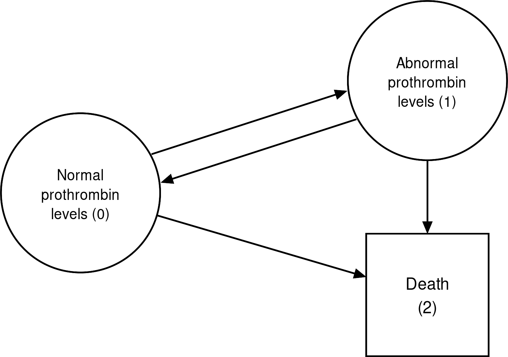
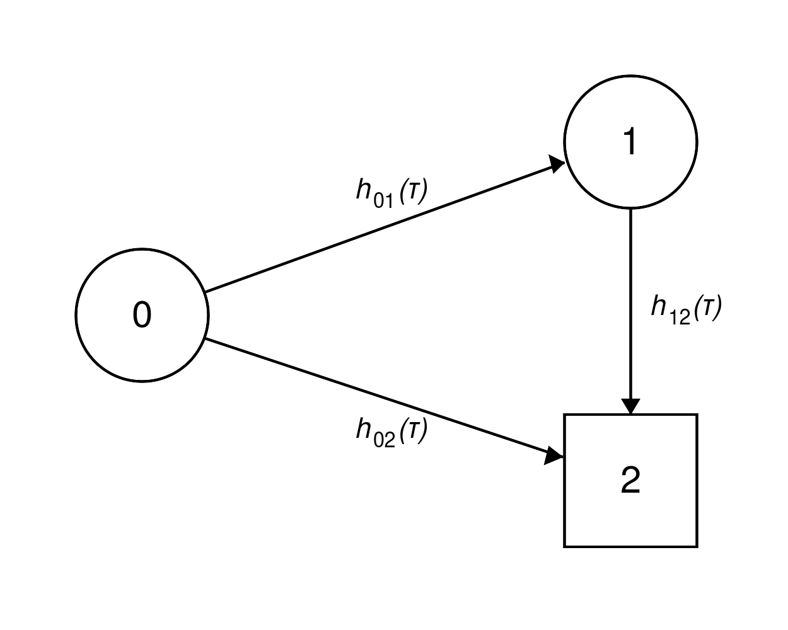
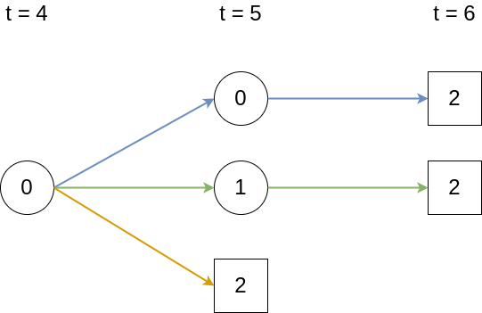

::: {.content-visible when-format="html"}

:::

# Event History Analysis {#sec-eha}

This chapter generalizes time-to-event data beyond a single, potentially censored or truncated, outcome of interest.
This generalization explores more complex settings with multiple, potentially mutually exclusive events as well as recurrences of events.
In this setting, the observed data is sometimes referred to as *event history data* and its analysis as *event history analysis*\index{event history analysis}.

One way to think about event history data is in terms of transitions between different states, as illustrated in @fig-eha.
Usually, a subject starts out in an initial state $0$ (for example, 'healthy') and from there transitions to different states\index{state process}.
States from which further transitions are possible are called *transient* (displayed as circles), otherwise a state is called *terminal* or *absorbing* (displayed as squares)\index{transient states}\index{terminal states}.

In the *single event* setting (@fig-eha, upper left panel), discussed in @sec-surv, a subject can only transition to one state (the event of interest).
In this setting, censored observations are those that do not transition to the single terminal state and the censoring event is considered independent of the event of interest.
In the *competing risks*\index{competing risks} setting (@fig-eha, upper right panel), a subject could transition to any of the $Q$ mutually exclusive states (formally introduced in @sec-competing-risks).
Therefore, the subject is initially *at risk* for a transition to multiple terminal states.
Once a transition to one of the terminal states occurs, the process is concluded (at least for modeling purposes).

In the *recurrent events setting*\index{recurrent events} (@fig-eha lower left panel), the same event can be observed multiple times for the same subject; for example, recurrent respiratory infections during one year.
Two different methods to represent recurrent events are shown in the figure: (top) the status is reset to $0$ after occurrence of an event; or (bottom) each recurrence of the event is modeled as a separate state.
While not shown in the figure, recurrent event processes often also include a competing, terminal event.
Recurrent events can be represented as multi-state processes and their methodology can therefore be inferred from the theory in @sec-multi-state.
For treatment about recurrent events explicitly, see @cookStatisticalAnalysisRecurrent2007.

In the most general case, the *multi-state*\index{multi-state models} setting (@fig-eha lower right panel), there are multiple transient and terminal states\index{transient states}\index{terminal states} with potential back transitions; for example, moving between different stages of an illness with the possibility of (partial) recovery and death as terminal event (introduced in @sec-multi-state).

![Illustration of different types of time-to-event processes. Transient states are displayed as circles, terminal states are displayed as squares. Top-left: Standard single-event setting with transition from initial state $0$ to state $1$; Top-right: Competing risks setting with $Q$ competing events. The follow-up ends once one of the $\{1,\ldots, Q\}$ events is observed or the study ends;
Bottom-left: Recurrent events setting with multiple occurrences of the same event. Bottom-right: Multi-state setting where subjects can transition between multiple transient states with possible back-transitions or to terminal states.](Figures/survival/eha-overview.png){#fig-eha fig-alt="Top-left plot (single event) is a circle with '0' (transient state) in it with a right arrow to a square with '1' in it (terminal state). Top-right plot (competing risks) is a circle with '0' with arrows to squares '1', '2', ... 'Q'. Bottom-left plot (recurrent events) has a dotted line, above the dotted line are two circles with '0' and '1' with arrows to each, below the dotted line are circles from left-to-right: 0, 1, 2, ..., Q, each with an arrow to the circle on the right. Bottom-right plot (multi-state) shows a circle with '0' with an arrow to a circle '1' and arrow to a square '3'. '1' has an arrow to circle '2' and back to '0'. '2' has an arrow back to '1' and to '3'."}

Note that the concepts discussed in @sec-types-of-censoring and @sec-truncation are still relevant here, as, dependent on the specific process, any transition between two states could be subject to different types of censoring and truncation\index{censoring}\index{truncation}.
Remaining in one of the transient states until the end of follow-up constitutes right-censoring\index{censoring!right}.
Left-truncation\index{truncation!left} is particularly important for the multi-state setting as subjects enter the risk sets for each transition at different time points, which must be individually accounted for (@sec-non-param-lt).

## A process point of view

In @sec-surv, a subject is characterized by a single random variable $Y \in \NNReals$, which represents the time until the event of interest (defined in @sec-data-rc).
This definition works well when exactly one event is possible or of interest.
However, when there are multiple possible events (for example, death by heart disease versus cancer), recurrences (for example, hospital re-admissions), or intermediate states (for example, healthy to ill to recovered), a single scalar random variable no longer captures the data-generating process.
Instead, one tries to model which state the subject is in at different moments in time.

A *state* is a mutually exclusive classification of subjects at a given time point\index{state process}.
In the simplest single-event setting, there are two states: "no event yet" (encoded by $0$) and "event has occurred" (encoded as $1$).
In a competing-risks setting with $Q$ possible events, the states are $\{0, 1, \ldots, Q\}$ with $0$ retaining the "no event yet" state and $q \in \{1, \ldots, Q\}$ indicating that event of type $q$ has occurred.

This is formalized as a stochastic process
<!--  -->
$$
E(\tau) \in \{0,\ldots, Q\},\ \tau \geq 0,
$$ {#eq-state-process}
<!--  -->
which records the state occupied at time $\tau$.
In the single-event case ($Q = 1$), $E(\tau)$ and $Y$ provide the same information.
In particular, $\{Y \in [\tau, \tau + \dtau) \mid Y \geq \tau\}$ and $\{E(\tau + \dtau) = 1 \mid E(\tau-) = 0\}$ are mathematically equivalent; the first expression represents the (only) event of interest occurring in the next instant, the second is a jump from state $0$ to state $1$ in the next instant.
Thus their hazards are equivalent,
<!--  -->
$$
h(\tau)
  = \lim_{\dtau \searrow 0}\frac{\Pr(Y \in [\tau, \tau + \dtau) \mid Y \geq \tau)}{\dtau}
  = \lim_{\dtau\searrow 0}\frac{ \Pr\left(E(\tau + \dtau)=1 \mid E(\tau-)=0\right)}{\dtau},
$${#eq-continuous-hazard-process}
<!--  -->
where $\tau-$ indicates the time point immediately before $\tau$. 

The process-valued formulation may seem over-engineered in the single-event case but is less verbose when there are multiple states and transitions, as will be seen in @sec-competing-risks and @sec-multi-state.
For a thorough stochastic-process treatment of event history analysis, see @aalen2008survivalevent.

## Competing risks {#sec-competing-risks}

@sec-surv assumed a single event of interest, with all reasons a subject might leave the observation window treated as right-censoring.
*Competing risks*\index{competing risks} arise when several mutually exclusive events can occur for the same subject.
Treating competing events as independent censoring can distort estimated event probabilities; this is illustrated in @sec-cens-vs-cr.
A canonical medical example is cause-specific mortality, for example modeling if death was caused by cancer or heart disease or another cause; another common example is modeling death in an intensive care unit versus discharge.
The defining feature of the competing risks framework is that only one of the $Q$ events can occur on a subject at any given time.
This section introduces relevant notation (@sec-cr-notation), the non-parametric Aalen-Johansen estimator\index{Aalen-Johansen estimator} (@sec-aalen-johansen), and then a worked example.

@tbl-surv-data-siradm shows an excerpt of the `sir.adm` data [@pkgmvna] of patients on an intensive care unit (ICU).
Time under observation ('time') could end in one of three outcomes ('status'): $1$ --- discharge alive; $2$ --- death in the ICU; or $0$ --- neither discharge nor death at the end of follow-up, which constitutes right-censoring at the end of study.
The data was collected to understand how pneumonia status at admission to the ICU affects mortality.

In this study, follow-up stopped once patients were discharged.
As discharged patients are healthier than those who remain in the ICU, assuming independence between the time until discharge and time until death is unrealistic.
Contrast this data to the `tumor` example in @sec-surv-km, in which patients were followed even after hospital discharge.
In that case, hospital discharge was not a competing risk, even if a patient was lost to follow-up (thus right censored) after discharge.
Analysis of how these different assumptions (independent censoring vs. competing risks) affect the estimates is discussed in @sec-aalen-johansen and @sec-cens-vs-cr.

| id | time| status| pneumonia|
|---:|----:|------:|----:|
| 1 |    8|      0|    no|
| 2 |    8|      0|    no|
| 3 |   31|      1|    yes|
| 4 |    5|      1|    no|
| 5 |    9|      2|    no|
| 6 |    5|      2|    no|
: Subset of the `sir.adm` dataset [@pkgmvna]. Each row represents one subject identified by 'id'. 'time' is the time under observation, 'status' indicates the outcome observed ($0$: censored at the end of the study, $1$: discharged from the ICU, $2$: death in the ICU). 'pneumonia' indicates whether a subject had pneumonia at ICU admission. {#tbl-surv-data-siradm}

### Notation and definitions {#sec-cr-notation}

In the competing risks setting, everyone starts in the initial state $0$ and can progress to one of the terminal states,

$$
q \in \{1,\ldots,Q\}.
$$

These terminal states\index{terminal states} are also often referred to as *competing events*, *event types*, or *causes*.
State $q = 0$ is the initial state and a subject that remains in state $0$ until the end of follow-up is considered censored.
The formulae in this section characterize the process $E(\tau) \in \{0,\ldots, Q\}$ in terms of transition hazards and probabilities.

In extension of (@eq-continuous-hazard-process), the *cause-specific hazard* is defined as \index{cause-specific hazard},

$$
h_q(\tau) = \lim_{\dtau \to 0} \frac{\Pr(E(\tau + \dtau) = q\  \mid E(\tau-)=0)}{\dtau}.
$$ {#eq-cause-specific-hazard}

Analogous to the single-event case, the *cause-specific cumulative hazard*\index{cause-specific cumulative hazard} is defined as,

$$
H_{q}(\tau) = \int_{0}^\tau h_q(u) \du.
$$ {#eq-cause-specific-cumu-hazard}

As competing events are mutually exclusive at any time $\tau$, it is possible to define the *all-cause hazard*\index{all-cause hazard}, which is the hazard of any event occurring as the sum of all cause-specific hazards,
<!--  -->
$$
h(\tau) = \sum_{q = 1}^Q h_q(\tau).
$$ {#eq-all-cause-hazard}
<!--  -->

The *all-cause cumulative hazard*\index{all-cause cumulative hazard} can then be calculated either via the integral over the all-cause hazard (@eq-all-cause-hazard) or as sum of cause-specific cumulative  hazards (@eq-cause-specific-cumu-hazard),

$$
H(\tau) 
 = \sum_{q=1}^Q H_{q}(\tau) = \sum_{q=1}^{Q}\int_{0}^\tau h_{q}(u) \du
 =\int_{0}^\tau \sum_{q=1}^{Q} h_{q}(u) \du = \int_{0}^\tau h(u) \du.
$$ {#eq-all-cause-cumu-hazard}

The *all-cause survival probability*\index{all-cause survival probability} gives the probability that *none* of the events occurred before $\tau$.
This is usually not estimated directly but calculated from the cause-specific hazards via (@eq-all-cause-cumu-hazard),

$$
S(\tau) = \Pr(Y > \tau) = \Pr(E(\tau) = 0) = \exp(-H(\tau)).
$$ {#eq-all-cause-surv-prob}

Finally, the *Cumulative Incidence Function* (CIF)\index{cumulative incidence function} is the probability of experiencing an event $q$ before time $\tau$,

$$
F_q(\tau) = \Pr(E(\tau) = q)  = \int_{0}^\tau f_q(u) \mathrm{d}u = \int_{0}^\tau S(u-)h_q(u)\ \du,
$$ {#eq-cif}
<!--  -->

where $S(u-)$ is the probability of surviving (not experiencing any of the competing events) until the time point shortly before $u$; and $f_q(u)\du = S(u-)h_q(u)\du$ is the probability of experiencing event $q$ in a small interval around $u$ (which follows analogously to the relationship between density and hazard functions in (@eq-continuous-hazard)).
All the terms in (@eq-cif) can be calculated from the cause-specific hazards (@eq-cause-specific-hazard) and estimation of the CIF often takes this 'cause-specific hazards' approach.

The notation $S(u-)$ is used rather than $S(u)$ to make explicit the modeling of the probability to survive until the time point immediately before $u$. 
This makes limited difference in continuous time where $\Pr(T > t) = \Pr(T\geq t)$, but may be important in (discrete) approximations (discussed in @sec-aalen-johansen).

$F_q(\tau)$ can be interpreted as the proportion of subjects who experienced event of type $q$ before time $\tau$.
Because the events are mutually exclusive, it holds that
<!--  -->
$$
S(\tau) + \sum_{q=1}^Q F_q(\tau) =  S(\tau) + F(\tau)= 1
$$
<!--  -->
where $F(\tau)$ is the probability that any event occurs before $\tau$, and $S(\tau)$ is the all-cause survival probability (@eq-all-cause-surv-prob).

### Non-parametric estimators {#sec-aalen-johansen}

Estimating the CIF (@eq-cif) for cause $q$ requires estimates of two components: the all-cause survival function $S(t)$ and the cause-specific hazard $h_q(t)$, both of which can be estimated non-parametrically through direct analogues of the single-event constructions in @sec-surv-estimation-non-param.

Recall from @sec-data-rc the unique ordered event times $\tbk,\, k=1,\ldots,m$, the risk set $\calR_{\tbk}$, and the number at risk $n_{\tbk}$.
Assume the follow-up is partitioned into $m$ disjoint intervals $(t_{(k-1)}, \tbk],\, k=1,\ldots,m$, such that $Y \in (t_{(k-1)}, \tbk] \Leftrightarrow \tilde{Y}=\tbk$, with $\tilde{Y}$ the discrete time random variable defined in @sec-distributions-discrete.

Let $d_{q,\tbk}$ be the number of events of type $q$ observed at $\tbk$.
Then the *cause-specific* discrete hazard is the analogue of the discrete hazard estimator (@eq-disc-haz-non-param), with the numerator restricted to events of type $q$,
<!--  -->
$$
h^d_{q}(\tbk) := \frac{d_{q,\tbk}}{n_{\tbk}},\ q \in \{1, \ldots, Q\}.
$$ {#eq-cs-discrete-hazard}
<!--  -->

The all-cause survival probability\index{all-cause survival probability} (@eq-all-cause-surv-prob) can be estimated with the Kaplan-Meier estimator\index{Kaplan-Meier estimator} (@eq-km).
Substituting this estimate and (@eq-cs-discrete-hazard) into (@eq-cif), yields the Aalen-Johansen (AJ) estimator\index{Aalen-Johansen estimator} (@aalenEmpiricalTransitionMatrix1978) for the CIF of cause $q$,

$$
F_{AJ,q}(\tau) = \sum_{k:\tbk \leq \tau} S_{KM}(t_{(k-1)})h^d_q(\tbk)=  \sum_{k:\tbk \leq \tau} S_{KM}(t_{(k-1)})\frac{d_{q,\tbk}}{n_{\tbk}}.
$$ {#eq-aalen-johansen}
<!--  -->

### Application to mortality of ICU patients

For illustration of the AJ estimator and the interpretation of the CIFs\index{cumulative incidence function} consider the analysis based on the data from @tbl-surv-data-siradm [@beyersmann.competing.2012].
Recall from the start of this section, the objective was to estimate mortality (state $2$) given pneumonia status at admission, with discharge from ICU as a competing risk (state $1$).
While the AJ estimator cannot naturally incorporate feature information, it can be applied to subgroups of the data, here based on the pneumonia status $x_{\text{pneu}} \in \{0,1\}$.
Note that this will yield different sets of unique event times in each group, thus the AJ can have jumps at different time points for the two groups.

@fig-cif-sir shows the AJ estimates of the CIFs for the two competing events stratified by pneumonia status.
To give a few examples, approximately 75% of patients with pneumonia have been discharged by $\tau = 120$ days:

$$
\hat{F}_{1}(120 \mid x_{\text{pneu}}=1) = \widehat{\Pr}(E(120) = 1 \mid x_{\text{pneu}}=1)\approx 0.75,
$$

while approximately 25% died in the ICU:

$$
\hat{F}_2(120 \mid x_{\text{pneu}}=1) = \widehat{\Pr}(E(120) = 2 \mid x_{\text{pneu}}=1)\approx 0.25.
$$

For patients without pneumonia,

$$
\hat{F}_{1}(120 \mid x_{\text{pneu}}=0) \approx 0.91,
$$

and

$$
\hat{F}_{2}(120 \mid x_{\text{pneu}}=0) \approx 0.09.
$$

![Aalen-Johansen estimator for the `sir.adm` data [@pkgmvna], stratified by pneumonia status at admission to the ICU. Left panel: Proportion of subjects discharged alive from the ICU. Right panel: Proportion of subjects who died in the ICU.](Figures/survival/cif-sir.png){#fig-cif-sir fig-alt="Left plot (discharge) shows two CIF curves. A red curve (no pneumonia) goes from around (0,0) to (40, 0.9) then is roughly constant until the end (time=120). The blue curve rises to around (50, 0.75) and is then constant. The right plot (death) shows a blue curve that roughly linearly increases from (0,0) to (120, 0.25); the red curve is flat for the majority of the plot around 0.09 on the y-axis."}

### Independent censoring vs. competing risks {#sec-cens-vs-cr}

When estimating the cause-specific discrete hazard (@eq-cs-discrete-hazard) for cause $q$, all events of type $\tilde{q} \neq q$ are treated as if they were right-censored\index{censoring!right}.
However, these competing events are subsequently combined when calculating the CIF (@eq-cif), for example through the AJ estimator (@eq-aalen-johansen), in which the all-cause survival probability (@eq-all-cause-surv-prob) depends on all the cause-specific hazards.

The competing risks approach was just illustrated in the analysis of the `sir.adm` data.
Consider instead if discharge were treated as an independent right-censoring event and not as a competing risk.
In that case, the event of interest (death) could be modeled using the methods in @sec-surv, for example using the Nelson-Aalen estimator\index{Nelson-Aalen estimator} (@eq-surv-na).
The estimated probability of death before some time point $\tau$ could then be obtained via $\hatF(\tau) = 1 - \hatS_{NA}(\tau)$.

@fig-cens-vs-cr shows the estimates obtained under the two assumptions.
Solid lines indicate the probabilities under the competing risks assumption (identical to the right-hand side of @fig-cif-sir).
Dashed lines are obtained under the independent right-censoring assumption.
Clearly, the probabilities of dying at time $\tau=120$ are much larger when independent censoring is assumed; for example around 75% in the pneumonia group under the right-censoring assumption, compared to around 25% when discharge is correctly modeled as a competing risk.
This example emphasizes the importance of assessing which modeling framework is appropriate for a given analysis, as the resulting estimates may differ substantially.

{#fig-cens-vs-cr fig-alt="Graph of four CIF curves. A solid blue curve roughly linearly increases from (0,0) to (120, 0.25); a solid red curve is flat for the majority of the plot around 0.09 on the y-axis; a dashed, blue curve roughly linearly increases to (120, 0.75) and a dashed, red curve roughly linearly increases to around (120, 0.6)."}

## Multi-state models {#sec-multi-state}

The multi-state process\index{multi-state models} can be considered the most general type of time-to-event process, as others (single-event, competing risks\index{competing risks}, recurrent events\index{recurrent events}) can be viewed as special cases.
Multi-state modeling allows realistic depiction of complex processes where subjects can start in different states and transition back and forth between them\index{state process}.

For illustration, consider the  `prothr` dataset [@pkgmstate] of liver cirrhosis patients from a randomized clinical trial with possible transitions depicted in @fig-multi-state-prothr-states.
Patients may have normal (state $0$) or abnormal (state $1$) levels of prothrombin (a protein important for blood clotting, produced by the liver) at the beginning of the trial.
Some patients were treated with prednisone (which suppresses immune response and reduces inflammation) and others received a placebo.
Death (state $2$) constitutes the terminal state.
The purpose of the trial was to investigate if treatment (prednisone) slows down or reverses disease progression (transitions $0 \rightarrow 1$ and $1 \rightarrow 0$) and/or reduces mortality (transitions $0 \rightarrow 2$ and $1 \rightarrow 2$).

{#fig-multi-state-prothr-states fig-alt="Text in a circle 'Normal prothrombin levels (0)' has an arrow to a circle 'Abnormal prothrombin levels (1)' and an arrow to a square 'Death (2)'. State 1 has an arrow back to State 0 and an arrow to State 2." width=80%}

Strictly speaking, prothrombin level is only assessed at scheduled follow-up visits, so the transitions between state $0$ (normal) and state $1$ (abnormal) are interval-censored\index{censoring!interval} (@sec-types-of-censoring-left-interval): at visit $k$ the new status is observed, but not the exact time at which the change occurred between visits $k-1$ and $k$.
The analyses that follow ignore this interval structure and treat the transition times as exactly observed, which is a common simplification for this example.
Accounting for the interval-censoring would require similar non-parametric maximum likelihood estimator\index{non-parametric maximum likelihood estimator} methods to those described in @sec-surv-estimation-non-param.

@tbl-ms-data-prothr shows a subset of the data and contains, for each subject ('id'), one row per transition for which the subject was at risk.
In this example, this includes transitions that were possible, but did not happen (counterfactual transitions).
The columns 'from' and 'to' indicate the initial state and the possible end state of each transition, which the 'transition' column also shows compactly as $\ell \rightarrow q$.
'tstart' indicates the time at which the subject entered the 'from' state and thereby became at risk for the transition listed in that row, and 'tstop' the time at which the subject left the 'from' state, either by making a transition or by being censored.
The variable 'status' indicates whether the transition was actually made ('status=1') or not ('status=0').
The status variable is required here as all possible transitions are listed (including counterfactuals), so an indicator is required to identify which transitions actually occurred.
If 'status=0' for all possible transitions, the subject is censored for further transitions.
Finally, 'treatment' indicates whether a patient was assigned the treatment or placebo group.

Subject 'id=1' already had abnormal prothrombin levels at the beginning of the trial, thus started in state $1$ with possible transitions $1\rightarrow 0$ and $1 \rightarrow 2$.
In this case, the patient died and transition $1\rightarrow 2$ was realized after 151 days, while the transition $1 \rightarrow 0$ is a 'counterfactual' transition that could have happened in the time-span between 'tstart=0' and 'tstop=151', but did not actually occur in reality.
Patient 'id=8' also started in state $1$, but made a back transition to normal prothrombin levels after 211 days at which time they entered the risk set for transitions $0\rightarrow 1$ and $0\rightarrow 2$.
Neither of the transitions occurred, as 'status=0' for both transitions, which means the subject remained in status $0$ (right-censored) until the end of their follow-up at 2,770 days.
Finally, subject 'id=46' started in state 0 (normal levels), transitioned to state 1 (abnormal levels) after 415 days and then died (transition $1\rightarrow 2$) two days later.

This example illustrates the importance of left-truncation (@sec-truncation) in multi-state processes.
For example, subjects 'id=1' and 'id=8' are at risk for the transitions $1 \rightarrow 0$ and $1 \rightarrow 2$ from the beginning of the trial ('tstart = 0').
In contrast, subject 'id=46' starts in state 0 and only enters state $1$, thus the risk set for the transitions $1\rightarrow 0$ and $1\rightarrow 2$, after 415 days ('tstart = 415').
The fact that subjects enter the risk sets for different transitions at different time points constitutes left-truncation and should be taken into account accordingly (@sec-ms-aalen-johansen).

| id| from| to| transition| tstart| tstop| status|treatment  |
|--:|----:|--:|:---------:|------:|-----:|------:|:----------|
|  1|    1|  0| $1 \rightarrow 0$|      0|   151|      0|Placebo    |
|  1|    1|  2| $1 \rightarrow 2$|      0|   151|      1|Placebo    |
|  8|    1|  0| $1 \rightarrow 0$|      0|   211|      1|Prednisone |
|  8|    1|  2| $1 \rightarrow 2$|      0|   211|      0|Prednisone |
|  8|    0|  1| $0 \rightarrow 1$|    211|  2770|      0|Prednisone |
|  8|    0|  2| $0 \rightarrow 2$|    211|  2770|      0|Prednisone |
| 46|    0|  1| $0 \rightarrow 1$|      0|   415|      1|Prednisone |
| 46|    0|  2| $0 \rightarrow 2$|      0|   415|      0|Prednisone |
| 46|    1|  0| $1 \rightarrow 0$|    415|   417|      0|Prednisone |
| 46|    1|  2| $1 \rightarrow 2$|    415|   417|      1|Prednisone |
: Subset of the `prothr` dataset [@pkgmstate]. Each row is a transition for which the subject ('id') was at risk: 'from'/'to' (also shown as 'transition', $\ell \rightarrow q$) are the start and possible end states; 'tstart'/'tstop' are the times of entering and leaving the 'from' state; 'status' is $1$ if the transition occurred and $0$ otherwise; and 'treatment' is the trial arm. {#tbl-ms-data-prothr}

### Notation and definitions

In the competing risks setting, the data generating process was characterized by cause-specific transition hazards $h_q(\tau)$ (@eq-cause-specific-hazard).
Implicitly, these are transitions from starting state $0$ to end state $q$; however, since everyone starts in state $0$, more complex notation is not required.
In the multi-state setting, with multiple different states and more complex transitions, more sophisticated notation is necessary.
Transitions between different states are characterized by transition hazards, denoted by $h_{\ell\rightarrow q}(\tau)$ or more simply $h_{\ell q}(\tau)$, where $\ell$ is the starting state and $q$ the end state.

Let $E(\tau)\in \{0,\ldots,Q\}$ be the state of the process at time $\tau$ as in (@eq-state-process).
Then, the _transition hazard_\index{transition hazard} can be defined as,
<!--  -->
$$
h_{\ell q}(\tau) = \lim_{\dtau \to 0} \frac{\Pr(E(\tau + \dtau)=q \mid E(\tau-) = \ell)}{\dtau}.
$$ {#eq-ms-transition-hazards}

Transition hazards (@eq-ms-transition-hazards) indicate the instantaneous risk to enter state $q$ at time $\tau$ given occupation of state $\ell$  at $\tau-$, which is the instant before $\tau$.

By definition, a transition is a move _out_ of the current state and therefore $\ell \neq q$ when describing the transition hazard $h_{\ell q}(\tau)$.
Furthermore, not every pair $(\ell, q)$ corresponds to a realizable transition: the state diagram of the specific process determines which transitions are possible a priori (for example, @fig-multi-state-prothr-states), and the hazards of impossible transitions are equal to zero.

Analogous to the competing risks setting, one can define the _transition cumulative hazard_\index{transition cumulative hazard},

$$
H_{\ell q}(\tau) = \int_{0}^{\tau}h_{\ell q}(u) \du.
$$ {#eq-ms-cumu-hazard}

In the multi-state setting, two further quantities are often of interest.
Firstly, the *transition probabilities*\index{transition probability}

$$
P_{\ell q}(\zeta, \tau):= \Pr(E(\tau) = q \mid E(\zeta) = \ell),
$$

that is, the conditional probability to be in state $q$ at $\tau$ given occupation of state $\ell$ at $\zeta < \tau$ (fully introduced in @sec-ms-transition-probs).

Secondly, the (marginal) *state-occupation probability*\index{state-occupation probability},

$$
\Pr(E(\tau) = q),
$$ {#eq-ms-state-prob}

which is the probability to occupy a certain state $q$ at time $\tau$ (described in detail in @sec-ms-state-occupation).

Throughout the remainder of @sec-multi-state, it is assumed that the multi-state process is *Markov*\index{Markov}, meaning that the transition hazard at time $\tau$ depends only on the current state $E(\tau-)$ and not on the full state history $\{E(u) : u < \tau\}$.
Under this assumption, conditioning on the current state alone (as in (@eq-ms-transition-hazards)) is sufficient to characterize the local dynamics, and the transition probability $P_{\ell q}(\zeta,\tau)$ is fully determined by the transition cumulative hazards between $\zeta$ and $\tau$.
The non-parametric Aalen-Johansen estimator\index{Aalen-Johansen estimator} (@eq-ms-aj-trans-prob) of the transition-probability matrix (@eq-ms-trans-prob-mat) is then consistent.
Relaxing the Markov assumption leads to *semi-Markov*\index{Markov!semi} and general *non-Markov* models, where the conditioning set must include the *sojourn time* (the time already spent in the current state) or the full state history; these are not discussed further here, instead see @aalen2008survivalevent and @beyersmann.competing.2012 for an overview.
Notably, the marginal state-occupation probabilities (@eq-ms-state-prob) remain consistently estimable from the same Aalen-Johansen methodology, even without the Markov assumption (see @sec-ms-state-occupation).

Transition probabilities of a multi-state process are often summarized in a matrix\index{transition probability matrix}
<!--  -->
$$
\mathbf{P}(\zeta, \tau):=
\begin{pmatrix}
  P_{00}(\zeta, \tau) & \cdots & P_{0Q}(\zeta, \tau)\\
  \vdots & \ddots & \vdots\\
  P_{Q0}(\zeta, \tau) & \cdots & P_{QQ}(\zeta, \tau)\\
\end{pmatrix},
$$ {#eq-ms-trans-prob-mat}
<!--  -->
where rows indicate starting states and columns indicate end states.
Some of the elements of $\mathbf{P}$ might be zero or one depending on the specific process, presence of terminal states and possible pathways between states.
As subjects can only be in one of the $Q+1$ states at $\tau$, rows sum to $1$:
<!--  -->
$$
\sum_{q =0}^Q P_{\ell q}(\zeta, \tau) = 1,\forall \ell \in \{0, \ldots,Q\}.
$$ {#eq-ms-trans-prob-row-sums}
<!--  -->

### Transition probabilities {#sec-ms-transition-probs}
This section briefly motivates how transition probabilities between two non-consecutive time points can be expressed as the product (integral) of transition probabilities between intermediate, subsequent time points.

For illustration, consider the illness-death model in @fig-illness-death, where subjects can transition from healthy state $0$ to terminal death state $2$ either directly or via intermediate state $1$.

{#fig-illness-death fig-alt="A circle with '0' has a right arrow to circle '1', the arrow is labelled 'h_{01}(\tau)', there is also an arrow to square '2' with label 'h_{02}(\tau)'. State 1 also has an arrow to state 2 with label 'h_{12}(\tau)'." width=60%}

In this example, back-transitions are not possible, therefore the lower triangle of the matrix is filled with zeros and $P_{22}(\zeta, \tau) = 1, \forall\ \zeta < \tau$ by virtue of being a terminal state.
The matrix of transition probabilities is thus,
<!--  -->
$$
\mathbf{P}(\zeta, \tau) =
  \begin{pmatrix}
  P_{00}(\zeta, \tau) & P_{01}(\zeta, \tau) & P_{02}(\zeta, \tau)\\
  0 & P_{11}(\zeta, \tau) & P_{12}(\zeta, \tau)\\
  0 & 0 & 1\\
  \end{pmatrix}.
$$ {#eq-ms-trans-prob-mat-illness-death}
<!--  -->

Assume that data is collected in discrete time, that is $\zeta, \tau \in \{0, 1, 2,\ldots\}, \zeta < \tau$ and transitions only occur at these discrete time points and not in between.
Say one is interested in the transition probability $P_{02}(4, 6)$, which is the probability to transition from state $0$ to state $2$ between time points $\zeta=4$ and $\tau=6$.
This is possible in the three ways depicted in @fig-prothr-ex-graph.

{#fig-prothr-ex-graph fig-alt="A circular '0' under the heading 't=4' has arrows to a circular '0', circular '1', and square '2', all under a heading 't=5'. The circular states under 't=5' each have one arrow to a square '2' under a heading 't=6'. The graph indicates transitions: 0->0->2, 0->1->2, 0->2."}

Let $p_{\ell q}$ be the step probabilities for transitions $\ell \rightarrow q$ between two subsequent discrete time points,

$$
p_{\ell q}(\tau) = \Pr(E(\tau)=q \mid E(\tau -1) = \ell).
$$

The transition probability can then be written as,

$$
P_{02}(4,6) = \textcolor{blue}{p_{00}(5)p_{02}(6)} + \textcolor{green}{p_{01}(5)p_{12}(6)} + \textcolor{orange}{p_{02}(5)}.
$$

More generally, in discrete time, the matrix of transition probabilities can be represented as a finite matrix product,

$$
\mathbf{P}(\zeta, \tau) = \prod_{j =\zeta+1}^{\tau}
\begin{pmatrix}
  p_{00}(j) & p_{01}(j) & p_{02}(j)\\
  0 & p_{11}(j) & p_{12}(j)\\
  0 & 0 & 1\\
  \end{pmatrix}.
$$ {#eq-ms-trans-prob-ill-death-discrete}

For the transitions from time points $4$ to $6$,

$$
\begin{aligned}
\mathbf{P}(4, 6) &=
\begin{pmatrix}
P_{00}(4, 6) & P_{01}(4, 6) & P_{02}(4, 6)\\
        0 & P_{11}(4, 6) & P_{12}(4,6)\\
        0 &         0 &         1
\end{pmatrix} \\
&= \prod_{j=5}^6
\begin{pmatrix}
p_{00}(j) & p_{01}(j) & p_{02}(j)\\
        0 & p_{11}(j) & p_{12}(j)\\
        0 &         0 &         1
\end{pmatrix}\\
            & =
\begin{pmatrix}
p_{00}(5) & p_{01}(5) & p_{02}(5)\\
        0 & p_{11}(5) & p_{12}(5)\\
        0 &         0 &         1
\end{pmatrix}
\begin{pmatrix}
p_{00}(6) & p_{01}(6) & p_{02}(6)\\
        0 & p_{11}(6) & p_{12}(6)\\
        0 &         0 &         1
\end{pmatrix}\\
            &=
\begin{pmatrix}
p_{00}(5) p_{00}(6) & p_{00}(5)p_{01}(6) + p_{01}(5)p_{11}(6) & p_{00}(5)p_{02}(6) + p_{01}(5)p_{12}(6) + p_{02}(5)\\
        0           & p_{11}(5) p_{11}(6)& p_{11}(5)p_{12}(6) + p_{12}(5)\\
        0           &                  0 &         1
\end{pmatrix},
\end{aligned}
$$

where the quantity of interest, $P_{02}(4, 6)$ is given in the top right corner, but other transition probabilities are also readily available.
For example, the probability to transition from state $1$ to $2$ between time points $\zeta=4$ and $\tau=6$ is $P_{12}(4, 6) = p_{11}(5)p_{12}(6) + p_{12}(5)$.

Returning to the continuous time setting, where transitions can occur at any time point, ideas from the discrete time setting still hold.
Imagine dividing the interval $(\zeta, \tau]$ into $J$ intervals such that $\zeta = t_{0} < t_{1} < \cdots < t_{j} < \cdots t_{J} = \tau$, assuming that no events occur between time points $t_{j} \in \mathbb{R}_+, j=1,\ldots, J$.
Then the transition probability matrix $\mathbf{P}(\zeta, \tau)$ takes the same product form as in (@eq-ms-trans-prob-ill-death-discrete), with $p_{\ell q}(j)$ replaced by $p_{\ell q}(t_j)$.

### Transition probabilities and hazards
Increasing the number of intervals to infinity, or equivalently reducing the interval size to infinitesimally small intervals, one can define the transition probability matrix\index{transition probability matrix} as a product integral over the instantaneous transition probabilities $p_{\ell q}(u)$, expressed in terms of transition-specific (cumulative) hazards. 

First note from equations (@eq-ms-transition-hazards) and (@eq-ms-cumu-hazard) that the instantaneous transition probabilities can be approximated by increments of the cumulative hazard, which is the increase in the cumulative hazard within a fixed, infinitesimally small interval $\du$:
$$
p_{\ell q}(u) := \Pr\big(E(u+\mathrm{d}u)=q \mid E(u-) = \ell\big) \approx \mathrm{d}H_{\ell q}(u).
$$

Secondly, because of the relationship in (@eq-ms-trans-prob-row-sums), diagonal elements (transitions into the same state) are set to,

$$
\mathrm{d}H_{\ell \ell}(u) := -\sum_{q \neq \ell} \mathrm{d}H_{\ell q}(u),
$$

such that

$$
1 + \mathrm{d}H_{\ell\ell}(u) = 1-\sum_{q \neq \ell} \mathrm{d}H_{\ell q}(u) = 1 - \sum_{q\neq \ell}p_{\ell q}(u) = p_{\ell\ell}(u).
$$

Consequently, the transition probability matrix can be written as,

$$
\begin{aligned}
\mathbf{P}(\zeta, \tau)
                        &= \mathscr{P}_{u \in (\zeta, \tau]}
  \begin{pmatrix}
    p_{00}(u) = 1 + \mathrm{d}H_{00}(u) & \cdots & p_{0Q}(u) = \mathrm{d}H_{0Q}(u)\\
    \vdots                  & \ddots & \vdots\\
    p_{Q0}(u) =  \mathrm{d}H_{Q0}(u)     & \cdots & p_{QQ}(u) = 1 + \mathrm{d}H_{QQ}(u)\\
  \end{pmatrix}\nonumber\\
  & \ \\
  & =  \mathscr{P}_{u \in (\zeta, \tau]}(\mathbf{I} + \mathrm{d}\mathbf{H}(u)),\nonumber\\
\end{aligned}
$$ {#eq-ms-prodint-cumu-hazards}

where $\mathscr{P}$ is the product integral operator, $\mathbf{I}$ is a $(Q+1) \times (Q+1)$ identity matrix and $\mathrm{d}\mathbf{H}(u)$ is the matrix of increments of the cumulative hazard within infinitesimally small intervals.
Thus, similar to the competing risks setting\index{competing risks}, the relationship (@eq-ms-prodint-cumu-hazards) implies that knowledge of the transition (cumulative) hazards is sufficient to fully specify the multi-state process.

As analytical solutions of (@eq-ms-prodint-cumu-hazards) only exist for specific models, in practice, the transition probabilities are often once again approximated numerically via a finite matrix product on a discrete time grid $\zeta = t_0 < t_1 < \cdots < t_{J-1} < t_{J} = \tau$,
<!--  -->
$$
\mathbf{P}(\zeta, \tau) \approx \prod_{j=1}^{J}(\mathbf{I} + \triangle\mathbf{H}(t_{j})),
$$ {#eq-ms-prodint-approx}
<!--  -->
where $\triangle \mathbf{H}(t_{j}) = \mathbf{H}(t_{j}) - \mathbf{H}(t_{j-1})$ is the increment of the cumulative hazards between two consecutive time points.

### Non-parametric estimation of transition probabilities {#sec-ms-aalen-johansen}

From (@eq-ms-prodint-approx), it follows that transition probabilities can be estimated by first computing the transition cumulative hazards\index{transition cumulative hazard}, $H_{\ell q}(\tau)$.
Similarly to the AJ approach in the competing risks setting (@sec-aalen-johansen) \index{Aalen-Johansen estimator}, one can first define the _transition hazards_\index{transition hazard},

$$
h^{d}_{\ell q}(\tbk):= \frac{d_{\ell q,\tbk}}{n_{\ell; \tbk}},
$$

where $d_{\ell q,\tbk}$ is the number of subjects that made the transition $\ell \rightarrow q$ at time $\tbk$; and $n_{\ell; \tbk}$ is the number of subjects in state $\ell$ immediately before $\tbk$.

The _transition cumulative hazards_ follow as\index{transition cumulative hazard}
<!--  -->
$$
H_{AJ,\ell q}(\tau) = \sum_{k:\tbk \leq \tau} h^d_{\ell q}(\tbk) = \sum_{k:\tbk \leq \tau}\frac{d_{\ell q,\tbk}}{n_{\ell; \tbk}},
$$
<!--  -->

Transition probabilities\index{transition probability} are obtained via (@eq-ms-prodint-approx),
<!--  -->
$$
\mathbf{P}(\zeta, \tau) = \prod_{j=1}^{J}\left(\mathbf{I} + \triangle\mathbf{H}_{AJ}(t_{(j)})\right).
$$ {#eq-ms-aj-trans-prob}
<!--  -->

### State occupation probabilities {#sec-ms-state-occupation}

The pairwise transition probabilities, $P_{\ell q}(\zeta, \tau)$, defined above are conditioned on a specific entry-state $\ell$ at a specific time $\zeta$; the Aalen-Johansen estimator (@eq-ms-aj-trans-prob) is only consistent for them under the Markov\index{Markov} assumption.
A closely related but conceptually distinct target is the *state-occupation probability*\index{state-occupation probability},
<!--  -->
$$
P_q(\tau) := \Pr(E(\tau) = q),
$$ {#eq-ms-state-occupation}
<!--  -->
which is the marginal probability that a subject occupies state $q$ at time $\tau$.

State-occupation probabilities are arguably the more natural target for many prediction tasks: questions of the form "what is the probability that the subject is alive in normal-prothrombin state at $\tau = 365$ days?" are directly answered by $P_q(\tau)$, not by a pairwise transition probability conditioned on a fixed entry-state.

An important property is that the Aalen-Johansen plug-in (@eq-ms-aj-trans-prob), applied with the empirical initial-state distribution rather than conditioned on a fixed $\ell$, remains a consistent estimator of $P_q(\tau)$ even when the underlying process is not Markov [@putter2018; @niessl2023].

Concretely, given the AJ estimate $\widehat{\mathbf{P}}(0, \tau)$ and the empirical initial-state distribution $\hat{\pi}_\ell = n_\ell^{(0)}/n$ (where $n_\ell^{(0)}$ is the number of subjects observed in state $\ell$ at $\tau=0$), the state-occupation estimator is
<!--  -->
$$
\hat{P}_{AJ,q}(\tau) = \sum_{\ell=0}^{Q} \hat{\pi}_\ell\, \widehat{P}_{\ell q}(0, \tau).
$$ {#eq-ms-state-occupation-est}
<!--  -->
The final section below reports the pairwise transition probabilities under the Markov assumption.
Deriving the state-occupation estimates follows by applying the same AJ pipeline and then marginalizing with (@eq-ms-state-occupation-est).

### Application to liver cirrhosis patients

For illustration, consider again the `prothr` data set (@tbl-ms-data-prothr), with possible transitions summarized in @fig-multi-state-prothr-states.
In contrast to the illness-death model in @fig-illness-death, back transitions are possible and some subjects already start in the abnormal prothrombin state at the beginning of the study.

The estimands of interest are the four off-diagonal transition probabilities $\hat{P}_{\ell q}(0, \tau)$ for $(\ell, q) \in \{(0,1), (0,2), (1,0), (1,2)\}$, computed separately for the prednisone and placebo arms via the Aalen-Johansen estimator\index{Aalen-Johansen estimator} (@eq-ms-aj-trans-prob).
Stratifying by treatment treats each arm as a homogeneous Markov sub-population, with no further covariate adjustment.
This is a coarse but standard simplification; regression-based extensions that incorporate subject-level features into the multi-state estimation are taken up later in the book.

@fig-multi-state-prothr shows these probabilities for both arms.
In contrast to the cumulative incidence functions\index{cumulative incidence function} of the competing-risks setting (@sec-aalen-johansen), the curves targeting *transient* states\index{transient states} (such as $\ell \rightarrow 0$ and $\ell \rightarrow 1$) are not monotonically increasing in $\tau$.
This is a feature of the underlying mathematics, the terminal state mass $P_{\ell 2}(0, \tau)$ grows monotonically with $\tau$ and the row-sum constraint (@eq-ms-trans-prob-row-sums) forces the transient-state probabilities to give up mass to compensate.

The curves for $0 \rightarrow 2$ and $1 \rightarrow 2$ (death) increase monotonically over follow-up in both arms, as expected for terminal-state probabilities.
Relative to the placebo, between days $1,000$ to $3,000$, the prednisone arm shows a modest reduction in the $0 \rightarrow 2$ transition probability and an increase in the back-transition $1\rightarrow 0$, but the gap narrows toward the end of follow-up.
The overall conclusion is that prednisone does not appear to confer a strong, persistent protective effect. 
Meaningful inference about treatment effects would require accompanying uncertainty bands and is beyond the descriptive scope of this stratified Aalen-Johansen analysis.

{#fig-multi-state-prothr fig-alt="Four line graphs of transition probabilities. Top-left (0->1) blue (placebo) and red (prednisone) curves are near identical. Top-right (0->2), the placebo curve shows very slightly higher probabilities of transition (to death). Bottom-left (1->0) shows prednisone with very slightly higher probability of transition (recovery) but only to around t=3,000. Bottom-right (1->2) shows very similar curves again, with slightly higher probabilities for placebo to transition (to death)." width=70%}

## Conclusion

:::: {.callout-warning icon=false}

## Key takeaways

* Event history analysis generalizes the standard survival analysis setting by representing subjects as moving between states over time, allowing competing, recurrent, and multi-state outcomes to be modeled within a common framework.
* In competing-risks settings, treating competing events as independent censoring can substantially distort estimated event probabilities; cumulative incidence functions and the Aalen-Johansen estimator account for this dependence explicitly.
* Multi-state processes are characterized through transition hazards and transition probabilities, with the Aalen-Johansen estimator providing a non-parametric plug-in estimator based on estimated transition hazards and product integrals.
* Defining the state diagram of the data generating process can be a helpful first step to understand the dynamics in the data and to select an appropriate framework (and model) for the analysis.

::::

:::: {.callout-tip icon=false}

## Further reading

* @aalen2008survivalevent introduces different approaches for event history analysis motivated from the counting process point of view.
* @beyersmann.competing.2012 provide an accessible overview of important concepts for competing risks and multi-state modeling, particularly non-parametric estimation.

::::
