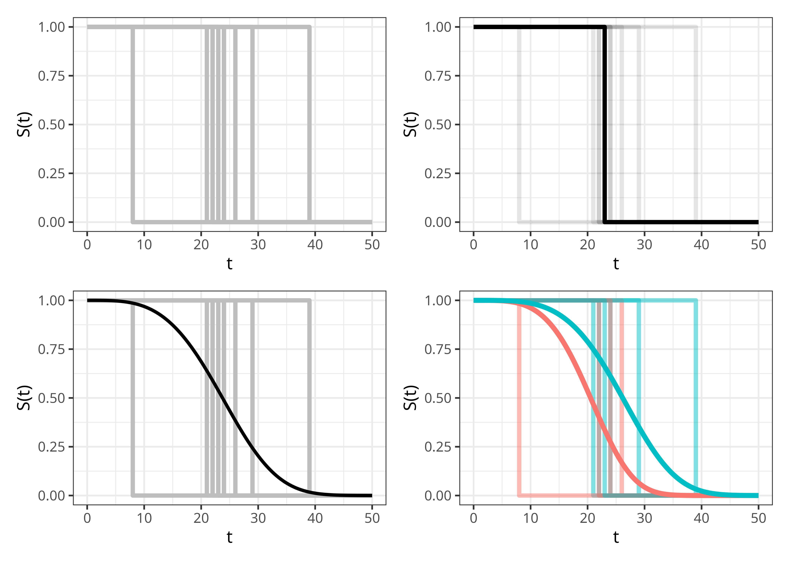

::: {.content-visible when-format="html"}

:::

# Survival Task {#sec-survtsk}

A machine learning task\index{task} specifies a mathematical problem to be solved by an algorithm\index{algorithm} (@sec-ml-tasks).
Formally, a task is a mapping $g: \calX \rightarrow \calY$ with three components: a description of the input space $\calX$, a description of the target space $\calY$, and a description of the estimation procedure that learns $g$ from data.
A _survival task_\index{task!survival} is a machine learning\index{machine learning} task in which the target space $\calY_S$ corresponds to a _survival prediction type_\index{prediction types} (@sec-surv-tsk-predicts), and the learning algorithm $g_S$ is designed to handle censoring and/or truncation while targeting that prediction type (as in the methods introduced in Part III).

Throughout this chapter let  $\calX \subseteq \Reals^p$ be the feature space.
The censoring mechanism does not affect the definition of the prediction types, hence this chapter does not distinguish between right-, left-, or interval-censoring when defining $\calY_S$.

## Survival prediction types {#sec-surv-tsk-predicts}

Survival prediction types describe the codomain $\calY_S$, four are commonly distinguished:

1. Survival distribution\index{survival distribution}: Probability of the event occurring over time;
2. Relative risk\index{relative risk}: A scalar quantity representing the risk of event that is meaningful only in comparison to other individuals in the sample;
3. Survival time or time-to-event\index{survival time}: A point prediction of the time at which the event of interest will occur;
4. Prognostic index\index{prognostic index}: A risk score usually based on a linear predictor\index{linear predictor}.

Survival distribution predictions are _probabilistic_ as they return a full distribution over time\index{probabilistic predictions}.
Survival time predictions are _deterministic_ point predictions in the sense that they return a single scalar value, though uncertainty remains due to underlying variance\index{deterministic predictions}.
Relative risk and prognostic index predictions do not directly predict when or if the event of interest will occur, instead they produce scores that can be used to rank or compare an individual's risk to others in the same cohort.

The term _relative_ risk is used throughout this book to emphasize that these types of predictions should only be interpreted in comparison to others in the cohort; this is revisited in @sec-survtsk-risk.
This contrasts with predictions such as survival probability estimates, which quantify an individual's probability of surviving to a given time point and are therefore directly related to event risk, but remain interpretable independently.

These prediction types are closely related.
Relative risks and survival time predictions can be derived from a predicted survival distribution, though the reverse does not hold in general as a single survival time or risk score does not uniquely determine a probability distribution.
Both prognostic index and time-to-event predictions can usually be interpreted as a type of relative risk prediction.
Under (often strict) assumptions, prediction types can be converted between each other.
In fact, many algorithms target a single prediction type but internally compute another as an intermediate step, this pattern will appear throughout Part III, for example with the prognostic index being computed in linear models before being transformed into a survival distribution prediction (some algorithmic examples in @sec-classical).

Despite their close connection, it is essential to keep discussion of prediction types distinct as they are not directly comparable.
For example, it is not meaningful to compare a relative risk score from one model to a survival distribution prediction of another without first transforming the distribution prediction.
Even within a single prediction type, interpretations can be confused.
For example, in some literature a larger value of a risk score implies higher risk of event, whereas in other sources, a larger value implies lower risk.
Distinction of prediction types is also critical for evaluation as each prediction type naturally aligns with different types of metrics, a topic returned to throughout Part II.

In applied predictive modelling, _direct_ survival time prediction is uncommon as they can be challenging to estimate and evaluate reliably under censoring, particularly when prediction requires extrapolation beyond the observed follow-up period.
Instead, practitioners often report distribution-derived summaries such as $\tau$-year survival probabilities or the predicted median survival time\index{median survival time}.
Similarly, the prognostic index is more commonly used for model interpretation or inference, whereas relative risk predictions are common in applications such as resource allocation and risk stratification.
Though, as will be seen below, a prognostic index can usually be interpreted as a relative risk.

@fig-survtsk-overview illustrates the different information provided by the different prediction types based on a Weibull\index{Weibull} accelerated failure time\index{accelerated failure time} model (@sec-surv-models-param) . 
The prognostic index\index{prognostic index} is omitted as it would visually look the same as the relative risk\index{relative risk} prediction type.
Top-left panel shows the tabular survival data using the six patients from the `tumor` data set (@tbl-surv-data-tumor).
The top-right panel shows predicted survival times\index{survival time}, for each observation this is a single scalar value representing the estimated event time (here, the predicted expected survival time after operation $\hat{\EE}[T \mid \xx]$ with its 95% confidence interval).
The bottom-left panel visualizes relative risk predictions; here the score is the negative log of the predicted expected survival time, centred at zero across the six patients, so positive values indicate higher than average risk and negative values lower than average risk.
Finally, the bottom-right panel shows survival distribution predictions\index{survival distribution}, where each observation's predicted survival function $\hatS(\tau \mid \xx)$ is shown over time.

![Illustration of prediction types using six patients from the `tumor` data set and a Weibull accelerated failure time model. Tabular survival data (top-left) can be used by an algorithm to make various prediction types, each conveying different information. Survival times (top-right) provide a single number estimating the time until an event takes place. Relative risk scores (bottom-left) compare the risk of event between subjects within the same sample. Survival distributions (bottom-right) estimate the probability of the event taking place over time.](Figures/survtsk/predict_types.png){#fig-survtsk-overview width=100% fig-alt="Graphical illustration of prediction types for six tumor patients. Top-left panel is a table with columns id, age, sex, complications, days, and status, with each row's id cell colored to match the patient's color in the other panels. Top-right panel is horizontal lollipops (line with a filled circle at the endpoint) showing predicted expected survival times for each patient, ranging from about 1700 to 3200 days. Bottom-left panel is vertical lollipops showing predicted relative risk scores centred around zero, indicating different risk profiles for each patient. Bottom-right panel is six smooth survival probability curves, one per patient, decreasing over time from one toward zero."}

## Predicting distributions {#sec-survtsk-dist}

Predicting a survival distribution\index{survival distribution} means estimating the probability of an individual's event time over the interval from time-point $0$ to $\infty$.
In principle, such predictions are defined over the continuous $\NNReals$.
In practice, the form of the prediction depends on the modeling approach: parametric models typically define predictions over continuous time, whereas several non- and semi-parametric approaches represent predictions through discrete time points.
Even when predictions are continuous, they are often evaluated or visualized on a discrete time grid.

Theoretically, distributional prediction can target any of the distribution defining functions introduced in @sec-distributions, though predicting $S(t)$ or $h(t)$ is most common\index{survival function}\index{hazard function}.
Mathematically, the survival task associated with the distribution prediction type is defined by $g_S: \calX \rightarrow \calS$, where $\calS \subseteq \Distr(\NNReals)$ denotes a set of distributions on $\NNReals$.
In the most general multi-state setting\index{multi-state models}, this generalizes to $g_S: \calX \rightarrow [0,1]^{q\times q}$ for $q$ different states, this simplifies to $g_S: \calX \rightarrow \calS^q$ in the competing risks setting\index{competing risks}.

In applied settings, communicating a predicted distribution over time is a daunting task for both clinician and patient.
Instead, distribution predictions are commonly used to derive time-specific survival probabilities, which represent the probability of surviving beyond a relevant time point, for example the probability of being alive ten years after a diagnosis of Huntington's disease.
Predicting '$\tau$-year survival probabilities' is sometimes mistakenly framed as a classification problem, in which a model predicts whether an event will occur by a fixed time.
This is misleading as traditional classification models cannot incorporate observations censored before the time horizon of interest, and discarding such observations would bias any results [@DeRong2025]; see also @sec-icpw-reduction.

Survival distributions can also be used for decision making by establishing thresholds on survival probabilities.
For example, in an engineering context, a survival model might be used to estimate the reliability of a jet engine over time, with a maintenance rule defined such that the engine is serviced once the predicted survival probability falls below a predefined reliability threshold (which could be as high as 0.95).

Another source of potential confusion can arise when trying to interpret a survival distribution prediction for an individual in the single-event setting.
In reality, an event either does or does not occur at a specific time, so it is natural to ask what it means to predict an individual's survival probability distribution.
@fig-survtsk-heaviside visualizes what the survival distribution prediction aims to achieve.\index{Heaviside function}
The top-left panel shows the idealized 'real-world' survival curves for multiple individuals, each represented by a Heaviside step function that drops from $1$ to $0$ when the individual experiences the event.
The top-right panel highlights a curve for a single event.
The bottom-left panel shows the goal of survival distribution predictions: a smooth survival function that captures the average behavior of these individual events across the population.
Finally, the bottom-right panel shows the same events stratified by a single binary covariate, producing one survival distribution prediction for each subgroup.
In a machine learning task, this stratification process is generalized by conditioning on the full covariate vector, yielding one predicted survival distribution for each individual.

{#fig-survtsk-heaviside width=80% fig-alt="Four graphs with 'survival probability S(t)' on the y-axis and 't' on the x-axis. The top left shows 10 random heaviside functions. The top right shows 1 of these highlighted. The bottom left shows a smooth curve superimposed across all of the same lines. The bottom right shows the same 10 lines but split between red and blue with two smooth curves in the same colors superimposed on top."}

## Predicting relative risks {#sec-survtsk-risk}

Predicting relative risk\index{relative risk} scores refers to estimating a value that ranks individuals in a cohort according to their predicted risk of experiencing the event.
These scores are meaningful only in comparison to other individuals in the same cohort used to train the model; they cannot be interpreted in isolation, nor can they be compared to scores produced by a different model, except under very strong assumptions.
The interpretation of these scores can also differ across model classes, parameterizations, and even software implementations.
For example, some models produce scores where larger values correspond to higher risk, whereas others produce scores where smaller values correspond to higher risk. 
To avoid ambiguity, throughout this book larger values always correspond to higher risk and smaller values correspond to lower risk.
In machine learning terms\index{task}, the relative risks prediction is the problem of estimating $g_S: \calX \rightarrow \Reals$.

As an example of this prediction type, consider three individuals, $\{i,j,k\}$ with predicted risks $\{0.5, 10, 0.1\}$, respectively.
From these values, two broad types of conclusion can be drawn.

1. Conclusions comparing individuals

* The corresponding ranks for $\{i,j,k\}$ are $\{2,3,1\}$.
* $k$ has the lowest risk and $j$ the highest risk.
* The risk of $i$ is slightly higher than that of $k$, whereas $j$'s risk is substantially higher than both.

2. Conclusions comparing risk groups:

* Thresholding at $0.4$ classifies $k$ as low-risk and $i$ and $j$ as high-risk.
* Thresholding at $1.0$ classifies $i$ and $k$ as low-risk and $j$ as high-risk.

As in other domains, differences in relative risks should always be interpreted cautiously.
In the example above, $j$'s relative risk is 100 times that of $k$; however, if $k$'s absolute probability of experiencing the event is $0.0001$, then $j$'s absolute probability remains small at $0.01$.

Estimation and interpretation of risks in the competing risks settings follows similar principles.
Though, one must take care to clearly identify if the task of interest is to predict risks for each of the $q$ causes, $g_S: \calX \rightarrow \Reals^q$, or a single all-cause risk\index{all-cause risk}.
In multi-state models\index{multi-state models}, the notion of a single scalar 'risk' is less clearly defined and any risk-based summaries derived from survival probabilities should be interpreted with caution.

### Distributions and risks

In general it is not possible to uniquely recover a survival distribution from a relative risk score\index{survival distribution}, except in very specific cases (discussed in @sec-survtsk-PI).
The reverse direction, deriving a risk score from a predicted survival distribution, is more common.
One stable approach to compute a risk score is by calculating the 'ensemble mortality' or 'expected mortality' [@Ishwaran2008]\index{ensemble mortality}.
The expected mortality for an individual $i$ is defined as,

$$
\sum_{\tau \in \calT} -\log(\hatS_i(\tau)) = \sum_{\tau \in \calT} \hatH_i(\tau),
$$

where $\hatS_i$ is the predicted survival function, $\hatH_i$ is the corresponding cumulative hazard, and $\calT$ is the set of observed time points.
This quantity summarizes the accumulated mortality over the observed time window.
A larger value therefore indicates that $i$ has a higher risk profile, hence being a suitable quantity to represent a relative risk score.
As a concrete example, consider two individuals, $i$ and $j$, with predicted survival probabilities at times $\calT = \{0,1,2,3\}$:

$$
\begin{aligned}
&(\tau, \hatS_i(\tau)) = (0, 1), (1, 0.8), (2, 0.4), (3, 0.15), \\
&(\tau, \hatS_j(\tau)) = (0, 1), (1, 0.6), (2, 0.4), (3, 0.35).
\end{aligned}
$$

From these values alone, it is not immediately obvious which individual would be considered at higher risk.
The corresponding cumulative hazards are

$$
\begin{aligned}
&(\tau, \hatH_i(\tau)) = (0, 0), (1, 0.10), (2, 0.40), (3, 0.82), \\
&(\tau, \hatH_j(\tau)) = (0, 0), (1, 0.22), (2, 0.40), (3, 0.46).
\end{aligned}
$$

Using the ensemble mortality approach, this yields relative risk scores of 

$$
\begin{aligned}
&\sum_{\tau \in \calT} \hatH_i(\tau) = 0 + 0.10 + 0.40 + 0.82 = 1.32, \\
&\sum_{\tau \in \calT} \hatH_j(\tau) = 0 + 0.22 + 0.40 + 0.46 = 1.08.
\end{aligned}
$$

Under this method, the risk score of $i$ is approximately $1.2$ times higher than individual $j$.

## Predicting survival times {#sec-survtsk-time}

Predicting a survival time\index{survival time} refers to estimating when an individual will experience the event of interest.
Mathematically, this corresponds to estimating $g_S: \calX \rightarrow \PReals$, that is, predicting a single positive value on $(0,\infty)$.

From a practical perspective, the expected time-to-event may appear to be an attractive prediction type as it initially appears intuitive and easy to interpret.
However, evaluating survival time point predictions is limited and generally ill-advised and reliance on such predictions is therefore challenging.
To illustrate this, consider an individual censored at time $\tau=5$.
There is no way to know if the event would have occurred at $\tau=6$ or $\tau=600$; all that is known is that the event did not occur before $\tau=5$.
As a result, it is impossible to assess how close a time prediction is to the true, unobserved event time.

Even when a prediction is clearly incorrect, the magnitude of its error cannot be quantified.
For the same individual censored at $\tau=5$, suppose a model predicts a survival time of $\hat{t} = 3$.
This prediction is clearly wrong as the event did not occur before $\tau=5$.
However, the prediction might only be slightly wrong if the true event time were $\tau=6$, or extremely wrong if the true event time were $\tau=600$.

For these reasons, this book recommends predicting and evaluating survival distributions and then deriving time-oriented summaries.

In the event-history analysis setting\index{event-history analysis}, a single 'survival time' is ill-defined unless the event or transition of interest is explicitly specified, as it may refer either to the time until a particular event or transition, or more generally to the time until any event occurs.
For multi-state models\index{multi-state models}, one could estimate _sojourn times_\index{sojourn times}, which represent the expected time spent in a given state and can be derived from estimated transition probabilities.
Sojourn times are particularly well defined in Markov\index{Markov} and semi-Markov models, where they follow from stochastic process theory.
These derivations are beyond the scope of this book; for further details, see, for example, @Ibe2013.

### Times and risks

Converting a survival time prediction to a risk prediction is conceptually straightforward, as survival times encode natural ordering.
An individual predicted to survive longer is, by definition, at lower overall risk\index{relative risk}.
Formally, if $\hat{t}_i,\hat{t}_j$ denote predicted survival times and $\hat{r}_i,\hat{r}_j$ are associated rankings, then

$$
\hat{t}_i > \hat{t}_j \Rightarrow \hat{r}_i < \hat{r}_j.
$$

The reverse transformation, from ranking to survival time, is generally not possible without strong assumptions as relative risk scores are usually abstract quantities that do not map directly to meaningful survival times.

### Times and distributions

Moving from a survival time to a distribution prediction\index{survival distribution} is uncommon for the reasons just discussed.
Given the availability of survival models that directly predict distributions, and the difficulties in evaluating survival time predictions, there is little practical value in constructing a survival distribution from a predicted survival time.
Although, as in regression settings, it is certainly _possible_ to construct a distribution around a central estimate by assuming a parametric form, for example $\operatorname{TruncatedNormal}(\haty, \sigma, a=0, b=\infty)$ where $\sigma$ represents an assumed or estimated standard deviation; such approaches rely on strong assumptions and are rarely used in practice.

It is more common to reduce a prediction from a probability distribution to a survival time by *attempting* to compute the mean or median of the distribution.
When there is no censoring, the expected survival time can be computed from the survival function using the 'Darth Vader rule'\index{Darth Vader rule} [@Muldowney2012]:

$$
\EE[Y] = \int^\infty_0 S_Y(y) \ \dy
$$ {#eq-darth}

However, this rule is often unusable in survival datasets as censoring can lead to estimated survival distributions that are _improper_\index{improper distributions} (@sec-distributions-continuous).
A valid probability distribution for a random variable $Y$ must satisfy: $\int f_Y \dy = 1$, $S_Y(0) = 1$ and $S_Y(\infty) = 0$.
This last condition is often violated in survival distribution predictions, particularly when non-parametric estimators\index{non-parametric estimator} are used as intermediate steps before constructing full distribution predictions (some examples in @sec-classical-cox).
To see why this is the case, recall from @sec-surv-km that the Kaplan-Meier estimator is defined as:

$$
\KMS(\tau) = \prod_{k:\tbk \leq \tau}\left(1-\frac{d_{\tbk}}{n_{\tbk}}\right).
$$ 

This estimator reaches zero only if all individuals at risk at the final observed time-point experience the event: $d_{\tbk} = n_{\tbk}$.
In practice, there is almost always administrative censoring\index{censoring!type I} at the final time-point and as such $d_{\tbk} < n_{\tbk}$ and hence $\hatS(\infty) > 0$.
<!-- TODO (ANDREAS; MINOR) - THE SENTENCE ABOVE REPEATS A LITTLE WHAT WE HAVE IN THE SURVIVAL ANALYSIS CHAPTER - I DON'T THINK IT MATTERS TOO MUCH BECAUSE WE EXPAND BELOW - IF YOU AGREE JUST DELETE THIS COMMENT -->
Heuristics have been proposed to address this issue, including linear extrapolation of the survival curve to zero, or an immediate drop to zero at the final time-point.
However, these can introduce bias into estimated survival times [@Han2022; @Sonabend2022].
The survival time could also be reported as the median survival time\index{median survival time}, defined as the time at which the predicted survival probability drops to $0.5$.
However, this quantity is only defined if the survival curves falls below $0.5$ within the observed follow-up period, which is never guaranteed.

An alternative approach is to summarize the predicted distribution with the *restricted mean survival time* (RMST)\index{restricted mean survival time} [@Han2022; @andersen.regression.2004].
Rather than integrating over the entire time axis as in (@eq-darth), the RMST truncates the integral at a finite horizon:

$$
\RMST(\tau) = \int^\tau_0 S_Y(y) \dy.
$$

It follows from (@eq-darth) that $\RMST(\infty) = \EE[Y]$ .
Whereas (@eq-darth) represents the average survival time over $[0,\infty)$, the RMST represents the average survival time up to $\tau$.
Equivalently,

$$
\RMST(\tau) = \EE[\min(Y, \tau)],
$$ {#eq-rmst-min}

which treats all events occurring after $\tau$ as if they occurred at $\tau$.
The RMST is well-defined even when the predicted distribution is improper\index{improper distribution}, provided that $\tau$ lies within the range of observed follow-up times.

Say individuals are observed over a five-year time period and administrative censoring\index{censoring!type I} is present so that $\EE[Y]$ cannot be reliably computed.
One _can_ compute $\RMST(5)$ to provide an interpretable lower bound on the mean survival time\index{mean survival time}: $\RMST(5) \leq \EE[Y]$.
This results in a meaningful statement such as: "the average survival time is at least $\RMST(5)$" (@fig-survtsk-rmst).

The RMST is commonly used to understand the effect of covariates, particularly treatments in a healthcare setting.
For example, suppose a clinician is interested in understanding how a specific treatment affects two-year and five-year survival for a given disease.
Assume patient $i$ received the treatment and patient $j$ did not, and that their predicted survival curves are

$$
\begin{aligned}
(\tau, \hatS_i(\tau)) = (0, 1.00), (1, 0.80), (2, 0.75), (3, 0.75), (4, 0.70), (5, 0.60), \\
(\tau, \hatS_j(\tau)) = (0, 1.00), (1, 0.90), (2, 0.85), (3, 0.60), (4, 0.50), (5, 0.00). \\
\end{aligned}
$$

The corresponding RMSTs at $\tau=3$ and $\tau=6$ are (using a left-endpoint Riemann sum approximation with unit intervals),

$$
\begin{aligned}
\RMST_i(3) &\approx 1.00 + 0.80 + 0.75 = 2.55, \\
\RMST_j(3) &\approx 1.00 + 0.90 + 0.85 = 2.75, \\
\RMST_i(6) &\approx 1.00 + 0.80 + 0.75 + 0.75 + 0.70 + 0.60 = 4.60, \\
\RMST_j(6) &\approx 1.00 + 0.90 + 0.85 + 0.60 + 0.50 + 0.00 = 3.85. \\
\end{aligned}
$$

Over the three-year follow-up period, patient $j$ is expected to remain event-free for approximately $0.20$ years ($2.4$ months) longer than patient $i$.
In contrast, over the six-year interval, patient $i$ is expected to remain event-free for approximately $0.75$ years ($9$ months) longer than patient $j$.
Computing the RMST at these two thresholds provides interpretable summaries: the treatment offers no short-term benefit within three years (and may even bring some risks) but confers a meaningful advantage over a longer six-year horizon. 

These results (visualized in @fig-survtsk-rmst) illustrate a key feature of the RMST.
By fixing the time horizon $\tau$, the contribution of survival differences after $\tau$ is ignored.
In the above example, although patient $j$'s survival probability drops sharply to zero, this late drop in survival probability contributes relatively little to the area under the curve up to $\tau=6$.
Even if patient $i$ were to survive many years longer than patient $j$, the RMST at $\tau=6$ treats all events occurring after six years as if they occurred at that time, a consequence of (@eq-rmst-min).
As a result, the RMST difference over the six-year horizon remains modest, even though the long term survival difference, if it were estimable, could be substantial.

{#fig-survtsk-rmst fig-alt="The two graphs provide a visual summary of the data above by shading the area below the curve for each of the two patients separately. The graphs convey how the RMST is higher for patient i than for j as the shaded area is clearly larger for patient i."}

## Prognostic index predictions {#sec-survtsk-PI}

In medical terminology (often used in survival analysis), a _prognostic index_\index{prognostic index} is a quantity that summarizes an individual's risk of experiencing the event of interest based on observed risk factors.
Therefore, as a summary of risk, a prognostic index prediction is simply another term for a relative risk (@sec-survtsk-risk).
The term is therefore primarily useful when used specifically in reference to simple linear models.
In these cases, a prognostic index is simply any scalar function $\psi$ applied to the _linear predictor_\index{linear predictor},  $\bseta := \XX\bsbeta$ where $\XX \in \Reals^{n \times p}$ are covariates and $\bsbeta \in \Reals^p$ are model coefficients.

A prognostic index can serve several purposes, including:

1. Scaling and/or normalization: simple transformation can improve interpretability and visualization;
2. Ensuring meaningful results: for example, $\psi(\bseta) = \exp(\bseta)$ transforms covariates to act multiplicatively on the resulting prognostic score, which is appropriate for models in which the covariates rescale the underlying risk instead of inducing additive shifts (explored further in @sec-classical-cox);
3. Interpretability conventions: for example, $\psi(\bseta) = -\bseta$ might be sufficient to ensure that larger values correspond to higher risk.

In event history analysis, prognostic indices are defined analogously, but with a cause-specific interpretation.

### Prognostic index, risks, and times

A prognostic index is naturally interpreted as a relative risk score\index{relative risk}.
When used in this way, it is essential that both the magnitude and sign of the index align with the convention adopted above, meaning that larger values must correspond to a higher risk of experiencing the event.

The reverse transformation, from risk score to prognostic index, does not hold in general.
For example, models introduced in @sec-boost and @sec-svm directly predict risk scores that cannot be expressed as transformations of covariates\index{gradient boosting machines}\index{support vector machines}.
Therefore, reporting a prognostic index emphasizes that the predicted quantity is interpretable in its own right, much like a survival time prediction\index{survival time}.

There is no direct mapping between a prognostic index and survival time.
However, a prognostic index may be used to construct a distribution prediction, from which a time-based summary can be derived.

### Prognostic index and distributions

In general, a prognostic index cannot be uniquely recovered from a predicted survival distribution\index{survival distribution} without additional modeling assumptions.
By contrast, constructing a survival distribution conditional on a prognostic index is very common in survival analysis.
Many survival models predict survival distributions by first estimating a group-wise survival distribution, often using nonparametric estimators\index{non-parametric estimator} (@sec-surv-estimation-non-param), then combine this estimate with an individual's prognostic index.
The manner in which these components are combined is algorithm-specific and discussed in detail in Part III.

As a concrete illustration, one class of models known as 'proportional hazards models'\index{proportional hazards} (described in full in @sec-classical-cox), construct survival predictions of the form

$$
S_{PH}(\tau|\xx_i)= S_0(\tau)^{\exp(\eta_i)},
$$

where $S_0(\tau)$ is known as the baseline survival function\index{baseline survival function}, $\eta_i$ is the individual's linear predictor\index{linear predictor} and $\exp(\eta_i)$ is serving as a prognostic index\index{prognostic index}.

## Conclusion

:::: {.callout-warning icon=false}

## Key takeaways

* There are four main prediction types in survival analysis: probability distributions, survival times, relative risks, and prognostic indices.
* The choice of prediction type determines both what a model learns and how its outputs should be interpreted. Prediction types are not directly comparable nor evaluated in the same way.
* Survival time predictions, while appearing intuitive, are difficult to evaluate under censoring and can easily lead to misleading interpretations.
* Distribution predictions are the most informative and under suitable assumptions may be used to derive other prediction types.
* Ranking predictions are widely used in practice and often easier to evaluate. However, their interpretation is relative and restricted to comparisons within the given cohort.
* Some prediction types can be transformed between one another however this relies on modeling assumptions that may be strong, untestable, or context dependent.
* Extensions of prediction types to event history analysis are not always straightforward as key quantities such as "risk" or "time-to-event" may be poorly defined.
* In real-world applications, the choice of prediction type may be constrained by software implementations or end-user (for example, clinicians) rather than theoretical considerations.

::::

:::: {.callout-tip icon=false}

## Further reading

* @Sonabend2022 and @Haider2020 discuss methods for transforming survival distribution predictions into relative risks and survival times.
* For deeper discussion of the restricted mean survival time, see @Uno2014, @Han2022, and @Royston2011.
* @VanHouwelingen2007 provides a comprehensive overview of dynamic survival prediction settings in which models are updated over time.
* @Kalbfleisch1980 offer a more theoretical perspective on the relationships between prediction types.
* See @Candido2017 for a real-world example of how survival distribution predictions can be computed in a healthcare setting.

::::
