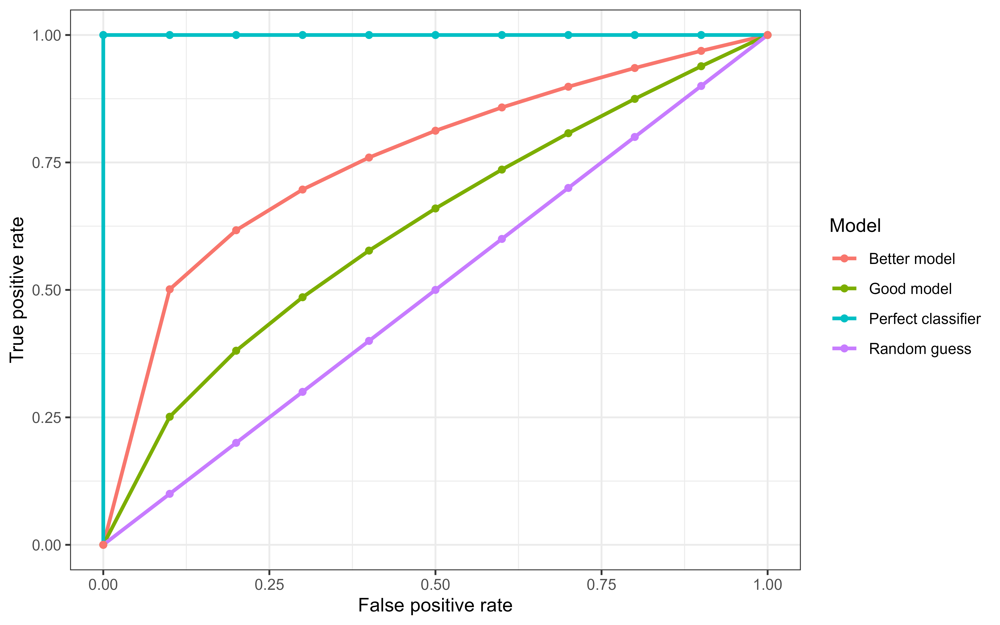

::: {.content-visible when-format="html"}

:::

# Discrimination {#sec-eval-crank}



This chapter discusses 'discrimination measures', which evaluate how well models separate (or 'discriminate') observations into different risk groups.
A model is said to have good discrimination if it correctly predicts that one observation is at higher risk of the event of interest than another, where the prediction is 'correct' if the observation predicted to be at higher risk does indeed experience the event sooner.

In the survival setting, the 'risk' is taken to be the continuous ranking prediction (and by extension the prognostic index prediction) introduced in @sec-survtsk.
All discrimination measures are ranking measures, which means that the exact predicted value is irrelevant, only its relative ordering is required.
For example given predictions $\{100,2,299.3\}$, only their rankings, $\{2,1,3\}$, are used by measures of discrimination.

These measures can be grouped into two categories: concordance indices (@sec-cindex), which assess a model's discrimination by comparing pairs of observations to determine if higher predicted risk corresponds to worse outcomes; and area-under-the-curve (AUC) measures, which evaluate discrimination by converting predicted risks into binary decisions at different cut-off values and assessing how well those decisions align with true positives (sensitivity) and true negatives (specificity).
In binary classification, the AUC and concordance index are identical.
However, in survival analysis there are multiple definitions of the concordance index, and sensitivity and specificity are also not uniquely defined due to censoring and the time-dependent nature of the outcome.
These additional complexities require more careful treatment in the survival setting.

## Concordance Indices {#sec-cindex}

Concordance indices measure the proportion of cases in which the model correctly ranks a pair of observations according to their risk.
These measures may be best understood in terms of two key definitions: 'comparable', and 'concordant'.

::: {#def-concordance}

## Concordance

Let $(i,j)$ be a pair of observations with outcomes $\{(t_i,\delta_i),(t_j,\delta_j)\}$ and let $\{r_i,r_j\} \in \Reals$ be their respective risk predictions. Then $(i,j)$ are called [@Harrell1984; @Harrell1982]:

* *Comparable* if $t_i < t_j$ and $\delta_i = 1$;
* *Concordant* if $r_i > r_j$.

:::

Note that this book defines risk rankings such that a higher value implies higher risk of event and thus lower expected survival time (@sec-survtsk), hence a pair is concordant if $(t_i < t_j \wedge r_i > r_j)$.
Other sources may instead assume that higher values imply lower risk of event and hence a pair would be concordant if $(t_i < t_j \wedge r_i < r_j)$.

Concordance measures then estimate the probability of a pair being concordant, given that they are comparable:

$$
P(r_i > r_j | t_i < t_j \cap \delta_i)
$$ {#eq-cindex-prob}

While various definitions of a 'Concordance index' (C-index) exist, they all represent a weighted proportion of the number of concordant pairs over the number of comparable pairs.
As such, a C-index value will always be within $[0, 1]$ with $1$ indicating perfect separation, $0.5$ indicating no ability to separate low and high risk (equivalent to tossing a coin to estimate (@eq-cindex-prob)), and $0$ being separation in the 'wrong direction', i.e. all high risk observations being ranked lower than all low risk observations.

Concordance measures may either be reported as a value in $[0,1]$, a percentage, or as 'discriminatory power', which refers to the percentage improvement of a model's discrimination above the baseline value of $0.5$.
For example, if a model has a concordance of $0.8$ then its discriminatory power is $(0.8-0.5)/0.5 = 60\%$.
This representation of discrimination provides more information by encoding the model's improvement over some baseline although is often confused with reporting concordance as a percentage (e.g. reporting a concordance of 0.8 as 80%).
In theory this representation could result in a negative value, however this would indicate that $C<0.5$, which would indicate serious problems with the model that should be addressed before proceeding with further analysis.
Representing measures as a percentage over a baseline is a common method to improve measure interpretability and closely relates to the ERV representation of scoring rules (@sec-eval-distr-score-base).

Concordance indices can be expressed as a general measure.
Let $\dvec{\hatr}{n}$ be predicted risks, $(\tt, \bsdelta) = ((t_1, \delta_1) \ (t_2, \delta_2) \cdots (t_n, \delta_n))^\trans$ be observed times and event indicators, let $W$ be some weighting function, and let $\tau$ be a cut-off time.
Then, the *survival concordance index* is defined by,

$$
C(\hatrr, \tt, \bsdelta|\tau) = \frac{\sum_{i\neq j} W(t_i)\II(t_i < t_j, \hatr_i > \hatr_j, t_i < \tau)\delta_i}{\sum_{i\neq j}W(t_i)\II(t_i < t_j, t_i < \tau)\delta_i}
$$ {#eq-cindex}

The choice of $W$ specifies a particular variation of the c-index (see below).
The use of the cut-off $\tau$ mitigates against decreased sample size (and therefore high variance) over time due to the removal of censored observations (see @fig-ipcw).
For $\tau$ to be comparable across datasets, a common choice would be to set $\tau$ as the time at which 80\%, or perhaps 90\% of the data have been censored or experienced the event.

In continuous time settings, it is rare to counter exact ties in observed event times, $t_i = t_j$, though the probability of this occurring as the time outcome is increasingly rounded or aggregated to lower precision.
As model complexity increases, ties in predicted risks, $\hat{r}_i = \hat{r}_j$, also become less common but again may be more likely in simpler models, for example a Cox PH model (@sec-classical) with few coefficients.
As such, it is important to define how such edge cases are handled as the definition of (@eq-cindex) explicitly excludes pairs with tied times or risks.

Concordance indices assess if a model correctly ranks individuals according to their risk.
When two individuals experience the event at the same time, there is no meaningful ordering to recover and therefore the pair does not contribute information about discriminatory ability and may reasonably be excluded from $C_{ind}$.
In contrast, consider pairs with distinct event times but where the model did not separate the observations in terms of risk, $t_i \neq t_j \wedge \hat{r}_i = \hat{r}_j$.
Assigning a score of $0$ could be problematic especially when the observed times are very close.
Conversely, a score of $1$ may also be overly-optimistic, especially when the observed times are very fair.
Therefore, it is common to treat such pairs as contributing $0.5$ to the numerator [@Therneau2020], essentially reflecting that the model is equivalent to a coin toss for that pair.

Specific concordance indices can be constructed by assigning a weighting scheme for $W$ which generally depends on the Kaplan-Meier estimate of the survival function of the censoring distribution fit on training data, $\KMG$, or the Kaplan-Meier estimate for the survival function of the survival distribution fit on training data, $\KMS$, or both.
Measures that use $\KMG$ are referred to as Inverse Probability of Censoring Weighted (IPCW) measures as the estimated censoring distribution is utilized to weight the measure in order to compensate for removed censored observations.
This is visualized in @fig-ipcw where $\KMG$, $\KMG^{-2}$, and $\KMS$ are computed based on the `whas` dataset [@dataapplied].

{#fig-ipcw fig-alt="Line graph with three lines in green, red, and blue. x-axis is labelled 't' and ranges from 0 to 6000. y-axis is labelled 'W(t)' and ranges from 0 to 5. Legend for lines is titled 'W' with entries 'KMG' for the red line, 'KMG^-2' for the green line, and 'KMS' for the blue line. The blue line starts at (0,1), moves to around (1000, 0.5) then is relatively flat. The red line roughly linearly decreases from (0,1) to (6000,0). The green line sharply increases between (1, 1000) to (5, 3500). A vertical gray line passes through (0, 1267)."}

The following are a few of the weights that have been proposed for the concordance index:

* $W(t_i) = 1$:  Harrell's concordance index, $C_H$ [@Harrell1984; @Harrell1982], which is widely accepted to be the most common survival measure and imposes no weighting on the definition of concordance. The original measure given by Harrell has no cut-off, $\tau = \infty$, however applying a cut-off is now more widely accepted in practice.
* $W(t_i) = [\KMG(t_i)]^{-2}$: Uno's C, $C_U$ [@Uno2011].
* $W(t_i) = \KMS(t_i)$ [@Therneau2020]
* $W(t_i) = \KMS(t_i)/\KMG(t_i)$ [@Schemper2009]

All methods assume that censoring is conditionally-independent of the event given the features (@sec-types-of-censoring), otherwise weighting by $\KMS$ or $\KMG$ would not be applicable. It is assumed here that $\KMS$ and $\KMG$ are estimated on the training data and not the testing data (though the latter may be seen in some implementations, e.g. @pkgsurvival).

### Time-dependent concordance indices {#sec-cindex-dep}

So far, it has been implicitly assumed that the quantities $\{r_i, r_j\}$ are derived directly from relative risks predictions (@sec-survtsk).
In doing so, the above measures are time-independent, in that the measure considers discrimination over the entire time horizon and does not take into account that it may be advantageous to take a time-dependent view to consider discrimination at specific time-points.
Antolini's C [@Antolini2005] provides a time-dependent formula for the concordance index by evaluating probability distribution predictions at specific time-points.

Let $\{\hatS_i, \hatS_j\}$ be predicted survival functions for observations $\{i,j\}$ with true outcome times $\{t_i, t_j\}$.
If $t_i < t_j$ and $\delta_i=1$ then observation $i$ experiences the event before $j$ experiences any outcome, hence at the outcome time of observation $i$, $t_i$, one would expect $i$ to have a lower survival probability than $j$: $\hatS_i(t_i) < \hatS_j(t_j)$.
Equation @eq-cindex then follows with $\hat{r}_i := -\hatS_i(t_i)$ and $r_j := -\hatS_j(t_j)$, or slightly more cleanly

$$
C^A(\hat{\mathbf{S}}, \tt, \bsdelta|\tau) = \frac{\sum_{i\neq j} W(t_i)\II(t_i < t_j, \hatS_i(t_i) < \hatS_j(t_i), t_i < \tau)\delta_i}{\sum_{i\neq j}W(t_i)\II(t_i < t_j, t_i < \tau)\delta_i}.
$$

where $\dvec{\hatS}{n}$.
A similar time-dependent measure was derived by @Gandy2025, which defines $\hat{r}_i := \hath_i(t_i)$ and $r_j := \hath_j(t_j)$ where $\hat{h}$ is the predicted hazard function.

### Choosing a C-index {#sec-eval-crank-choose}

With multiple choices of weighting available, choosing a specific measure might seem daunting.
Matters are only made worse by significant debate in the literature, reflecting uncertainty in measure choice and interpretation.

When $\tau$ is too small, the chosen measure is only calculated on early events and as such only provides an estimate that reflects short-term discrimination rather than overall model performance.
In contrast, when $\tau$ is too large, then IPCW measures can be highly unstable [@Rahman2017; @Uno2011], for example the variance of Uno's C drastically increases with increased censoring [@Schmid2012].
For non-IPCW measures (such as Harrell's C), when $\tau$ is too large the central estimate provided by the measure is heavily affected by the proportion of censoring though the variance may be more stable [@Rahman2017].

If a suitable cut-of $\tau$ is chosen, all these weightings perform very similarly [@Rahman2017; @Schmid2012].
In practice, given a suitable $\tau$, all C-index metrics provide an intuitive measure of discrimination and as such the choice of C-index is less important than the transparency in reporting.
One may therefore prefer Harrell's C which estimates the familiar form of the concordance probability in @eq-cindex-prob.

When there is no clear _a priori_ choice of $\tau$, a common rule of thumb is to set $\tau$ to be the time-point at which 80\% of the observations have experienced the event, which is the 80th order statistic from ordered outcome (event or censoring) times:

$$
t_{(1)} \leq t_{(2)} \leq ... \leq t_{(n)}; \quad \tau^* = t_{(\lceil 0.8n \rceil)}.
$$

Even with a suitable choice of $\tau$, the C-index will always be highly dependent on censoring within a dataset.
Therefore, C-index values between experiments are not directly comparable, instead comparisons are limited to comparing model rankings, for example conclusions such as "model A outperformed model B with respect to Harrell's C in this experiment".

To compare choices of weighting schemes, @tbl-ipcw uses the `whas` dataset to compare Harrell's C with measures that include IPCW weighting, when no cutoff is applied (top row) and when a cutoff is applied when $\hat{G}(t)=0.6$ (grey line in @fig-ipcw).
The results are almost identical when the cutoff is applied but still not massively different without the cutoff.

<!-- results below from _experiments.R -->

| | $W=1$ | $W= G^{-1}$ | $W=G^{-2}$ |
|-|-|-|-|
| $\tau=\infty$ | 0.74 | 0.73 | 0.71 |
| $\tau=1267$ | 0.76 | 0.75 | 0.75 |

: Comparing C-index measures (calculated on the `whas` dataset using a Cox model with three-fold cross-validation) with no cut-off (top) and a cut-off when $\hat{G}(t)=0.6$ (bottom). First column is Harrell's C, second is the weighting $1/\hat{G}(t)$, third is Uno's C. {#tbl-ipcw}

The number of choices of concordance indices, and the complexity around them, means that it is not uncommon to see 'C-hacking' in the literature [@Sonabend2022].
C-hacking is the deliberate, unethical procedure of calculating multiple C-indices and to selectively report one or more results to promote a particular model or result, whilst ignoring any negative findings.
For example, calculating Harrell's C and Uno's C but only reporting the measure that shows a particular model of interest is better than another (even if the other metric shows the reverse effect).
To avoid 'C-hacking':

i) the choice of C-index should be made before experiments have begun and the choice of C-index should be clearly reported;
ii) transformations from distribution to ranking predictions (@sec-survtsk) should be chosen and clearly described before starting any experiments.

## Area Under the Curve {#sec-auc}

The area under the curve (AUC) measure specifically refers to the area under the curve obtained by plotting the true positive rate (sensitivity) against the false positive rate (one minus true negative rate, or specificity) across different decision thresholds.
This measure is sometimes referred to as the AUROC as the plot of true positive rate against false positive rate is known as the receiver operating characteristic (ROC) curve, hence area under the ROC.
In binary classification, the area under the curve can be interpreted as the probability that a randomly selected positive case receives a higher predicted probability than a randomly selected negative case, which makes its interpretation identical to the concordance index in the same setting [@Uno2011].

To elucidate this, consider the binary classification problem of predicting whether it will rain or not tomorrow, this leads to four possible outcomes which can be visualized in a confusion matrix:

||||
|----|----|-----|
| | Observed rain | Observed no rain |
| Predicted rain | True positive (TP) | False positive (FP) |
| Predicted no rain | False negative (FN) | True negative (TN) |

Given many different predictions and outcomes, one can count the total number of true positives (TPs) and so on and then define the sensitivity (TPR) and specificity (TNR) as:

$$
\mathrm{TPR} = \frac{\mathrm{TPs}}{\mathrm{TPs} + \mathrm{FNs}}, \quad \mathrm{TNR} = \frac{\mathrm{TNs}}{\mathrm{TNs} + \mathrm{FPs}}, \quad \mathrm{FPR} = 1 - \mathrm{TNR}.
$$

Now consider probabilistic classification where a model predicts $\Pr(\mathrm{rain}) = \hat{p}$ for some $\hat{p} \in [0,1]$.
To convert probabilistic predictions into deterministic labels, a decision threshold $\alpha$ must be chosen such that

$$
\hat{y} =
\begin{cases}
\text{Rain}, & \text{ if } \hat{p} \ge \alpha, \\
\text{No rain}, & \text{ if } \hat{p} < \alpha.
\end{cases}
$$

The receiver operating characteristic curve plots the true positive rate against the false positive rate for all possible threshold values.
The AUC is the area under this curve and is in the range $[0,1]$ with larger values preferred.
In @fig-eval-rocs, a perfect classifier is shown in the blue line, which hugs the top-left corner of the graph.
This optimal curve corresponds to a model for which there exists a threshold at which all positive cases are correctly identified (TPR = 1) and no negative cases are incorrectly classified (FPR = 0).
In practice, achieving perfect separation is rare, and different thresholds produce different trade-offs between true positive and false positive rates.
Hence performance is considered across multiple thresholds.
The purple curve running along $y=x$ represents a random guess classifier ('a coin toss') where at every threshold there is an equal rate of true positives and false positives.
The other two curves represent models that are better than a random guess but don't reach the performance of the optimal classifier.

{#fig-eval-rocs fig-alt="Image shows graph with '1 - Specificity' on the x-axis from 0 to 1 and 'Sensitivity' on the y-axis from 0 to 1. There is a blue line from the bottom left (0,0) to the top right (1,1) of the graph and a red line that forms a curve from (0,0) to around (0.2,0.8) then (1,1)."}

### True positives and negatives in survival analysis

To apply the AUC in a survival analysis setting, one must define a true positive and true negative.
This has two complications, firstly determining _if_ an observation outcome is considered 'positive' or 'negative' and secondly determining _when_ an outcome is positive or negative.
Let $\tau$ be a time point of interest and let $i$ be an observation with outcome $(t_i, \delta_i)$, then there are three possible cases:

1. The observation has experienced the event by $\tau$, in which case they are a 'positive' -- $t_i \le \tau \wedge \delta_i = 1$;
2. The observation has not experienced any outcome by $\tau$ and are considered a 'negative' -- $t_i > \tau$;
3. The observation has been censored by $\tau$ and are neither a 'positive' nor 'negative' -- $t_i \le \tau \wedge \delta_i = 0$.

Similarly to the probabilistic classification case, in a survival analysis setting one must assign a continuous relative risk prediction into a class label (positive or negative).
Let $\hat{r}_i$ be a risk prediction for observation $i$ with usual interpretation that higher values yield higher risk, and let $\alpha$ be a cut-off to threshold the prediction, then the confusion matrix for relative risk predictions is presented in @tbl-confusion-survival.

||||
|----|----|-----|
| | $t_i \le \tau \wedge \delta_i = 1$ | $t_i > \tau$ |
| $\hat{r}_i \ge \alpha$ | True positive (TP) | False positive (FP) |
| $\hat{r}_i < \alpha$ | False negative (FN) | True negative (TN) |

: Confusion matrix at time $\tau$ for risk threshold $\alpha$ for an observation $i$ with relative risk prediction $\hat{r}_i$. {#tbl-confusion-survival}

With these definitions, one can define the TPR and TNR for survival analysis as

$$
\mathrm{TPR}_S(\tau|\alpha) = \frac{\sum_i \II(\hat{r}_i \ge \alpha, t_i \le \tau, \delta_i = 1)}{\sum_i \II(t_i \le \tau, \delta_i = 1)},
$$ {@eq-tpr}

and

$$
\mathrm{TNR}_S(\tau|\alpha) = \frac{\sum_i \II(\hat{r}_i < \alpha, t_i > \tau)}{\sum_i \II(t_i > \tau)}.
$$ {@eq-tnr}

These equations depend on the chosen time $\tau$ and hence yield a measure that is time-dependent.
It does not only capture if the model correctly separates observations into those that do and do not experience the event, but additionally assesses if the model has captured that the time at which events occur also contains valuable information.

Similarly to the issues faced by Harrell's C, (@eq-tpr) simply discards censored observations, which could lead to bias in the measure.
As with prior measures, this can be corrected via IPC weighting [@Uno2011]:

$$
\mathrm{TPR}_{S^*}(\tau|\alpha) = \frac{\sum_i \II(\hat{r}_i \ge \alpha, t_i \le \tau, \delta_i = 1)[\KMG(t_i)]^{-1}}{\sum_i \II(t_i \le \tau, \delta_i = 1)[\KMG(t_i)]^{-1}}.
$$ {@eq-tpr-ipcw}

This weighting is not required in (@eq-tnr), which includes all observations who have yet to experience an outcome (event or censoring).

The equations (@eq-tnr) and (@eq-tpr-ipcw) are derived from earlier work by @Heagerty2005, which relied on additional modelling assumptions and did not incorporate IPCW.
In practice, (@eq-tnr) and (@eq-tpr-ipcw) are straightforward to estimate and yield time-dependent AUC measures that allow model performance to be evaluated at multiple time-points.
For a fixed time point $\tau$, the survival AUC, $\operatorname{AUC}(\tau)$, can be estimated numerically using any standard method for computing the area under a curve, such as the trapezoidal rule applied to the ROC curve.
A single summary measure up to a cutoff $\tau^*$ can then be obtained via a weighted integral over time,

$$
AUC(\tau^*) = \int^{\tau^*}_0 \operatorname{AUC}(\tau) w(\tau) \ d\tau,
$$

where $w$ is a non-negative weighting function.
Popular choices of weights include the density of events over time, a non-parametric estimate of the survival function, or simply uniform weighting across time.

A number of time-dependent AUC methods have been derived including by [@Chambless2006; @Song2008; @Hung2010].
Various surveys on these measures have produced different results [@Blanche2012; @Li2018; @Kamarudin2017] with no clear consensus on how and when these measures should be used.
Moreover, @Uno2011 appears to favour the pairwise methods found in concordance indices, dismissing their early AUC work in @Uno2005.
The primary advantage of these measures is to extend discrimination metrics to be time-dependent and AUC plots over time can be visually appealing to understand where models perform better or worse.
However, for a single time-independent measure, one might prefer the concordance index discussed earlier, and for a single, interpretable time-dependent measure, Antolini's C might remain more interpretable.

## Extensions beyond single-event, right-censoring {#sec-rank-ext}

The definitions of comparable and concordant pairs presented thus far implicitly assume a single-event survival setting with only right-censoring.
In the competing risks setting, multiple distinct event types may occur with event-specific risk predictions.
As such, the earlier notion of concordance cannot be directly applied without modification.
In settings involving other censoring mechanisms or truncation, even the definition of a 'comparable' pair becomes less straightforward.
Concordance measures therefore require careful adaptation in these contexts, discussed next.

### Competing risks

Discrimination measures are usually extended to the competing risk setting by evaluating cause-specific probabilities individually and then potentially summing or averaging over cause-specific measures [@vanGeloven2022; @Lee2018a; @Bender2021; @Alberge2025].

To recap formulae from @sec-eha, the cause-specific hazard for event $e$ is defined as

$$
h_{e}(\tau) = \lim_{\Delta \tau \to 0} \frac{P(\tau \leq Y \leq \tau + \Delta \tau, E = e\ |\ Y \geq \tau)}{\Delta \tau}, \; e = 1, \dots, q,
$$

where $Y$ is the random variable representing the time-to-event and $E\in \{1,\ldots,q\}$ is the random variable with realizations $e$, which denotes one of $q$ competing events that can occur at time $Y$.

In a single-event setting, a pair of observations, $(i,j)$, with outcomes $\{(t_i,\delta_i),(t_j,\delta_j)\}$, and predicted risks, $r_i,r_j \in \Reals$, are called comparable if $t_i < t_j$ and $\delta_i = 1$; they are concordant if additionally $r_i > r_j$.
In the competing risks setting, comparability and concordance are defined at the cause-specific level for an event $e$ [@vanGeloven2022].
Observations are called comparable if $t_i < t_j$ and $\delta_{ie} = 1$, Where $\delta_{ie}$ equals $1$ if observation $i$ experienced event $e$ and $0$ otherwise.
Intuitively, if $\delta_{ie} = 0$ then either $i$ was censored, in which case cannot determine ordering for event $e$, or it experienced a different event, which is not informative for discrimination with respect to event $e$.

The usual definition of a concordance index then follow with this additional conditioning on the event of interest $e$.
In practice, as competing risks models often estimate cause-specific hazard functions, a variation of Antolini's time-dependent concordance measure may be most appropriate.
For event event $e$, the measure is

$$
C(\hat{\mathbf{h}}_e, \tt, \bsdelta|\tau) = \frac{\sum_{i\neq j} W(t_i)\II(t_i < t_j, \hat{h}_{e_i}(t_i) > \hat{h}_{e_j}(t_i), t_i < \tau)\delta_{ie}}{\sum_{i\neq j}W(t_i)\II(t_i < t_j, t_i < \tau)\delta_{ie}}
$$

where $\hat{\hh}_e = (\hath_{e_1} \ \hath_{e_2} \cdots \hath_{e_n})^\trans$ are the predicted cause-specific hazards for event $e$.

### Other censoring and truncation types

AUC and concordance indices are designed to rank observations, or at least evaluate how well a model discriminates between two risk groups.
This is a substantial challenge when there is interval censoring in the data as the 'true' ranks of observations are unknown.
Let $i,j$ be two observations with interval censoring times $(l_i, r_j), (l_j, r_j)$ respectively.
Given valid combinations (r > l) then these observations may coincide with one of six combinations:

1. $l_i < r_i < l_j < r_j$
2. $l_i < l_j < r_i < r_j$
3. $l_i < l_j < r_j < r_i$
4. $l_j < r_j < l_i < r_i$
5. $l_j < l_i < r_j < r_i$
6. $l_j < l_i < r_i < r_j$

Of these, only case (1) and (4) can be used in a standard concordance index as the intervals are non-overlapping.
For all other cases, conditional probabilities have to be substituted or imputation used to estimate when in an interval the event takes place [@Tsouprou2015; @Wu2023].
After such estimation, interpretation of any metric is difficult, as it's unclear if the original prediction is being evaluated or the guesswork that went into the evaluation measure.
In this case it is likely better to use more straightforward methods that do not require these extra steps.

When it comes to time-dependent AUC measures, the TNR and TPR can be extended to accommodate interval-censoring, by updating the equations to only include contributions from observations when the event is guaranteed to have occurred ($r_i \leq \tau$) or not ($l_i > \tau$) [@Li2011]:

$$
TNR_D(\hatrr, N | \alpha, \tau) = P(\hatr_i \leq \alpha | l_i > \tau)
$$

and

$$
TPR_C(\hatrr, N | \alpha, \tau) = P(\hatr_i > \alpha | r_i \leq \tau)
$$

In the presence of interval censoring, estimation depends on more complex estimators such as the nonparametric maximum likelihood estimator, which can be challenging to fit and splines could be used instead [@Wu2020].
However, splines themselves require modelling and any metric that requires modelling to estimate introduces significant difficulties in its interpretation.
As a more simplistic (yet sometimes realistic on average) alternative, one could impute the outcome time as the midpoint between the interval margins, $t_i = (l_i + r_i)/2$ [@Gadda2016].

As left-censoring is a specialised case of interval-censoring (with $l_i = 0$) the above formulae can be used to handle left-censored data as well.

### Truncation

When only right-censoring is present, the objective of concordance measures is to estimate the probability that the ranking of two observations' risk is correctly specified (@eq-cindex-prob).
The naive method to deal with left-truncation is to simply ignore it and use @eq-cindex as usual.
Doing so yields an estimator, $C_N$, that converges in probability to

$$
P(r_i > r_j | \delta_i, t_i < t_j, t_i \geq t^L_i, t_j \geq t^L_j)
$$ {#eq-cindex-lt-naive}

where $t^L_i, t^L_j$ are the left-truncation times for $i$ and $j$ respectively (which are $0$ if the observation is not left-truncated).
This is considered a 'naive' estimator as it may introduce bias [@Hartman2022], to see why this is the case consider that the right-hand-side of @eq-cindex-lt-naive is true in one of two cases (ignoring ties):

1. $t_i < t_j^L < t_j$;
2. $t_j^L < t_i < t_j$.

In the first case, $j$ enters the study after $i$ has experienced the outcome and the observations never overlap in the data at the same time 
@Hartman2022 demonstrate that evaluating discrimination in the presence of these 'nonoverlapping intervals' creates bias if truncation is dependent on the predictors (for the same reason, methods for estimation need to be adapted as well).
Therefore, the data should be further restricted to overlapping intervals, yielding the estimator

$$
C_{LT}(\hatrr, \tt, \bsdelta, \tt^L|\tau) = \frac{\sum_{i\neq j} \II(t_i < t_j, \hatr_i > \hatr_j, t_i < \tau, t_i \geq t^L_j)\delta_i}{\sum_{i\neq j}\II(t_i < t_j, t_i < \tau, t_i \geq t^L_j)\delta_i}
$$

In contrast to @eq-cindex, no generic weighting term is included, which is due to the complexity of estimating IPC weights in the context of left-truncation [@Therneau2020].
Interestingly, experiments have shown that naively applying Harrell's C (@eq-cindex with $W=1$) may be a better estimator than $C_{LT}$ with lower bias [@Hartman2022].
Whilst more complex IPC measures have been proposed, they do not seem to be in common usage anywhere whereas $C_N$ and $C_{LT}$ are both used in published research and software [@McGough2021; @pkgsurvival].
As has been seen throughout this book, left-truncation research is still nascent.
No evidence of methods for right-truncation could be found.

## Conclusion

:::: {.callout-warning icon=false}

## Key takeaways

* Discrimination measures evaluating relative risks predictions by assessing if a mode can separate correctly between observations who are at higher or lower risk of event.
* The C-index is the most common concordance index, with several specific choices that handle censoring differently. In practice, Harrell's C is often a sensible first choice, provided a cut-off is applied to only evaluate the model up to a given time point.
* Concordance measures offer some degree of flexibility over different patterns in the underlying dataset. For example, measures can be extended to capture changes over time, to handle competing risks, and some more complex censoring and truncation types.

::::

:::: {.callout-important icon=false}

## Limitations

* Concordance measures can change substantially with the censoring mechanism and length of follow-up. As a result, absolute values are often not comparable across datasets or studies.
* Concordance measures often require choices to be made by the practitioner for stable result. These can include selecting a weighting scheme to handle censoring, a cut-off to evaluate the model up to, and handling of ties. Without careful selection, results from measures can vary widely between experiment iterations.
* Concordance measure should rarely be used to evaluate prediction's on their own as there is often a trade-off between discrimination and calibration, which is discussed in the next chapter.

::::

:::: {.callout-tip icon=false}

## Further reading

* A recent paper explored a variant of Antolini's C in which the risk prediction is made with the hazard function instead of the survival function [@Gandy2025].
* The work of @Heagerty2000 and @Heagerty2005 led to the majority (if not all) developments in time-dependent AUCs. These were touched on briefly in this chapter but readers may want to explore these further for more detail and in particular to learn about incident/dynamic versus cumulative/dynamic AUC definitions.
* @Royston2004 present a concordance measure now known as Royston's D, which @Rahman2017 recommend for its interpretability. However, this measure does not appear widely used in practice and as such was not discussed in this chapter.
* @Avati2020 consider an alternative AUC statistic based on the area under the precision-recall curve (AUC-PR). AUC-PR is increasingly common in machine learning literature as it may perform better when classes are imbalanced.

::::
