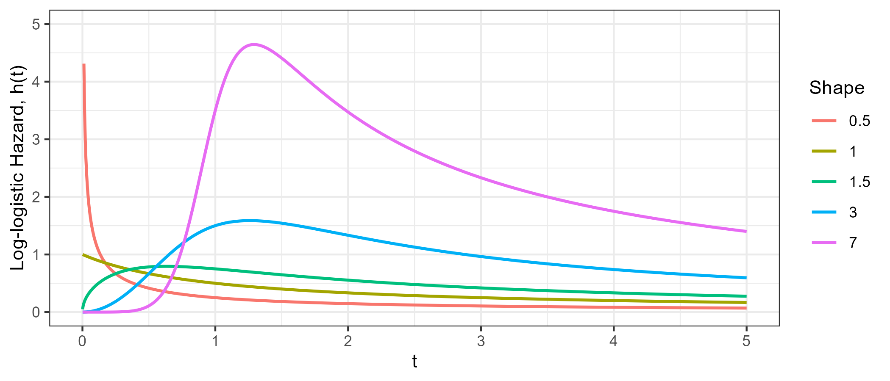

::: {.content-visible when-format="html"}

:::

# Foundational Survival Models and Estimators {#sec-classical}

In a predictive setting, it can be easy to dismiss survival models that have been around for decades ('foundational models')\index{foundational models} and instead favor testing of more modern 'machine learning' tools\index{machine learning}. This would be a mistake.
Firstly, on low-dimensional data (small number of variables), foundational methods often outperform machine learning models [@Beaulac2020; @Burk2026].
Secondly, even on high-dimensional data\index{high-dimensional data}, several papers have demonstrated that augmenting foundational models (@sec-classical-improving) can yield models that outperform machine learning alternatives [@Spooner2020; @Zhang2021].
Finally, most machine learning survival algorithms build on these foundational models as a central component, for example by using non-parametric estimators (@sec-classical-nonpar) and/or assuming a proportional hazards form (@sec-classical-cox).
Therefore, a robust understanding of these models is imperative to fairly construct and evaluate machine learning survival models.
This chapter begins by demonstrating non-parametric estimators as predictive tools, including a recap of some estimators in @sec-surv.
Semi- and fully-parametric models are then introduced, most notably the Cox proportional hazards model (@sec-ph-semi-parametric) and the accelerated failure time model (@sec-surv-models-param).
Finally, methods to improve foundational models through machine learning methodology are presented.

## Non-parametric estimators {#sec-classical-nonpar}

Non-parametric estimators\index{non-parametric estimators} have already been introduced in @sec-surv-estimation-non-param, therefore this section is brief and focuses only on how these estimators can be used as predictive models.

### Unconditional estimators

Recall from @sec-surv-estimation-non-param, the Kaplan-Meier\index{Kaplan-Meier estimator} and Nelson-Aalen\index{Nelson-Aalen estimator} estimators respectively estimate the survival function and cumulative hazard function as:

$$
S_{KM}(\tau) = \prod_{k:t_{(k)} \leq \tau}\left(1-\frac{d_{\tbk}}{n_{\tbk}}\right),
$$ {#eq-km-ml-two}

and

$$
H_{NA}(\tau) = \sum_{k:\tbk\leq \tau} \frac{d_{\tbk}}{n_{\tbk}},
$$

where $d_{\tbk}$ and $n_{\tbk}$ are the number of events and observations at risk at the $k$th ordered event time, $\tbk$ respectively.

@fig-km-rats illustrates the Kaplan-Meier estimator fit on the `rats` [@datarats] dataset.
The top image shows the estimator as a step function, with steps occurring at event times (some examples in green dashed lines).
At censoring times, the estimator stays constant (examples in blue dotted lines).
The bottom image displays the estimator as a predictive tool.
To predict the survival probability of a new rat, one can find the estimated survival probability at a given time from the trained estimator, without needing any more details about the rat in question (as covariates are ignored).
This provides a quick tool that tends to be marginally well-calibrated (@sec-eval-distr-calib).
This estimator is the analogue to the sample mode and sample mean baseline estimators\index{baseline models} in classification and regression respectively.
The same idea of using a non-parametric featureless estimator as a predictive baseline follows for other censoring and truncation types (@sec-surv-estimation-non-param) and event history analysis more generally (@sec-aalen-johansen).

{#fig-km-rats fig-alt="Two graphs both with time on the x-axis and survival probability on the y-axis. Both graphs show the same step function decreasing from S(t)=1 at t=0 to around S(t)=0.8 at around t=100. In the top graph, three dashed vertical lines mark three steps in the function, two blue lines mark vertical lines without steps. In the bottom graph, an arrow from t=60 points to the survival probability of around S(t)=0.98."}

### Conditional estimators

As well as unconditional estimators, which do not account for covariates, an alternative is the conditional Akritas estimator [@Akritas1994], usually defined by [@Blanche2013]:\index{Akritas estimator}

$$
S(\tau \mid \xx^*, \lambda) = \prod_{k:\tbk\leq \tau} \left(1 - \frac{\sum^n_{i=1} K(\xx^*,\xx_i \mid \lambda)\II(t_i = \tbk, \delta_i = 1)}{\sum^n_{i=1} K(\xx^*,\xx_i \mid \lambda)\II(t_i \geq \tbk)}\right),
$$ {#eq-akritas}

where $K$ is a kernel function, usually $K(\xx,\yy \mid \lambda) = \II(\lvert \hat{F}_X(\xx) - \hat{F}_X(\yy)\rvert \leq \lambda), \lambda \in (0, 1]$ is a hyperparameter, and $\hat{F}_X$ is the empirical distribution function of the data.
The estimator can be interpreted as a conditional Kaplan-Meier estimator computed on a neighborhood of subjects closest to $\xx^*$.
When $\lambda = 1$, then $K(\cdot \mid \lambda) = 1$ and (@eq-akritas) is identical to (@eq-km-ml-two).

The formulation in (@eq-akritas) can be turned into a baseline predictive model by treating estimation of $\hatF_X$ on training data as the learning algorithm, and then using (@eq-akritas) as the prediction algorithm (@sec-ml-models). \index{baseline models}

## Proportional hazards {#sec-classical-cox}

This section begins with an introduction to the proportional hazards concept\index{proportional hazards}, introduces estimation with the Cox proportional hazards\index{Cox proportional hazards} model (@sec-ph-semi-parametric), and then moves to fully parametric proportional hazards models (@sec-ph-parametric), with the Weibull model as a motivating example.\index{proportional hazards!fully parametric}

Let $\eta_i = \xx_i^\trans\bsbeta$ be the linear predictor for some observation $i$ with covariates $\xx_i \in \Reals^p$ and model coefficients $\bsbeta \in \Reals^p$, then proportional hazards (PH) models assume that the hazard function for observation $i$ follows the form:

$$
h_{PH}(\tau \mid \xx_i)= h_0(\tau)\exp(\eta_i),
$$ {#eq-ph}

or equivalently:

$$
H_{PH}(\tau \mid \xx_i)= H_0(\tau)\exp(\eta_i),
$$ {#eq-ph-cum}

and

$$
S_{PH}(\tau \mid \xx_i)= S_0(\tau)^{\exp(\eta_i)}.
$$ {#eq-ph-surv}

$h_0,H_0,S_0$ are referred to as the baseline hazard, cumulative hazard, and survival function respectively.\index{baseline hazard}\index{baseline survival}
Instead of modeling a separate intercept, the _baseline hazard_ represents the hazard when the linear predictor is zero, hence the term _baseline_. 
Note that the baseline hazard may not have a meaningful interpretation unless continuous covariates are centered and categorical covariates are reference coded (analogous to the intercept $\beta_0$ in linear regression).

It can be seen from (@eq-ph) that time is only incorporated via the baseline hazard [see @vanHouwelingen2011 for extensions to time-varying covariates].\index{time-varying covariates}
Therefore, PH models first estimate the baseline risk of an event at a fixed time, and then modulate this risk according to the specification of covariates.
This represents the eponymous 'proportional hazards' assumption as the individual's hazard at time $\tau$ is directly proportional to a multiplicative function of their own covariates: $h(\tau \mid \xx_i) \propto \exp(\eta_i)$.\index{proportional hazards!assumption}
In other words, a unit change in a covariate acts multiplicatively on the estimated hazard.
For a single covariate $x$, the _hazard ratio_ is:\index{proportional hazards!hazard ratio}

$$
\frac{h_{PH}(\tau \mid x_i)}{h_{PH}(\tau \mid x_j)} = \frac{h_0(\tau)\exp(x_i\beta)}{h_0(\tau)\exp(x_j\beta)} = \exp(\beta(x_i -x_j)),
$$ {#eq-ph-hazard-ratio}

or equivalently:

$$
h_{PH}(\tau \mid x_i) = \exp(\beta(x_i - x_j))h_{PH}(\tau \mid x_j).
$$

So in the case where the covariate differs between subjects by $1$, the hazard ratio is $\exp(\beta)$.
This yields an interpretable model in which hazard ratios depend solely on the value of their linear predictors and remain constant over time.
This does _not_ imply that the effect of covariates on the survival function is constant over time, as the survival ratio depends on $S_0$:

$$
\frac{S_{PH}(\tau \mid x_i)}{S_{PH}(\tau \mid x_j)} = \frac{S_0(\tau)^{\exp(x_i\beta)}}{S_0(\tau)^{\exp(x_j\beta)}} = S_0(\tau)^{\exp(x_i\beta)-\exp(x_j\beta)}.
$$

The next sections discuss how to fit the $\bsbeta$ parameters semi-parametrically (@sec-ph-semi-parametric) and fully parametrically (@sec-ph-parametric).

### Semi-parametric PH {#sec-ph-semi-parametric}

The Cox proportional hazards (Cox PH)  [@Cox1972], or Cox model, is likely the most widely known semi-parametric model and the most studied survival model [@Reid1994; @Wang2017].\index{Cox proportional hazards}\index{proportional hazards!semi-parametric}
Often, it is considered synonymous with proportional hazards and the functional form of the hazard given in (@eq-ph). 
However, the main contribution of Cox's work was to develop a method to estimate $\bsbeta$ without making any assumptions about the baseline hazard. \index{baseline hazard}
Estimation of the parameters is discussed in detail as the objective function of the Cox model is also used by many machine learning methods like boosting (@sec-boost) and neural networks (@sec-nnet).

Recall from @sec-surv-estimation, to estimate the distribution of event times one either needs to make distributional assumptions and accordingly define the likelihood of observing the data (given model parameters), or to use non-parametric estimators, which usually do not incorporate covariate information. 
Let $i_{(k)}$ denote the subject who experienced the event at ordered event time $\tbk$.
Cox noted the contribution of an individual could be defined as the probability of a subject, $i_{(k)}$, experiencing the event at $\tbk$, given that someone in the risk set experienced the event at that time. 
The likelihood contribution of this $k$th event is given by:

$$
\calL^{Cox}_{i_{(k)}}
=\frac{h_0\left(\tbk\right)\exp\left(\eta_{i_{(k)}}\right)}
{\sum_{j\in \calR_{\tbk}} h_0\left(\tbk\right)\exp\left(\eta_j\right)}
=\frac{\exp\left(\eta_{i_{(k)}}\right)}
{\sum_{j\in \calR_{\tbk}}\exp\left(\eta_j\right)},
$$

which depends on $\bsbeta$ via $\eta_i=\xx_i^\trans\bsbeta$.
Note how the baseline hazard $h_0$ cancels out in the likelihood contribution and removes the dependency on time.
For the estimation of $\bsbeta$, the baseline hazard can be considered a 'nuisance parameter'\index{baseline hazard} and the likelihood for the entire data set can be defined as: \index{Cox proportional hazards!partial likelihood}

$$
\mathcal{L}_{PL}(\bsbeta) = \prod_{k=1}^m \calL^{Cox}_{i_{(k)}} = \prod_{k=1}^m \left(\frac{\exp(\eta_{i_{(k)}})}{\sum_{j \in \calR_{\tbk}} \exp(\eta_j)}\right),
$$ {#eq-partial}

which is referred to as a *partial likelihood* [@Cox1975] as it omits the baseline hazard and so captures only part of the full likelihood, rather than fully specifying the distribution of event times.
Ignoring the baseline hazard means that exact event time information is absent from (@eq-partial).
However, observation rankings are still preserved as event time information contributes to (@eq-partial) through the index of the product and sum.
Censored observations contribute to the likelihood through $\exp(\eta_j)$ in the denominator of the calculation.

The partial likelihood (@eq-partial) assumes there are no ties in the event time, that is, no two subjects have an event at the same time.
In practice, ties can be common and several methods have been proposed to handle them, including an exact (but computationally expensive) method [@Kalbfleisch1973], the Breslow approximation [@breslowCovarianceAnalysisCensored1974], and the Efron approximation [@Efron1977]. Further details are not discussed here, but all three methods are readily accessible in openly available software.\index{ties}

The log-partial likelihood, usually preferred for optimization, is given by:\index{Cox proportional hazards!log-partial likelihood}

$$
\ell_{PL}(\bsbeta) = \sum_{k=1}^m \left(\eta_{i_{(k)}} - \log \left(\sum_{j \in \calR_{\tbk}} \exp(\eta_j)\right)\right),
$${#eq-lpartial}

such that 

$$
\hat{\bsbeta} = \argmax_{\bsbeta}\ \ell_{PL}(\bsbeta).
$${#eq-estimate-beta}

Traditionally, $\hat{\bsbeta}$ is obtained using numerical optimization methods, such as Newton-Raphson or Fisher-Scoring, which require the first and second derivatives of (@eq-lpartial).

The partial likelihood allows estimation of covariate effects (and interpretation in terms of hazard ratios) without making any assumptions about the underlying distribution of event times.
Obtaining $\hat{\bsbeta}$ also provides enough information to make predictions in the form of relative risks (@sec-survtsk-risk). 
However, making survival distribution predictions (@sec-survtsk-dist) requires an estimate of the baseline hazard, $h_0$.
The Breslow estimator\index{Cox proportional hazards!Breslow estimator} [@Breslow1972; @linBreslowEstimator2007] provides a way to obtain an estimate of the cumulative baseline hazard, $H_0$, using the parameters from the Cox model:

$$
H_{Bres}(\tau) = H_0(\tau) = \sum_{k:\tbk \leq \tau} \frac{d_{\tbk}}{\sum_{j \in \calR_{\tbk}} \exp(\eta_j)}.
$$ {#eq-breslow}

The Breslow estimator is identical to the Nelson-Aalen estimator\index{Nelson-Aalen estimator} (@eq-nelson-aalen) when the linear predictor is zero for every observation:

$$
H_{Bres}(\tau) = \sum_{k:\tbk \leq \tau} \frac{d_{\tbk}}{\sum_{j \in \calR_{\tbk}} 1} = \sum_{\tbk \leq \tau} \frac{d_{\tbk}}{n_{\tbk}} = H_{NA}(\tau).
$$

With these formulae, the Cox PH model can be used as a predictive model.
The learning and prediction algorithms each proceed in two steps:

1. **Learning**: Fit $\hat{\bsbeta}$ on training data via (@eq-estimate-beta) and then estimate the cumulative baseline hazard, $\hatH_0$ with (@eq-breslow).
2. **Predicting**: Use $\hat{\bsbeta}$ to obtain $\hat{\eta}_i$ for new observations, optionally returning $\exp(\hat{\eta}_i)$ as a relative risk prediction. Then combine $\hat{\eta}_i$ with $\hatH_0$ via (@eq-ph-cum) to return a predicted survival distribution.

The Cox model is highly interpretable and has a long history of use in clinical prediction modeling and analysis.
However, the proportional hazards assumption is often violated in practice.
Over the years, extensions to the Cox model have been developed [@therneau2001modelingsurvival] to incorporate stratified baseline hazards (where the PH assumption only has to hold within strata), time-varying effects (where the effects of time-constant covariates change over time), and time-varying covariates (where covariate values themselves change over time).
While these extensions can improve model fit and support interpretation, they may be difficult to incorporate into predictive modeling, particularly when future covariate values are unknown.
Even without such extensions, the Cox model has been shown to perform well in comparison to more complex models in neutral benchmark experiments [@Burk2026; @Gensheimer2018; @Luxhoj1997; @VanBelle2011b].

### Parametric PH {#sec-ph-parametric}

Semi-parametric approaches (like the Cox model) are popular because they do not make an assumption about the underlying distribution of event times, leaving the baseline hazard unspecified.
However, there are some cases where modeling a particular distribution is sensible.\index{proportional hazards!fully parametric}
On these occasions, a specific probability distribution of the event times is assumed, with three common choices being the exponential, Gompertz, and Weibull distributions [@Kalbfleisch1980; @Wang2017].\index{exponential distribution}\index{Weibull distribution}\index{Gompertz distribution}
The exponential distribution is a special case of the Weibull distribution when the latter's shape parameter equals $1$.

Assuming a PH model, one can plug in the hazard and survival functions from the Weibull distribution into (@eq-ph) and (@eq-ph-surv) respectively.
First recall for a $\Weib(\gamma, \lambda)$ distribution with shape parameter $\gamma$ and scale parameter $\lambda$, the relevant functions can be given by [@Kalbfleisch1980]:\index{proportional hazards!Weibull}\index{proportional hazards!exponential}

$$
h(\tau) = \lambda\gamma \tau^{\gamma-1} \quad \text{and} \quad S(\tau) = \exp(-\lambda \tau^\gamma).
$$

These functions can be substituted into the PH form as the baseline hazard and survival functions respectively:

<!--  -->
$$
h_{WeibullPH}(\tau \mid \xx_i)= (\lambda\gamma \tau^{\gamma-1}) \exp(\eta_i),
$$ {#eq-ph-weibull-haz}
<!--  -->
or equivalently
<!--  -->
$$
S_{WeibullPH}(\tau \mid \xx_i)= (\exp(-\lambda \tau^\gamma))^{\exp(\eta_i)}.
$$ {#eq-ph-weibull-surv}
<!--  -->

The full likelihood (@sec-surv-estimation-param) for the WeibullPH model follows by substituting (@eq-ph-weibull-haz)-(@eq-ph-weibull-surv) into the right-censored likelihood (@eq-right-censoring-likelihood):

$$
\begin{aligned}
\mathcal{L}(\bstheta) &= \prod_{i=1}^n h_Y(t_i \mid \xx_i, \bstheta)^{\delta_i}S_Y(t_i \mid \xx_i, \bstheta) \\
&= \prod_{i=1}^n \left(\lambda\gamma t_i^{\gamma-1} \exp\left(\eta_i\right)\right)^{\delta_i}\left(\exp\left(-\lambda t_i^\gamma\right)\right)^{\exp(\eta_i)},
\end{aligned}
$$

with log-likelihood:

$$
\begin{aligned}
\ell(\bstheta) &= \sum_{i=1}^n \delta_i[\log(\lambda\gamma) + (\gamma-1)\log(t_i) + \eta_i] - \lambda t_i^\gamma\exp(\eta_i) \\
&\propto \sum_{i=1}^n \delta_i[\log(\lambda\gamma) + \gamma\log(t_i) + \eta_i] - \lambda t_i^\gamma \exp(\eta_i).
\end{aligned}
$$

Parameters can then be fit using maximum likelihood estimation\index{maximum likelihood estimator} with respect to all unknown parameters $\bstheta = \{\bsbeta, \gamma, \lambda\}$.
Expansion to other censoring types and truncation follows by using other likelihood forms presented in @sec-surv-estimation.

When considering which probability distributions to model in predictive experiments, Weibull is a common starting choice [@CoxSnell1968; @Hielscher2010; @Rahman2017], its two parameters make it a flexible fit to data but on the other hand it can be easily reduced to exponential when $\gamma=1$.
Gompertz [@Gompertz1825] is commonly used in medical domains, especially when describing adult lifespans.\index{Gompertz distribution}\index{Weibull distribution}
In a machine learning context, one can select the optimal distribution for future predictive performance by running a benchmark experiment.
In contrast to the semi-parametric Cox model, fully parametric PH models can predict absolutely continuous survival distributions, they do not treat the baseline hazard as a nuisance, and in general will result in more precise and interpretable predictions if the distribution is correctly specified  [@Reid1994; @Royston2002].

### Competing risks {#sec-classical-ph-cr}

There are two common methods to extend the Cox model to the competing risks setting.\index{competing risks}
The first makes use of the cause-specific hazard to fit a cause-specific Cox model, the second fits a 'subdistribution' hazard.\index{proportional hazards!cause-specific}\index{proportional hazards!subdistribution}

#### Cause-specific PH models

In cause-specific models, the hazard for cause $q \in \{1,\ldots,Q\}$ is defined as:\index{proportional hazards!cause-specific}

$$
h_{q}(\tau \mid \xx_{q;i})= h_{q;0}(\tau)\exp(\eta_{q;i}),
$$

where $h_{q;0}$ is a cause-specific baseline hazard and $\xx_{q;i}$ is a set of cause-specific covariates (in practice, usually the same covariates are used for all causes), and $\eta_{q;i}$ is the cause-specific linear predictor,

$$
\eta_{q;i} = \xx_{q;i}^\trans \bsbeta_q.
$$

To estimate $\bsbeta_q$, let $\tbkq, k=1,\ldots,m(q)$ be the unique, ordered event times at which events of cause $q$ occur and let $i_{q;(k)}$ be the index of the observation that experiences the $k$th event of cause $q$.
Then the cause-specific partial likelihood is given by:

$$
\mathcal{L}_{PL}(\bsbeta_q) = \prod_{k=1}^{m(q)} \left(\frac{\exp(\eta_{q;i_{q;(k)}})}{\sum_{j \in \calR_{\tbkq}} \exp(\eta_{q;j})}\right),
$$ {#eq-partial-cr}

where $\calR_{\tbkq}$ is the risk set of observations that have not experienced an event of *any* cause or censoring before $\tbkq$.
The competing risks partial likelihood (@eq-partial-cr) is identical to the single-event partial likelihood in (@eq-partial), with the only difference being that the product and sum are over the unique, ordered event times for cause $q$. \index{proportional hazards!cause-specific partial likelihood}

Using the same logic as in the single-event case, the Breslow estimator follows from (@eq-breslow): \index{Cox proportional hazards!Breslow estimator}

$$
H_{Bres;q}(\tau) = \sum_{k:\tbkq \leq \tau} \frac{d_{\tbkq}}{\sum_{j \in \calR_{\tbkq}} \exp(\eta_{q;j})},
$$

and the feature-dependent, cause-specific cumulative hazard (@eq-ph-cum) as,

$$
H_{q}(\tau \mid \xx) = H_{Bres;q}(\tau)\exp(\xx^\trans \bsbeta_q).
$$ {#eq-cause-specific-cumu-hazard-cox}

A final prediction of the cumulative incidence function\index{cumulative incidence function} follows by (@eq-cif) where the cause-specific hazard function is the derivative (or a discrete approximation) of (@eq-cause-specific-cumu-hazard-cox) and the all-cause survival probability follows by (@eq-all-cause-surv-prob): 
$$
\begin{aligned}
&F_{Bres;q}(\tau \mid \xx) = \\
&\sum_{k:\tbkq \leq \tau} \exp\left(-\sum_{r=1}^Q H_{r}(\tbkq- \mid \xx)\right) \frac{d_{\tbkq}}{\sum_{j \in \calR_{\tbkq}} \exp(\eta_{q;j})}\exp(\xx^\trans \bsbeta_q).
\end{aligned}
$$ {#eq-cif-cox}

#### Subdistribution PH models

The methods discussed thus far estimate cause-specific hazards (@eq-cause-specific-hazard), which represent the instantaneous risk of an individual experiencing the cause of interest, given that they have not yet experienced *any* event. \index{proportional hazards!subdistribution}
An alternative approach is to model subdistribution hazards, which model the risk of an individual experiencing the cause of interest, given they have not yet experienced the event of interest, but may have experienced a competing event.
One benefit of the subdistribution model is the ability to directly relate the covariates to the cumulative incidence function (CIF) under a PH model, rather than using the indirect calculation in (@eq-cif-cox).

Mathematically, the difference between cause-specific and subdistribution hazards comes from the definition of the risk set. The subdistribution risk set is defined as: \index{risk set!subdistribution}
$$
\calR^{SD}_{q;\tau} := \{i: t_i \geq \tau \vee \left(t_i < \tau \wedge q_i \in \{1,\ldots,Q\} \setminus \{q\}\right)\},
$$ {#eq-riskset-sd}

where $q_i$ is the cause experienced by observation $i$.

<!--  -->
Observe that in this definition the left-hand side is the same as the standard risk set definition (@eq-risk-set) and the right-hand side additionally includes those that have experienced a different event.
Anyone that has been censored ($q_i = 0$) before $\tau$ is removed from the risk set.

The definition of the subdistribution risk (@eq-riskset-sd) is equivalent to defining the subdistribution hazard for cause $q$ as:

$$
\begin{aligned}
&h^{SD}_{q}(\tau) = \\
&\lim_{\dtau \to 0} \frac{\Pr\left(E(\tau + \dtau) = q \mid E(\tau-) = 0 \vee \left(E(\tau-) \in \{1,\ldots,Q\} \setminus \{q\}\right)\right)}{\dtau}.
\end{aligned}
$$ {#eq-hazard-sd}

This extends the cause-specific hazard (@eq-cause-specific-hazard), which conditions only on remaining event-free ($E(\tau-) = 0$), by additionally retaining in the conditioning set those who have already experienced a competing event and thus could never transition to $q$.

@Fine1999 proposed a proportional hazards formulation of the subdistribution hazard (@eq-hazard-sd) as: \index{proportional hazards!subdistribution}

$$
h_{FG;q}(\tau \mid \xx_i)= h^{SD}_{q;0}(\tau)\exp(\eta_{q;i}),
$$ {#eq-cox-sd}

with (@eq-hazard-sd) being the target for the subdistribution baseline hazard $h^{SD}_{q;0}(\tau)$, and where $\eta_{q;i}$ is the linear predictor for observation $i$ and cause $q$.
Applying the Fine-Gray model assumes proportional hazards for the subdistribution hazard of the cause of interest.
An equivalent formulation in terms of the CIF is given by:

$$
F_{FG;q}(\tau \mid \xx_i) = 1 - \left(1 - F^{SD}_{q;0}(\tau)\right)^{\exp(\eta_{q;i})},
$$ {#eq-fg-cif}

where $F^{SD}_{q;0}(\tau) = 1 - \exp(-H^{SD}_{q;0}(\tau))$ is the baseline subdistribution CIF (the CIF when $\eta_{q;i} = 0$) and $H^{SD}_{q;0}$ is the cumulative baseline subdistribution hazard (once again estimated by the Breslow estimator).

The parameters of (@eq-cox-sd) are estimated using a weighted partial likelihood [@Fine1999]:
$$
\mathcal{L}_{PL}^{SD}(\bsbeta) = \prod_{k=1}^{m(q)} \left(\frac{\exp(\eta_{q;i_{q;(k)}})}{\sum_{j \in \calR^{SD}_{q;\tbkq}} w_{kj}\exp(\eta_{q;j})}\right),
$$ {#eq-fg-likelihood}

where again $\tbkq$ are the unique, ordered event times at which cause $q$ occurs, and $w_{kj}$ are weights to account for the subdistribution risk set, defined as:

$$
w_{kj} := \frac{G_{KM}(\tbkq)}{G_{KM}(\min\{\tbkq, t_j\})},
$$
where $G_{KM}$ is the Kaplan-Meier estimate of the censoring distribution $\Pr(C > \tau)$ (@sec-surv-km), obtained by treating censoring ($q_i = 0$) as the event of interest and all events, of any cause, as censored observations. \index{Kaplan-Meier estimator}\index{inverse probability of censoring weights}
The subdistribution risk set definition in (@eq-riskset-sd) means that the denominator of (@eq-fg-likelihood) is a weighted sum over individuals, $j \in \calR^{SD}_{q;\tbkq}$,  at time $\tbkq$ who have either yet to experience an event ($t_j \geq \tbkq$) or experienced a different event ($t_j < \tbkq \wedge q_j \in \{1,\ldots,Q\} \setminus \{q\}$).
The weighting function handles these cases as follows:

1. If $t_j \geq \tbkq$ then $w_{kj} = 1$ and thus observations that have not experienced any event contribute fully to the denominator.
2. If $t_j < \tbkq$ then $w_{kj} < 1$ as $G_{KM}$ is a monotonically decreasing function and $w_{kj}$ continues to decrease as the distance between $t_j$ and $\tbkq$ increases. Thus the contribution from observations that have experienced competing events reduces over time.

If no observation that has experienced a competing event is in the risk set at any cause-$q$ event time, all weights equal $1$ and (@eq-fg-likelihood) coincides with the cause-specific Cox partial likelihood (@eq-partial-cr).
If there are no competing events at all, $Q=1$, then the subdistribution risk set (@eq-riskset-sd) reduces to the standard risk set (@eq-risk-set) as only the first condition can ever hold, and the subdistribution hazard reduces to the usual hazard, recovering the single-event Cox PH model (@eq-ph).

Finally, prediction of the subdistribution cumulative hazard follows by updating the Breslow estimator (@eq-breslow) to incorporate the subdistribution risk set definition and applying the same weighting as in (@eq-fg-likelihood) to compensate for competing events:  \index{Cox proportional hazards!Breslow estimator}

$$
\hat{H}^{SD}_{Bres;q}(\tau) = \sum_{k:\tbkq \leq \tau} \frac{d_{\tbkq}}{\sum_{j \in \calR^{SD}_{q;\tbkq}} w_{kj}\exp(\hat{\eta}_{q;j})},
$$

which can be substituted into (@eq-fg-cif) via (@eq-surv-haz):

$$
\hat{F}_{FG;q}(\tau \mid \xx_i) = 1 - \exp\left(-\hatH^{SD}_{Bres;q}(\tau)\exp(\hat{\eta}_{q;i})\right).
$$

The Fine-Gray model should be carefully considered before being used as a predictive model.
The subdistribution risk set definition, which includes competing events, treats all causes as non-terminal (even if realistically impossible), which means an observation could be considered at risk of the event of interest even after experiencing a terminal event (like death).
Moreover, combining subdistribution CIF estimates across causes can result in probabilities that exceed $1$, which should be impossible as events are mutually exclusive and exhaustive [@Austin2022b].
Finally, fitting multiple subdistribution models requires the PH assumption to hold simultaneously across all causes, which is often difficult to justify and may even be impossible: the cause-specific CIFs must sum to at most one, so proportional subdistribution hazards cannot hold for every cause at once [@bonnevilleWhyYouShould2024; @Grambauer2010].

The Fine-Gray model is most appropriate when only one cause is of interest, which is often the case in clinical settings; for example, predicting death from disease while treating discharge as a competing risk.
In such settings, coefficients from a subdistribution model may be more intuitive to interpret than those from cause-specific models\index{proportional hazards!cause-specific} as they directly relate covariates to event incidence via (@eq-fg-cif), which is often the quantity of primary interest [@Austin2017b]. 
Moreover, even when the subdistribution PH assumption is misspecified, the estimated subdistribution hazard ratio still provides a useful summary of a covariate's effect on the cause-specific CIF [@Grambauer2010].

## Accelerated failure time {#sec-surv-models-param}

Proportional hazards models are popular tools, but they do not always represent real-world phenomena well.
The _accelerated failure time_ (AFT) model is a common alternative which models the effect of covariates as acceleration factors that act multiplicatively on time.
In contrast to the PH model, AFT models are usually fully-parametric. \index{accelerated failure time}
A semi-parametric model has been suggested [@Buckley1979] however this is not widely used as it lacks "theoretical justification" and is "not reliable" [@Wei1992].\index{accelerated failure time!Buckley-James estimator}
Similarly, while it is theoretically possible to fit cause-specific AFT models for the competing risks setting, this does not appear common in practice.

### Understanding acceleration

Moving from a PH to AFT framework can be confusing, so to elucidate this, take the following example adapted from @Kleinbaum1996.
Consider the lifespans of humans and small dogs. Suppose small dogs age five times faster than humans. \index{accelerated failure time!acceleration}
Under AFT (time-scaling modifier), a dog's survival at age $\tau$ matches a human's at $5\tau$:

$$
S_{dog}(\tau) = S_{human}(5\tau).
$$

For example, at age 10, a small dog has the same probability of being alive as a human at age 50.
The dog's survival curve is _accelerated_ by a factor of 5, as shown in the bottom, red curve in @fig-dogs.

If instead, one assumes a constant hazard ratio\index{proportional hazards!hazard ratio} then at age $\tau$ (the PH assumption), the dog's risk is five times the humans (@eq-ph-surv):

$$
S_{dog}(\tau) = S_{human}(\tau)^5.
$$

This is shown by the middle, blue curve in @fig-dogs.

These illustrative curves demonstrate how the same modifier yields different behavior under PH and AFT assumptions.
Of course, there is no reason a five-fold acceleration on the AFT (time) scale should correspond to a five-fold hazard ratio on the PH scale.
Increasing the hazard ratio to approximately $395$ brings the PH survival curve much closer to the AFT curve, matching its median survival (dashed blue line in @fig-dogs).
Nevertheless, under the proportional hazards assumption it is not possible to recover the *shape* of the AFT curve, with the only exception being the Weibull distribution, which can be expressed as both a PH and an AFT model.\index{Weibull distribution}

{#fig-dogs fig-alt="Survival time T is on the x-axis (0 to 80) and survival probability S(T) on the y-axis (0 to 1). All curves start at S(T)=1. The black curve (human) stays near 1 until about T=40 then declines gently to about 0.48 at T=80. The solid blue curve (dog, PH with hazard ratio 5) stays near 1 until about T=35 then declines, passing 0.5 around T=60. The red curve (dog, AFT) stays near 1 until about T=10 then drops steeply between T=12 and T=20 to near 0. The dashed blue curve (dog, PH with hazard ratio 395) lies much closer to the red AFT curve, crossing 0.5 near T=16, but with a more gradual shape: it begins to decline around T=5 and reaches near 0 only around T=35."}

More generally, the accelerated failure time model estimates survival functions as:\index{accelerated failure time}

$$
S_{AFT}(\tau \mid \xx_i) = S_0(\tau e^{-\eta_i}),
$$ {#eq-aft-surv}

with respective hazard function:

$$
h_{AFT}(\tau \mid \xx_i) = e^{-\eta_i} h_0(\tau e^{-\eta_i}).
$$ {#eq-aft-haz}

where $\eta_i = \xx_i^\trans\bsbeta$ is the linear predictor for observation $i$ (as before), and $S_0$ and $h_0$ are the baseline survival and hazard functions.

Note three key differences compared to the PH model.

1. $\exp(-\eta_i)$ is modeled instead of $\exp(\eta_i)$, which means the linear predictor relates to risk in the opposite direction to the PH model.
As $\eta_i$ increases, the inner expression of (@eq-aft-surv), $\tau e^{-\eta_i}$, tends to zero and as $S_0$ is a decreasing function, it follows that $S_0(\tau e^{-\eta_i})$ tends to one.
In a PH model, a larger $\eta_i$ raises the hazard, reducing survival. 
Interpreting the AFT linear predictor as a risk score therefore reverses the book's 'high value, high risk' convention, so its sign should be flipped before being used for relative-risk prediction.
1. The baseline risk now clearly depends on both the linear predictor as well as time.
2. An increase in a covariate results in a multiplicative effect on survival time, rather than the multiplicative effect on hazard seen in a PH model. This is often viewed as an advantage of AFT models as survival times may be simpler to interpret than hazard ratios.

This third point is visualized in @fig-phaft in which a covariate is increased by $\log(2)$.
The left panel shows that the estimated hazard function from a PH model is double the baseline at all time points --- the multiplicative effect is seen on the y-axis (risk).
In contrast, the right panel shows how the survival function from an AFT model decreases at double the speed to the baseline --- the multiplicative effect is now on the x-axis (time).

{#fig-phaft fig-alt="Two line graphs. Left has 't' on x-axis and 'y' 'h(t)' on y-axis. A blue line (PH model) runs in parallel, vertically above, a black line (baseline). The right graph has 'S(t)' on the y-axis and shows a red line (AFT model) running in parallel but to the left of the baseline. The graph demonstrates how PH acts multiplicatively on the hazard but the AFT acts on the survival function."}

Another way to demonstrate this effect is through the log-linear form of the accelerated failure time model:\index{accelerated failure time!log-linear}

$$
\log(\tau) = \mu + \eta + \sigma\epsilon,
$$ {#eq-aft-log}

where $\sigma$ is a scale parameter, $\epsilon$ is an error term, and $\mu$ is an intercept.
Now consider the difference in $\tau$ when $x$ is increased by one (assuming just one covariate):

$$
\log(\tau \mid x + 1) - \log(\tau \mid x) = (\mu + \beta (x + 1) + \sigma\epsilon) - (\mu + \beta x + \sigma\epsilon) = \beta,
$$

and taking exponentials of both sides gives,

$$
\frac{\tau \mid x + 1}{\tau \mid x} = \exp(\beta),
$$

showing that increasing a covariate by one unit multiplies the survival time by $\exp(\beta)$.

### Parametric AFTs

As stated, AFTs are usually fully parametric, which means $S_0$ and $h_0$ are chosen according to a specific distribution.
Common distribution choices include Weibull, exponential, log-logistic, and log-Normal [@Kalbfleisch1980; @Wang2017]. \index{Weibull distribution}\index{exponential distribution}\index{log-logistic distribution}\index{log-Normal distribution}
The Weibull distribution, with the exponential distribution as a special case, is unique as it can be parameterized as either a PH model or an AFT model.
By contrast, the log-logistic and log-Normal distributions are commonly used as AFT models but do not imply PH covariate effects.
For example, @fig-logloghaz visualizes the hazard function of the log-logistic distribution, which can be non-monotonic and allows the baseline risk of an event to increase before decreasing.
When the chosen distribution is well specified, AFTs can provide a useful alternative to PH models, especially when covariate effects are more naturally interpreted as time ratios than hazard ratios [@Patel2006; @Qi2009; @Zare2015].

{#fig-logloghaz fig-alt="Five log-logistic hazard curves. Each represents a distinct representation of the hazard. When the shape parameter is 0.5, the curve starts at (0, 4) then curves down to (5,0). In contrast, when the shape parameter is 7, the curve starts at (0,0) then peaks at around (1.2, 4.5) then slopes down to (5, 1.5)."}

As with the PH model, AFT models can be fit using maximum likelihood estimation of the full-likelihood (@sec-surv-estimation-param) by plugging distribution functions into (@eq-aft-surv)-(@eq-aft-haz).
Using the exponential distribution as an example, first recall that if $Y \sim \Exp(\lambda)$ then,

$$
h_Y(\tau) = \lambda \quad \text{and} \quad S_Y(\tau) = \exp(-\lambda\tau).
$$

Giving the Exponential-AFT survival and hazard functions: \index{accelerated failure time!exponential}

$$
S_{ExpAFT}(\tau \mid \xx_i)= \exp(-\lambda\tau e^{-\eta_i}) \quad \text{and} \quad h_{ExpAFT}(\tau \mid \xx_i)= \lambda e^{-\eta_i}.
$$

The Exponential-AFT right-censored likelihood follows from (@eq-right-censoring-likelihood):

$$
\begin{aligned}
\mathcal{L}(\bstheta) &= \prod_{i=1}^n h_Y(t_i \mid \bstheta)^{\delta_i}S_Y(t_i \mid \bstheta) \\
&= \prod_{i=1}^n \Big(\lambda e^{-\eta_i}\Big)^{\delta_i}\Big(\exp(-\lambda t_i e^{-\eta_i})\Big) \\
&= \prod_{i=1}^n \lambda^{\delta_i} \exp(-\lambda t_i e^{-\eta_i} - \delta_i\eta_i), \\
\end{aligned}
$$

with log-likelihood,

$$
\begin{aligned}
\ell(\bstheta) &= \sum_{i=1}^n \log(\lambda^{\delta_i} \exp(-\lambda t_i e^{-\eta_i} - \delta_i\eta_i)) \\
&= \sum_{i=1}^n \delta_i\log(\lambda) - \lambda t_i e^{-\eta_i} - \delta_i\eta_i,
\end{aligned}
$$

and extensions to other censoring types and truncation follow by specifying the correct likelihood form in @sec-surv-estimation-param.

## Proportional odds {#sec-proportionalodds}

Proportional odds (PO) models [@Bennett1983] are the final of the three major linear model classes in survival analysis. \index{proportional odds}
In contrast to the PH and AFT models just discussed, proportional odds models are used less widely.
They are discussed in more detail in flexible parametric models (@sec-flexible). \index{flexible parametric models}
This section briefly describes the motivation for the model and its key properties.

As the name may suggest, the proportional odds model is analogous to the proportional hazards model except with the goal of modeling odds instead of hazards.
In general, let $p$ be the probability of an event occurring, then the _odds_ of the event are: \index{odds}

$$
O(p) = \frac{p}{1 - p}.
$$

In a survival analysis context, the odds are calculated for the survival probability:

$$
O(S(\tau)) = \frac{S(\tau)}{1-S(\tau)} = \frac{S(\tau)}{F(\tau)}.
$$

The PO model follows similarly to the PH model, substituting odds in place of the hazards:

$$
O_{PO}(\tau \mid \xx_i) =  O_0(\tau)\exp(\eta_i)
$$

where $O_0$ is the baseline odds.
A log-logistic distribution is often assumed for the baseline odds and the model is fit by maximum likelihood estimation on the full likelihood [@Bennett1983], discussed further in the next section.\index{maximum likelihood estimator}

By the same logic as the proportional hazards model, this model assumes $O(\tau \mid \xx_i) \propto \exp(\eta_i)$.
For a model with single covariate $x$ and coefficient $\beta$, by analogous maths to (@eq-ph-hazard-ratio), a unit increase in $x$, multiplies the odds of surviving past $\tau$ by $\exp(\beta)$.

A useful implication of the PO model is the convergence of hazard functions, which states $h_{PO}(\tau \mid \xx_i)/h_0(\tau) \rightarrow 1$ as $\tau \rightarrow \infty$ [@Kirmani2001].
To see this, note that the PO model can be represented in terms of the hazard function via [@Collett2014]:

$$
h_{PO}(\tau \mid \xx_i) =  \frac{h_0(\tau)}{1 + \Big(S_0(\tau)(\exp(\eta_i) - 1)\Big)}.
$$ {#eq-po}

Dividing by the baseline hazard,

$$
\frac{h_{PO}(\tau \mid \xx_i)}{h_0(\tau)} = \frac{1}{1 + \Big(S_0(\tau)(\exp(\eta_i) - 1)\Big)},
$$ {#eq-po-ratio}

and as $\tau \rightarrow \infty$, it holds that $S_0(\tau) \rightarrow 0$ and (@eq-po-ratio) $\rightarrow 1$.
As such, every individual's hazard approaches the baseline hazard over a long period of time.
This assumption holds in several contexts, most commonly in medical domains where death is the event of interest.
For example, take two patients with a disease, patient $i$ receives treatment and patient $j$ does not.
Let $\exp(\eta_i) = 4$ and $\exp(\eta_j) = 1$ be their respective survival odds ratios (relative to baseline) and let $S_0(0) = 1$ and $S_0(5) = 0.01$ be baseline survival at times $0$ and $5$.
Following (@eq-po), for patient $i$:

$$
h_{PO}(0 \mid \xx_i) =  0.25h_0(0); \quad\quad h_{PO}(5 \mid \xx_i) =  0.97h_0(5),
$$

and for patient $j$:

$$
h_{PO}(0 \mid \xx_j) = h_0(0); \quad\quad h_{PO}(5 \mid \xx_j) = h_0(5).
$$

The treatment effect reduces the hazard for observation $i$ at early time points.
However, at the later time point, the hazard is similar for both observations.
This example highlights a similarity to AFT models (@sec-surv-models-param): under the survival-odds parameterization, larger values of $\eta$ decrease the hazard.
Therefore, once again, care must be taken when using these models for relative risk predictions to ensure a consistent interpretation of risk.

## Flexible parametric models {#sec-flexible}

Royston-Parmar flexible parametric models  [@Royston2002] extend PH and PO models by estimating the baseline hazard with natural cubic splines. \index{flexible parametric models}
The model was designed to keep the form of the PH or PO methods but without estimating a potentially misleading baseline hazard (for semi-parametric models) or misspecifying the survival distribution (for fully-parametric models).

The crux of the method is to use splines to model time on a log-scale and to either estimate the log cumulative hazard for PH models, or the log odds for PO models.
For the flexible PH model, a Weibull distribution is the basis for the baseline distribution, whereas a log-logistic distribution is assumed for the baseline odds in the flexible PO model. \index{proportional hazards}\index{proportional odds}\index{Weibull distribution}\index{log-logistic distribution}
A recommended summary of the model is given in @Collett2014. 

The flexible parametric Royston-Parmar (RP) proportional hazards and proportional odds model are respectively defined by:

$$
\log{H}_{RP}(\tau \mid \xx_i) = s(\tau \mid \bsnu,\mathbf{k}) + \eta_i,
$$ {#eq-rp-hazard}

and

$$
\log{O}_{RP}(\tau \mid \xx_i) = s(\tau \mid \bsnu,\mathbf{k}) + \eta_i,
$$ {#eq-rp-odds}

where $\bsnu$ are spline coefficients to be fitted by maximum likelihood estimation, $\mathbf{k}$ are the positions of $K$ internal knots, and $s$ is the restricted cubic spline function in log time defined by, \index{splines}

$$
s(\tau \mid \bsnu,\mathbf{k}) = \nu_0 + \nu_1\log(\tau) + \nu_2 B_1(\log(\tau)) + \ldots + \nu_{K+1} B_K(\log(\tau)),
$$

$B_j$ is the basis function at knot $k_j$ defined by,\index{basis functions}

$$
B_j(x) = (x - k_j)^3_+ - \omega_j(x - k_{min})^3_+ - (1 - \omega_j)(x - k_{max})^3_+,
$$

where the weight $\omega_j$, determined entirely by the knot locations, is chosen so that $B_j$ is linear beyond the boundary knots,

$$
\omega_j = \frac{k_{max} - k_j}{k_{max} - k_{min}},
$$

and $(x - y)_+ = \max\{0, (x - y)\}$ for any $x, y$, and where $k_{min}$ and $k_{max}$ are the boundaries of the cubic spline, meaning the curve is linear when $\log(t) < k_{min}$ or $\log(t) > k_{max}$.

To see how the proportional hazards RP model relates to the Weibull distribution, first integrate and take logs of the Weibull-PH hazard function from (@eq-ph-weibull-haz): \index{proportional hazards!Weibull}

$$
\log(H_{WeibullPH}(\tau \mid \xx_i)) = \log\big((\lambda \tau^\gamma) \exp(\eta_i)\big) = \log(\lambda) + \gamma\log(\tau) + \eta_i
$$ 

Setting $\nu_0 = \log(\lambda)$ and $\nu_1 = \gamma$ yields (@eq-rp-hazard) when there are no knots.
Analogous results can be shown between (@eq-rp-odds) and the log-logistic distribution.

To fit the model, the number and position of knots are theoretically tunable, although Royston and Parmar advised against tuning and suggest often only one internal knot is required and the placement of the knot does not make a significant difference to performance [@Royston2002]. \index{tuning}
While increasing knots can increase model overfitting, @Bower2019 showed up to seven knots does not significantly increase model bias.
The model's primary advantage is its flexibility to model non-linear effects (see also @sec-nonlinear) and can also be extended to time-dependent covariates.
The Royston-Parmar model can be fit by maximum likelihood estimation, making estimation of smooth survival functions under this framework straightforward using readily available off-the-shelf software.

In the same manner as other proportional hazards models, the Royston-Parmar model can be extended to competing risks by modeling cause-specific hazards, considering only one event at a time and censoring competing events [@Hinchliffe2013].

## Improving foundational models {#sec-classical-improving}

A number of model-agnostic algorithms have been created to improve a model's predictive ability.
Such extensions of foundational models can lead to substantial performance improvements.

Three extensions are discussed briefly:

1. modeling non-linear feature effects;
2. reducing the number of variables used by the model, either by feature selection or by shrinking their effects toward zero; and
3. combining predictions from multiple models.

### Non-linear effects {#sec-nonlinear}

One of the major limitations of the models discussed so far is the assumption of a linear relationship between covariates and outcomes (on the scale of the predictor).
At first, one might view the Cox model as non-linear due to the presence of the exponential function.
However, the linearity becomes clear when the model is written in terms of its linear predictor $\eta$: \index{non-linear effects}

$$
\eta = x_1\beta_1 + \ldots + x_p\beta_p.
$$

Consider modeling the time until disease progression with covariates representing age (continuous) and treatment (binary):

$$
\eta = x_{age}\beta_{age} + x_{trt}\beta_{trt}.
$$

In this form, increasing age from $1$ to $21$ or $81$ to $101$ has the same effect on the linear predictor $\eta$; this is clearly not realistic.
There are many approaches to relaxing linearity; these are discussed extensively elsewhere and not repeated here, @Hastie2013 covers non-linear modeling in detail.

In brief, the models discussed in this chapter can be extended to _additive models_ in the same manner as a regression model. \index{additive model}
For example,

$$
\eta = f_1(x_1) + \ldots + f_p(x_p),
$$

where each $f_j$ is a smooth, possibly non-linear function of its covariate. 
If all $f_j$ are linear functions then this recovers the standard linear predictor $\eta = x_1\beta_1 + \ldots + x_p\beta_p$.

In practice, each $f_j$ is represented as a linear combination of $M_j$ known basis functions,\index{basis functions}

$$
f_j(x_j) = \sum_{m=1}^{M_j} \nu_{jm} B_{jm}(x_j),
$$

where $B_{jm}$ are the basis functions and the $\nu_{jm}$ are the corresponding basis coefficients to be estimated.
Many basis systems can be used, including natural cubic splines, B-splines and the closely related penalized B-splines (P-splines) [@Eilers1996], and thin-plate regression splines [@Wood2003]; simpler choices such as step functions or polynomial bases are also possible (see @Wood2017 for a comprehensive treatment of spline-based modeling).\index{splines}

Highly flexible basis functions can easily overfit the data, so estimation is usually combined with a penalty on the basis coefficients.
Collecting all parameters in $\bstheta$, the functions are estimated by optimizing a penalized criterion of the general form

$$
L(\bstheta) + \xi P(\bstheta),
$$

where $L(\bstheta)$ is a loss function, typically the negative log-likelihood, $P(\bstheta)$ is a penalty on the basis coefficients, and $\xi \geq 0$ is a tuning parameter governing the trade-off between goodness-of-fit and smoothness.
For a single function $f_j$, a common penalty is the sum of squared differences between adjacent coefficients [@Eilers1996],

$$
P(\bstheta) = \sum_{m=2}^{M_j} (\nu_{jm} - \nu_{j,m-1})^2,
$$

which shrinks neighboring coefficients towards one another and thereby penalizes abrupt changes in $f_j$.
As $\xi \to 0$, the estimate approaches the unpenalized fit, whereas a large $\xi$ forces each $f_j$ towards a straight line.
Flexible parametric models like the Royston-Parmar model (@sec-flexible) are additive models that use splines to model the baseline hazard, and are implemented in the `flexsurv` package [@pkgflexsurv]. Additive Cox models, which instead estimate smooth functions of the covariates directly within the proportional hazards framework, are described in @Hastie1990.

The constructions above make the predictor considerably more flexible, but they still assume that each effect is a smooth function of a single covariate, rule out interactions between covariates, and require advance specification of which features are modeled using splines and how.
More generally, the predictor can be written as

$$
y = g(\xx \mid \bstheta) = r(\eta(\xx \mid \bstheta)),
$$

where $\bstheta$ collects all parameters of the model and $g$ is a general function of the features that may include non-linear effects, interactions, and non-smooth components, and $r$ is a response function\index{response function} that maps the predictor $\eta$ to the target space.
Machine learning models, including all those discussed in the next chapters, are designed to learn such functions directly from data, without the need to pre-specify the range of possible effects.

### Dimension reduction and feature selection

In a predictive modeling problem, only a small subset of variables in datasets tend to be relevant for correctly predicting the outcome.
Other variables are either redundant, providing no more information than their counterparts, or irrelevant, they do not influence the outcome.
In these cases, using all variables for modeling results in worse interpretability, increased computational complexity, and often inferior model performance as models tend to overfit the training data and generalize poorly to new data.

To improve model performance, one can therefore apply feature selection methods to reduce the number of variables the model uses. \index{feature selection}\index{dimension reduction}
Feature selection is often grouped into three categories: 1) wrappers; 2) embedded methods; and 3) filters.
Wrappers fit multiple models on subsets of variables and select the best-performing subsets.
This is often computationally infeasible in the context of very large datasets.
This section does not consider general algorithms such as principal component analysis, see further reading below for suggested material that covers these areas.

#### Embedded methods

Embedded methods refer to those that are incorporated during model fitting.
Many machine learning models incorporate embedded methods and thus reduce the number of variables the model relies on as part of the training process.
Models that do not apply feature selection during training tend to perform poorly when there is a large number of variables in a dataset.
One model that straddles the line of foundational and machine learning methodology is the elastic Cox model, which incorporates the lasso and ridge regularization methods.
Given a generic learning algorithm, lasso and ridge regularization constrain the model coefficients subject to the $\ell^1$-norm and $\ell^2$-norm respectively.
The Lasso-Cox [@Tibshirani1997] model fits the Cox model \index{Cox proportional hazards} by estimating $\bsbeta$ as: \index{Cox proportional hazards!lasso}\index{lasso}

$$
\hat{\bsbeta} = \argmax \mathcal{L}(\bsbeta); \text{ subject to } \sum \vert \beta_j \vert \leq \gamma,
$$

where $\mathcal{L}$ is the likelihood defined in (@eq-partial) and $\gamma > 0$ is a hyperparameter.

In contrast, the Ridge-Cox model estimates $\bsbeta$ as: \index{Cox proportional hazards!ridge}\index{ridge}

$$
\hat{\bsbeta} = \argmax\ \mathcal{L}(\bsbeta); \text{ subject to } \sum \beta_j^2 \leq \gamma.
$$

Lasso and ridge are both shrinkage methods, which are used to reduce model variance and overfitting, especially in the context of multi-collinearity.
However, the $\ell^1$ norm in Lasso regression can also shrink coefficients to zero and thus performs variable selection as well.
One could perform feature selection and then pass the reduced variables to a Ridge-Cox model; however, experiments have shown Ridge-Cox on its own is already a powerful tool [@Spooner2020].
Deciding between lasso and ridge can also be automated by using elastic net [@Simon2011; @Zou2005], which is a convex combination of $\ell^1$ and $\ell^2$ penalties such that $\bsbeta$ is estimated as: \index{Cox proportional hazards!elastic net}\index{elastic net}

$$
\hat{\bsbeta} = \argmax \mathcal{L}(\bsbeta); \text{ subject to } \alpha \sum \vert \beta_j \vert + (1-\alpha) \sum \beta_j^2 \leq \gamma,
$$

where $\alpha$ is a hyperparameter to be tuned (@sec-ml-opt)

#### Filter methods

Filter methods are a two-step process that score features according to some metric and then select either a given number of top-performing features (those with the top scores) or those where the score exceeds some threshold. \index{feature selection}
The number of features to select, or the threshold to exceed, can be treated as a hyperparameter to tune.

@Bommert2021 compared 14 filter methods for high-dimensional survival data and found that the most powerful method was a simple variance filter:

$$
V(\xx_{\cdot j}) = \Var(\xx_{\cdot j})
$$

where $\xx_{\cdot j}$ is the $j$th variable in the data and $V$ is the resulting score.
The filter measures the amount of variance in the feature and removes features that have little variation.

Another common filter method is to train a model with embedded feature selection and pass these results to a simpler model. This is particularly useful when model interpretability is the priority.
Common choices for models to use in the first step of the pipeline include random forests (@sec-ranfor) and gradient boosting machines (@sec-boost).

### Ensemble methods

Ensemble methods fit multiple models and combine the result into a single prediction.
Common ensemble methods include boosting, bagging, and stacking. \index{ensemble}\index{boosting}\index{bagging}\index{stacking}
These are briefly explained below and can be applied to any model, whether machine learning or a simple linear model.
Note that nested cross-validation should be used when fitting any of the models below in order to ensure no data is leaked between training and predictions (@sec-ml-opt). \index{resampling!nested}

#### Bagging and averaging

The simplest ensemble method is to fit multiple models on the same data and make predictions by taking an average over the individual model predictions.\index{bagging}
The average over predictions could be uniform, weighted with weights selected through expert knowledge, or weighted with weights optimized as hyper-parameters.
Ensemble methods perform best when there is high variance between models as each then captures unique information about the underlying data.
Therefore, ensemble averaging is usually used after first subsetting (without replacement) the training data and training each model on a different subset.

While increasing variance is beneficial, too much variance may result in worse predictions.
Hence, bagging (Bootstrap AGGregatING) is a common approach to increase variance without losing predictive accuracy.
Bootstrapping is the process of sampling data _with_ replacement, meaning the rows may be duplicated in each subset (discussed further in @sec-ranfor).
Models are then trained on the bootstrapped data.

#### Model-based boosting

Model-based boosting fits a sequence of models that iteratively improve predictive performance by correcting errors from previous iterations.\index{boosting}
The initial model is fit to the training data and subsequent models are fit on the same features but using pseudo-residuals as targets, resulting in a sequence of regression tasks.
These _pseudo-residuals_ are the negative gradient (@sec-ml-gradient-descent) of a chosen loss function evaluated at the previous iteration; this process is revisited in detail in @sec-boost. \index{gradient descent} \index{pseudo-residuals}
Fitting each subsequent model to the pseudo-residuals focuses learning on the remaining prediction error and incrementally improves the overall ensemble.
In survival analysis, many of the losses discussed in Part II can be incorporated into this framework, with the choice of loss depending on the prediction task of interest.
Model-based boosting is a general framework and may underperform the purpose-built algorithms discussed in @sec-boost.

#### Stacking

Stacking can improve model performance by fitting multiple models and aggregating the predictions using a meta-model. \index{stacking}
Fitting a meta-model, often a simple linear model, results in fitted coefficients that weight the input models according to how close or far they were from the truth.

Training data is partitioned (once or several times) and the first partition is used to train several independent models, a meta-model is fit using the outputs (predictions) from the base models as features and the targets $(t_i,\delta_i)$ from the second partition as targets.

For example, consider stacking three Cox models with a Cox meta-model. \index{Cox proportional hazards}
Let $\calD = \{(\xx_i, t_i, \delta_i)\}_{i=1}^N$ be a dataset.
Partition $\calD$ into two disjoint datasets: $\calD_1$ of size $n$ and $\calD_2$ of size $m$.
Three Cox base models are fit on $\calD_1$ and linear predictors are predicted for all $m$ observations in $\calD_2$:

$$
\mathbf{Z} = 
\begin{bmatrix}
\hat{\eta}^{(1)}_{1} & \hat{\eta}^{(2)}_{1} & \hat{\eta}^{(3)}_{1} \\
\vdots & \vdots & \vdots \\
\hat{\eta}^{(1)}_{m} & \hat{\eta}^{(2)}_{m} & \hat{\eta}^{(3)}_{m} \\
\end{bmatrix},
$$

where $\hat{\eta}^{(j)}_{i}$ is the linear predictor for the $i$th observation in the validation set from the $j$th base model.

The meta-Cox model is then fit on $\{(\mathbf{Z}, (t_i, \delta_i)_{i \in \calD_2})\}$:

$$
h_M(\tau \mid \hat{\bseta}_i) = h^{(M)}_{0}(\tau)\exp(\beta^{(M)}_1\hat{\eta}^{(1)}_{i} + \beta^{(M)}_2\hat{\eta}^{(2)}_{i} + \beta^{(M)}_3\hat{\eta}^{(3)}_{i}), \quad i \in \calD_2,
$$

where $\hat{\bsbeta}^{(M)}$ and $\hat{h}^{(M)}_0$ are the learned coefficients and baseline hazard respectively for the meta-model.
Finally, the base learners are refit on all $\calD$ but keeping $\hat{\bsbeta}^{(M)}$ and $\hat{h}^{(M)}_0$ from the meta-model fixed.

Predictions for a new observation $\xx_*$ are made by first predicting $(\xx_*^\trans\hat{\beta}^{(1)},\xx_*^\trans\hat{\beta}^{(2)},\xx_*^\trans\hat{\beta}^{(3)})$ from the trained base models and passing those to $h_M$ using the fitted $\hat{\bsbeta}^{(M)}$ coefficients and $\hat{h}^{(M)}_0$.

In the above example, Cox models are used throughout.
However, any machine learning models with the same prediction types can be stacked, including combinations of models.
One particularly popular form of stacking in survival analysis is the _SuperLearner_ method [@vanderLaan2007], which constructs an ensemble by optimally weighting multiple candidate models based on cross-validated predictive performance. \index{SuperLearner}

## Conclusion

:::: {.callout-warning icon=false}

## Key takeaways

* Foundational statistical models broadly fall into three categories: non-parametric estimators, semi-parametric models that include a non-parametric baseline estimate, and fully-parametric models.
* Non-parametric estimators are used throughout survival analysis, often as components in more complex machine learning models.
* Proportional hazards and accelerated failure time models encode different assumptions but both are powerful predictive tools.
* The boundary between machine learning and statistical models is fuzzy, and simpler survival models can outperform more complex machine learning alternatives [@Burk2026].
* Simpler (linear) models encode assumptions that are rarely met in practice, for example the proportional hazards assumption. However, even if assumptions are violated, these often still generalize well to new data and are worth including in benchmark experiments.
* Unregularized models perform badly on high-dimensional data without some form of pre-processing, however this is relatively simple with modern software such as `sklearn` [@pkgsklearn] and `mlr3` [@pkgmlr3].

::::

:::: {.callout-tip icon=false}

## Further reading

* To learn more about hazard ratios from Cox models and complexities in interpretation, see @Sashegyi2017 and @Spruance2004.
* Extensions of the proportional hazards framework include more general hazard-based models that allow covariates to act simultaneously on the hazard and time scales. An example is the general hazards model of [@Chen2001]. While flexible, such models do not appear common in predictive modeling but are instead preferred for inference [for example, @Rubio2019; @Rubio2022; @Tong2013].
* @Collett2014 and @Kalbfleisch1980 both provide comprehensive reading for foundational statistical models. The former is slightly less technical and covers extensions to multiple settings.
* For more abstract feature selection algorithms that can be applied to any data (survival or otherwise), see @Chandrashekar2014 and @Guyon2003.
* Kernel-based approaches not covered here have been suggested for smooth non-parametric estimates of the baseline hazard [@Gefeller1992; @Muller1994].

::::
