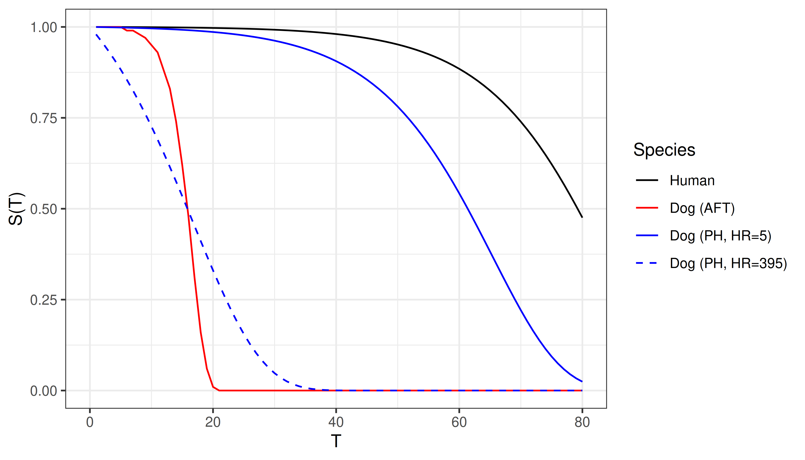

::: {.content-visible when-format="html"}

:::

# Foundational Survival Models and Estimators {#sec-classical}

In a predictive setting it can be easy to dismiss survival models that have been around for decades ("foundational models") and instead favor testing of more modern 'machine learning' tools; this would be a mistake.
Firstly, on low dimensional data (small number of variables), foundational methods often outperform machine learning models [@Burk2026; @Beaulac2020].
Secondly, even on high-dimensional data, several papers have demonstrated that augmenting foundational models (@sec-classical-improving) can yield models that outperform machine learning alternatives [@Zhang2021; @Spooner2020].
Finally, the majority of machine learning survival algorithms make use of these foundational models, for example by using non-parametric estimators (@sec-classical-nonpar) and/or assuming a proportional hazards form (@sec-classical-cox), as a central component to construct an algorithm around.
Therefore, a robust understanding of these models is imperative to fairly construct and evaluate machine learning survival models.
This chapter begins with demonstrating non-parametric estimators as predictive tools, including a recap of some estimators in @sec-surv.
Semi- and fully-parametric models are then introduced, most notably the Cox proportional hazards model and the accelerated failure time model.
Finally, methods to improve foundational models through machine learning methodology is presented.

## Non-parametric estimators {#sec-classical-nonpar}

Non-parametric estimators have already been introduced in @sec-surv-estimation-non-param, therefore this section is brief and focuses only on how these estimators can be used as predictive models.

### Unconditional estimators

Recall from @sec-surv-estimation-non-param the Kaplan-Meier and Nelson-Aalen estimators respectively estimate the survival function and cumulative hazard function as

$$
S_{KM}(\tau) = \prod_{k:t_{(k)} \leq \tau}\left(1-\frac{d_{\tbk}}{n_{\tbk}}\right)
$$ {#eq-km-ml-two}

and

$$
H_{NA}(\tau) = \sum_{k:\tbk\leq \tau} \frac{d_{\tbk}}{n_{\tbk}},
$$

where $d_{\tbk}$ and $n_{\tbk}$ are the number of events and observations at risk at the $k$th ordered event time, $\tbk$ respectively.

For example, @fig-km-rats shows the Kaplan-Meier estimator fit on the `rats` [@datarats] dataset.
The top image displays how the estimator is a step function with steps occurring at event times (some examples in green dashed lines).
At censoring times, the estimator stays constant (examples in blue dotted lines).
The bottom image displays how to use the estimator as a predictive tool.
To predict the survival probability of a new rat, one can find the estimated survival probability at a given time from the trained estimator, without needing any more details about the rat in question (as covariates are ignored).
This provides a quick tool that tends to be well-calibrated to the average observation.

As predictive models, these can also be extended to other censoring and truncation types as well as event history analysis more generally from using the estimators defined in @sec-surv-estimation-non-param, @sec-aalen-johanson, and @sec-ms-aalen-johanson.

{#fig-km-rats fig-alt="Two graphs both with time on the x-axis and survival probability on the y-axis. Both graphs show the same step function decreasing from S(t)=1 at t=0 to around S(t)=0.8 at around t=100. In the top graph, three dashed lines mark three steps in the function, two blue lines mark horizontal lines without steps. In the bottom graph, an arrow from t=60 points to the survival probability of around S(t)=0.98."}

### Conditional estimators

As well as unconditional estimators, which do not account for covariates, an alternative is the conditional Akritas estimator [@Akritas1994] usually defined by [@Blanche2013]:

$$
S(\tau \mid \xx^*, \lambda) = \prod_{k:\tbk\leq \tau} \Big(1 - \frac{\sum^n_{i=1} K(\xx^*,\xx_i \mid \lambda)\II(t_i = \tbk, \delta_i = 1)}{\sum^n_{i=1} K(\xx^*,\xx_i \mid \lambda)\II(t_i \geq \tbk)}\Big)
$$ {#eq-akritas}

where $K$ is a kernel function, usually $K(\xx,\yy \mid \lambda) = \II(\lvert \hat{F}_X(\xx) - \hat{F}_X(\yy)\rvert \leq \lambda), \lambda \in (0, 1]$, $\hat{F}_X$ is the empirical distribution function of the data, and $\lambda$ is a hyper-parameter.
The estimator can be interpreted as a conditional Kaplan-Meier estimator which is computed on a neighborhood of subjects closest to $\xx^*$.
In fact, if $\lambda = 1$ then $K(\cdot \mid \lambda) = 1$ and (@eq-akritas) is identical to (@eq-km-ml-two).

The formulation in (@eq-akritas) includes fitting and predicting in one step as the usual application of the model is as a non-parametric estimator.
By first estimating $\hatF_X$ on separate training data, the estimator can be used as a baseline predictive model.

## Proportional hazards {#sec-classical-cox}

This section begins with an introduction to the proportional hazards concept, introduces estimation with the Cox PH model, and then moves to fully parametric proportional hazards models, with the Weibull model as a motivating example.

Let $\eta_i = \xx_i^\trans\bsbeta$ be the linear predictor for some observation $i$ with covariates $\xx_i$ and model coefficients $\bsbeta \in \Reals^p$, then proportional hazards (PH) models assume that the hazard function for $i$ follows the form
$$
h_{PH}(\tau \mid \xx_i)= h_0(\tau)\exp(\eta_i)
$$ {#eq-ph}

or equivalently:

$$
H_{PH}(\tau \mid \xx_i)= H_0(\tau)\exp(\eta_i)
$$ {#eq-ph-cum}

and

$$
S_{PH}(\tau \mid \xx_i)= S_0(\tau)^{\exp(\eta_i)}
$$ {#eq-ph-surv}

$h_0,H_0,S_0$ are referred to as the baseline hazard, cumulative hazard, and survival function respectively.
Instead of modelling a separate intercept, the baseline hazard represents the hazard when the linear predictor is zero, hence the term _baseline_. 
Note that the baseline hazard may not have a meaningful interpretation, unless the covariates are all centered around zero or reference coded in case of categorical covariates (similar to the intercept $\beta_0$ in linear regression).

It can be seen from (@eq-ph) that time is only incorporated via the baseline hazard (ignoring adaptations to time-varying models).
Therefore, PH models estimate the baseline risk of an event at a given time, and modulate this risk according to the specification of covariates.
This represents the eponymous "proportional hazards" assumption as the individual's hazard at time $\tau$ is directly proportional to a multiplicative function of their own covariates: $h(\tau \mid \xx_i) \propto \exp(\eta_i)$.
In other words, a unit change in a covariate acts multiplicatively on the estimated hazard.
Further, the hazard ratio, which is a measure of the difference in risk, between two different subjects, depends solely on the value of their (linear) predictors and not on time.
For a single covariate $x$:

$$
\frac{h_{PH}(\tau \mid x_i)}{h_{PH}(\tau \mid x_j)} = \frac{h_0(\tau)\exp(x_i\beta)}{h_0(\tau)\exp(x_j\beta)} = \exp(\beta(x_i -x_j))
$$ {#eq-ph-hazard-ratio}

Equivalently:

$$
h_{PH}(\tau \mid x_i) = \exp(\beta(x_i - x_j))h_{PH}(\tau \mid x_j)
$$

So in the case where the covariate differs between subjects by $1$, the hazard ratio increases multiplicatively by $\exp(\beta)$.
This yields an interpretable model, in which hazard ratios are constant over time and do not depend on $\tau$.
That is, the covariates effect on the hazard is independent of time. 
Note that this does not imply that the effect of covariates on the survival function is constant over time (a constant difference in hazards at each time point will accumulate over time and the difference between the survival functions will increase). 

The next sections discuss how to fit the $\beta$ parameters semi-parametrically (@sec-ph-semi-parametric) and fully parametrically (@sec-ph-parametric).

### Semi-parametric PH {#sec-ph-semi-parametric}

The Cox Proportional Hazards (Cox PH)  [@Cox1972], or Cox model, is likely the most widely known semi-parametric model and the most studied survival model [@Reid1994; @Wang2017].
Often, it is considered synonymous with proportional hazards and the functional form of the hazard given in (@eq-ph). 
However, the main contribution of Cox's work was to develop a method to estimate $\bsbeta$ without making any assumptions about the baseline hazard. 
Estimation of the parameters is discussed in detail as the objective function of the Cox model is also used by many machine learning methods like boosting (@sec-boost) and neural networks (@sec-nnet).

Recall from @sec-surv-estimation, to estimate the distribution of event times one either needs to make distributional assumptions and accordingly define the likelihood of observing the data (given model parameters), or to use non-parametric estimators, which usually do not incorporate covariate information. 
Let $i_{(k)}$ denote the subject who experienced the event at ordered event time $\tbk$.
Cox noted the contribution of an individual could be defined as the probability of a particular subject $i_{(k)}$ experiencing the event at $\tbk$ _given_ that _someone_ in the risk set experienced the event at that time. 
The likelihood contribution of this $k$th event is given by

$$
\ell^{Cox}_{i_{(k)}} 
=\frac{h_0\left(\tbk\right)\exp\left(\eta_{i_{(k)}}\right)}
{\sum_{j\in \calR_{\tbk}} h_0\left(\tbk\right)\exp\left(\eta_j\right)}
=\frac{\exp\left(\eta_{i_{(k)}}\right)}
{\sum_{j\in \calR_{\tbk}}\exp\left(\eta_j\right)},
$$

which depends on $\bsbeta$ via $\eta=\xx^\trans\bsbeta$.
Note how the baseline hazard $h_0$ cancels out in the likelihood contribution and thus removes the dependency on time.
Thus, for the estimation of $\bsbeta$, the baseline hazard can be considered a "nuisance parameter" and the likelihood for the entire data set can be defined as:

$$
\mathcal{L}_{PL}(\bsbeta) = \prod_{k=1}^m \ell^{Cox}_{i_{(k)}} = \prod_{k=1}^m \left(\frac{\exp(\eta_{i_{(k)}})}{\sum_{j \in \calR_{\tbk}} \exp(\eta_j)}\right),
$$ {#eq-partial}

which is referred to as a *partial likelihood* [@Cox1975] function, as it does not make use of all the observed data.
Information about the event times only contributes to (@eq-partial) through the index of the product and sum, thus preserving rankings.
The baseline hazard, and thus information about the exact event time is absent from the function.
Moreover, censored observations only contribute in the denominator of the calculation.

The partial likelihood (@eq-partial) also assumes that there are no ties in the event time, that is, no two subjects have an event at the same time.
In practice, ties can be common and several methods have been proposed to handle them, namely an exact method [@Kalbfleisch1973] (which is computationally expensive), the Breslow approximation [@breslowCovarianceAnalysisCensored1974], and the Efron approximation [@Efron1977]; further details are not discussed here but all three methods are readily available in openly available software.

The log-partial likelihood, usually preferred for optimization, is given by

$$
\ell_{PL}(\bsbeta) = \sum_{k=1}^m \left(\eta_{i_{(k)}} - \log \left(\sum_{j \in \calR_{\tbk}} \exp(\eta_j)\right)\right),
$${#eq-lpartial}

such that 

$$
\hat{\bsbeta} = \argmax_{\bsbeta}\ \ell_{PL}(\bsbeta).
$${#eq-estimate-beta}

Traditionally, $\hat{\bsbeta}$ is obtained using numerical optimization methods, such as Newton-Raphson or Fisher-Scoring, which require the first and second derivatives of (@eq-lpartial).

Importantly, the partial likelihood allows estimation of covariate effects (and interpretation in terms of hazard ratios) without making any assumptions about the underlying distribution of event times.
Obtaining $\hat{\bsbeta}$  also provides enough information to make predictions in the form of relative risks (@sec-survtsk). 

Making survival distribution predictions requires an estimate of the baseline hazard, $h_0$.
The Breslow estimator [@Breslow1972; @linBreslowEstimator2007] provides a way to obtain an estimate of the cumulative baseline hazard, $H_0$, using the parameters from the Cox model:
<!--  -->
$$
H_{Bres}(\tau) = H_0(\tau) = \sum_{k:\tbk \leq \tau} \frac{d_{\tbk}}{\sum_{j \in \calR_{\tbk}} \exp(\eta_j)}.
$$ {#eq-breslow}
<!--  -->
Note that if the value for all covariates or their effects was zero, or if there were no covariates, then the Breslow estimator is identical to the Nelson-Aalen estimator (@sec-surv-na):

$$
H_{Bres}(\tau) = \sum_{k:\tbk \leq \tau} \frac{d_{\tbk}}{\sum_{j \in \calR_{\tbk}} 1} = \sum_{\tbk \leq \tau} \frac{d_{\tbk}}{n_{\tbk}} = H_{NA}(\tau).
$$

With these formulae, the Cox PH model can be used as a predictive model by using training data to estimate $\hat{\bsbeta}$ via (@eq-estimate-beta).
These fitted coefficients are used to predict $\hat{\bseta}$ for new observations and finally the cumulative baseline hazard is computed with (@eq-breslow) to return a predicted distribution, for example the survival probability (@eq-ph-surv).

The Cox model is highly interpretable and has a long history of use in clinical prediction modelling and analysis.
However, the proportional hazards assumption is often violated in practice.
Over the years, extensions to the Cox model have been developed [@therneau2001modelingsurvival] to incorporate stratified baseline hazards (where the PH assumption only has to hold within strata), time-varying effects (where the effects of time-constant covariates change over time), and time-varying covariates (where covariate values themselves change over time).
While these extensions can improve model fit and support interpretation, they may be difficult to incorporate into predictive modelling, particularly when future covariate values are unknown.
This limitation is often less problematic than it first appears, as the Cox model can still outperform alternative foundational and machine learning models even when the proportional hazards assumption is violated [@Burk2026; @Gensheimer2018; @Luxhoj1997; @VanBelle2011b].

### Parametric PH {#sec-ph-parametric}

Semi-parametric approaches (like the Cox model) are popular because they do not make an assumption about the underlying distribution of event times, leaving the baseline hazard unspecified.
However, there are some cases where modelling a particular distribution may make sense.
On these occasions, a particular probability distribution of the event times is assumed, with three common choices [@Kalbfleisch1980; @Wang2017] being the exponential, Gompertz, and Weibull distributions.
The exponential distribution is a special case of the Weibull distribution when the latter's shape parameter equals $1$.

Assuming a PH model one can plug in the hazard and survival functions from the Weibull distribution into (@eq-ph) and (@eq-ph-surv) respectively.
First recall for a $\Weib(\gamma, \lambda)$ distribution with shape parameter $\gamma$ and scale parameter $\lambda$, the relevant functions can be given by [@Kalbfleisch1980]:

$$
h(\tau) = \lambda\gamma \tau^{\gamma-1}
$$

and

$$
S(\tau) = \exp(-\lambda \tau^\gamma)
$$

Taking these to be the baseline hazard and survival functions respectively, they can be substituted into the Cox model as follows:
<!--  -->
$$
h_{WeibullPH}(\tau \mid \xx_i)= (\lambda\gamma \tau^{\gamma-1}) \exp(\eta_i)
$$ {#eq-ph-weibull}
<!--  -->
or equivalently
<!--  -->
$$
S_{WeibullPH}(\tau \mid \xx_i)= (\exp(-\lambda \tau^\gamma))^{\exp(\eta_i)}
$$
<!--  -->
Finally, these formulae can be used to define the full likelihood (@sec-surv-estimation-param) for the WeibullPH model (here for right-censored data):

$$
\begin{aligned}
\mathcal{L}(\bstheta) &= \prod_{i=1}^n h_Y(t_i \mid \xx_i, \bstheta)^{\delta_i}S_Y(t_i \mid \xx_i, \bstheta) \\
&= \prod_{i=1}^n \Big((\lambda\gamma t_i^{\gamma-1} \exp(\eta_i))^{\delta_i}\Big)\Big(\exp(-\lambda t_i^\gamma\exp(\eta_i))\Big)
\end{aligned}
$$

with log-likelihood

$$
\begin{aligned}
\ell(\bstheta) &= \sum_{i=1}^n \delta_i[\log(\lambda\gamma) + (\gamma-1)\log(t_i) + \eta_i] - \lambda t_i^\gamma\exp(\eta_i) \\
&\propto \sum_{i=1}^n \delta_i[\log(\lambda\gamma) + \gamma\log(t_i) + \eta_i] - \lambda t_i^\gamma \exp(\eta_i)
\end{aligned}
$$

Parameters can then be fit using maximum likelihood estimation (MLE) with respect to all unknown parameters $\bstheta = \{\bsbeta, \gamma, \lambda\}$.
Expansion to other censoring types and truncation follows by using other likelihood forms presented in @sec-surv-estimation.

When considering which probability distributions to model in predictive experiments, Weibull is a common starting choice [@Hielscher2010; @CoxSnell1968; @Rahman2017], its two parameters make it a flexible fit to data but on the other hand it can be easily reduced to exponential when $\gamma=1$.
Gompertz [@Gompertz1825] is commonly used in medical domains, especially when describing adult lifespans.
In a machine learning context, one can select the optimal distribution for future predictive performance by running a benchmark experiment.
In contrast to the semi-parametric Cox model, fully parametric PH models can predict absolutely continuous survival distributions, they do not treat the baseline hazard as a nuisance, and in general will result in more precise and interpretable predictions if the distribution is correctly specified  [@Reid1994; @Royston2002].

### Competing risks {#sec-classical-ph-cr}

There are two common methods to extend the Cox model to the competing risks setting.
The first makes use of the cause-specific hazard to fit a cause-specific Cox model, the second fits a "subdistribution" hazard.

#### Cause-specific PH models

In cause-specific models, the hazard for cause $q \in \{1,\ldots,Q\}$ is defined as:

$$
h_{q}(\tau \mid \xx_{q;i})= h_{q;0}(\tau)\exp(\eta_{q;i}),
$$

where $h_{q;0}$ is a cause-specific baseline hazard and $\xx_{q;i}$ is a set of cause-specific covariates (although in practice often the same covariates are used for all causes), and $\eta_{q;i}$ is the cause-specific linear predictor,

$$
\eta_{q;i} = \xx_{q;i}^\trans \bsbeta_q.
$$

To estimate $\bsbeta_q$, let $\tbkq, k=1,\ldots,m(q)$ be the unique, ordered event times at which events of cause $q$ occur and let $i_{q;(k)}$ be the index of the observation that experiences the $k$th event of cause $q$.
Then the cause-specific partial likelihood is given by:

$$
\mathcal{L}_{PL}(\bsbeta_q) = \prod_{k=1}^{m(q)} \Bigg(\frac{\exp(\eta_{q;i_{q;(k)}})}{\sum_{j \in \calR_{\tbkq}} \exp(\eta_{q;j})}\Bigg),
$$ {#eq-partial-cr}

This is identical to the single-event partial likelihood in (@eq-partial), with the only difference being that the product and sum are over the unique, ordered event times for cause $q$.
The risk-set definition is unaltered such that $\calR_{\tbkq}$ is the set of observations that have not experienced an event of *any* cause or censoring before $\tbkq$.

Using the same logic, the Breslow estimator follows from (@eq-breslow):
<!--  -->
$$
H_{Bres;q}(\tau) = \sum_{k:\tbkq \leq \tau} \frac{d_{\tbkq}}{\sum_{j \in \calR_{\tbkq}} \exp(\eta_{q;j})},
$$ {#eq-breslow-cr}
<!--  -->
and the feature-dependent, cause-specific cumulative hazard (@eq-ph-cum) as 

$$
H_{q}(\tau \mid \xx) = H_{Bres;q}(\tau)\exp(\xx^\trans \bsbeta_q)
$$ {#eq-cause-specific-cumu-hazard-cox}

Finally, to obtain an estimate of the cumulative incidence function $F_q(\tau)$ (@eq-cif), one required an estimate of the all cause survival probability and an estimate of the cause-specific hazard (the Breslow estimator only provides an estimate of the cause-specific *cumulative* baseline hazard).
The all cause survival probability is obtained using (@eq-cause-specific-cumu-hazard-cox) and the usual relationships (@eq-all-cause-cumu-hazard, @eq-surv-haz) as 
<!--  -->
$$
S(\tau \mid \xx) = \exp\left(-\sum_{q=1}^Q H_{q}(\tau \mid \xx)\right)
$$ {#eq-all-cause-surv-prob-cox}
<!--  -->
and an estimate of the cause-specific hazard is obtained via
<!--  -->
$$
\begin{aligned}
h_{q}(\tau \mid \xx) \approx \triangle H_{q}(\tau \mid \xx) & = \triangle H_{Bres;q}(\tau)\exp(\xx^\trans \bsbeta_q)\\
& = \frac{d_{\tbkq}}{\sum_{j \in \calR_{\tbkq}} \exp(\eta_{q;j})}\exp(\xx^\trans \bsbeta_q),
\end{aligned}
$$ {#eq-cause-specific-hazard-cox}
<!--  -->
where $\triangle H_{Bres;q}(\tau)$ is the increment of the cause-specific cumulative baseline hazard between successive time points (note the missing sum over different time points compared to (@eq-breslow-cr)).
With (@eq-all-cause-surv-prob-cox) and (@eq-cause-specific-hazard-cox), the CIF is approximated by:
<!-- TODO (ANDREAS): CONFIRM BELOW CORRECT -->
$$
F_q(\tau \mid \xx) = \sum_{k:\tbkq \leq \tau} S(\tbkq- \mid \xx) h_q(\tbkq \mid \xx).
$$ {#eq-cif-cox}

#### Subdistribution PH models

The methods discussed thus far estimate cause-specific hazards (@eq-cause-specific-hazard), which represent the instantaneous risk of an individual experiencing the cause of interest, given that they have not yet experienced *any* event.
An alternative approach is to model subdistribution hazards, which model the risk of an individual experiencing the cause of interest, given they have not yet experienced the event of interest, but may have experienced a competing event.
As will be shown below, the benefit of the subdistribution model is the ability to directly predict the cumulative incidence function (CIF) under a PH model, rather than using the indirect calculation in (@eq-cif-cox).
The subdistribution hazard approach also provides a direct relationship between covariates and the CIF for an event of interest [@Austin2016].

Mathematically, the difference between cause-specific and subdistribution hazards comes from the definition of the risk set. The subdistribution risk set is defined as:
<!-- TODO (ANDREAS; MAJOR): CHECK BELOW CORRECT AND CONSISTENT WITH NOTATION IN EHA; q_i notation slightly easier I think than E -->
$$
\calR^{SD}_{q;\tau} := \{i: t_i \geq \tau \vee \left(t_i < \tau \wedge q_i \in \{1,\ldots,Q\} \setminus \{q\}\right)\},
$$ {#eq-riskset-sd}

where $q_i$ is the cause experienced by observation $i$ and $q_i=0$ indicates censoring.

<!--  -->
Observe that in this definition the left-hand side is the same as the standard risk set definition (@eq-risk-set) and the right-hand side additionally includes those that have experienced a different event already.
Anyone that has been censored ($E(t_i) = 0$) before $\tau$ is removed from the risk set.

The definition of the subdistribution risk (@eq-riskset-sd) is equivalent to defining the subdistribution hazard for cause $q$ as:
<!-- TODO (ANDREAS; MAJOR): CHECK BELOW CORRECT AND CONSISTENT WITH NOTATION IN EHA -->
$$
h^{SD}_{q}(\tau) = \lim_{\dtau \to 0} \frac{\Pr\left(E(\tau + \dtau) = q \mid E(\tau-) = 0 \vee \left(E(\tau-) \in \{1,\ldots,Q\} \setminus \{q\}\right)\right)}{\dtau}.
$$ {#eq-hazard-sd}
<!--  -->
Fine and Gray [@Fine1999] proposed a proportional hazards formulation of the subdistribution hazard (@eq-hazard-sd) as
<!--  -->
$$
h_{FG;q}(\tau \mid \xx_i)= h^{SD}_{q;0}(\tau)\exp(\eta_i),
$$ {#eq-cox-sd}
<!--  -->
with subdistribution baseline hazard $h^{SD}_{q;0}(\tau)$ (the superscript added to distinguish from the baseline obtained from a Cox model (@eq-ph-cum) due to differences in risk set definition).

While the subdistribution hazards model is different from the proportional hazards Cox model, @Fine1999 showed that it's parameters could be estimated using a weighted partial likelihood, which is otherwise identical to the cause-specific partial likelihood (@eq-partial-cr):
<!-- TODO (ANDREAS): CONFIRM IF PROD UPPER LIMIT IS M(Q) OR M -->
$$
\mathcal{L}_{PL}^{SD}(\bsbeta) = \prod_{k=1}^{m(q)} \left(\frac{\exp(\eta_{q;i_{q;(k)}})}{\sum_{j \in \calR^{SD}_{q;\tbkq}} w_{kj}\exp(\eta_{q;j})}\right),
$$ {#eq-fg-likelihood}
<!--  -->
In (@eq-fg-likelihood), $\tbkq$ is the same as in the cause-specific case and weights $w_{kj}$ account for the fact that the subdistribution risk set is different from the cause-specific risk set.
The weights are defined as
<!--  -->
$$
w_{kj} := \frac{G_{KM}(\tbkq)}{G_{KM}(\min\{\tbkq, t_j\})},
$$
<!--  -->
where $G_{KM}$ is the Kaplan-Meier estimator fit on the censoring distribution (@sec-surv-km).
Because of the way the subdistribution risk set is defined in (@eq-riskset-sd), the denominator of (@eq-fg-likelihood) is a weighted sum over individuals, $j \in \calR^{SD}_{q;\tbkq}$,  at time $\tbkq$ who have either yet to experience an event ($t_j \geq \tbkq$) or experienced a different event ($t_j < \tbkq \wedge q_i \ne q \wedge \delta_i=1$).
The weighting function handles these cases as follows:

1. If $t_j \geq \tbkq$ then $w_{kj} = 1$ and thus observations that have not experienced any event contribute fully to the denominator.
2. If $t_j < \tbkq$ then $w_{kj} < 1$ as $G_{KM}$ is a monotonically decreasing function and $w_{kj}$ continues to decrease as the distance between $t_j$ and $\tbkq$ increases. Thus the contribution from observations that have experienced competing events reduces over time.

Whilst modelling the subdistribution can seem unintuitive, note that if there is only one event of interest then $w_{kj} = 1$ for all $k$ and $j$ and further $q_i \neq q$ must always be false, meaning (@eq-riskset-sd) reduces to the standard risk set definition (@eq-risk-set) as only the left condition can ever be true and by the same logic the subdistribution hazard reduces to the usual hazard definition.
Therefore the standard Cox PH for single events is perfectly recovered. 

Instead of interpreting the subdistribution hazards directly, @Austin2017b recommend interpreting the fitted coefficients via the cause-specific CIF and cumulative hazard forms of (@eq-cox-sd), which can be obtained by first integrating to obtain the cumulative hazard form:

$$
H_{FG;q}(\tau \mid \xx_i)= H^{SD}_{q;0}(\tau)\exp(\eta_i) 
$$

where $H^{SD}_{q;0}$ is the subdistribution baseline cumulative hazard for cause $q$.
Then using (@eq-surv-haz) to relate the survival and hazard functions and representing this in terms of the CIF:

$$
F_{FG;q}(\tau \mid \xx_i) = 1 - \exp(-H^{SD}_{q;0}(\tau))^{\exp(\eta_i)}
$$ {#eq-fg-cif-long}

Or more simply:

$$
F_{FG;q}(\tau \mid \xx_i) = 1 - (1 - F^{SD}_{q;0}(\tau))^{\exp(\eta_i)}
$$ {#eq-fg-cif}

where $F^{SD}_{q;0}$ is the subdistribution baseline cumulative incidence function for cause $q$.
The model in (@eq-fg-cif) is fit by estimating the baseline cumulative hazard function and substituting into (@eq-fg-cif-long).
Similarly to how the subdistribution hazard was created, estimation of $\hat{H}^{SD}$ follows by updating (@eq-breslow) to use the subdistribution risk set definition and applying the same weighting to compensate for multiple events: 

$$
\hat{H}^{SD}_{Bres;q}(\tau) = \sum_{k:\tbkq \leq \tau} \frac{d_{\tbkq}}{\sum_{j \in \calR^{SD}_{q;\tbkq}} w_{kj}\exp(\hat{\eta}_j)}
$$

Use of the Fine-Gray model has to be carefully considered before model fitting.
The subdistribution risk set definition, which includes competing events, treats all causes as non-terminal (even if realistically impossible), which means an observation could be considered at risk of the event of interest even after experiencing a terminal event (like death).
Moreover, combining subdistribution CIF estimates across causes can result in probabilities that exceed $1$, which should be impossible as events are mutually exclusive and exhaustive [@Austin2022b].
The cause-specific hazards approach for the estimation of the CIF (@sec-cr-notation,  @eq-all-cause-surv-prob-cox, @eq-cif-cox) is often preferred [@Austin2022b] as fitting subdistribution models requires model assumptions to hold for all causes simultaneously, which is not possible (@bonnevilleWhyYouShould2024).

The Fine-Gray model is most appropriate when one is only interested in analyzing one of the causes.
In this case, interpretation of coefficients from a subdistribution model can be more intuitive as they represent the magnitude of the effect on the incidence, rather than the hazard, which is often of more interest, for example in clinical settings [@Austin2017b].

## Accelerated failure time {#sec-surv-models-param}

Whilst the proportional hazards models is a powerful model, it often does not represent real-world phenomena well.
The _accelerated failure time_ (AFT) model is a popular alternative which models the effect of covariates as acceleration factors that act multiplicatively on time.
In contrast to the PH model, AFT models are all fully-parametric.
A semi-parametric model has been suggested [@Buckley1979] however this is not widely used as it lacks "theoretical justification" and is "not reliable" [@Wei1992].
Similarly, whilst its theoretically possible to fit cause-specific AFT models for the competing risks setting, this does not appear common in practice.

### Understanding acceleration

Moving from a PH to AFT framework can be confusing, so to elucidate this, take the following example adapted from @Kleinbaum1996.
Consider the lifespans of humans and small dogs.

Suppose small dogs age five times faster than humans.
Under AFT (time-scaling modifier), a dog's survival at age $\tau$ matches a human's at $5\tau$:

$$
S_{dog}(\tau) = S_{human}(5\tau)
$$

For example, at age 10, a small dog has the same probability of being alive as a human at age 50.
The dog's survival curve is _accelerated_ by a factor of 5, as shown in the bottom, red curve in @fig-dogs.

If instead, one assumes a constant hazard ratio then at age $\tau$, the dog's risk is five times the humans (@eq-ph-surv):

$$
S_{dog}(\tau) = S_{human}(\tau)^5
$$

the middle, blue curve in @fig-dogs.

These illustrative curves demonstrate how the same modifier yields different behavior under PH and AFT assumptions.

{#fig-dogs fig-alt="Survival time is on the x-axis and survival probability on the y-axis. The top, black curve models a human life span smoothly decreasing from S(T)=1 to S(T)=0.5 between T=0 and T=80. The middle, blue curve represents a dog's lifespan under the PH assumption. The survival probability drops close to S(T)=0 by T=0 but is positive and is even above 0.8 at T=30. The bottom, red line represents a dog's lifespan under the AFT assumption. The curve drops to 0 by T=20 but with low survival probability from around T=16."}

More generally, the accelerated failure time model estimates survival functions as

$$
S_{AFT}(\tau \mid \xx_i) = S_0(\tau e^{-\eta_i})
$$ {#eq-aft-surv}

with respective hazard function

$$
h_{AFT}(\tau \mid \xx_i) = e^{-\eta_i} h_0(\tau e^{-\eta_i})
$$ {#eq-aft-haz}

Note three key differences compared to the PH model.
Firstly, $\exp(-\eta_i)$ is modelled instead of $\exp(\eta_i)$, hence in a PH model $h_{PH}(\eta_i+1) > h_{PH}(\eta_i)$ whereas in an AFT model larger values of $\eta_i$ increase survival time and thus decrease relative risk.
This means that interpreting the AFT linear predictor alone results in a 'high value, low risk' interpretation, which is the reverse of the convention used throughout this book.
Special care must therefore be taken when using AFT models for relative risk prediction and the sign of the predictions must be reversed to preserve a consistent interpretation of risk.
Secondly, the baseline risk now clearly depends on both time and the linear predictor.
Thirdly, an increase in a covariate results in a multiplicative increase over *time* compared to the PH model in which the hazard is increased -- this is often seen as more intuitive to understand than hazard ratio, especially to clinicians who may be more interested in survival times and not abstract relative risks.

This third point is visualized in @fig-phaft in which a covariate is increased by $\log(2)$.
The left panel shows that the estimated hazard function from a PH model is double the baseline at all time points -- the multiplicative effect is seen on the y-axis (risk).
In contrast, the right panel shows how the survival function from an AFT model decreases at double the speed to the baseline -- the multiplicative effects is now on the x-axis (time).
Another way to demonstrate this effect is through the log-linear form of the accelerated failure time model:

$$
\log(t_i) = \mu + \eta_i + \sigma\epsilon_i
$$ {#eq-aft-log}

where $\sigma$ is a scale parameter, $\epsilon_i$ is an error term, and $\mu$ is an intercept.
Now consider the difference in $t_i$ when $\eta_i$ is increased by one (assuming just one covariate):

$$
\log(t_i \mid x_i + 1) - \log(t_i \mid x_i) = (\mu + \beta (x_i + 1) + \sigma\epsilon_i) - (\mu + \beta x_i + \sigma\epsilon_i) = \beta
$$

Taking exponentials,

$$
\frac{t_i \mid x_i + 1}{t_i \mid x_i} = \exp(\beta).
$$

Hence increasing a covariate effectively multiplies the survival time by $\exp(\beta)$:

$$
t_i \mid x_i + 1 = e^{\beta}t_i  \mid  x_i
$$

{#fig-phaft fig-alt="Two line graphs. Left has 't' on x-axis and 'y' 'h(t)' on y-axis. A blue line (PH model) runs in parallel, vertically above, a black line (baseline). The right graph has 'S(t)' on the y-axis and shows a red line (AFT model) running in parallel but to the left of the baseline. The graph demonstrates how PH acts multiplicatively on the hazard but the AFT acts on the survival function."}

### Parametric AFTs

As stated, AFTs are usually fully parametric, which means $S_0$ and $h_0$ are chosen according to a specific distribution.
Common distribution choices include Weibull, exponential, log-logistic, and log-Normal [@Kalbfleisch1980; @Wang2017].
The Weibull distribution, with the exponential distribution as a special case, is unique as it can be parameterized as either a PH model or an AFT model.
By contrast, the log-logistic and log-Normal distributions are commonly used as AFT models but do not imply PH covariate effects.
For example, the hazard function of the log-logistic distribution is plotted in @fig-logloghaz and can be non-monotonic, allowing the baseline risk of an event to increase before decreasing.
When the chosen distribution is well specified, AFTs can provide a useful alternative to PH models, especially when covariate effects are more naturally interpreted as time ratios than hazard ratios [@Patel2006; @Qi2009; @Zare2015].

{#fig-logloghaz fig-alt="Five log-logistic hazard curves. Each represents a distinct representation of the hazard. When the shape parameter is 0.5, the curve starts at (0, 4) then curves down to (5,0). In contrast, when the shape parameter is 7, the curve starts at (0,0) then peaks at around (1.2, 4.5) then slopes down to (5, 1.5)."}

As with the PH model, AFT models can be fit using maximum likelihood estimation of the full-likelihood by plugging in distribution defining functions into (@eq-aft-surv) and (@eq-aft-haz) and likelihoods defined in (@sec-surv-estimation-param).
Using the exponential distribution as an example, first recall that if $X \sim \Exp(\lambda)$ then $h_X(\tau) = \lambda$ and $S_X(\tau) = \exp(-\lambda\tau)$.
Then:

$$
S_{ExpAFT}(\tau \mid \xx_i)= \exp(-\lambda\tau e^{-\eta_i}),
$$

and

$$
h_{ExpAFT}(\tau \mid \xx_i)= \lambda e^{-\eta_i}.
$$

Giving the ExpAFT likelihood (@sec-surv-estimation-param):

$$
\begin{aligned}
\mathcal{L}(\bstheta) &= \prod_{i=1}^n h_Y(t_i \mid \bstheta)^{\delta_i}S_Y(t_i \mid \bstheta) \\
&= \prod_{i=1}^n \Big(\lambda e^{-\eta_i})^{\delta_i}\Big(\exp(-\lambda t_i e^{-\eta_i})\Big) \\
&= \prod_{i=1}^n \lambda^{\delta_i} \exp(-\lambda t_i e^{-\eta_i} - \delta_i\eta_i) \\
\end{aligned}
$$

with log-likelihood

$$
\begin{aligned}
\ell(\bstheta) &= \sum_{i=1}^n \log(\lambda^{\delta_i} \exp(-\lambda t_i e^{-\eta_i} - \delta_i\eta_i)) \\
&= \sum_{i=1}^n \delta_i\log(\lambda) - \lambda t_i e^{-\eta_i} - \delta_i\eta_i \\
\end{aligned}
$$

Likelihoods can also be derived using the log-linear form in (@eq-aft-log) however these are beyond the scope of this book.
As before, extensions to other censoring types and truncation follows by specifying the correct likelihood form from @sec-surv-estimation-param.

## Proportional odds {#sec-proportionalodds}

Proportional odds models [@Bennett1983] are the final of the three major linear model classes in survival analysis.
In contrast to the PH and AFT models just discussed, proportional models are rarely, if ever, used on their own to make inferences about underlying data or as predictive models.
Instead they are more commonly found as components within neural networks (@sec-nnet) or in flexible parametric models (discussed next).
Therefore this section very briefly describes the motivation for the model and its key properties.

As the name may suggest, the proportional odds model is analogous to the proportional hazards model except with the goal of modelling odds instead of hazards.
In general, let $p$ be the probability of an event occurring, then the _odds_ of the event are:

$$
O(p) = \frac{p}{1 - p},
$$

In a survival analysis context, the odds are calculated for the survival probability:

$$
O(S(\tau)) = \frac{S(\tau)}{1-S(\tau)} = \frac{S(\tau)}{F(\tau)}.
$$

By considering the same functional form as in the proportional hazards model, the proportional odds model follows analogously, substituting odds in place of the hazards:

$$
O_{PO}(\tau \mid \xx_i) =  O_0(\tau)\exp(\eta_i)
$$

where $O_0$ is the baseline odds.

By the same logic as the proportional hazards model, this model assumes $O(\tau \mid \xx_i) \propto \exp(\eta_i)$ and by analogous maths to (@eq-ph-hazard-ratio), a unit increase in a covariate, $x_i$, multiplies the odds of surviving past $t$ by $\exp(\beta_i)$ where $\beta_i$ is the corresponding coefficient.

A useful implication is the convergence of hazard functions, which states $h_i(\tau)/h_0(\tau) \rightarrow 1$ as $\tau \rightarrow \infty$ [@Kirmani2001].
To see this note that the PO model can be represented in terms of the hazard function via [@Collett2014]

$$
h_{PO}(\tau \mid \xx_i) =  h_0(\tau)\Bigg(1 - \frac{S_0(\tau)}{(\exp(\eta_i) - 1)^{-1} + S_0(\tau)} \Bigg)
$$ {#eq-po}

Dividing by the baseline hazard yields

$$
\frac{h_{PO}(\tau \mid \xx_i)}{h_0(\tau)} =  \Bigg(1 - \frac{S_0(\tau)}{(\exp(\eta_i) - 1)^{-1} + S_0(\tau)} \Bigg) =  \frac{(\exp(\eta_i) - 1)^{-1} }{(\exp(\eta_i) - 1)^{-1} + S_0(\tau)}
$$

Simplifying gives $(1 + S_0(\tau)(\exp(\eta_i) - 1))^{-1}$.
As $S_0(\tau) \rightarrow 0$ when $\tau \rightarrow \infty$, it follows that the hazard ratio tends to $1$ as $\tau$ increases.

This means that for any individual, their individual hazard approaches the baseline hazard over a long period of time.
This assumption holds in several contexts, commonly in medical domains in which death is the event of interest.
For example, take two patients with a disease, patient $i$ receives treatment and patient $j$ does not.
Let $\exp(\eta_i) = 4$, $\exp(\eta_j) = 1$, $S_0(0) = 1$, and $S_0(5) = 0.01$.
Following (@eq-po), for patient $i$:

$$
h_{PO}(0 \mid \xx_i) =  0.25h_0(0); \quad\quad h_{PO}(\tau \mid \xx_i) =  0.97h_0(5),
$$

and for patient $j$:

$$
h_{PO}(0 \mid \xx_j) = h_0(0); \quad\quad h_{PO}(5 \mid \xx_j) = h_0(5).
$$

The treatment effect reduces the hazard for observation $i$ at early time-points.
However, at the later time-point, the hazard is very similar for both observations.
This example highlights a similarity to AFT models (@sec-aft): under this survival-odds parameterization, larger values of $\eta$ decrease the hazard.
Care must therefore again be taken when using these models for relative risk prediction to ensure a consistent interpretation of risk.

There is no simple closed form expression for the partial likelihood of a semi-parametric proportional odds model and hence in practice a log-logistic distribution is usually assumed for the baseline odds and the model is fit by maximum likelihood estimation on the full likelihood [@Bennett1983], discussed further in the next section.

## Flexible parametric models {#sec-flexible}

Royston-Parmar flexible parametric models  [@Royston2002] extend PH and PO models by estimating the baseline hazard with natural cubic splines.
The model was designed to keep the form of the PH or PO methods but without being forced to estimate a misleading baseline hazard (for semi-parametric models) or misspecifying the survival distribution (for fully-parametric models).
This is achieved by fitting natural cubic splines in place of the baseline hazard.

The crux of the method is to use splines to model time on a log-scale and to either estimate the log cumulative Hazard for PH models,or the log Odds for PO models.
For the flexible PH model, a Weibull distribution is the basis for the baseline distribution, whereas a log-logistic distribution is assumed for the baseline odds in the flexible PO model.
The exact derivation of the model requires a lot of mathematical exposition which is not included here, a very good summary of the model is given in @Collett2014. 
Instead, below is the model in its full form with an explanation of the variables and figures that demonstrate cubic splines.

The flexible parametric Royston-Parmar (RP) proportional hazards and proportional odds model are respectively defined by

$$
\log{H}_{RP}(\tau \mid \xx_i) = s(\tau \mid \bsgamma,\mathbf{k}) + \eta_i
$$ {#eq-rp-hazard}

$$
\log{O}_{RP}(\tau \mid \xx_i) = s(\tau \mid \bsgamma,\mathbf{k}) + \eta_i
$$ {#eq-rp-odds}

where $\bsgamma$ are spline coefficients to be estimated by maximum likelihood estimation, $\mathbf{k}$ are the positions of $K$ knots, and $s$ is the restricted cubic spline function in log time defined by,

$$
s(\tau \mid \bsgamma,\mathbf{k}) = \gamma_0 + \gamma_1\log(\tau) + \gamma_2\nu_1(\log(\tau)) + \ldots + \gamma_{K}\nu_K(\log(\tau)),
$$

$\nu_j$ is the basis function at knot $k_j$ defined by,

$$
\nu_j(x) = (x - k_j)^3_+ - \lambda_j(x - k_{min})^3_+ - (1 - \lambda_j)(x - k_{max})^3_+,
$$

where
$$
\lambda_j = \frac{k_{max} - k_j}{k_{max} - k_{min}},
$$

and $(x - y)_+ = \max\{0, (x - y)\}$ for any $x, y$, and where $k_{min}$ and $k_{max}$ are the boundaries of the cubic spline, meaning the curve is linear when $\log(t) < k_{min}$ or $\log(t) > k_{max}$.

To see how the proportional hazards RP model relates to the Weibull distribution, first integrate and take logs of the Weibull-PH hazard function from (@eq-ph-weibull):

$$
\log(H_{WeibullPH}(\tau \mid \xx_i)) = \log\big((\lambda \tau^\gamma) \exp(\eta_i)\big) = \log(\lambda) + \gamma\log(\tau) + \eta_i
$$ 

Setting $\gamma_0 = \log(\lambda)$ and $\gamma_1 = \gamma$ yields (@eq-rp-hazard) when there are no knots.
Analogous results can be shown between (@eq-rp-odds) and the log-logistic distribution.

To fit the model, the number and position of knots are theoretically tunable, although Royston and Parmar advised against tuning and suggest often only one internal knot is required and the placement of the knot does not make a significant difference to performance [@Royston2002].
Increasing knots can increase model overfitting however @Bower2019 showed up to seven knots does not significantly increase model bias.
The model's primary advantage is its flexibility to model non-linear effects and can also be extended to time-dependent covariates.
Moreover, the model can be fit via maximum likelihood estimation and thus many standard off-shelf routines for estimating a smooth survival time function.
Despite advantages, the model appears to be limited in common use which makes it difficult to verify the model's utility across different contexts [@Ng2018].

In the same manner as other proportional hazards models, the Royston-Parmar model can be extended to competing risks by modelling cause-specific hazards, considering only one event at a time and censoring competing events [@Hinchliffe2013].

## Improving foundational models {#sec-classical-improving}

A number of model-agnostic algorithms have been created to improve a model's predictive ability.
When applied to foundational algorithms, these methods can be used to create powerful models that outperform other machine learning.
As each could be the subject of a whole book, this section remains brief and just covers the general overview.
These are split into methods for:

1. modelling non-linear data effects;
2. reducing the number of variables in a dataset; and
3. combining predictions from multiple models.

### Non-linear effects

One of the major limitations of the models discussed so far is the assumption of a linear relationship between covariates and outcomes (on the scale of the predictor).
At first one might view the Cox model as non-linear due to the presence of the exponential function.
However, the linearity becomes clear when the model is equivalently expressed as:

$$
\log\left(\frac{h(\tau \mid \xx_i)}{h_0(\tau)}\right) = x_1\beta_1 + \ldots + x_p\beta_p
$$

Consider modelling the time until disease progression with covariates age (continuous) and treatment (binary):

$$
\log\left(\frac{h(\tau \mid \xx_i)}{h_0(\tau)}\right) = x_{age_i}\beta_{age} + x_{trt_i}\beta_{trt}
$$

In this form, increasing age from $1$ to $21$ or $81$ to $101$ has the same effect on the log hazard ratio; this is clearly not realistic.
There are many approaches to relaxing linearity; these are discussed extensively elsewhere and not repeated here, @Hastie2013 covers non-linear modelling in detail.

In brief, PH and AFT can be extended to _generalized additive models_ (GAM) in the same manner as a regression model.
For example for the Cox model,

$$
\log\left(\frac{h_i(\tau \mid \xx_i)}{h_0(\tau)}\right) = f_1(x_1) + \ldots + f_p(x_p)
$$

where each $f_j$ is a smooth, possibly non-linear function of its covariate. 
If all $f_j$ are the identity function then this reduces to the standard Cox model.
The functions $f_j$ are often chosen to be natural splines, but step functions, polynomial bases, or any other transformation can also be used.
The Royston-Parmar model (@sec-flexible) is a special case of a GAM where splines are used to model the baseline hazard.

### Dimension reduction and feature selection

In a predictive modelling problem, only a small subset of variables in datasets tend to be relevant for correctly predicting the outcome.
Other variables are either redundant -- they provide no more information than their counterparts -- or irrelevant -- they do not influence the outcome.
In these cases, using all variables for modelling results in worse interpretability, increased computational complexity, and often inferior model performance as model's tend to overfit the training data and generalize poorly to new data.

To improve model performance, one can therefore apply feature selection methods to reduce the number of variables in the dataset.
Feature selection is often grouped into three categories: 1) filters; 2) wrappers; and 3) embedded methods.
Wrappers fit multiple models on subsets of variables and select the best performing subsets, this is often computationally infeasible in the context of very large datasets, and as such have less relevance in survival analysis which often tackles very high-dimensional datasets such as genomic datasets and detailed time-series economic data.
This section only looks at methods specific to survival analysis and does not consider general algorithms such as PCA, see further reading below for suggested additional material that covers these areas.

#### Embedded methods {.unlisted .unnumbered}
Embedded methods refers to those that are incorporated during model fitting.
The vast majority of machine learning models incorporate embedded methods and thus reduce a dataset's size as part of the training process.
In contrast, models that do not apply any form of feature selection will perform poorly when there is a large number of variables in a dataset.
One model that straddles the line of foundational and machine learning methodology is the elastic Cox model, which incorporates the lasso and ridge regularization methods.
Given a generic learning algorithm, lasso and ridge regularization constrain the model coefficients subject to the $\ell^1$-norm and $\ell^2$-norm respectively.
The Lasso-Cox [@Tibshirani1997] model fits the Cox model by estimating $\bsbeta$ as

$$
\hat{\bsbeta} = \argmax \mathcal{L}(\bsbeta); \text{ subject to } \sum \vert \beta_j \vert \leq \gamma
$$

where $\mathcal{L}$ is the likelihood defined in (@eq-partial) and $\gamma > 0$ is a hyper-parameter.

In contrast, the Ridge-Cox model estimates $\bsbeta$ as 

$$
\hat{\bsbeta} = \argmax\ \mathcal{L}(\bsbeta); \text{ subject to } \sum \beta_j^2 \leq \gamma
$$

Ridge and lasso are both shrinkage methods, which are used to reduce model variance and overfitting, especially in the context of multi-collinearity.
However, the $\ell^1$ norm in Lasso regression can also shrink coefficients to zero and thus performs variable selection as well.
It is therefore possible to incorporate a feature selection method first and then pass the results to a Ridge-Cox model -- though experiments have shown Ridge-Cox on its own is already a powerful tool [@Spooner2020].
Alternatively, as with many machine learning algorithms, deciding between lasso and ridge can be performed in empirical benchmark experiments by using elastic net [@Simon2011;@Zou2005], which is a convex combination of $\ell^1$ and $\ell^2$ penalties such that $\bsbeta$ is estimated as,

$$
\hat{\bsbeta} = \argmax \mathcal{L}(\bsbeta); \text{ subject to } \alpha \sum \vert \beta_j \vert + (1-\alpha) \sum \beta_j^2 \leq \gamma,
$$

where $\alpha$ is a hyper-parameter to be tuned.

#### Filter methods {.unlisted .unnumbered}
Filter methods are a two-step process that score features according to some metric and then select either a given number of top-performing features (those with the optimal score) or those where the score exceeds some threshold.
Once again determining the number of features to select, or the threshold to exceed, can be performed via hyperparameter optimization.
@Bommert2021 compared 14 filter methods for high-dimensional survival data by extending existing methods, making use of tools seen throughout this book including non-parametric estimators, martingale residuals, and inverse probability of censoring weighting.
However, the authors found that the method that outperformed all others was a simple variance filter:

$$
V(\xx_{\cdot j}) = \text{Var}(\xx_{\cdot j})
$$

where $\xx_{\cdot j}$ is the $j$th variable in the data and $V$ is the resulting score.
The filter measures the amount of variance in the feature and removes features that have little variation.

Another common filter method is to train another model and make use of its embedded feature selection and pass these results to a simpler model.
This allows a foundational model to be trained on relevant features without loss to interpretability or performance.
Common choices for models to use in the first step of the pipeline include random forests (@sec-ranfor) and gradient boosting machines (@sec-boost).

### Ensemble methods

Ensemble methods fit multiple models and combine the result into a single prediction.
Common ensemble methods include boosting, bagging, and stacking.
These are briefly explained below and can be applied to any model, whether machine learning or a simple linear model.
Note that nested cross-validation should be used when fitting any of the models below in order to ensure no data is leaked between training and predictions (@sec-ml-opt).

#### Bagging and averaging {.unlisted .unnumbered}

The simplest ensemble method is to fit multiple models on the same data and make predictions by taking an average over the individual model predictions.
The average over predictions could be uniform, weighted with weights selected through expert knowledge, or weighted with weights optimized as hyper-parameters.
Ensemble methods perform best when there is high variance between models as each then captures unique information about the underlying data.
Therefore ensemble averaging is more common after first subsetting the training data and training each model on a different subset.

Whilst increasing variance is beneficial, too much variance may result in worse predictions.
Hence, bagging (Bootstrap AGGregatING) is a common approach to increase variance without losing predictive accuracy.
Bootstrapping is the process of sampling data with replacement, meaning the rows may be duplicated in each subset -- this is discussed further in @sec-ranfor.
After sampling the process is the same with predictions made and averaged.

#### Model-based boosting {.unlisted .unnumbered}

Model-based boosting fits a sequence of models that iteratively improve model performance by correcting the previous model's mistakes.
The initial model is trained as usual on a testing dataset, and subsequent models are fit on the same features but using pseudo-residuals as targets (a regression problem).
These _pseudo-residuals_ are the negative gradient of a chosen loss from the previous iteration -- this is discussed in detail in @sec-boost.
The result is a gradual increase in improvement as each model captures patterns missed previously.
In a survival analysis context, many of the losses discussed in Part II can be used in this pipeline, with the choice of loss dependent on the task of interest.
Model-based boosting is a generic pipeline which may underperform the purpose-built algorithms discussed in @sec-boost.

#### Stacking {.unlisted .unnumbered}

Stacking can improve model performance by fitting multiple models and aggregating the predictions using a meta-model.
Fitting a meta-model, often a simple linear model, results in fitted coefficients that weight the input models according to how close or far they were from the truth.

Training data is partitioned (once or several times) and the first partition is used to train several independent models, a meta-model is fit using the outputs (predictions) from the base models as features and the targets $(t_i,\delta_i)$ from the second partition as targets.

As an example, take stacking three Cox models with a Cox meta-model.
Let $\calD = \{(\xx_i, t_i, \delta_i)\}$ be a dataset.
Partition $\calD$ into two disjoint datasets $\calD_1$ of size $n$ and $\calD_2$ of size $m$.
Three Cox base models are fit on $\calD_1$ and linear predictors are obtained (predicted) for all $m$ observations in $\calD_2$:

$$
Z = 
\begin{bmatrix}
\hat{\eta}^{(1)}_{1} & \cdots & \hat{\eta}^{(3)}_{1} \\
\vdots & \ddots & \vdots \\
\hat{\eta}^{(1)}_{m} & \cdots & \hat{\eta}^{(3)}_{m} \\
\end{bmatrix}
$$

where $\hat{\eta}^{(j)}_{i}$ is the linear predictor for the $i$th observation in the validation set from the $j$th base model.

Fit the meta-Cox model on $(Z, (t_i, \delta_i)_{i \in \calD_2})$:

$$
h_M(\tau \mid \hat{\bseta}_i) = h^{(M)}_{0}(\tau)\exp(\beta^{(M)}_1\hat{\eta}^{(1)}_{i} + \beta^{(M)}_2\hat{\eta}^{(2)}_{i} + \beta^{(M)}_3\hat{\eta}^{(3)}_{i}), \quad i \in \calD_2
$$

Finally, the base learners are refit on all $\calD$ but keeping $\hat{\bsbeta}^{(M)}$ and $\hat{h}^{(M)}_0$ from the meta-model fixed.

Predictions for a new observation, $\xx^*$ are made by first predicting $(\hat{\eta}_*^{(1)},\hat{\eta}_*^{(2)},\hat{\eta}_*^{(3)})$ from the trained base models and passing those to $h_M$ using the fitted $\hat{\bsbeta}^{(M)}$ coefficients and $\hat{h}^{(M)}_0$.

In the above example, Cox models are used throughout.
However, any machine learning models with the same prediction types can be stacked, including combinations of models.
One particularly popular form of stacking in survival analysis is the _SuperLearner_ method [@vanderLaan2007], which constructs an ensemble by optimally weighting multiple candidate models based on cross-validated predictive performance.

## Conclusion

:::: {.callout-warning icon=false}

## Key takeaways

* Foundational statistical models broadly fall into three categories: non-parametric estimators, semi-parametric models that include a baseline estimate, and fully-parametric estimates. Each has its own advantages and disadvantages.
* Non-parametric estimators are used throughout survival analysis, often as components in more complex machine learning models.
* Proportional hazards and accelerated failure time models encode different assumptions but both are powerful tools for learning patterns from data and even in prediction problems.
* The boundary between machine learning and statistical models is fuzzy, and simpler survival models can outperform more complex machine learning alternatives [@Burk2026].
* Several models can be extended to time-dependent covariates however these are not well-developed for predictive problems (only for inference).
* Simpler (linear) models encode assumptions that are rarely met in practice, for example the proportional hazards assumption. However, even if assumptions are violated, these could still generalize well to new data and are therefore worth including in benchmark experiments.
* Unregularized models perform badly on high-dimensional data without some form of pre-processing, however this is relatively simple with modern off-shelf software such as $\texttt{sklearn}$ and $\texttt{mlr3}$.

::::

:::: {.callout-tip icon=false}

## Further reading

* To learn more about hazard ratios from Cox models and complexities in interpretation, see @Sashegyi2017 and @Spruance2004.
* Extensions of the proportional hazards framework include more general hazard-based models that allow covariates to act simultaneously on the hazard and time scales. An example is the general hazards model of [@Chen2001]. While flexible, such models do not appear common in predictive modelling but instead preferred for inference [for some examples, @Tong2013; @Rubio2019; @Rubio2022].
* @Collett2014 and @Kalbfleisch1980 both provide comprehensive reading for foundational statistical models. The former is slightly less technical and covers extensions to multiple settings.
* For more abstract feature selection algorithms that can be applied to any data (survival or otherwise), see @Chandrashekar2014 and @Guyon2003.
* Kernel-based approaches have been suggested for smooth non-parametric estimates of the baseline hazard, these do not appear commonly used in practice but details can be found in @Gefeller1992 and @Muller1994.

::::
