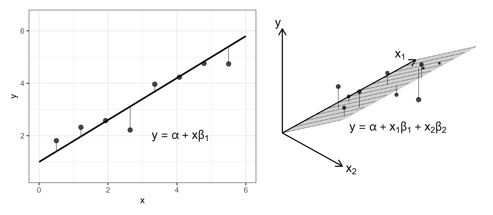

::: {.content-visible when-format="html"}

:::

# Support Vector Machines {#sec-svm}

Support vector machines\index{support vector machines} are a popular class of models in regression and classification settings due to their ability to make accurate predictions for complex high-dimensional, non-linear data.
Survival support vector machines (SSVMs) predict continuous responses that can be used as ranking predictions with some formulations that provide survival time interpretations.
This chapter starts with SVMs in the regression setting before moving to adaptions for survival analysis.

## SVMs for regression

In simple linear regression, the aim is to estimate the line $y = \alpha + x\beta_1$ by estimating the $\alpha,\beta_1$ coefficients.
As the number of coefficients increases, the goal is to instead estimate the *hyperplane*, which divides the higher-dimensional space into two separate parts.
To visualize a hyperplane, imagine looking at a room from a birds eye view that has a dividing wall cutting the room into two halves (@fig-svm-hyper).
In this view, the room appears to have two dimensions (x=left-right, y=top-bottom) and the divider is a simple line of the form $y = \alpha + x\beta_1$.
In reality, this room is actually three dimensional and has a third dimension (z=up-down) and the divider is therefore a hyperplane of the form $y = \alpha + x\beta_1 + z\beta_2$.

<!-- FIXME (ANDREAS; MAJOR): CAN YOU MAKE A NEW IMAGE IN THE BOOK STYLE? -->

{#fig-svm-hyper fig-alt="AI generated image of a birds-eye view of an office cut in half by a dividing wall." width=400}

Continuing the linear regression example, consider a simple model where the objective is to find the $\dvec{\beta}{p}$ coefficients that minimize $\sum^n_{i=1} (g(\xx_i) - y_i)^2$ where $g(\xx_i) = \alpha + \xx_i^\trans\bsbeta$ and $(\XX, \yy)$ is training data such that $\XX \in \Reals^{n \times p}$ and $\yy \in \Reals^n$.
In a higher-dimensional space, a penalty term can be added to shrink variable importance and reduce model complexity, commonly of the form:

$$
\frac{1}{2} \sum^n_{i=1} (g(\xx_i) - y_i)^2 + \frac{\lambda}{2} \|\bsbeta\|^2,
$$

for some penalty term $\lambda \in \NNReals$.
Minimizing this error function effectively minimizes the total squared difference between predictions and true outcomes, resulting in a hyperplane that represents the best *linear* relationship between coefficients and outcomes.

Similarly to linear regression, support vector machines (SVMs) [@CortesVapnik1995] also fit a hyperplane, $g$, on given training data, $\XX$.
However, in SVMs, the goal is to fit a *flexible* (non-linear) hyperplane that minimizes the difference between predictions and the truth for *individual* observations.
A core feature of SVMs is that one does not try to fit a hyperplane that makes perfect predictions as this would overfit the training data and is unlikely to perform well on unseen data.
Instead, SVMs use a regularized error function, which allows incorrect predictions (errors) for some observations, with the magnitude of error controlled by an $\epsilon>0$ parameter as well as slack parameters, $\dvec{\xi^\dagger}{n}$ and $\dvec{\xi^\ddagger}{n}$:

$$
\begin{aligned}
& \min_{\bsbeta,\alpha, \bsxi^\dagger, \bsxi^\ddagger} \frac{1}{2} \|\bsbeta\|^2 + C \sum^n_{i=1}(\xi^\dagger_i + \xi_i^\ddagger) \\
& \textrm{subject to}
\begin{dcases}
g(\xx_i) & \geq y_i -\epsilon - \xi^\dagger_i, \\
g(\xx_i) & \leq y_i + \epsilon + \xi_i^\ddagger, \\
\xi^\dagger_i, \xi_i^\ddagger & \geq 0, \\
\forall i = 1,\ldots,n,
\end{dcases}
\end{aligned}
$$ {#eq-svm-opt}

where $g(\xx_i) = \alpha + \xx_i^\trans\bsbeta$ for model weights $\bsbeta \in \Reals^p$ and $\alpha \in \Reals$ and the same training data $(\XX, \yy)$ as above.

@fig-svm-regr visualizes a support vector regression model in two dimensions.
The red circles are values within the $\epsilon$-tube and are thus considered to have a negligible error.
In fact, the red circles do not affect the fitting of the optimal line $g$ and even if they moved around, as long as they remain within the tube, the shape of $g$ would not change.
In contrast the blue diamonds have an unacceptable margin of error -- as an example the top blue diamond will have $\xi^\dagger_i = 0$ but $\xi_i^\ddagger > 0$, thus influencing the estimation of $g$.
Points on or outside the epsilon tube are referred to as *support vectors* as they affect the construction of the hyperplane.
The penalty hyperparameter, $C \in \PReals$, controls the slack parameters.
As $C$ increases, the number of slack violations (errors) are encouraged to decrease to compensate, which could result in overfitting with lower bias but higher variance, in contrast a lower $C$ is more likely to introduce high bias but low variance [@Hastie2001].
$C$ should be tuned to control this trade-off.

{#fig-svm-regr fig-alt="Line graph with g(x) on the y-axis and 'x' on the x-axis. A solid black line labelled 'y' runs along g(x)=x. Parallel to this line, above and below, are two dotted lines labelled 'y+epsilon' (green) and 'y-epsilon' (purple) respectively. These dotted lines form the boundaries of the epsilon-tube. Red dots lie between the dotted lines and blue diamonds are outside the lines. One blue diamond above the top dotted line is labelled to reflect that it represents the distance to a slack parameter and one blue dot below the bottom line is the distance to the other slack parameter."}

The other core feature of SVMs is exploiting the *kernel trick*, which uses functions known as *kernels* to allow the model to learn a non-linear hyperplane whilst keeping the computations limited to lower-dimensional settings.
Once the model coefficients have been estimated using the optimization above, predictions for a new observation $\xx_*$ can be made using a function of the form:

$$
\hatg(\xx_*) = \sum^n_{i=1} \mu_iK(\xx_*,\xx_i) + \alpha.
$$ {#eq-svm-pred}

Details (including estimation) of the $\mu_i$ Lagrange multipliers are beyond the scope of this book, references are given at the end of this chapter for the interested reader.
$K$ is a kernel function, with common functions including the:

* linear kernel: $K(\xx_*,\xx_i) = \sum^p_{j=1} x_{ij}x_{*j}$;
* radial kernel: $K(\xx_*,\xx_i) = \exp(-\omega\sum^p_{j=1} (x_{ij} - x_{*j})^2); \quad \omega \in \PReals$;
* polynomial kernel: $K(\xx_*,\xx_i) = (1 + \sum^p_{j=1} x_{ij}x_{*j})^d; \quad d \in \PNaturals$.

The choice of kernel and its parameters, the regularization parameter $C$, and the acceptable error $\epsilon$, are all tunable hyperparameters, which makes the support vector machine a highly adaptable and often well-performing machine learning method.
The parameters $C$ and $\epsilon$ often have no clear a priori meaning (especially true in the survival setting predicting abstract rankings) and thus require tuning over a great range of values; no tuning usually results in a poor model fit [@Probst2019].

## SVMs for survival analysis {#sec-surv-ml-models-svm-surv}

Extending SVMs to _survival support vector machines_ (SSVMs) is a case of: i) identifying the quantity to predict; and ii) updating the optimization problem (@eq-svm-opt) and prediction function (@eq-svm-pred) to accommodate for censoring.
In the first case, SSVMs can be used to either make survival time or ranking predictions, which are discussed in turn.
The notation above is reused below for SSVMs, with additional notation introduced when required and now using the survival training data $(\XX, \tt, \bsdelta)$.

### Survival time SSVMs

To begin, consider the objective for support vector regression with the $y$ variable replaced with the usual survival time outcome $t$:

$$
\begin{aligned}
& \min_{\bsbeta, \alpha, \bsxi^\dagger, \bsxi^\ddagger} \frac{1}{2} \|\bsbeta\|^2 + C \sum^n_{i=1}(\xi^\dagger_i + \xi_i^\ddagger) \\
& \textrm{subject to}
\begin{dcases}
g(\xx_i) & \geq t_i -\epsilon - \xi^\dagger_i, \\
g(\xx_i) & \leq t_i + \epsilon + \xi_i^\ddagger, \\
\xi^\dagger_i, \xi_i^\ddagger & \geq 0, \\
\forall i = 1,\ldots,n.
\end{dcases}
\end{aligned}
$$ {#eq-svm-survnaive}

In survival analysis, this translates to fitting a hyperplane in order to predict the true survival time.
However, as with all adaptations from regression to survival analysis, there needs to be a method for incorporating censoring.

To do so, consider a simplified version of the first constraint in (@eq-svm-survnaive),

$$
g(\xx_i) \geq t_i - \epsilon - \xi^\dagger_i,
$$

where the right-hand side is conditioned on the observed outcome time.
In words, this constraint is ensuring the predicted survival time is greater than some lower-bound as a function of the observed survival time $t_i$.
For right-censored and uncensored observations, this lower-bound is defined as the right-censoring or true event time respectively.
In contrast, for left-censored observations, there is no defined lower-bound as all that is known is the event occurred at some time before $t_i$.

Analogously, the second constraint,

$$
g(\xx_i) \leq t_i + \epsilon + \xi_i^\ddagger,
$$

places an upper-bound on the prediction, which is only defined for left-censored and uncensored observations.
Whereas it is unknown when a right-censored observation's event actually occurred, so there is no meaningful upper-bound.

Let $\mathcal{RC}$ be the set of right-censored observations, whose outcomes are bounded below by the right-censoring time, $\mathcal{LC}$ be the set of left-censored observations, with outcomes bounded above by the left-censoring time, and $\mathcal{UC}$ be the set of uncensored observations whose outcomes are bounded above and below by the exact outcome time.
Let $\mathcal{LB}$ be the set of observations bounded below,

$$
\mathcal{LB} = \mathcal{RC} \cup \mathcal{UC},
$$

and $\mathcal{UB}$ be the set of observations bounded above,

$$
\mathcal{UB} = \mathcal{LC} \cup \mathcal{UC}.
$$

Note that despite left-censored observations being bounded below at $0$, @Shivaswamy2007 treat it as unbounded as it is not an especially useful constraint at an individual level (though should be applied globally).

These definitions lead to the following optimization problem, also visualized in @fig-svm-surv [@Shivaswamy2007]:

$$
\begin{aligned}
& \min_{\bsbeta, \alpha, \bsxi^\dagger, \bsxi^\ddagger} \frac{1}{2}\|\bsbeta\|^2 + C\Big(\sum_{i \in \mathcal{LB}} \xi^\dagger_i + \sum_{i \in \mathcal{UB}} \xi_i^\ddagger\Big) \\
& \textrm{subject to}
\begin{dcases}
g(\xx_i) & \geq t_i -\xi^\dagger_i, i \in \mathcal{LB}, \\
g(\xx_i) & \leq t_i + \xi^\ddagger_i, i \in \mathcal{UB}, \\
\xi^\dagger_i \geq 0, \forall i\in \mathcal{LB}; \xi^\ddagger_i \geq 0, \forall i \in \mathcal{UB}.
\end{dcases}
\end{aligned}
$$ {#eq-shivaswamy}

In general, SSVMs do not use $\epsilon$ parameters to better accommodate censoring and to help prevent the same penalization of over- and under-predictions.
If $\epsilon$ were introduced and if no observations were censored, then the optimization (@eq-shivaswamy) reduces to the regression optimization (@eq-svm-opt).

In contrast to this formulation, one *could* introduce more $\epsilon$ and $C$ parameters to separate between under- and over-predictions and to separate right- and left-censoring, however this leads to eight tunable hyperparameters, which is inefficient and may increase overfitting [@Fouodo2018; @Land2011].

If only right-censoring is present in the data then the algorithm can be simplified by removing the second constraint completely for anyone censored:

$$
\begin{aligned}
& \min_{\bsbeta, \alpha, \bsxi^\dagger, \bsxi^\ddagger} \frac{1}{2}\|\bsbeta\|^2 + C \sum_{i = 1}^n (\xi^\dagger_i + \xi_i^\ddagger) \\
& \textrm{subject to}
\begin{dcases}
g(\xx_i) & \geq t_i - \xi^\dagger_i, \\
g(\xx_i) & \leq t_i + \xi^\ddagger_i, i:\delta_i=1, \\
\xi^\dagger_i, \xi_i^\ddagger & \geq 0, \\
\forall i = 1,\ldots,n.
\end{dcases}
\end{aligned}
$$ {#eq-shivaswamy-right}

With the prediction for a new observation $\xx_*$ calculated as,

$$
\hatg(\xx_*) = \sum^n_{i=1} \left[\mu_i^\dagger K(\xx_i, \xx_*) - \delta_i\mu_i^\ddagger K(\xx_i, \xx_*)\right] + \alpha
$$

Where again $K$ is a kernel function and the calculation of the Lagrange multipliers, $\mu_i^\dagger, \mu_i^\ddagger$ is beyond the scope of this book.

{#fig-svm-surv fig-alt="Line graph with g(x) on the y-axis and 'x' on the x-axis. A solid black line labelled 'y' runs along g(x)=x, i.e., from the bottom-left to the top-right of the graph. Red circles and blue dots lie on both sides of the line. Blue dots above the line represent observations with finite upper bounds and blue dots below the line represent observations with finite lower bounds. The blue dots are labelled to show they represent the distance to slack parameters."}

### Ranking SSVMs

Support vector machines can be used to estimate rankings by penalizing predictions that result in disconcordant pairs.
Recall the definition of concordance from @sec-eval-crank: ranking predictions for a pair of comparable observations $(i, j)$ where $t_i < t_j \cap \delta_i = 1$, are called concordant if $r_i > r_j$ where $r_i, r_j$ are the predicted ranks for observations $i$ and $j$ respectively and a higher value implies greater risk.
Using the prognostic index as a ranking prediction (@sec-survtsk-PI), a pair of observations is concordant if $g(\xx_i) > g(\xx_j)$ when $t_i < t_j$, leading to [@VanBelle2007; @VanBelle2008]:

$$
\begin{aligned}
& \min_{\bsbeta, \alpha, \bsxi} \frac{1}{2}\|\bsbeta\|^2 + \gamma\sum_{(i,j) \in \mathcal{CP}} \xi_{ij} \\
& \textrm{subject to}
\begin{dcases}
g(\xx_i) - g(\xx_j) & \geq 1 - \xi_{ij}, \\
\xi_{ij} & \geq 0, \\
\forall (i,j) \in \mathcal{CP}.
\end{dcases}
\end{aligned}
$$ {#eq-vanbelle-rank}

where $\mathcal{CP}$ is the set of comparable pairs defined by $\mathcal{CP} = \{(i, j) : t_i < t_j \wedge \delta_i = 1\}$.
The addition of the constant $1$ in the first constraint defines the SSVM margin between comparable observations.
The value $1$ itself is arbitrary and conventional, as the overall scale is absorbed by the model coefficients, slack parameters, and hyperparameters.
Thus, the constraint encourages not only correct ordering but also a minimum separation between comparable predictions.

Given the number of pairs, the optimization problem (@eq-vanbelle-rank) quickly becomes difficult to solve with a very long runtime.
To solve this problem [@VanBelle2008; @VanBelle2011b] found an efficient reduction that sorts observations in order of outcome time and then compares each data point $i$ with the observation that has the next smallest *survival* time, skipping over censored observations:

$$
j(i) := \argmax_{j = 1,\ldots,n} \{t_j : t_j < t_i \wedge \delta_j = 1\}.
$$ {#eq-vb-neighbor}

This is visualized in @fig-svm-surv-redux where six observations are sorted by outcome time from smallest (left) to largest (right).
Starting from right to left, the first pair is made by matching the observation to the first uncensored outcome to the left, this continues to the end.
In implementation, to ensure all observations are used in the optimization, the algorithm sets the first outcome to be uncensored hence observation $2$ being compared to observation $1$.

<!-- FIXME (ANDREAS; MINOR): If you have time this could be better but I think it's not a problem as it is -->
{#fig-svm-surv-redux fig-alt="x-axis says 'observation', y-axis says 'outcome time'. There are six observations that increase linearly from bottom-left to top-right. The order is: 1-censored, 2-uncensored, 3-censored, 4-uncensored, 5-censored, 6-censored. Arrows show observation 6 matched with 4, 5 matched with 4, 4 matched with 2, 3 matched with 2, 2 matched with 1."}

Using this reduction, the algorithm becomes:

$$
\begin{aligned}
& \min_{\bsbeta, \alpha, \bsxi} \frac{1}{2}\|\bsbeta\|^2 + \gamma\sum_{i =1}^n \xi_i \\
& \textrm{subject to}
\begin{dcases}
g(\xx_{j(i)}) - g(\xx_i) & \geq t_i - t_{j(i)} - \xi_i, \\
\xi_i & \geq 0, \\
\forall i = 1,\ldots,n.
\end{dcases}
\end{aligned}
$$ {#eq-ssvm-rank}

Note that $j(i)$ is defined in (@eq-vb-neighbor) so that $t_{j(i)} < t_i$.
Under the convention that larger values of $g(\xx)$ imply greater risk, the constraint in (@eq-ssvm-rank) requires $g(\xx_{j(i)}) - g(\xx_i) > 0$ whenever the slack term, $\xi_i$, is sufficiently small as $t_i - t_{j(i)} > 0$.
The updated right hand side of the constraint defines a margin that increases with the difference in observed survival times, while the slack term, $\xi_i$, allows violations when this separation is not achieved.

Predictions for a new observation $\xx_*$ are calculated as,

$$
\hatg(\xx_*) = \sum^n_{i=1} \mu_i(K(\xx_{j(i)}, \xx_*) - K(\xx_i, \xx_*)) + \alpha,
$$

where $\mu_i$ are again Lagrange multipliers.

There do not appear to be any adaptations to the ranking SSVM for other censoring or truncation types.

### Hybrid SSVMs

Finally, @VanBelle2011b noted that the ranking algorithm could be updated to add the constraints of the regression model, thus providing a model that simultaneously optimizes for ranking whilst providing continuous values that can be interpreted as survival time predictions.
This results in the hybrid SSVM:

$$
\begin{aligned}
& \min_{\bsbeta, \alpha, \bsxi, \bsxi^\dagger, \bsxi^\ddagger} \frac{1}{2}\|\bsbeta\|^2 + \textcolor{CornflowerBlue}{\gamma\sum_{i =1}^n \xi_i} + \textcolor{Rhodamine}{C \sum^n_{i=1}(\xi_i^\dagger + \xi_i^\ddagger)} \\
& \textrm{subject to}
\begin{dcases}
\textcolor{CornflowerBlue}{g(\xx_{j(i)}) - g(\xx_i)} & \textcolor{CornflowerBlue}{\geq t_i - t_{j(i)} - \xi_i}, \\
\textcolor{Rhodamine}{g(\xx_i)} & \textcolor{Rhodamine}{\leq t_i + \xi^\ddagger_i, i:\delta_i=1}, \\
\textcolor{Rhodamine}{g(\xx_i)} & \textcolor{Rhodamine}{\geq t_i - \xi^\dagger_i}, \\
\textcolor{CornflowerBlue}{\xi_i}, \textcolor{Rhodamine}{\xi_i^\dagger, \xi_i^\ddagger} & \geq 0, \\
\forall i = 1,\ldots,n.
\end{dcases}
\end{aligned}
$$

The blue parts of the equation make up the ranking model and the red parts are the regression model.
$C$ is the penalty associated with the regression method and $\gamma$ is the penalty associated with the ranking method.
Setting $\gamma = 0$ reduces to the regression SSVM (@eq-shivaswamy-right) while $C = 0$ results in the ranking SSVM (@eq-ssvm-rank).
Hence, fitting the hybrid model and tuning these parameters is an efficient way to automatically detect which SSVM is best suited to a given task.

Once the model is fit, a prediction from given features $\xx_* \in \Reals^p$, can be made using the equation below, again with the ranking and regression contributions highlighted in blue and red respectively.

$$
\hatg(\xx_*) = \sum^n_{i=1} \left[\textcolor{CornflowerBlue}{\mu_i(K(\xx_{j(i)}, \xx_*) - K(\xx_i, \xx_*))} + \textcolor{Rhodamine}{\mu^\dagger_i K(\xx_i, \xx_*) - \delta_i\mu_i^\ddagger K(\xx_i, \xx_*)}\right] + \alpha
$$

where $\mu_i, \mu_i^\dagger, \mu_i^\ddagger$ are Lagrange multipliers and $K$ is a chosen kernel function, which may have further hyperparameters to select or tune.

### Competing risks

As of the time of publication, no SSVMs for competing risks appear to have been published [@Kantidakis2023; @Monterrubio2024; @Djangang2025].
As discussed in @sec-survtsk-time, there is not a straightforward concept of time-to-event competing risks predictions so survival time SSVMs are unlikely to be extended to competing risks.
For the ranking SSVMs, theoretically one could use any of the methods to estimate per-cause risk by considering each risk separately and censoring observations that experience a different risk, however this has not been validated in the literature.
Moreover, the risks predicted by SSVMs correspond to abstract relative risks and not to an interpretable hazard, meaning there is no clear method to transform these predictions into a CIF or any other distribution function (@sec-survtsk-risk).
Theoretically, one could consider a transformation based on survival time predictions; however, this approach also does not appear to have been explored in the literature.

## Conclusion

:::: {.callout-warning icon=false}

## Key takeaways

* Support vector machines (SVMs) are a highly flexible machine learning method that can use the 'kernel trick' to represent infinite dimensional spaces in finite domains.
* Survival SVMs (SSVMs) extend regression SVMs by either making survival time predictions, ranking predictions, or a combination of the two.
* The hybrid SSVM provides an efficient method that encapsulates all the elements of regression and ranking SSVMs and is therefore a good model to include in benchmark experiments to test the potential of SSVMs.
* SSVMs can only perform well with extensive tuning of hyperparameters over a wide parameter space. To date, no papers have experimented with the tuning range for the $\gamma$ and $C$ parameters, we note [@Fouodo2018] tune over $(2^{-5}, 2^5)$.

::::

:::: {.callout-tip icon=false}

## Further reading

* @Shivaswamy2007, @Khan2008, @Land2011, and @VanBelle2011b to learn more about regression SSVMs.
* @Evers2008, @VanBelle2007, @VanBelle2008, and @VanBelle2011b for more information about ranking SSVMs.
* @Goli2016a and @Goli2016b introduce mean residual lifetime optimization SSVMs.
* @Fouodo2018 surveys and benchmarks SSVMs.

::::
