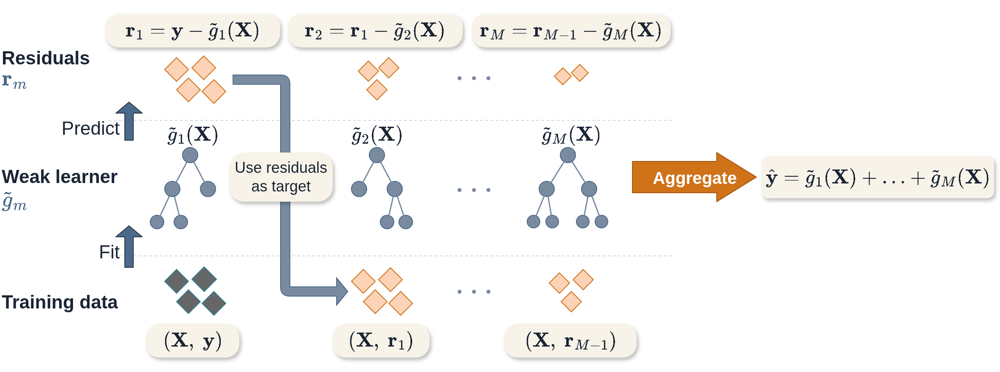

::: {.content-visible when-format="html"}

:::

# Boosting Methods {#sec-boost}



Similarly to random forests, boosting is an ensemble method that creates a model from a 'committee' of *weak* learners that make poor predictions individually, which creates a *slow learning* approach that requires many iterations for a model to be a good fit to the data.
However, the two differ in how committee members are selected and combined: in random forests, each decision tree is grown independently and predictions are averaged, whereas in boosting, weak learners are fit sequentially with errors from one learner used to train the next, and predictions are made by a weighted linear combination of all learners (@fig-boosting).

## GBMs for Regression {#sec-surv-ml-models-boost-regr}

Gradient Boosting Machines (GBMs) are the most widely used family of boosting algorithms.
The general idea is to choose a differentiable loss function and iteratively fit weak learners to the negative gradient of that loss — a generalization of fitting residuals that covers regression, classification, and survival settings alike.
<!--TODO: \XX should be \xx as per convention -->
@fig-boosting illustrates this process in a least-squares regression setting, where the negative gradient reduces to the ordinary residual:
<!--TODO: uses f here and in the graphic, but switches to g later on -->
1. A weak learner, $f_1$, often a decision tree of shallow depth is fit on the training data $(\XX, \yy)$.
2. Predictions from the learner, $f_1(\XX)$, are compared to the ground truth, $\yy$, and the residuals are calculated as $\rr_1 = \yy - f_1(\XX)$.
3. The next weak learner, $f_2$, uses the previous residuals for the target prediction, $(\XX, \rr_1)$
4. This is repeated to train $M$ learners, $f_1,\ldots,f_M$

Predictions are then made as $\hat{\yy} = f_1(\XX) + f_2(\XX) + \ldots + f_M(\XX)$ (for now ignoring any individual learner weights).

{#fig-boosting fig-alt="TODO"}

The algorithm above is also a simplification as no hyper-parameters other than $M$ were included for controlling the algorithm.
In order to reduce overfitting, three common hyper-parameters are utilised:

**Number of iterations**, $M$:
The number of iterations is often claimed to be the most important hyper-parameter in GBMs and it has been demonstrated that a value too small will result in underfitting, whilst a value too large will result in overfitting [@Buhlmann2006; @Hastie2001; @Schmid2008a].
This underlines the general idea of boosting weak learners to slowly form a single powerful model.

**Step-size**, $\nu$:
The step-size parameter is a shrinkage parameter that controls the contribution of each weak learner at each iteration.
Several studies have demonstrated that GBMs perform better when shrinkage is applied and a value of $\nu \leq 0.1$ is often suggested  [@Buhlmann2007; @Hastie2001; @Friedman2001; @Lee2018; @Schmid2008a].
The optimal values of $\nu$ and $M$ depend on each other, such that smaller values of $\nu$ require larger values of $M$, and vice versa.
This is intuitive as smaller $\nu$ results in slower learning and therefore more iterations are required to fit the model.
A practical procedure is to set $\nu$ to a small value (e.g. $0.1$) and $M$ to a large value, then stop the algorithm when the performance on a validation set stops improving (early stopping). This avoids computationally expensive tuning to find the optimal combination of $\nu$ and $M$.

**Subsampling proportion**, $\phi$:
Sampling a fraction, $\phi$, of the training data at each iteration can improve performance and reduce runtime [@Hastie2001], with $\phi = 0.5$ often used. Motivated by the success of bagging in random forests, stochastic gradient boosting  [@Friedman1999] randomly samples the data in each iteration. It appears that subsampling performs best when also combined with shrinkage [@Hastie2001]. Selection of $\phi$ is usually performed by nested cross-validation.

In addition to these parameters, the underlying hyper-parameters of the weak learner are also commonly tuned.
If using a decision tree, then it is usual to restrict the number of terminal nodes in the tree to be between $4$ and $8$, which corresponds to two or three splits in the tree.
Including these hyper-parameters, and some differentiable loss, $L$, the general gradient boosting machine algorithm is as follows:
<!-- TODO: notation below inconsistent with intro h_m vs. f_m, also g_m should be introduced more clearly as cumulative model. changing f_m to h_m will require changing the graphic) -->

1. $g_0 \gets \text{ Initial guess}$
2. **For** $m = 1,...,M$:
3. \ \ \ \ \ $\dtrain^* \gets \text{ Randomly sample } \dtrain \text{ with probability } \phi$
4. \ \ \ \ \ $r_{im} \gets -[\frac{\partial L(y_i, g_{m-1}(\xx_i))}{\partial g_{m-1}(\xx_i)}], \forall i \in \{i: \xx_i \in \dtrain^*\}$
5. \ \ \ \ \ Fit a weak learner, $h_m$, to $(\xx^*, \rr_m)$
6. \ \ \ \ \ $g_m \gets g_{m-1} + \nu h_m$
7. **end For**
8.  **return** $\hatg = g_M$

Note:

1. The initial guess (or *offset*), $g_0$, is often the best constant prediction under the chosen loss, $g_0 = \argmin_c \sum_{i=1}^n L(y_i, c)$. For regression with mean squared error loss this reduces to the mean, $g_0 = \bar{y}$.
2. Line 4 is the calculation of the negative gradient, which is equivalent to calculating the residuals in a regression problem with the mean squared error loss.
3. Lines 5-6 differ between implementations, with some fitting multiple weak learners and selecting the one that minimizes a simple optimization problem. The version above is simplest to implement and quickest to run, whilst still providing good model performance.

Once the model is trained, predictions are made for new data, $\xx_{test}$ with

$$
\hat{y} = \hat{g}(\xx_{test}) = g_0(\xx_{test}) + \nu \sum^M_{i=1} g_i(\xx_{test})
$$

GBMs provide a flexible, modular algorithm, primarily comprised of a differentiable loss to minimize, $L$, and the selection of weak learners.
Perhaps the most common weak learners are decision trees, linear least squares [@Friedman2001] and smoothing splines  [@Buhlmann2003].
The use of trees means that the structure of the resulting prediction function can vary substantially, for example using stumps (trees with only one split) results in an additive model with main effects only, whereas decision trees with an extra layer yield two-way interactions.

This chapter focuses on tree-based learners, which are primarily used for survival analysis, due to the flexibility demonstrated in @sec-ranfor.
See references at the end of the chapter for other weak learners.
Extension to survival analysis therefore follows by considering alternative losses.

## GBMs for Survival Analysis {#sec-surv-ml-models-boost-surv}

Unlike other machine learning algorithms that historically ignored survival analysis, early GBM papers considered boosting in a survival context  [@Ridgeway1999]; though there appears to be a decade gap before further considerations were made in the survival setting.
Subsequently, @Hothorn2005, @Schmid2008b, @Schmid2008a, and @Binder2008 adapted GBMs to a framework suitable for survival analysis — the developments discussed in this chapter.

<!-- TODO: All is a bit general. I'm sure there are some approaches that generate distributions -->
All survival GBMs make ranking predictions and none are able to directly predict survival distributions.
However, depending on the underlying model, the predictions may be indirectly composed into a survival distribution, for example algorithms that assume a proportional hazards (PH) or accelerated failure time (AFT) form.
This section starts with those models with simpler underlying forms, then explores more complex alternatives.

### Likelihood Boosting

The negative log-likelihood of the semi-parametric PH and fully-parametric AFT models can be derived from the (partial) likelihoods presented in @sec-surv-estimation-param.
<!-- TODO: the switch between the previous intro where g_m was sum of h_m to g_m = x^T\beta^m is too fast. I would have expected h_m = x^T\beta^m instead, and where is \nu? -->
Boosting algorithms use these losses to train the model coefficients, $\bsbeta$, hence at each iteration in the algorithm, $g_m(\xx_i) = \xx_i^\trans \bsbeta^{(m)}$, where $\bsbeta^{(m)}$ are the updated coefficients in iteration $m$.

The Cox partial likelihood [@Cox1972; @Cox1975] is given by

$$
L^{PH}(\bsbeta) = \prod^n_{i:\delta_i=1} \frac{\exp(\eta_i)}{\sum^n_{j \in \calR_{t_i}} \exp(\eta_j)}
$$

with corresponding negative log-likelihood

$$
-l^{PH}(\bsbeta) = -\sum^n_{i=1} \delta_i \Big[\eta_i \ - \ \log\Big(\sum^n_{j \in \calR_{t_i}} \exp(\eta_i)\Big)\Big]
$$ {#eq-surv-logpartial}
where $\calR_{t_i}$ is the set of patients at risk at time $t_i$ and $\eta_i = \xx_i\bsbeta$.

The gradient of $-l^{PH}$ at iteration $m$ is then
$$
r_{im} := \delta_i - \sum^n_{j=1} \delta_j \frac{\II(t_i \geq t_j) \exp(g_{m-1}(\xx_i))}{\sum_{k \in \calR_{t_j}} \exp(g_{m-1}(\xx_k))}
$$ {#eq-surv-partialgrad}
where $g_{m-1}(\xx_i) = \xx_i\bsbeta^{(m-1)}$.

For non-PH data, boosting an AFT model can outperform boosted PH models [@Schmid2008b].
The AFT is defined by
$$
\log \yy = \bseta + \sigma W
$$

<!-- TODO: independent of X? or Y?, should be lower case x in any case, in which case its a tautology, since x is not random -->
where $W$ is a random noise variable independent of $X$, and $\sigma$ is a scale parameter controlling the amount of noise; again $\bseta = \xx^\trans \bsbeta$.
By assuming a distribution on $W$, a distribution is assumed for the full parametric distribution of the survival time $\yy$.

<!-- TODO: not clear to me, if both \nu and \sigma are obtained, the distribution is fully specified. Why do I need composition to obtain distributional prediction beyond rank? -->
The model is boosted by alternately updating $\hat{g}_m$ and $\hat{\sigma}_m$ at each iteration.
Assuming a location-scale distribution with location $\nu = g(\xx_i)$ and scale $\sigma$, the negative log-likelihood evaluated at the estimates from the previous iteration is [@Klein2003]

$$
\begin{split}
-l^{AFT}_m(\bsbeta) = -\sum^n_{i=1} \delta_i\Big[- \log\hat{\sigma}_{m-1} + \log f_W\Big(\frac{\log(t_i) - \hat{g}_{m-1}(\xx_i)}{\hat{\sigma}_{m-1}}\Big)\Big] + \\
(1-\delta_i)\Big[\log S_W\Big(\frac{\log(t_i) - \hat{g}_{m-1}(\xx_i)}{\hat{\sigma}_{m-1}}\Big)\Big]
\end{split}
$$

where $\hat{g}_{m-1}$, $\hat{\sigma}_{m-1}$ are the location and scale estimates from the previous iteration.
The pseudo-residuals $r_{im} = -\frac{\partial(-l^{AFT}_m)}{\partial g(\xx_i)}$ are then computed and used to update $\hat{g}_m$ following the general boosting algorithm.
The scale parameter is subsequently updated with $\hat{g}_m$ fixed:
$$
\hat{\sigma}_m := \argmin_\sigma \ -l^{AFT}_m(\bsbeta)
$$
$\sigma_0$ is commonly initialised as $1$ [@Schmid2008b].

As well as boosting fully-parametric AFTs, one could also consider boosting semi-parametric AFTs, for example using the Gehan loss [@Johnson2011] or using Buckley-James imputation [@Wang2010].
However, known problems with semi-parametric AFT models and the Buckey-James procedure [@Wei1992], as well as a lack of off-shelf implementation, mean that these methods are rarely used in practice.

The flexibility of boosting means extensions to other censoring and truncation types follows simply by replacing the likelihood functions above with the corresponding objective functions in @sec-surv-estimation-param.

#### Penalized Boosting {.unnumbered .unlisted}

'CoxBoost' is an alternative method to boost Cox models and has been demonstrated to perform well in experiments.
This algorithm boosts the Cox PH by optimising the penalized partial-log likelihood; additionally the algorithm allows for mandatory (or 'forced') covariates  [@Binder2008].
In medical domains the inclusion of mandatory covariates may be essential, either for model interpretability, or due to prior expert knowledge.
CoxBoost deviates from the algorithm presented above by instead using an offset-based approach for generalized linear models [@Tutz2007].

Let $\calI = \{1,...,p\}$ be the indices of the covariates, let $\calI_{mand}$ be the indices of the mandatory covariates that must be included in all iterations, and let $\calI_{opt} = \calI \setminus \calI_{mand}$ be the indices of the optional covariates that may be included in any iteration.
In the $m$th iteration, the algorithm fits a weak learner on all mandatory covariates and *one* optional covariate:
$$
\calI_m = \calI_{mand} \cup \{x | x \in \calI_{opt}\}
$$

In addition, a penalty matrix $\mathbf{P} \in \Reals^{p \times p}$ is considered such that $P_{ii} > 0$ implies that covariate $i$ is penalized and $P_{ii} = 0$ means no penalization.
In practice, this is usually a diagonal matrix  [@Binder2008] and by setting $P_{ii} = 0, i \in I_{mand}$ and $P_{ii} > 0, i \not\in I_{mand}$, only optional (non-mandatory) covariates are penalized.
The penalty matrix *can* vary with each iteration, which allows for a highly flexible approach.
However, in implementation a simpler approach is to use the same penalty in each iteration, which could be a single number, so the same penalty is applied to all penalized covariates, or a single matrix, such that the penalty differs between covariates but stays the same in each iteration [@pkgcoxboost].

At the $m$th iteration and the $k$th set of indices to consider ($k = 1,...,p$), the loss to optimize is the penalized partial-log likelihood given by
$$
\begin{split}
&l_{pen}(\gamma_{mk}) = \sum^n_{i=1} \delta_i \Big[\eta_{i,m-1} + \xx_{i,\calI_{mk}}\gamma^\trans_{mk}\Big] - \\
&\quad\delta_i\log\Big(\sum^n_{j = 1} \II(t_j \leq t_i) \exp(\eta_{i,{m-1}} + \xx_{i, \calI_{mk}}\gamma^\trans_{mk}\Big) - \lambda\gamma_{mk}\mathbf{P}_{mk}\gamma^\trans_{mk}
\end{split}
$$ {#eq-coxboost}

where $\eta_{i,m} = \xx_i^\trans \bsbeta^{(m)}$, $\gamma_{mk}$ are the coefficients corresponding to the covariates in $\calI_{mk}$ which is the possible set of candidates for a subset of total candidates $k = 1,...,p$; $\mathbf{P}_{mk}$ is the penalty matrix; and $\lambda$ is a penalty hyper-parameter to be tuned or selected.\footnote{On notation, note that $\mathbf{P}_{ij}$ refers to the penalty matrix in the $i$th iteration for the $j$th set of indices, whereas $P_{ij}$ is the $(i,j)$th element in the matrix $\mathbf{P}$.}

In each iteration, all potential candidate sets (the union of mandatory covariates and one other covariate) are updated by
$$
\hat{\gamma}_{mk} = \mathbf{I}^{-1}_{pen}(\hat{\gamma}_{(m-1)k})U(\hat{\gamma}_{(m-1)k})
$$
where $U(\gamma) = \partial l / \partial \gamma (\gamma)$ and $\mathbf{I}^{-1}_{pen} = \partial^2 l/\partial\gamma\partial\gamma^T (\gamma + \lambda\mathbf{P}_{(m-1)k})$ are the first and second derivatives of the unpenalized partial-log-likelihood.
This is the key difference between CoxBoost and standard gradient boosting as CoxBoost uses updates based on Fisher scoring iterations (including both the first and the second derivatives), whereas the latter only makes use of the gradient (first derivative).

The optimal set is then found as
$$
k^* := \argmax_k \ l_{pen}(\hat{\gamma}_{mk})
$$
and the estimated coefficients are updated with
$$
\hat{\beta}_m = \hat{\beta}_{m-1} + \hat{\gamma}_{mk^*}, \quad k^* \in \calI_{mk}
$$

This deviates from the standard GBM algorithm by directly optimizing $l_{pen}$ and not its gradient, additionally model coefficients are iteratively updated instead of a more general model form.

CoxBoost is extended to the competing risks setting by boosting a subdistribution PH model [@Binder2009].
In this setting, (@eq-coxboost) is replaced by the log-likelihood from the Fine and Gray model (@sec-classical-ph-cr) with an analogous penalty function.
The rest of the procedure follows the same.

### Loss Boosting

Instead of optimising models based on a given model form, one could instead estimate $\hat{\eta}$ by optimizing a loss (Part II).
Common loss choices are discrimination measures, such as Uno's or Harrell's C [@Chen2013;@Mayr2014].

Consider Uno's C (@sec-eval-crank-disc-conc):
$$
C_U(\hat{g}, \dtrain) = \frac{\sum_{i \neq j}\delta_i\{\KMG(t_i)\}^{-2}\II(t_i < t_j)\II(\hatg(\xx_i) >\hatg(\xx_j))}{\sum_{i \neq j}\delta_i\{\KMG(t_i)\}^{-2}\II(t_i < t_j)}
$$

where $\KMG$ is again the Kaplan-Meier estimate of the censoring distribution.

The GBM algorithm requires that the chosen loss, here $C_U$, be differentiable with respect to $\hatg(\xx)$, which is not the case due to the indicator term, $\II(\hatg(\xx_i) > \hatg(\xx_j))$, however this term can be replaced with a sigmoid function to create a differentiable loss [@Ma2006]:

$$
K(u|\omega) = \frac{1}{1 + \exp(-u/\omega)}
$$

where $\omega$ is a tunable hyper-parameter controlling the smoothness of the approximation.
The measure to optimise is then,

$$
C_{USmooth}(\bsbeta|\omega) = \sum_{i \neq j} \frac{k_{ij}}{1 + \exp\big[(\hatg(\xx_j) - \hatg(\xx_i))/\omega)\big]}
$$ {#eq-surv-gbm-cus}

with

$$
k_{ij} = \frac{\Delta_i (\KMG(t_i))^{-2}\II(t_i < t_j)}{\sum_{i \neq j} \Delta_i(\KMG(t_i))^{-2}\II(t_i < t_j)}
$$

The negative gradient at iteration $m$ for observation $i$ is then calculated as,

$$
r_{im} := - \sum^n_{j = 1} k_{ij} \frac{-\exp(\frac{\hatg_{m-1}(\xx_j) - \hatg_{m-1}(\xx_i)}{\omega})}{\omega(1 + \exp(\frac{\hatg_{m-1}(\xx_j) - \hatg_{m-1}(\xx_i)}{\omega}))}
$$ {#eq-surv-gbm-cus-grad}

The GBM algorithm is then followed as normal with the above loss (@eq-surv-gbm-cus) and gradient (@eq-surv-gbm-cus-grad).
This algorithm may be more insensitive to overfitting than others [@Mayr2016], however stability selection  [@Meinshausen2010], which is implemented in off-shelf software packages [@pkgmboost], can be considered for variable selection.

Similarly to likelihood boosting, flexibility is again a key advantage here for extensions to other censoring and truncation types and also to competing risks.
For example, the all-cause logarithmic score introduced in @sec-rules-ext can be used to boost survival models that optimize overall predictive ability [@Alberge2025].

## Conclusion

:::: {.callout-warning icon=false}

## Key takeaways

* GBMs are a highly flexible and powerful machine learning tool due to their modular nature, where any differentiable loss and any weak base-learner can be combined. This makes them particularly useful in the survival setting as they can be easily adapted to different survival settings.
* There is evidence that boosting models can outperform the Cox PH even in low-dimensional settings [@Schmid2008b], which is not not something all ML models can claim.
* GBMs can perform very well in high-dimensional settings due to variable selection that can take place both during covariate selection as weak learners are chosen to optimize performance in each step, and within the base learners (especially when using trees).

::::

:::: {.callout-important icon=false}

## Limitations

* Boosting, especially with tree learners, is viewed as a black-box model that is increasingly difficult to interpret as the number of iterations increase. However, there are several methods for increasing interpretability, such as variable importance and SHAPs  [@Lundberg2017].
* Boosting methods are often computationally intensive. However, dedicated software packages such as $\pkg{xgboost}$ [@pkgxgboost] offer highly optimized implementations. This allows more complex models and extensive hyperparameter tuning to be performed within reasonable time and memory constraints, which can translate into improved predictive performance.

::::

:::: {.callout-tip icon=false}

## Further reading

* @Buhlmann2003; @pkgmboost; @Wang2010 for more general information and background on componentwise GBMs
* @Friedman2001; @Wang2010 for linear least squares weak learners
* @Buhlmann2003; @Friedman2001 for decision tree weak learners
* @Ridgeway1999 for early research into GBMs for survival analysis
* @Johnson2011 and @Wang2010 for semi-parametric AFT boosting

::::
