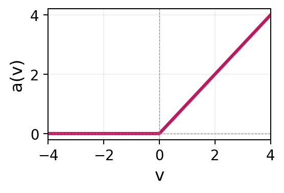
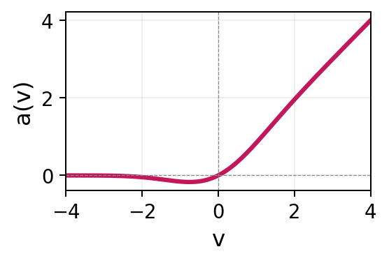
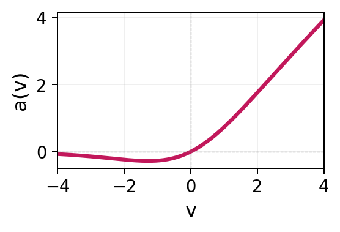
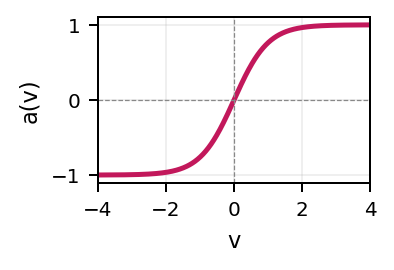
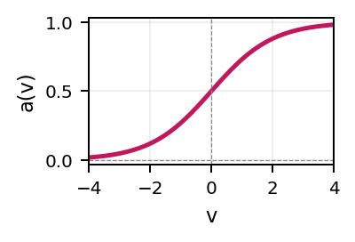
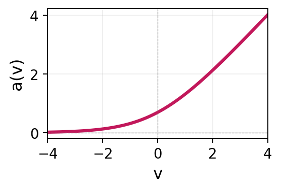

::: {.content-visible when-format="html"}

:::

# Neural Networks {#sec-nnet}

Neural networks\index{neural networks} are a flexible class of models that can approximate any smooth function given sufficient capacity [@Hornik1989; @Hornik1991].
Their emphasis on hidden layers, large numbers of hyperparameters, and diverse architectures means that working with neural networks is sometimes described as more art than science [@Chollet2018].
The term _deep learning_, often used interchangeably with _neural networks_ in the contemporary machine-learning literature, originates from the use of many hidden layers in a network.
A comprehensive treatment is beyond the scope of this chapter; readers interested in a broader introduction are referred to @LeCun2015, @Goodfellow2016 and @Prince2023.
The goal here is instead to introduce enough of the underlying concepts to understand how neural networks are adapted to survival analysis.
Despite their architectural diversity, neural networks share the same mathematical foundation: compositions of linear maps (@sec-nnet-regression) and non-linear activations (@sec-nnet-activations), trained by minimizing a differentiable loss using (stochastic) gradient descent (@sec-nnet-optimization).
The adaptation to survival analysis depends primarily on the loss rather than on the architecture itself.
The chapter therefore develops the key ideas using the simplest architecture, the feed-forward neural network; extensions to other architectures are briefly introduced in @sec-nnet-beyond-ffnn.

## Neural networks for regression {#sec-nnet-regression}

To begin, let $y_i \in \Reals$ be a continuous target, $\xx_i \in \Reals^p$ be a covariate vector and $\dtrain = \{(\xx_i, y_i)\}_{i=1}^n$ be a set of training data for $n$ observations.
Throughout this chapter, the term _unit_ (also known as a _node_ or _neuron_) refers to a single computational element of a neural network.\index{neural networks!unit}
A _layer_ is a collection of units operating at the same stage of the network, with the output of one layer serving as the input to the next.\index{neural networks!layer}
The _architecture_ is the arrangement of layers, units, and their connections.\index{neural networks!architecture}

In general, neural networks can be viewed as computational graphs (usually _directed acyclic graphs_) that transform inputs through a sequence of differentiable operations to produce an output.
@fig-ffnn-arch shows a *feed-forward neural network* (FFNN), the simplest neural network architecture.\index{neural networks!feed-forward neural network}
There are two inputs (features), $x_1$ and $x_2$, and one intercept per layer.
Arrows indicate operations that are applied to the input to produce the output from left to right. 
The final layer is referred to as the *output layer*.
The layers between the input and output layer are called *hidden* layers, and each unit in the hidden layer is referred to as a *hidden unit*.\index{neural networks!hidden layer}
In each step, the inputs are multiplied with scalar weights and summed, then transformed through a known *activation function* (@sec-nnet-activations), denoted by $a^{(l)}(\cdot)$, where the superscript $(l)$ indexes the layer.\index{neural networks!activation function}

As a concrete example, using the architecture in @fig-ffnn-arch, the $j$th hidden unit of the first layer is given by:

$$
h_j^{(1)} = a^{(1)}\!\left(b_j^{(1)} + w_{j,1}^{(1)} x_1 + w_{j,2}^{(1)} x_2\right), \quad j = 1, \ldots, 3,
$$

where the scalars $w_{j,k}^{(1)}$ are called *weights* (coefficients) and $b_j^{(1)}$ are the *biases* (intercepts). \index{neural networks!weights}\index{neural networks!biases}
In @fig-ffnn-arch, the weights are represented by edges connecting the feature inputs $x_k$ to the hidden units, while the biases are represented by edges connecting the constant bias node ($1$) to the hidden units.
For example, $w_{1,1}^{(1)}, w_{2,1}^{(1)}, w_{3,1}^{(1)}$ label the edges carrying input $x_1$ to the three units of the first hidden layer, and $b_1^{(1)}, b_2^{(1)}, b_3^{(1)}$ label the corresponding bias edges.
Each hidden layer can be compactly written in vector form. For example, the output of the first hidden layer is $\hh^{(1)}$ given by:

$$
\hh^{(1)} = a^{(1)}\!\left(\mathbf{b}^{(1)} + \mathbf{W}^{(1)} \xx\right) \in \Reals^3,
$$

where $\hh^{(1)} = (h_1^{(1)} \ h_2^{(1)} \ h_3^{(1)})^\trans$, the activation, $a^{(1)}$, is applied element-wise, and

$$
\xx =
\begin{pmatrix} x_1 \\ x_2 \end{pmatrix},
\qquad
\mathbf{b}^{(1)} =
\begin{pmatrix} b_1^{(1)} \\ b_2^{(1)} \\ b_3^{(1)} \end{pmatrix},
\qquad
\mathbf{W}^{(1)} =
\begin{pmatrix}
w_{1,1}^{(1)} & w_{1,2}^{(1)} \\
w_{2,1}^{(1)} & w_{2,2}^{(1)} \\
w_{3,1}^{(1)} & w_{3,2}^{(1)}
\end{pmatrix}.
$$

For a deterministic regression problem, the output layer consists of a single unit constructed in the same way as the hidden units, except the activation functions are replaced by an optional _response function_\index{neural networks!response function}, $r$ (@sec-nnet-activations). 
In @fig-ffnn-arch this corresponds to the final layer:

$$
z = \mathbf{b}^{(3)} + \mathbf{W}^{(3)} \hh^{(2)}, \qquad y = r(z),
$$

where $\mathbf{b}^{(3)}$ and $\mathbf{W}^{(3)}$ are the bias and weights in the final layer, and $\hh^{(2)}$ are the outputs from the hidden units in layer 2.

Putting everything together, the FFNN is defined by the recursion:\index{neural networks!recursion}

$$
\begin{aligned}
\hh^{(0)} &= \xx \\
\hh^{(l)} &= a^{(l)}\!\left(\mathbf{W}^{(l)}\hh^{(l-1)} + \mathbf{b}^{(l)}\right), \quad l = 1, \ldots, L \\
z &= \mathbf{W}^{(L+1)}\hh^{(L)} + \mathbf{b}^{(L+1)} \\
y &= r(z),
\end{aligned}
$$ {#eq-nnet-forward}

where $\mathbf{W}^{(l)}$ and $\mathbf{b}^{(l)}$ are the weight matrix and bias vector of layer $l$, $a^{(l)}$ is the layer's activation function, $L$ is the number of hidden layers (so FFNNs have $L+1$ weight layers in total). 
Finally,

$$
g(\xx \mid \bstheta) = y
$$

is used by convention to define the neural network model as a function that maps inputs $\xx$ to outputs $y$, given parameters $\bstheta = \{\mathbf{W}^{(l)}, \mathbf{b}^{(l)}\}_{l=1}^{L+1}$.

![Schematic of a feed-forward neural network instantiating (@eq-nnet-forward) with two inputs $x_1, x_2$, two hidden layers of three and four units $h^{(l)}_j$, and a scalar output $y$. Arrows indicate the direction of information flow; the bias nodes (labeled $1$) contribute the additive offsets $\mathbf{b}^{(l)}$ in each layer. The edges carrying input $x_1$ and the first bias node are labelled with their weights $w^{(1)}_{j,1}$ and biases $b^{(1)}_j$. The output layer is split into the pre-response value $z$ and the response function $r(\,\cdot\,)$ (yellow box) producing $y = r(z)$.](Figures/neuralnetworks/ffnn-architecture.png){#fig-ffnn-arch fig-alt="Four columns of nodes (circles) are presented to represent an FFNN. The first column 'input layer; x in R2' shows nodes: 1, x_1, x_2. The second column 'hidden layer 1; h^1=a(W^1x + b^1)' shows nodes: 1, h_1^1, h_2^1, h_3^1; the edges from x_1 to these three units are labelled w_11^1, w_21^1, w_31^1 and the edges from the bias node are labelled b_1^1, b_2^1, b_3^1. The third column 'hidden layer 2; h^2=a(W^2h^1 + b^2)' shows nodes: 1, h_1^2, h_2^2, h_3^2, h_4^2. The final column 'output layer; z=W^3h^2 + b^3, y = r(z)' shows a node 'z' with an arrow to a box 'r(.)' to a green node 'y'. Every single node has an arrow going from the node to all nodes in the next layer, indicating the architecture is 'fully-connected'."}

### Activations and response functions {#sec-nnet-activations}
Both activation and response functions are prespecified before training. 
Activation and response functions may use the same underlying function; however, they serve different purposes and are usually chosen independently of each other.
@tbl-activations lists common activation and response functions used in practice.

#### Activation functions {.unnumbered .unlisted}
A network may use the same activation function for all units, different activation functions across layers, or even different activation functions within the same layer, although the latter is uncommon in practice.\index{neural networks!activation function}
The default choice for hidden layers is the *rectified linear unit* (ReLU) [@Nair2010] due to its computational simplicity and favorable gradient properties.
As ReLU is piecewise linear, a network composed entirely of ReLU activations represents a piecewise-linear function with finitely many breakpoints.\index{neural networks!activation function!ReLU}
A network of the same size but only using $\tanh$ activations would instead produce smoother curves (see @fig-mcycle-ffnn). \index{neural networks!activation function!tanh@$\tanh$}
Smooth ReLU-like alternatives such as *GELU* [@Hendrycks2016] and *SiLU/Swish* [@Ramachandran2017] are common in modern deep learning architectures (@sec-nnet-beyond-ffnn). \index{neural networks!activation function!GeLU}\index{neural networks!activation function!SiLU}
GELU is widely used in transformer models, while SiLU is frequently used in contemporary convolutional neural networks and large language models.\index{neural networks!convolutional neural network}\index{neural networks!large language model}

#### Response functions {.unnumbered .unlisted}
The response function controls the range of the output and is usually dictated by the application rather than by computational considerations.\index{neural networks!response function}
In the deep learning literature, $r(\,\cdot\,)$ is commonly referred to as the *output activation* and is treated just like another activation.
The term "response function" is used here to emphasize its different role.

Common examples of $r(\,\cdot\,)$ are (@tbl-activations):

* _identity_, $r(z) = z$: for deterministic regression when the outcome lies in $\Reals$;\index{neural networks!response function!identity}
* *sigmoid*: to constrain $r(z) \in (0,1)$ for binary classification;\index{neural networks!response function!sigmoid}
* *softmax*, $r(\mathbf{z})_k = e^{z_k}/\sum_{j=1}^{K}e^{z_j}$: to transform an output vector, $\mathbf{z}$, into a vector of non-negative values that sum to one for multi-class classification problems;\index{neural networks!response function!softmax}
* *softplus* or *exponential*: common choices to constrain $r(z) \in \PReals$.\index{neural networks!response function!softplus}

: Common functions used as activations and response functions. {#tbl-activations}

| Name | Definition | Range | Shape |
|:-----|:-----------|:------|:-----:|
| ReLU | $a(v) = \max(0, v)$ | $[0, \infty)$ | {height=90px} |
| GELU | $a(v) = \tfrac{v}{2}\bigl[1 + \operatorname{erf}(v/\sqrt{2})\bigr]$ | $\approx [-0.17, \infty)$ | {height=90px} |
| SiLU | $a(v) = v / (1 + e^{-v})$ | $\approx [-0.28, \infty)$ | {height=90px} |
| Tanh | $a(v) = \frac{e^v - e^{-v}}{e^v + e^{-v}}$ | $(-1, 1)$ | {height=90px} |
| Sigmoid | $a(v) = \frac{1}{1 + e^{-v}}$ | $(0, 1)$ | {height=90px} |
| Softplus | $a(v) = \log(1 + e^v)$ | $(0, \infty)$ | {height=90px} |

As a running example, the bivariate `mcycle` dataset [@Silverman1985] records $n = 133$ measurements of *head acceleration* (in units of $g$) at successive times (measured in milliseconds) following impact on a helmeted crash-test dummy in a simulated motorcycle crash (@tbl-mcycle).
The shape of the curve formed by the observations is non-monotone, with a steep negative spike (deceleration) at the moment of impact, a positive rebound shortly afterwards, followed by a relatively stable tail.

: First five rows of the `mcycle` dataset [@Silverman1985] {#tbl-mcycle}.

| Time (ms) | Acceleration (g) |
|---:|---:|
| 2.4  | 0.0  |
| 2.6  | -1.3 |
| 3.2  | -2.7 |
| 3.6  | 0.0  |
| 4.0  | -2.7 |

@fig-mcycle-ffnn shows two FFNNs using identical architectures (same as @fig-ffnn-arch) and parameters, with the only difference being the choice of activations.
The smooth curve in the left panel is achieved using $\tanh$ activations, whereas the right panel is from a ReLU network, which is clearly visible in the figure through the small number of sharp corners in the fitted curve that arise from the piecewise-linear activations.
With more hidden units, the ReLU breakpoints would become dense enough that its fit would also appear smooth; $\tanh$ simply achieves a smooth fit with fewer units.

{#fig-mcycle-ffnn fig-alt="Two side-by-side scatter plots with lines tracing the shape of the points. The left plot is the tanh activation where a smooth curve passes through the points. The right plot is the ReLU activation where the curve contains a number of lines connected at breakpoints. Both curves fit well to the data. Both curves are relatively flat from time=0-10ms then dip sharply at time=20ms then rise sharply at time=30ms before dipping very slightly and remaining flat to the end at 60ms."}

### Optimization {#sec-nnet-optimization}

As with boosting (@sec-boost), fitting the model in (@eq-nnet-forward) to training data involves estimating the parameters $\bstheta$ to minimize a *loss function*, $L(\bstheta)$, so that:\index{neural networks!optimization}

$$
\hat{\bstheta} \;=\; \argmin_{\bstheta}\, L(\bstheta).
$$ {#eq-nnet-argmin}

A closed-form minimum to (@eq-nnet-argmin) does not exist for neural networks and instead $\hat{\bstheta}$ has to be found *iteratively* by gradient descent.
@sec-ml-gradient-descent introduced the simplest version of this procedure, referred to here as _plain gradient descent_.\index{neural networks!gradient descent}

Training a neural network consists of repeatedly performing three operations for a fixed number of iterations, $M$.\index{neural networks!hyperparameters!epochs}
As with boosting (@sec-boost), $M$ is usually chosen to be large and training is terminated by early stopping (@sec-ml-early-stopping).\index{early stopping}
First, the network passes the inputs through (@eq-nnet-forward), producing predictions (forward pass).
Second, the discrepancy between the predictions and the observed outcomes is quantified through a loss function (@sec-rules), and the corresponding gradients are computed by backpropagation\index{neural networks!backpropagation} (backward pass).
_Backpropagation_ efficiently computes gradients by applying the chain rule layer by layer, starting from the output and proceeding back to the input [@Rumelhart1986].
Finally, the gradients are used by an _optimizer_ (@sec-nn-opt) to update the parameters.
One complete pass through all the training data is called an _epoch_ and may consist of many iterations due to the use of _mini-batches_ (@sec-nn-batches). \index{neural networks!epoch}\index{neural networks!mini-batch}
In practice, modern frameworks compute gradients automatically using _automatic differentiation_, so specifying the forward pass, choice of optimizer, and batch size is sufficient to define the entire optimization procedure.\index{neural networks!automatic differentiation}

:::: {.callout-note icon=false}

## Algorithm 3 (Full-batch plain gradient descent training of a neural network) {#alg-nn-gd}

**Inputs:** training set $\dtrain = \{(\xx_i, y_i)\}_{i=1}^{n}$, loss $L(\bstheta) = \tfrac{1}{n}\sum_{i=1}^{n} \ell_i(\bstheta)$, learning rate $\alpha$, number of iterations $M$, optimizer update rule $U$.

1. $\bstheta^{0} \gets$ random initialization;
2. **for** $m = 0, 1, \ldots, M - 1$:
3. \ \ \ \ \ **Forward pass:** compute predictions $g(\xx_i \mid \bstheta^{m})$ for $i = 1, \ldots, n$ and loss $L(\bstheta^{m})$
4. \ \ \ \ \ **Backward pass:** compute the gradient $\bsgamma^{m} = \nabla_{\bstheta} L(\bstheta^{m})$ via backpropagation
5. \ \ \ \ \ **Update:** $(\bstheta^{m+1}) \gets U(\bstheta^{m}, \bsgamma^{m}, \alpha)$
6. **end for**
7. **return** $\hat{\bstheta} \gets \bstheta^{M}$

::::

Algorithm 3 presents training in its simplest form with plain full-batch gradient descent.
It is common to instead update neural networks using subsets of the data (the same principle used in random forests and boosting) and to replace plain gradient descent with an alternative optimizer.
Both ideas are discussed in turn.

#### Stochastic gradient descent and mini-batching {#sec-nn-batches}

Using the notation in Algorithm 3, let $U(\bstheta, \bsgamma, \alpha)$ be an update rule with parameters $\bstheta$, gradients, $\bsgamma$, and learning rate $\alpha$.\index{gradient descent}
Using plain gradient descent (described in @sec-ml-gradient-descent) as the update rule gives:

$$
U(\bstheta, \bsgamma, \alpha) = \bstheta - \alpha\bsgamma,
$$

which is the identical form to (@eq-ml-gd).

In Steps 3–4 of Algorithm 3 the *full-batch* gradient,

$$
\nabla_{\bstheta} L(\bstheta) \;=\; \frac{1}{n}\sum_{i=1}^{n} \nabla_{\bstheta}\,\ell_i(\bstheta),
$$

is evaluated by summing over the entire training set.
This requires one forward and one backward pass through all $n$ observations for *each* parameter update.
This is prohibitively expensive for the dataset sizes associated with deep learning.
Even when feasible, full-batch updates are usually suboptimal in practice (as also discussed in @sec-boost).

Therefore, in each iteration $m$, neural networks are typically trained in *mini-batches*, which are small, equally sized, random subsets of the training data, $\calB_m \subset \{1, \ldots, n\}$, where each batch is a fixed size $B$.\index{neural networks!gradient descent!mini-batch}
In contrast to bootstrapping  (@sec-ranfor), mini-batches are created by shuffling and partitioning the data into approximately $\lceil n / B \rceil$ batches, ensuring every observation is included in exactly one batch.\index{neural networks!hyperparameters!mini-batch size}

In steps 3--4 of Algorithm 3, the full-batch loss, $L(\bstheta)$, and gradient $\nabla_{\bstheta} L(\bstheta^{m})$, are replaced by a *mini-batch loss* and gradient,

$$
L_{\calB_m}(\bstheta) \;=\; \frac{1}{B}\sum_{i \in \calB_m} \ell_i(\bstheta),
\qquad
\nabla_{\bstheta} L_{\calB_m}(\bstheta^{m}) \;=\; \frac{1}{B}\sum_{i \in \calB_m}\nabla_{\bstheta}\,\ell_i(\bstheta^{m}).
$$ {#eq-nnet-minibatch}

As well as being more computationally efficient, the stochasticity introduced by 'mini-batching' can help the optimization escape narrow saddle points and shallow local minima, often leading to improved generalization.

The resulting procedure is called (mini-batch) *stochastic gradient descent* (SGD) [@Robbins1951].
Conceptually, training can be viewed as two nested loops: an inner loop consisting of steps 3--5, repeated once per mini-batch, and an outer loop of steps 2--6, repeated once per epoch, where an _epoch_ is a complete pass through the training data.\index{neural networks!epoch}
The term _iteration_ is avoided from this point as its meaning depends on which loop is being referenced.

#### Optimizers {#sec-nn-opt}

Plain gradient descent (including its stochastic and mini-batch variants) is the simplest choice for the optimizer, $U$.\index{neural networks!optimizer}
It applies the same learning rate, $\alpha$, to every parameter and uses no information from past gradients.\index{neural networks!hyperparameters!learning rate}
Modern *adaptive* optimizers improve on plain gradient descent by maintaining a running estimate of the gradient direction (*momentum*) and the per-parameter gradient magnitude (*scaling*).
These quantities are used to adapt the effective step size during training.\index{neural networks!optimizer!adaptive}

The quantities required by an optimizer are stored in an internal state, $\ss$, which contains any additional information needed to compute the parameter updates.
The optimizer in Algorithm 3 can then be written as $U(\bstheta, \bsgamma, \alpha, \ss)$ and the first step of the algorithm would set an initial state, $\ss^0$.
For plain gradient descent, the state is empty, $\ss = ()$.\index{neural networks!optimizer!state}

The most widely used optimizer in deep learning is *Adam* (Adaptive Moment Estimation) [@Kingma2015].
Adam maintains exponential moving averages of the gradient and the element-wise squared gradient, \index{neural networks!optimizer!Adam}

$$
\begin{aligned}
\bar{\bsgamma}^{m} &= \nu_1\,\bar{\bsgamma}^{m-1} + (1 - \nu_1)\,\bsgamma^{m},\\
\mathbf{v}^{m} &= \nu_2\,\mathbf{v}^{m-1} + (1 - \nu_2)\,(\bsgamma^{m})^2,
\end{aligned}
$$ {#eq-nnet-adam-moments}

where $\bsgamma^{m}$ is the gradient supplied to $U$ in Step 5 of Algorithm 3.
The quantities $\bar{\bsgamma}^{m}$ and $\mathbf{v}^{m}$ are exponential moving averages of the gradient and element-wise squared gradient, respectively, and $\nu_1, \nu_2 \in [0, 1)$ are the corresponding decay rates.
After a bias correction that compensates for the zero-initialization of $\bar{\bsgamma}$ and $\mathbf{v}$ (omitted here for brevity), the parameter update is:

$$
\bstheta^{m+1} \;=\; \bstheta^{m} - \alpha\,\frac{\bar{\bsgamma}^{m}}{\sqrt{\mathbf{v}^{m}} + \epsilon},
$$ {#eq-nnet-adam-update}

where $\epsilon > 0$ is a small numerical-stability constant (typically $10^{-8}$) that prevents division by zero whenever a component $v_j^{m}$ of $\mathbf{v}^{m}$ is close to zero.
The state, $\ss^m = (\bar{\bsgamma}^m, \mathbf{v}^m)$, is updated according to (@eq-nnet-adam-moments) and the resulting values are used to update $\bstheta$ via (@eq-nnet-adam-update).

The numerator, $\bar{\bsgamma}^{m}$, is the momentum term, which here averages recent gradients and thereby reduces noise from mini-batching while accelerating descent along persistent directions.
The denominator, $\sqrt{\mathbf{v}^{m}}$, is the scaling term, which rescales each coordinate by its own recent gradient magnitude, so parameters whose gradients are large get *smaller* steps and parameters whose gradients are small get *larger* steps.
These features make Adam much less sensitive to the choice of $\alpha$ than plain SGD and substantially reduce the need to tune separate learning rates.

### Managing hyperparameters {#sec-nnet-hyperparameters}

One feature of neural networks that can be considered both a strength and a drawback is the number of hyperparameters (@sec-ml-models) that must be configured.
In the context of neural networks, hyperparameters can be grouped into two categories.

#### Structural hyperparameters

*Structural hyperparameters* define the structure of the neural network.\index{neural networks!hyperparameters!structural}
They include the choice of architecture family (@sec-nnet-beyond-ffnn), the *depth* (number of hidden layers, $L$) and *width* (number of units per layer) of the network, the choice of hidden activations, $a^{(l)}$, and the response function, $r$.\index{neural networks!hyperparameters!depth}\index{neural networks!hyperparameters!width}
Together, these choices determine the class of functions that the network can represent, and therefore the solutions available to gradient descent.

Attempting to tune these hyperparameters is computationally expensive as each candidate configuration requires a full training run, which could take hours or even days.
*Neural architecture search* (NAS) [@Elsken2019] automates the search using reinforcement learning, evolutionary algorithms, or gradient-based relaxations of the discrete choices.\index{neural networks!neural architecture search}
However, NAS is itself extremely compute-intensive and largely confined to settings where the same architecture will be reused many times (for example in image classification).

For most applications the architecture is therefore *chosen*, not tuned, drawing on the families of @sec-nnet-beyond-ffnn and on what is standard in the relevant domain.
A complementary strategy is to deliberately over-parameterize the network, that is, to use more layers or units than are strictly necessary so that the network is sufficiently flexible to model complex relationships.\index{over-parameterization}
Overfitting is then controlled through regularization rather than by carefully tuning the network capacity.\index{regularization}\index{neural networks!regularization}
Two _regularization_ strategies are particularly common to help reduce overfitting:

- *Weight decay* adds a shrinkage penalty $\lambda\|\bstheta\|_2^2$ to the loss for some $\lambda \in \PReals$, identical to the ridge penalty in the linear case.\index{neural networks!regularization!weight decay}
- *Dropout* [@Srivastava2014] randomly sets a fraction, $p$, of activations to zero during each training step, which can be interpreted as implicit ensembling over thinned sub-networks.\index{neural networks!regularization!dropout proportion}

$\lambda$ and $p$ are mathematical hyperparameters, but they are typically robust and may be tuned over a small discrete grid of candidate values.\index{neural networks!hyperparameters!shrinkage penalty}\index{neural networks!hyperparameters!dropout proportion}
Over-parameterization alongside weight decay and/or dropout is therefore a common method to reduce the need to tune structural hyperparameters, at the cost of only one or two extra hyperparameters.

Beyond these explicit regularization methods, training an over-parameterized network with (stochastic) gradient descent includes its own _implicit regularization_.
Large networks may have many parameter settings that fit the training data equally well, but gradient descent usually favors solutions that are comparatively simple and generalize well to unseen data.

#### Mathematical hyperparameters

*Mathematical hyperparameters* control _how_ the parameters are estimated once the network structure has been fixed.\index{neural networks!hyperparameters!mathematical}
They include the learning rate $\alpha$,\index{neural networks!hyperparameters!learning rate} optimizer hyperparameters (such as Adam's decay rates from (@eq-nnet-adam-moments)),\index{neural networks!hyperparameters!decay rate} the mini-batch size, $B$,\index{neural networks!hyperparameters!mini-batch size} from (@eq-nnet-minibatch), the number of training epochs\index{neural networks!hyperparameters!epochs}, $M$, early-stopping settings, and the regularization hyperparameters discussed above.

Adaptive optimizers, such as Adam, are relatively insensitive to the choice of learning rate.
It is therefore common to set a small learning rate (such as $0.001$ [@pkgkeras]) rather than performing extensive tuning.\index{neural networks!optimizer!Adam}
As with gradient boosting machines, the number of epochs is also usually not tuned but instead a sufficiently large number is chosen and then early stopping (@sec-ml-early-stopping) is used to terminate training once a held-out validation loss stops improving.\index{gradient boosting machines}
The remaining mathematical hyperparameters can then be tuned using nested cross-validation (@sec-ml-opt). \index{cross-validation}\index{tuning}

### Probabilistic predictions {#sec-nnet-deterministic-vs-probabilistic}

Recall from @sec-ml-tasks-regr that regression tasks can be *deterministic*, returning a single point prediction $\hat{y}_i = g(\xx_i \mid \hat{\bstheta})$ of the conditional mean, or *probabilistic*, returning a full conditional distribution $\hatf(y \mid \xx_i, \hat{\bstheta})$ from which means, quantiles, prediction intervals, and predictive densities can be derived.
This distinction is central when adapting neural networks to survival analysis (@sec-nnet-surv), where the prediction targets are inherently distributional (@sec-survtsk).

The fits in @fig-mcycle-ffnn are deterministic with a single scalar output: for each observation (time in milliseconds), a single output is predicted (head acceleration).
In that example, the parameters $\hat{\bstheta}$ were obtained by minimizing the *mean squared error* (MSE), \index{mean squared error}

$$
\hat{\bstheta} \;=\; \argmin_{\bstheta}\; \frac{1}{n}\sum_{i=1}^{n}\bigl(y_i - g(\xx_i \mid \bstheta)\bigr)^{2},
$$ {#eq-nnet-mse}

which yields a fitted curve $g(\xx \mid \hat{\bstheta})$ that summarizes the conditional mean.

To instead estimate the full probability distribution, the network must output all the parameters of an assumed conditional distribution.
Any parametric family $f(y \mid \bsphi)$ with a differentiable log-density can be used, where $\bsphi$ denotes the vector of distribution parameters.
The network predicts $\bsphi(\xx_i) = g(\xx_i \mid \bstheta)$, requiring one output head and corresponding response function for each component of $\bsphi$.
The loss used for training is typically the _negative log-likelihood_, \index{negative log-likelihood}

$$
-\sum_i \log f(y_i \mid \bsphi(\xx_i)).
$$ {#eq-nnet-nll}

For this example, consider the Normal distribution which predicts the conditional mean $\mu(\xx \mid \bstheta)$ and the conditional scale $\sigma(\xx \mid \bstheta)$ jointly:

$$
g(\xx_i \mid \bstheta) = \bigl(\mu(\xx_i \mid \bstheta),\; \sigma(\xx_i \mid \bstheta)\bigr)^\trans \in \Reals \times \PReals.
$$

Positivity of the scale is enforced internally by an exponential response function (@sec-nnet-activations) on the $\sigma$-output, $\sigma = \exp(z_\sigma)$, while the mean uses the identity response.
The training objective is the Normal negative log-likelihood (@eq-nnet-nll),

$$
\begin{aligned}
\hat{\bstheta}
&= \argmin_{\bstheta}\; -\sum_{i=1}^n \log f(y_i \mid \bsphi(\xx_i)) \\
&= \argmin_{\bstheta}\; \sum_{i=1}^{n} \left[\tfrac{1}{2\,\sigma(\xx_i \mid \bstheta)^2}\bigl(y_i - \mu(\xx_i \mid \bstheta)\bigr)^2 + \log \sigma(\xx_i \mid \bstheta) + \tfrac{1}{2}\log(2\pi)\right],
\end{aligned}
$$ {#eq-nnet-gauss-nll}

where $f$ is the Normal density with mean $\mu(\xx_i \mid \bstheta)$ and standard deviation $\sigma(\xx_i \mid \bstheta)$.
The parameters $\bstheta$ now parametrize a whole conditional density $f(y \mid \xx, \bstheta)$ rather than a single conditional mean, so the prediction at a new $\xx_*$ is the full distribution $f(\,\cdot \mid \xx_*, \hat{\bstheta})$, from which means, quantiles, and prediction intervals can be extracted.

@fig-ffnn-distributional illustrates three ways a network can produce the two outputs $\mu(\xx)$ and $\sigma(\xx)$ that parametrize (@eq-nnet-gauss-nll).
The part of the network specific to a particular output is called an _output head_.\index{neural networks!output head}
In @fig-ffnn-distributional (a), the hidden layers are fully shared and each output head consists only of a final linear layer and response function.
This is the most parameter-efficient approach, as the same hidden representation is learned once and reused for both parameters.
In @fig-ffnn-distributional (b), the outputs still share an initial representation but each head contains additional hidden layers, allowing some parameter-specific specialization.
Finally, in @fig-ffnn-distributional (c), separate networks predict $\mu(\xx)$ and $\sigma(\xx)$ but are still trained jointly through the same distributional loss.
This is the most flexible approach, particularly when the parameters require different representations or regularization, but it also has the largest number of parameters.

![Three architectural variants for distributional regression. Top, a): Shared hidden layers whose final layer splits into two pre-response values $z_\mu, z_\sigma$, each mapped through its own response function to produce $\mu(\xx)$ and $\sigma(\xx)$. Middle, b): Shared hidden layers followed by two small per-parameter sub-networks before each $z$. Bottom, c): Two entirely separate networks for $\mu$ and $\sigma$. In all three variants the two outputs feed into the same conditional distribution $\mathcal{N}(\mu(\xx), \sigma(\xx)^2)$, so the network is trained jointly under one distributional loss.](Figures/neuralnetworks/ffnn-distributional.png){#fig-ffnn-distributional fig-alt="Three diagrams stacked vertically. (a): input feeds a block of shared hidden layers, which directly produces two pre-response values z_mu and z_sigma, each passing through a response function box and then the corresponding output mu(x) and sigma(x), converging into a conditional Normal distribution box labeled N(mu(x), sigma(x)^2). (b): same as (a) but with an extra small sub-network for mu and an extra small sub-network for sigma inserted between the shared hidden layers and the z nodes, colored pink and blue respectively. (c): two entirely separate networks, one labeled 'network for mu' (pink) and one labeled 'network for sigma' (blue), each taking the input x and producing its own z, response function and output, both feeding into the same conditional Normal distribution box." width=85%}

@fig-mcycle-det-vs-prob visualizes the contrast between deterministic and distributional regression on the `mcycle` data.
Both panels share the *same* FFNN architecture (@fig-ffnn-arch); only the output head and the loss differ.\index{neural networks!feed-forward neural network}
The left panel is a single-output FFNN trained with the MSE (@eq-nnet-mse); the prediction is a single curve and does not quantify predictive uncertainty.
The right panel uses fully shared hidden layers (@fig-ffnn-distributional (a)) with two output heads, identity response for $\mu(\xx)$ and exponential response for $\sigma(\xx)$, trained with the Normal negative log-likelihood (@eq-nnet-gauss-nll).
Estimation of $\sigma(\xx)$ allows uncertainty to be captured at each time point after impact.

![Deterministic vs. probabilistic regression on the `mcycle` data using the FFNN reference architecture of @fig-ffnn-arch in both panels. *Left*: a single-output FFNN trained with the MSE of (@eq-nnet-mse); the prediction is a single conditional-mean curve $\hat{y}(x)$. *Right*: variant *(a)* of @fig-ffnn-distributional trained with the Normal negative log-likelihood of (@eq-nnet-gauss-nll); the prediction is a whole conditional Normal $\mathcal{N}(\mu(x), \sigma(x)^2)$, shown as the mean $\mu(x)$ together with the pointwise central 95\% interval $\mu(x) \pm 1.96\,\sigma(x)$ of the predicted outcome distribution.](Figures/neuralnetworks/mcycle-det-vs-prob.png){#fig-mcycle-det-vs-prob fig-alt="Two side-by-side scatter plots of head acceleration against time after impact for the mcycle dataset. Left: a scatter plot using the tanh activation with a smooth line running through the points. Right: the same curve but with a ribbon around it indicating uncertainty, the ribbon is narrow at first and then widens around time=20ms before narrowing again around time=40ms." width=100%}

### Beyond feed-forward networks {#sec-nnet-beyond-ffnn}

The recursion in (@eq-nnet-forward) defines a fully-connected feed-forward network, but the optimization procedure of Algorithm 3 applies equally to any composition of differentiable units.
Contemporary architectures share the FFNN's gradient-based optimization and end-to-end training but differ in the types of patterns they are designed to capture from the data.
The most common families are listed below with references for further reading.

- **Convolutional Neural Networks (CNNs)** [@LeCun1998; @Krizhevsky2012] exploit local structure in the input by analyzing small regions at a time and reusing the same set of parameters across all regions. CNNs are the default choice for image-like inputs, such as natural images (object detection), medical images (histopathology slides), audio spectrograms, and any other grid-like data. In survival applications they are commonly used for radiology-based time-to-event prediction.\index{neural networks!convolutional neural network}
- **Recurrent Neural Networks (RNNs)**, in particular the *long short-term memory* (LSTM) [@Hochreiter1997] and *gated recurrent unit* (GRU) [@Cho2014], process variable-length sequences by maintaining an internal state that summarizes previously observed inputs. They are well suited to longitudinal data with irregular sampling, including electronic health-record event streams and biomarker trajectories, and were the dominant choice for sequence modelling until transformers overtook them.\index{neural networks!recurrent neural network}
- **Transformers** [@Vaswani2017] also process sequences but replace recurrence with *self-attention*, allowing each input element to directly incorporate information from every other element. Transformers dominate contemporary natural-language processing (BERT, GPT and successors), have largely replaced CNNs at the top of large-scale vision benchmarks, and are increasingly used for tabular electronic-health-record sequences and multi-modal medical data. They are computationally heavier than RNNs but capture relationships between distant parts of a sequence more reliably.\index{neural networks!transformer}\index{neural networks!large-language model}
- **Graph Neural Networks (GNNs)** [@Wu2022] generalize the idea of convolution to graph-structured data (nodes connected by edges) by aggregating information from neighboring nodes (the *message-passing* paradigm). They are used wherever the natural structure of the data is a graph, for example in molecular property prediction for drug discovery, social networks, or recommendation systems.\index{neural networks!graph neural network}
- **Autoencoders** [@Hinton2006] and their probabilistic counterparts, *variational autoencoders* (VAEs) [@Kingma2014VAE], learn a compact representation of the data by attempting to reconstruct the input after compressing it. They are widely used for unsupervised representation learning, dimensionality reduction, anomaly detection, and generative modelling of high-dimensional data such as multi-omics measurements.\index{neural networks!autoencoder}
- **Diffusion models** [@Ho2020DDPM] iteratively transform random noise into structured outputs. They are the current state of the art for image, video, and audio generation (Stable Diffusion, Imagen, Sora), and are increasingly being applied to molecular and medical-image generation. They are less common for direct time-to-event prediction but could be used to generate synthetic data when survival datasets are limited.\index{neural networks!diffusion}
These architectures are rarely used in isolation.
Instead, most large systems are composed of a domain-specific _encoder_ and one or more task-specific heads.
The encoder (such as a CNN for images) maps the raw input into a fixed-dimensional feature representation, and the heads use that representation to produce the prediction targets.

## Neural networks for survival analysis {#sec-nnet-surv}

As seen throughout this chapter, there are many parallels between training neural networks and gradient boosting machines\index{gradient boosting machines} (@sec-boost).
This remains true in the survival setting, where both approaches require a differentiable loss function from which gradients can be computed to update model parameters.
For neural networks, as with GBMs, this generally means predicting risk scores or probability distributions (@sec-survtsk), as there is no meaningful way to evaluate deterministic predictions in survival analysis (@sec-eval-det). \index{neural networks!survival analysis}

Development of deep learning methods for survival analysis remained relatively limited until around 2018, after which the field expanded rapidly and new models have since been introduced at a steady pace [@Wiegrebe2024].
Providing a detailed treatment of all proposed approaches is therefore infeasible.
Instead, this chapter focuses on three broad frameworks within which most modern survival neural networks can be categorized:

- **Parametric neural networks** (@sec-nnet-param) extend neural networks for probabilistic regression (@sec-nnet-deterministic-vs-probabilistic) to survival distributions by replacing the regression loss with a survival-adjusted negative log-likelihood (@sec-surv-estimation-param).
- **Semi-parametric, Cox-based neural networks** (@sec-nnet-cox) optimize the Cox partial likelihood (@sec-classical-cox) as the training objective to obtain a more flexible risk score.
- **Reduction-based neural networks** (@sec-nnet-reduction) convert the survival task into a regression or classification task (Part IV), after which a neural network is trained on the transformed data.

### Parametric neural networks {#sec-nnet-param}

The most direct extension to survival analysis is to update the methods in @sec-nnet-deterministic-vs-probabilistic by selecting a parametric distribution appropriate for the event time $Y$ and then minimizing the corresponding negative log-likelihood. \index{neural networks!survival analysis!parametric}
The idea is identical to the parametric approaches discussed in @sec-classical, but with a more flexible parameterization of the distribution parameters through a neural network.

Recall from @sec-surv-estimation-param that, for right-censored data, the log-likelihood of a parametric model with feature-dependent distribution parameters $\bsphi(\xx_i)$ is:

$$
\ell(\bstheta) = \sum_{i=1}^{n} \left[\delta_i \log f\bigl(t_i \mid \bsphi(\xx_i)\bigr) + (1 - \delta_i) \log S\bigl(t_i \mid \bsphi(\xx_i)\bigr)\right].
$$ {#eq-nnet-param-lik}

A neural network then predicts $g(\xx_i \mid \bstheta) = \bsphi(\xx_i)$, as in @sec-nnet-deterministic-vs-probabilistic.
Using the Weibull distribution as an example\index{Weibull distribution}, a network predicts two positive scalars: the scale $\lambda(\xx_i \mid \bstheta) > 0$ and shape $\gamma(\xx_i \mid \bstheta) > 0$, with positivity again ensured by softplus or exponential response functions (@sec-nnet-activations).
The training objective (assuming the accelerated failure time (AFT) parameterization\index{accelerated failure time}) is then,

$$
\begin{aligned}
\hat{\bstheta} = \argmin_{\bstheta} -\sum_{i=1}^{n} \Bigl[\;&\delta_i \log f_{\Weib}\bigl(t_i \mid \lambda(\xx_i \mid \bstheta), \gamma(\xx_i \mid \bstheta)\bigr) \\
&+ (1 - \delta_i) \log S_{\Weib}\bigl(t_i \mid \lambda(\xx_i \mid \bstheta), \gamma(\xx_i \mid \bstheta)\bigr)\Bigr],
\end{aligned}
$$

and Algorithm 3 then continues as normal as $f_{\Weib}$ and $S_{\Weib}$ are differentiable in their parameters.

This approach is very general as any distribution with a closed-form density can be used, including the exponential, log-normal, log-logistic, or Gompertz distributions, as well as mixtures and spline-based distributions that allow flexible hazard shapes.
The trade-off is that misspecification of the distribution can bias predictions, particularly in the tails of the survival function.
However, the gain is a coherent distribution prediction (without needing an intermediary risk score) and typically better statistical efficiency than non-parametric alternatives when the assumed distribution is approximately correct.

Another advantage is that extension beyond single-event, right-censored data is straightforward by replacing the likelihood (@eq-nnet-param-lik) with the appropriate likelihood from @sec-surv-estimation-param.
No changes to the network architecture, optimization procedure, or training algorithm are required to accommodate alternative censoring or truncation mechanisms, making this approach highly flexible and extensible.\index{neural networks!survival analysis!censoring}\index{neural networks!survival analysis!truncation}

To illustrate how neural networks increase the flexibility of parametric survival models, @fig-weibull-aft-nn compares four Weibull neural networks fitted to the `tumor` data (@tbl-surv-data-tumor).
The dotted lines show Kaplan-Meier estimates stratified by `complications`, while the solid lines show survival curves predicted by the neural networks.
All models use the same Weibull distribution, the FFNN architecture in @fig-ffnn-arch, and the Adam optimizer; they differ only in which Weibull parameters depend on the covariates.

* **M1**: *scale only, single feature*: The scale parameter, $\lambda$, depends on `complications`, while the shape parameter $\gamma$ is a single global value shared across all observations. This yields two survival curves with the same overall shape but different time scales.
* **M2**: *scale only, all features*: $\lambda$ depends on all features while $\gamma$ remains global. This produces individualized survival curves that differ in time scale but retain a common overall shape.
* **M3**: *both parameters, single feature*: Both $\lambda$ and $\gamma$ depend on `complications`. As a result, the two groups are allowed to have different shapes rather than simple rescalings of one another.
* **M4**: *both parameters, all features*: Both $\lambda$ and $\gamma$ depend on all features, producing fully individualized survival distributions. This is the most flexible specification and results in the greatest variation across predicted survival curves.

@fig-weibull-aft-nn illustrates how increasing the flexibility of the parametrization allows the model to represent increasingly complex survival patterns under the same model class and training procedure.
However, as with all machine learning models, greater flexibility does not necessarily imply better generalization to unseen data and robust validation is still recommended.

![Weibull AFT fit to the `tumor` data via a neural network, in four increasingly flexible parametrizations. *Top-left (M1)*: the scale, $\lambda$, depends on `complications`; the shape $\gamma$ is global. *Top-right (M2)*: $\lambda$ depends on all features, $\gamma$ is still global; the resulting curves are individualized in scale but share a common shape. *Bottom-left (M3)*: both $\lambda$ and $\gamma$ depend on `complications`; the two curves exhibit different shapes. *Bottom-right (M4)*: both heads are FFNNs over all seven covariates and produce one Weibull distribution *per unique feature set*. Each curve is colored by complications status. Kaplan-Meier estimates are overlaid in each panel for reference.](Figures/neuralnetworks/weibull-aft-nn.png){#fig-weibull-aft-nn fig-alt="Four panels arranged in a 2-by-2 grid showing predicted survival curves vs. Kaplan-Meier estimates stratified by complications. Top-left (M1) shows two parallel smooth AFT curves (no complications in blue and complications in red), which are close but not fully overlapping Kaplan-Meier curves. Bottom-left (M3) shows the same curves but now with different shapes to another that allow them to almost perfectly overlap the Kaplan-Meier curves. Top-right (M2) show hundreds of red and blue curves but with roughly the same shape. Bottom-right (M4) shows hundreds of red and blue curves but now with unique shapes." width=100%}

@fig-weibull-aft-nn illustrates the general applicability and flexibility of this method.
However, even when an appropriate survival distribution is selected, predictions remain constrained by the shape of that distribution's hazard or survival function.
As a result, relatively few neural-network survival models are fully parametric [@Wiegrebe2024], and even those often attempt to relax the parametric assumption.
One common strategy is to use a _mixture distribution_.
For a sufficiently large number of mixture components, $K$, mixtures of Weibull or log-normal distributions can approximate a wide range of smooth survival distributions while retaining the practical advantages of a parametric model, including closed-form survival and hazard functions.

* *DeepWeiSurv* [@Bennis2020] uses a feed-forward encoder to predict the weights $\alpha_k(\xx \mid \bstheta)$ and the scale and shape parameters of a $K$-component Weibull mixture, trained using the censored mixture negative log-likelihood.\index{neural networks!survival analysis!DeepWeiSurv}
* *DPWTE* [@Bennis2021] extends this construction by adding a sparse Weibull mixture layer whose weights are penalized to softly prune unused components during training, allowing the effective mixture size to adapt to the data.\index{neural networks!survival analysis!DPWTE}
* *Deep Survival Machines* (DSM) [@Nagpal2021] is the most widely used parametric variant. It generalizes the construction to Weibull or log-normal components, adds regularization on the mixture weights to prevent component collapse, and extends naturally to competing risks through cause-specific heads sharing a common encoder.\index{neural networks!survival analysis!deep survival machines}
* *Countdown Regression* [@Avati2020] is also parametric but evaluates and trains the predicted distribution via a *survival-adapted continuous ranked probability score* (@sec-rules) rather than the negative log-likelihood.\index{neural networks!survival analysis!countdown regression}

### Semi-parametric: Cox-based neural networks {#sec-nnet-cox}

The Cox proportional hazards (PH) model (@sec-classical-cox) avoids the distributional assumption by specifying only the relative hazard through a linear predictor $\eta_i = \xx_i^\trans \bsbeta$.\index{neural networks!survival analysis!semi-parametric}
This semi-parametric structure carries over naturally to Cox neural networks (Cox-NNs) by predicting a scalar risk score $g(\xx_i \mid \bstheta) = \eta_i$ and using the negative Cox partial likelihood (@eq-lpartial) as the training objective:\index{neural networks!survival analysis!Cox neural networks}

$$
-\ell_{PL}(\bstheta) = -\sum_{k=1}^m \left(g(\xx_{i_{(k)}} \mid \bstheta) - \log \left(\sum_{j \in \calR_{\tbk}} \exp(g(\xx_j \mid \bstheta))\right)\right),
$$ {#eq-nnet-cox-loss}

where $\calR_{\tbk}$ is the risk set at the $k$th ordered event time, $\tbk$, for $m \leq n$ unique event times (assuming no ties).

This loss is differentiable in $\bstheta$ and can be minimized by backpropagation.
To obtain a full predicted survival distribution from the risk score $\hat{\eta}_i = g(\xx_i \mid \hat{\bstheta})$, the Breslow estimator of the baseline cumulative hazard $\hatH_0$ (@eq-breslow) is combined with $\hat{\eta}_i$, exactly as in the standard Cox model (@sec-classical-cox). \index{Breslow estimator}\index{Cox proportional hazards}

One practical complication is that the inner sum in (@eq-nnet-cox-loss) ranges over the *entire* risk set $\calR_{\tbk}$, which is not compatible with mini-batch gradient descent of Algorithm 3 and can become prohibitively expensive on large or multi-modal datasets.
A common fix is *risk-set sub-sampling*: instead of taking the full risk set $\calR_{\tbk}$ at each event, the risk set is restricted to the subjects in the current mini-batch, which yields a stochastic estimate of the partial-likelihood gradient [@Kvamme2019a]. \index{risk-set sub-sampling}

@fig-cox-nn-tumor illustrates this method using two Cox-NN variants on the `tumor` dataset with the reference FFNN architecture of @fig-ffnn-arch, and again with the Kaplan-Meier estimate (dotted lines) stratified by `complications`.
Both models are trained by minimizing (@eq-nnet-cox-loss), and the predicted survival curves are obtained by combining the Breslow estimator (@eq-breslow) with the fitted risk scores.

* **C1**: The risk score depends only on the single covariate `complications`; yielding two predicted survival curves that broadly follow the Kaplan-Meier estimates.
* **C2**: The risk score depends on all seven covariates. The proportional hazards assumption is visible: despite the individualized predictions, all curves share the same baseline shape and do not cross.

To relax the proportional-hazards assumption, one can either introduce stratification (estimating separate baseline hazards for predefined groups) or allow covariate effects to vary over time. \index{time-varying covariates}
A neural-network implementation of the latter is discussed below.

![Cox-NN fits to the `tumor` data with survival curves recovered via the Breslow baseline cumulative hazard (@eq-breslow). **C1**: risk score on the single covariate `complications` — two predicted survival curves, one per complications group. **C2**: risk score on all seven covariates — one predicted survival curve per patient, colored by complications status. Dotted curves in both panels show the Kaplan-Meier estimate stratified by `complications` for reference. Both models assume proportional hazards: by construction the per-patient curves in **C2** are scaled versions of a single baseline shape.](Figures/neuralnetworks/cox-nn-tumor.png){#fig-cox-nn-tumor fig-alt="Two side-by-side panels showing predicted survival curves vs. Kaplan-Meier estimates stratified by complications on the tumor data. Left panel: two solid Cox-NN curves (no complications in blue, complications in red) closely tracking the dotted KM step curves. Right panel: several hundred individualized Cox-NN curves colored by complications group, fanned around the same two KM curves." width=100%}

Several concrete implementations have been suggested using a Cox-based approach.

- **DeepSurv** [@Katzman2018] uses a feed-forward risk score trained on (@eq-nnet-cox-loss) with mini-batch risk-set sub-sampling. It is essentially the C2 model (@fig-cox-nn-tumor, right) with more freedom on depth and weight-decay regularization, and serves as the standard baseline in modern Cox-NN comparisons.\index{neural networks!survival analysis!DeepSurv}
- **Cox-nnet** [@Ching2018] is a contemporary alternative to DeepSurv, using the same underlying model, but tuned for high-dimensional omics inputs (regularized training, dropout, gene-level interpretability heuristics).\index{neural networks!survival analysis!Cox-nnet}
- **Cox-Time** [@Kvamme2019a] lets the effect of $\xx$ depend on time, $\eta(\xx_i, t) = g(\xx_i, t \mid \bstheta)$, so that the predictor produces *time-varying covariate effects* rather than a single constant log hazard ratio. The proportional-hazards constraint of (@eq-nnet-cox-loss) is relaxed whenever the network exploits this time-dependence; within a non-linear architecture, this lets the implied log hazard ratio between two feature sets change with $t$ rather than being a constant. This model is illustrated in @fig-coxtime-tumor with the risk score dependent on `complications` only (left) and all features (right). Unlike the Cox-NN curves in @fig-cox-nn-tumor, the predicted survival curves are no longer constrained to be scaled versions of a common baseline shape.\index{neural networks!survival analysis!Cox-Time}
- **Deep Cox Mixtures** [@Nagpal2021DCM] relaxes proportional hazards by combining $K$ Cox PH sub-models in a per-subject *mixture*. For each subject, a shared FFNN predicts the mixture weights $\alpha_k(\xx \mid \bstheta)$ and $K$ component-specific risk scores $\eta_k(\xx \mid \bstheta)$; each component has its own baseline hazard estimated non-parametrically. Because the $K$ baseline hazards can differ, the resulting model is not restricted to proportional hazards.\index{neural networks!survival analysis!Deep Cox Mixtures}
- **Imaging-, omics- and graph-based Cox variants** (DeepConvSurv\index{neural networks!survival analysis!DeepConvSurv} [@Zhu2016], Cox-PASNet\index{neural networks!survival analysis!Cox-PASNet} [@Hao2018], VAECox\index{neural networks!survival analysis!VAECox} [@Kim2020VAECox], DeepOmix\index{neural networks!survival analysis!DeepOmix} [@Zhao2021DeepOmix], BioFusionNet\index{neural networks!survival analysis!BioFusionNet} [@Mondol2024], and others) replace the FFNN risk score with a domain-appropriate encoder (CNN on whole-slide pathology, VAE on RNA sequence data, graph attention on gene networks, transformer on multimodal inputs) while keeping (@eq-nnet-cox-loss) as the training objective.

![CoxTime fits to the `tumor` data using the same FFNN architecture as @fig-ffnn-arch, but trained with the time-varying partial likelihood of Cox-Time so the predictor allows the effect of $\xx$ to drift with $t$. **C3**: CoxTime with `complications` only (analogous to the Weibull M3); the two predicted curves no longer share a common baseline shape and the gap between them changes with $t$. **C4**: CoxTime with all seven features (analogous to the Weibull M4); per-patient curves are no longer constrained to share a common baseline shape. Dotted curves: Kaplan-Meier estimate stratified by `complications`.](Figures/neuralnetworks/cox-time-tumor.png){#fig-coxtime-tumor fig-alt="Two side-by-side panels showing predicted survival curves from CoxTime fits on the tumor data. Left: two solid curves (no complications in blue, complications in red) that have different shapes — the blue curve flattens earlier, the red curve descends more steeply, and the gap between them changes with time. Right: several hundred individualized CoxTime curves colored by complications group; the curves are no longer scaled copies of one baseline shape and can cross." width=100%}

## Reduction-based neural networks {#sec-nnet-reduction}

The final category of survival neural networks discussed here _reduces_ the survival task to a classification or regression problem through data transformation, after which a standard neural network is trained on the transformed task [@Wiegrebe2024].\index{neural networks!survival analysis!reductions}
Survival-specific challenges, such as censoring, are all handled entirely by the reduction step.
The neural network itself is an ordinary regressor or classifier, meaning any of the architectures from @sec-nnet-beyond-ffnn can be used without further modification.

As reduction is introduced in detail in Part IV, common models using this method are only briefly mentioned here.

- **Pseudo-value reduction.** Pseudo-values\index{pseudo-values} (@sec-pseudo-value-reduction) replace censored event times with jackknife-style "pseudo-observations" of a target functional (for example, the survival probability or restricted mean survival time), converting the survival task into regression. Examples include:
    - *DNNSurv* [@Zhao2020DNNSurv], which regresses pseudo-values of $S(\tau)$ on covariates using an FFNN;\index{neural networks!survival analysis!DNNSurv}
    - *DeepPseudo* [@Rahman2021DeepPseudo], which extends the approach to competing risks through pseudo-values of the cause-specific cumulative incidence functions; and\index{neural networks!survival analysis!DeepPseudo}
    - *msPseudo* [@Rahman2022msPseudo], which further generalizes the framework to multi-state outcomes through pseudo-values of state-occupation probabilities.\index{neural networks!survival analysis!msPseudo}
- **Discrete-time reduction.** Time is divided into $J$ intervals, with each interval corresponding to the binary classification task "does the event occur in this interval?"\index{discrete-time survival analysis} (@sec-partition-based-reductions). A neural network predicts a length-$J$ vector of conditional discrete hazards (@eq-discrete-hazard), from which the survival function is recovered as a running product (@eq-discrete-surv-prob).
  Some methods include:
   - *PLANN* [@Biganzoli1998], which uses a single-hidden-layer FFNN on the long-format dataset;\index{neural networks!survival analysis!PLANN}
   - *Nnet-survival* [@Gensheimer2019], which predicts discrete hazards using a deep network;\index{neural networks!survival analysis!Nnet-survival}
   - *N-MTLR* [@Fotso2018], which adapts multi-task logistic regression to survival;\index{neural networks!survival analysis!N-MTLR} and
   - *DeepHit* [@Lee2018a], which jointly models $Q$ competing risks through a softmax over $(J \times (Q{+}1))$ cells.\index{neural networks!survival analysis!DeepHit}
- **Piecewise-exponential reduction.** Time is again partitioned into intervals, but the hazard is assumed constant in each interval\index{piecewise exponential model} (@sec-piecewise-constant-hazards). The resulting likelihood is equivalent to a Poisson regression\index{Poisson regression} on a long-format dataset with offsets equal to the exposure time in each interval. Examples include:
    - *PC-Hazard* [@Kvamme2021], which predicts piecewise-constant hazards on a fine event-time grid using an FFNN trained against the Poisson-equivalent loss; and\index{neural networks!survival analysis!PC-Hazard}
    - *DeepPAMM* [@Kopper2021; @Kopper2022], which combines interpretable structured effects with deep learning components for high-dimensional or unstructured inputs through *semi-structured distributional regression* [@Ruegamer2024SSDR].\index{neural networks!survival analysis!DeepPAMM}

## Conclusion

:::: {.callout-warning icon=false}

## Key takeaways

* Neural networks are flexible machine-learning models that learn complex relationships directly from the data through gradient-based optimization, making them particularly useful when relationships are highly non-linear or the input data are high-dimensional.
* Survival neural networks are obtained by combining a neural-network architecture with a survival-aware loss function or data transformation. Three broad frameworks dominate the literature: parametric neural networks, semi-parametric Cox-based neural networks, and reduction-based neural networks.
* Modern neural-network architectures (FFNNs, CNNs, RNNs, transformers, and others) differ primarily in the types of data and patterns they are designed to model, but can usually be incorporated into any of the three survival frameworks.
* Neural networks typically require substantially more data, computation, and hyperparameter tuning than classical survival models, and their predictions are often more difficult to interpret.
* Despite rapid methodological development, many deep learning survival methods remain focused on single-event right-censored data; extensions to more complex settings such as left-truncation, interval-censoring, and event history analysis remain comparatively underdeveloped [@Wiegrebe2024].

::::

:::: {.callout-tip icon=false}

## Further reading

* @Goodfellow2016 and @Bishop2006 for general-purpose treatments of neural networks and deep learning, complemented by @Prince2023 as a modern reference.
* @chen2024Introduction for a self-contained introduction to deep survival analysis, covering classical and modern approaches including competing risks and dynamic settings.
* @Wiegrebe2024 for a comprehensive review of deep learning for survival analysis covering architectures, loss functions and benchmark comparisons; the companion table at <https://survival-org.github.io/DL4Survival> indexes over 60 methods along the taxonomy used in this chapter.

::::
