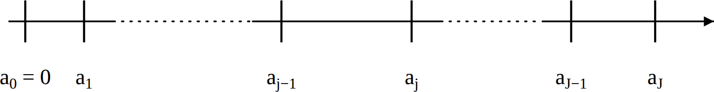
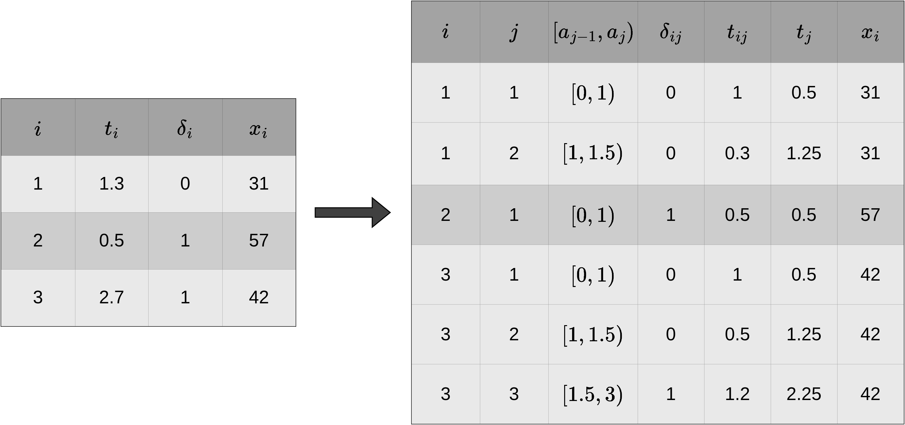
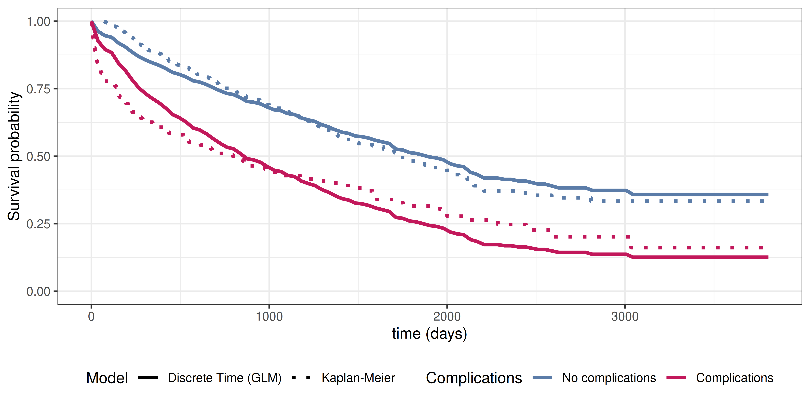
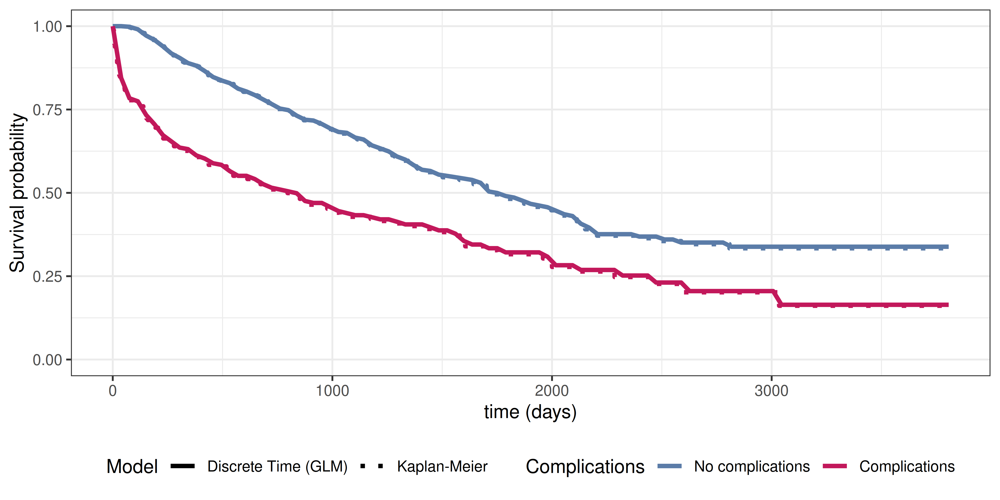
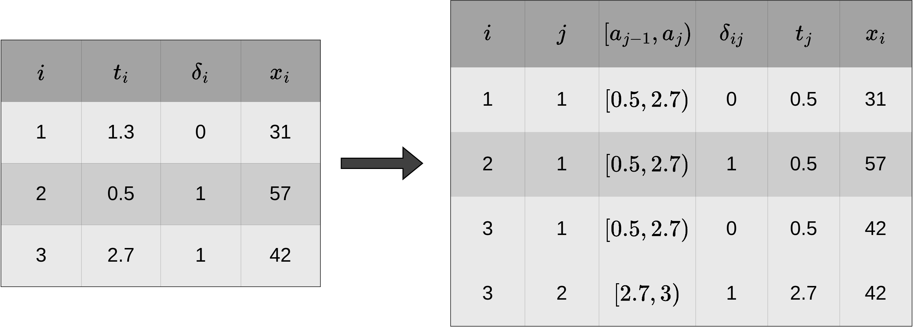
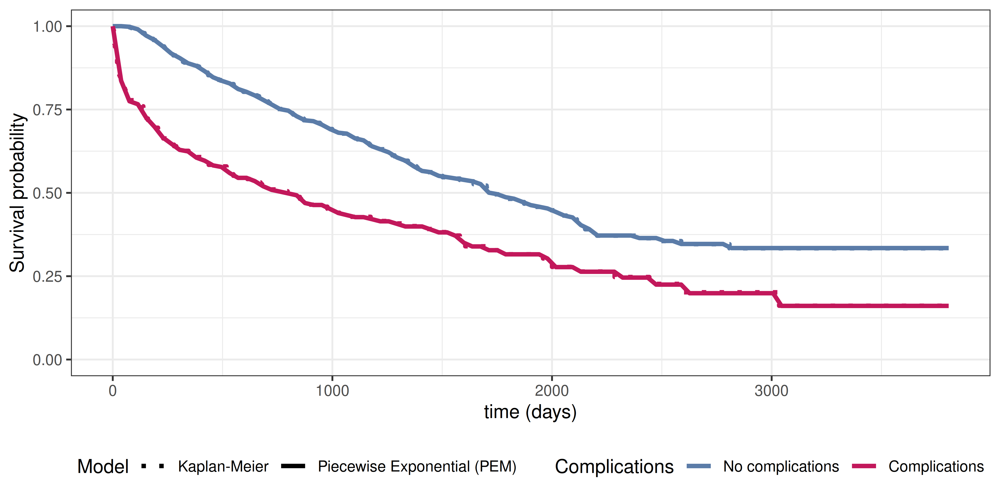

::: {.content-visible when-format="html"}

:::

# Partition based reductions {#sec-partition-based-reductions}



In contrast to the previously introduced reductions that focus on the estimation of a specific quantity of interest at one or few time points, partition-based reduction aim to estimate the entire distribution of the event times (similar to Cox models and other survival learners).
The general idea is to partition the time axis into $J$ disjunct intervals $[a_0,a_1),\ldots,[a_{J-1},a_J)$ and estimate a discrete or continuous hazard rate for each interval (sometimes left-open, right-closed intervals are used instead).

For illustration, consider the partitioning of the follow up in @fig-fu-partitioning.
Note that the intervals do not necessarily have to be equidistant.
The $j$ th interval is given by $I_j:=[a_{j-1},a_{j})$.
Let further $J_i$ the index of the interval in which observed time $t_i$ of subject $i$ falls, that is $t_i \in I_{J_i} = [a_{J_i-1},a_{J_i})$.

{#fig-fu-partitioning fig-alt="Partitioning the follow-up time into discrete intervals." width=80%}

Formally, define the partitioning of the follow-up via the set of interval boundary points $a_{j-1}$, $a_j$ for $j=1,\ldots,J$ as
<!--  -->
$$
\mathcal{A} = \{a_0, a_1, \ldots, a_J\}, \quad a_0 < a_1 < \ldots < a_J,
$$ {#eq-cut-points}
<!--  -->

where $a_0$ will often be zero and $a_J$ some time point larger than the last event time.
This partitioning is used to create a transformed data set, based on which standard regression or classification methods can be used in order to estimate (discrete) hazards in each interval.
@sec-data-transformation introduces the required data transformation in more detail.
Then @sec-discrete-time-reduction, @sec-survival-stacking and @sec-piecewise-constant-hazards define specific reductions based on this data transformation, provide theoretical justification why models applied to such transformed data are valid approaches for estimation in time-to-event analysis and provide illustrative examples for such models.
Finally, @sec-choice-of-interval-boundaries discusses computational aspects and modeling choices, including the choice of interval boundaries $a_j$ and the convention for left-closed vs. left-open intervals.

## Data Transformation {#sec-data-transformation}

In order to apply the reduction techniques introduced in the upcoming sections, standard time-to-event data needs to be transformed into a specific format. 
The transformation is based on the partitioning of the follow-up as illustrated in Figure @fig-fu-partitioning and given boundaries as defined in (@eq-cut-points).
The new data set contains $J_i$ rows for each subject $i$, that is one row for each interval in which subject $i$ was at risk of experiencing an event. 
<!-- Thus the overall number of rows in the transoformed data is given by  -->
 <!-- -->
<!-- $$\tilde{n} = \sum_{i=1}^n J_i = \sum_{i=1}^n \sum_{j=1}^J \II(t_i > a_{j-1}).$$ -->
<!--  -->

For each subject $i$, we record the subject's interval-specific event indicator
<!--  -->
$$
\delta_{ij} = \begin{cases}
1, & t_i \in [a_{j-1}, a_j) \text{ and } \delta_i = 1 \\
0, & \text{ else }
\end{cases},\quad j=1,\ldots,J_i,
$$ {#eq-interval-indicator}
<!--  -->

the time that subject $i$ was at risk for the event in interval $j$
<!--  -->
$$
t_{ij} = \begin{cases}
a_j - a_{j-1}, & \text{ if } t_i > a_j \\
t_i - a_{j-1}, & \text{ if } t_i \in [a_{J_i-1}, a_{J_i})\\
\end{cases},\quad j=1,\ldots,J_i,
$$ {#eq-time-at-risk}
<!--  -->
as well as some representation of the time in interval $j$, for example the interval midpoint (see @sec-choice-of-interval-boundaries for discussion of the choice of $t_j$)
<!--  -->
$$
t_j = \frac{a_{j-1} + a_j}{2}
$$ {#eq-interval-endpoint}
<!--  -->
and the subject's (potentially time-dependent) features
<!--  -->
$$
\xx_{ij}
$$ {#eq-interval-features}
<!--  -->
with $\xx_{ij} = \xx_{i}$ for all $j$, if the features are constant over time.

Thus, given the partition $\mathcal{A}$, the standard time-to-event data $\calD = \{(t_i, \delta_i, \xx_i)\}_{i=1,\ldots,n}$ is transformed to data 
<!--  -->
$$
\calD_{\mathcal{A}} = \{(i, j, \delta_{ij}, t_{ij}, t_j, \xx_{ij})\}_{i=1,\ldots,n;\  j=1,\ldots,J_i},
$$  {#eq-transformed-data}
<!--  -->
where $i$ and $j$ indices are usually only used for "book-keeping" purposes but are not used in modeling later on and $t_{ij}$ is only needed for the piecewise constant hazards approach (@sec-piecewise-constant-hazards).
Note that $t_j$ can be inerpreted as a time-dependent feature and could thus be --- as is done in practice --- subsumed in the features $\xx_{ij}$, but here we keep it separate for clarity and in order to highlight the importance of this feature which is necessary to estimate the interval-specific baseline hazards.

The data transformation procedure described above is illustrated in Figure @fig-data-trafo for hypothetical data. 
The left hand side of Figure @fig-data-trafo shows data in standard time-to-event format with one row per subject $i=1,\ldots,3$. For the transformation, we choose (arbitrary) interval boundaries $\mathcal{A} = \{0, 1, 1.5, 3\}$, which gives intervals $[0,1), [1,1.5), [1.5,3)$. The right-hand side of Figure @fig-data-trafo shows the transformed data $\mathcal{D}_{\mathcal{A}}$, where the first three columns keep track of subject and interval information and the other columns are the interval-specific event indicator, time at risk in the respective interval, representation of time, and (time-dependent) features as defined in Equations (@eq-interval-indicator), (@eq-time-at-risk), (@eq-interval-endpoint), and (@eq-interval-features), respectively.

{#fig-data-trafo fig-alt="Partitioning the follow-up time into discrete intervals." width=100%}

Note that $\delta_{ij}=0$ for all intervals except the last of subject $i$, where $\delta_{iJ_i} = \delta_i$. Thus the total number of events is the same in both the original and transformed data. In general, both data sets contain the same time-to-event information as the original data since, given the interval boundaries $\mathcal{A}$, the variables $\delta_{ij}$ and $t_{ij}$ are deterministic functions of the original data.

## Discrete Time Survival Analysis {#sec-discrete-time-reduction}

Recall from @sec-distributions-discrete that $\tilde{Y}$ denotes *discretized* time, such that $\tilde{Y}=j \Leftrightarrow Y \in [a_{j-1}, a_j)$.
Now consider the partitioning of the follow-up (@eq-cut-points) and assume we are only interested in whether the event occured within an interval rather than the exact event time.
The likelihood contribution of the $i$th observation is given by $P(Y_i \in [a_{J_i-1}, a_{J_i})) = P(\tilde{Y}_i = J_i)$ for subjects who experienced an event ($\delta_i = 1$) and
$P(Y_i \geq a_{J_i}) = P(\tilde{Y}_i > J_i)$ for censored observations ($\delta_i = 0$).

Thus, using definitions (@eq-discrete-surv-prob) and (@eq-discrete-prob), the likelihood contribution of subject $i$ is given by
<!--  -->
$$\begin{aligned}L_i 
& = P(Y_i \in [a_{J_i-1}, a_{J_i}))^{\delta_i} P(Y_i \geq a_{J_i})^{1-\delta_i}\\
& = \left[S_{\tilde{Y}}(J_i-1)h_{\tilde{Y}}(J_i)\right]^{\delta_i} \left[S_{\tilde{Y}}(J_i)\right]^{1-\delta_i}\\
& = \left[\left(\prod_{j=1}^{J_i-1} (1-h_{\tilde{Y}}(j))\right)h_{\tilde{Y}}(J_i)\right]^{\delta_i} \left[\prod_{j=1}^{J_i} (1-h_{\tilde{Y}}(j))\right]^{1-\delta_i},
\end{aligned}$${#eq-discrete-likelihood-1}
<!--  -->

Now recall from Equation (@eq-interval-indicator) the definition of the interval-specific event indicators $\delta_{ij}$, which always take value 0, except for the last interval, where $\delta_{iJ_i} = \delta_i$.
Thus, the first part of (@eq-discrete-likelihood-1) can be written as
$\prod_{j=1}^{J_i}(1-h_{\tilde{Y}}(j))^{1-\delta_{ij}}h_{\tilde{Y}}(j)^{\delta_{ij}}$ and the second part as $\prod_{j=1}^{J_i}(1-h_{\tilde{Y}}(j))^{1-\delta_{ij}}$.
It follows, that the likelihood (@eq-discrete-likelihood-1) can be written as
<!--  -->
$$\begin{aligned}
L_i 
& = \left[\prod_{j=1}^{J_i} (1-h_{\tilde{Y}}(j))^{1-\delta_{ij}}h_{\tilde{Y}}(j)^{\delta_{ij}}\right]^{\delta_i} \left[\prod_{j=1}^{J_i} (1-h_{\tilde{Y}}(j))^{1-\delta_{ij}}\right]^{1-\delta_i}\\
& = \prod_{j=1}^{J_i} (1-h_{\tilde{Y}}(j))^{1-\delta_{ij}}h_{\tilde{Y}}(j)^{\delta_{ij}},
\end{aligned}$${#eq-discrete-likelihood-2}
<!--  -->
where the last equality follows from $\delta_{ij}=0\ \forall j=1,\ldots,J_i$, if $\delta_i = 0$ and thus 
$\prod_{j=1}^{J_i}(1-h_{\tilde{Y}}(j))^{1-\delta_{ij}}h_{\tilde{Y}}(j)^{\delta_{ij}} = \prod_{j=1}^{J_i}(1-h_{\tilde{Y}}(j))^{1-\delta_{ij}}$.

The importance of this result may not be immediately apparent, but recall that if $Z \sim Bernoulli(\pi)$, where $\pi = P(Z = 1)$, then the likelihood contribution of an observation $z$ is given by $P(Z = z) = \pi^z (1-\pi)^{1-z}$.
We therefore recognize that the likelihood contribution (@eq-discrete-likelihood-2) can also be obtained by assuming that the interval-specific event indicators $\delta_{ij}$ are realizations of random variables $\Delta_{ij} \stackrel{iid}{\sim} Bernoulli(\pi_j = h_{\tilde{Y}}(j))$.
Thus
<!--  -->
$$\begin{aligned}
\pi_j & = P(\Delta_{ij} = 1|t_j)\\ & = P(Y_i \in [a_{j-1}, a_j) | Y_i \geq a_{j-1}) = h_{\tilde{Y}}(j)
\end{aligned}$$ {#eq-discrete-hazard-probability}
<!--  -->
Note that in (@eq-discrete-hazard-probability), $\Delta_{ij} =1$ is equivalent to $Y_i \in [a_{j-1}, a_j)$, while the conditioning on $Y_i \geq a_{j-1}$ is implicit in the definition of $\delta_{ij}$ in (@eq-interval-indicator).

This implies that we can estimate the discrete time hazards $h_{\tilde{Y}}(j)$ for each interval $j$ by fitting any binary classifcation model to the transformed data set
<!--  -->
$$\calD_{\mathcal{A}} = \{(\delta_{ij}, t_{j})\}_{i=1,\ldots,n;\quad j=1,\ldots,J_i},$${#eq-discrete-data}
<!--  -->
where $\delta_{ij}$ are the targets and $t_{j}$ --- some representation of time in interval $j$ (for example $t_j = j$ or $t_j = a_{j-1}$) --- enters the estimation as a feature and is needed in order to estimate different hazards/probabilities in different intervals.

In the presence of features $\xx_{i}$ we assume $\Delta_{ij}| \xx_{i}, t_j \stackrel{iid}{\sim} Ber(\pi_{ij})$, where $\pi_{ij} = P(\Delta_{ij} = 1| \xx_{i}, t_j) = h_{\tilde{Y}}(j|\xx_{i})$ is the discrete hazard rate for interval $j$ given features $\xx_{i}$ and is estimated by applying binary classifiers to
<!--  -->
$$\calD_{\mathcal{A}} = \{(\delta_{ij}, \xx_{i}, t_{j})\}_{i=1,\ldots,n;\quad j=1,\ldots,J_i}.$$
<!--  -->

### Example: Logistic Regression

To illustrate the discrete time reduction approach, once again consider the tumor data set introduced in Table @tbl-surv-data-tumor. The follow-up time is partitioned into $J = 100$ equidistant intervals and the data is transformed according to the procedure described in @sec-data-transformation.
Define $x_{i1} = \mathbb{I}(\text{complications}_i = \text{"yes"})$.
We then fit a logistic regression model 
<!--  -->
$$\text{logit}(\pi_{ij}) = \beta_{0j} + \beta_1x_{i1}
$${#eq-discrete-time-glm-po}
<!--  -->
to the transformed data set, where $j$ denotes the interval index, $\beta_{0j}$ are the interval-specific intercepts (technically we include the interval index $j$ as a reference coded categorical feature in the model) and $\beta_1$ is the common effect of complications on the discrete hazard rate (accross all intervals).

The estimated survival probabilities are obtained by calculating $\hat{S}_{\tilde{Y}}(j|x_{1}) = \prod_{k=1}^j (1-\hat{h}_{\tilde{Y}}(k|x_{1}))$ for each interval $j$ and complication group, where $\hat{h}_{\tilde{Y}}(k|x_{1})$ are the predicted discrete hazards from the logistic regression model.

Figure @fig-discrete-time-glm shows the estimated survival probabilities from the discrete time model (dashed lines) together with the Kaplan-Meier estimates (solid lines) for comparison.
The model specified in Equation (@eq-discrete-time-glm-po) is a proportional odds model, where the baseline hazard is the same for both complication groups, thus the shape of the hazard and therefore the survival probability curve is the same for both complication groups, shifted by the common effect of complications. This does not describe the data too well as the hazards are different in the two groups (as discussed in @sec-pseudo-value-S).

{#fig-discrete-time-glm fig-alt="Single plot showing survival curves for patients with and without complications. Kaplan-Meier estimates are shown as solid lines (black for no complications, gray for complications) and discrete time model estimates are shown as dashed blue lines (darker blue for no complications, lighter blue for complications)."}

In order to estimate separate discrete baseline hazards for each group, we can introduce an interaction term between the interval and complications variables to obtain the model
<!--  -->
$$\text{logit}(\pi_{ij}) = \beta_{0j} + \beta_{1j}x_{i1},
$${#eq-discrete-time-glm-interaction}
<!--  -->
where $\beta_{0j}$ are the interval-specific intercepts for the reference group (no complications), $\beta_{1j}$ are the deviations from the reference group for the complications group (technically this is fit as an interaction model using reference coded categorical features for interval and complications).
This specification allows the shape of the hazard and therefore the survival probability curve to be different for the two groups. 

Figure @fig-discrete-time-glm-interaction shows the estimated survival probabilities from the interaction model (dashed lines) together with the Kaplan-Meier estimates (solid lines) for comparison.
The interaction model provides a much better fit to the data compared to the proportional odds model, as it allows for separate baseline hazards for each complications group. The difference to the Kaplan-Meier estimates is barely detectable. 

{#fig-discrete-time-glm-interaction fig-alt="Single plot showing survival curves for patients with and without complications. Kaplan-Meier estimates are shown as solid lines and discrete time model estimates with interaction are shown as dashed lines, both colored by complications status."}

While this is a simple example with only one feature, it shows that the discrete time reduction approach provides a good approximation of the event time distribution when the number of intervals is large enough, despite the fact that we ignore the information about the exact event time.
Importantly, the estimated survival probabilities are discrete, representing survival probabilities at the interval endpoints. 
However, a simple solution to generate continuous survival function predictions is to linearly interpolate between the interval endpoints.

The example also raises the question about the choice of the number of intervals $J$ and the placement of interval boundaries $\mathcal{A}$. These questions will be discussed in more detail in @sec-choice-of-interval-boundaries, which is relevant for both, the discrete time reduction approach and the piecewise constant hazards approach discussed in @sec-piecewise-constant-hazards.

## Survival Stacking {#sec-survival-stacking}

Survival stacking (@craigreviewsurvival) casts survival tasks to classification tasks similarly to the discrete time method described in Section @sec-discrete-time-reduction.
It can be viewed as a special case of the discrete time approach, where the interval boundaries are defined by the unique, observed, ordered event times, such that
<!--  -->
$$\mathcal{A} = \{t_{(1)}, \ldots, t_{(m+1)}: t_{(j)} < t_{(j+1)}\},$${#eq-survival-stacking-intervals}
<!--  -->
resulting in intervals $[t_{(1)}, t_{(2)}), \ldots, [t_{(m-1)}, t_{(m)}), [t_{(m)}, t_{(m+1)})$, where $t_{(m+1)}$ is some time point larger than the last event time; see @sec-left-closed-vs-left-open).
Equivalently, survival stacking can be motivated analogous to the construction of the Kaplan-Meier estimator (@sec-surv-km): at each observed event time $t_{(j)}$, we consider all subjects in the risk set $\calR_{t_{(j)}}$ and record whether or not they experience an event at this time.

For illustration, consider once again, the example from Figure @fig-data-trafo.
The adapted data-transformation (using $t_{(m+1)} = 3$) for survival stacking is shown in Figure @fig-data-trafo-stacking (dropping columns that are not meaningful here).
At the first event time $t_{(1)} = 0.5$, all subjects are still at risk for the event.
At time $t_{(2)} = 2.7$, however, only subject $3$ is still at risk for the event.

<!-- https://drive.google.com/file/d/1kOnoJpER1hrM19x5IQ1PqAAAh0G-wvqZ/view?usp=sharing -->
{#fig-data-trafo-stacking fig-alt="Partitioning the follow-up time into discrete intervals." width=100%}

Note that in contrast to @fig-data-trafo, here subject $1$ has only one row and subject $3$ has two rather than three rows.
This could suggest that the data transformation for survival stacking creates smaller data sets, however, we need to create a row for each subject for each observed event time $t_{(j)}, j=1,\ldots,m$ at which the subject is at risk, whereas for the discrete time approach in @sec-discrete-time-reduction one can freely choose the number and placement of interval boundaries $\mathcal{A}$, such that the discrete time approach will have less rows if $J < m$.

Survival stacking yields data
<!--  -->
$$\calD_{\mathcal{A}} = \{(\delta_{ij}, t_{(j)}, \xx_{ij})\}_{i=1,\ldots,n;\ j=1,\ldots,m+1:\ i \in \calR_{t_{(j)}}},$${#eq-survival-stacking-data}
<!--  -->
where the $\delta_{ij}$ can be used as targets for binary classification, $t_{(j)}$ serves as the time representation feature (here the interval startpoint $t_j = t_{(j)}$), and as before, any algorithm that returns class probabilities can be used for estimation.

## Piecewise Constant Hazards {#sec-piecewise-constant-hazards}

The general idea of the piecewise constant hazards approach is conceptually simple: 

1. Partition the follow-up into many intervals
2. Estimate a constant hazard rate for each interval

Intuitively, any underlying continuous hazard function of the data generating process can be approximated arbitrarily well given enough intervals (and events).
This model class is known as the piecewise exponential model (PEM) because assuming event times to be exponentially distributed, implies constant hazards within each interval.

Consider the partitioning of the follow-up as defined in (@eq-cut-points) and assume that within each interval $I_j = [a_{j-1}, a_j)$, the hazard function is constant, that is
<!--  -->
$$h(\tau) = h_j,\ \forall\ \tau \in I_j.$${#eq-constant-hazard}
<!--  -->
Note that left-closed, right-open intervals are used here for consistency with the discrete time approach in @sec-discrete-time-reduction. In the PEM literature on the other hand, intervals are often defined as left-open, right-closed (see also @sec-choice-of-interval-boundaries).

First we derive the likelihood contribution of subject $i$ under assumption (@eq-constant-hazard),
starting with the general likelihood for right-censored data (@eq-right-censoring-likelihood):
<!--  -->
$$\begin{aligned}
\calL_{i} 
& = h(t_i)^{\delta_{i}}S(t_i)\\
& = h(t_i)^{\delta_{i}}\exp\left(-\int_{0}^{t_i} h(u) \ \du\right)\\
& = h_{J_i}^{\delta_{i}}\exp\left(-\left[\sum_{j=1}^{J_i-1} (a_j - a_{j-1})h_j + (t_i - a_{J_i-1})h_{J_i}\right]\right)\\
& = h_{J_i}^{\delta_{i}}\exp\left(-\sum_{j=1}^{J_i} h_j t_{ij}\right) = h_{J_i}^{\delta_{i}}\prod_{j=1}^{J_i}\exp\left(- h_j t_{ij}\right)\\
& = \prod_{j=1}^{J_i} h_j^{\delta_{ij}} \exp(-h_j t_{ij}),
\end{aligned}$${#eq-pem-likelihood-general}
<!--  -->
where the first equality follows from (@eq-surv-haz), the third and fourth equalities follow from the hazard being a step function (@eq-constant-hazard) and definition (@eq-time-at-risk), and the last equality follows from (@eq-interval-indicator) such that $h_{J_i}^{\delta_i} = \prod_{j=1}^{J_i} h_j^{\delta_{ij}}$ (when $\delta_i = 0$, all $\delta_{ij} = 0$, when $\delta_{i} = 1$, only $\delta_{iJ_i} = 1$).

Now assume that the interval-specific event indicators $\delta_{ij}$ are realizations of random variables $\Delta_{ij} \stackrel{iid}\sim \text{Poisson}(\mu_{ij} : = h_j t_{ij})$ and recall that $Z\sim \text{Poisson}(\mu)$ implies $P(Z = z) = \frac{\mu^z \exp(-\mu)}{z!}$.
Thus, the likelihood contribution of subject $i$ can be written as 
<!--  -->
$$\begin{aligned}
\calL_{\text{Poisson},i} 
& = \prod_{j=1}^{J_i} P(\Delta_{ij} = \delta_{ij}) = \prod_{j=1}^{J_i} \frac{(h_j t_{ij})^{\delta_{ij}} \exp(-h_j t_{ij})}{\delta_{ij}!}\\
& = \prod_{j=1}^{J_i} h_j^{\delta_{ij}} t_{ij}^{\delta_{ij}}\exp(-h_j t_{ij}),
\end{aligned}$$ {#eq-pem-poisson-likelihood}
<!--  -->
where the last equality follows from $\delta_{ij} \in \{0,1\}$ and $0!=1!=1$.

Note that $\calL_{i,\text{Poisson}} \propto \calL_i$ from equation (@eq-pem-likelihood-general), since $t_{ij}$ is a constant and does not depend on the parameters of interest (here $h_j$).
This implies that we can estimate a model with piecewise constant hazards by optimizing the Poisson likelihood (@eq-pem-poisson-likelihood). The $t_{ij}$ term enters as an offset $\log(t_{ij})$ in the Poisson regression model.

More generally, in the presence of features $\xx_i$, assume $\delta_{ij}|\xx_i \stackrel{iid}{\sim} \text{Poisson}(\mu_{ij})$, where $\mu_{ij} = h_{ij} t_{ij}$ is the expected number of events in interval $j$ given features $\xx_i$ and $h_{ij} = g(t_j, \xx_i)$ is the hazard rate in interval $j$ given features $\xx_i$.
This can be estimated by fitting a Poisson regression model with log-link to the transformed data set
<!--  -->
$$\calD_{\mathcal{A}} = \{(\delta_{ij}, t_{ij}, t_j, \xx_{ij})\}_{i=1,\ldots,n; j=1,\ldots,J_i},$${#eq-pem-data}
<!--  -->
where the model specification is
<!--  -->
$$\log(\mathbb{E}[\Delta_{ij}]) = \log(h_{ij}) + \log(t_{ij}),$${#eq-pem-model}
<!--  -->
where $\log(h_{ij}) = g(\xx_i, t_j)$ is the interval and feature specific hazard rate, $g$ is a function learned by the model of choice and $\log(t_{ij})$ is included as an offset term in the Poisson likelihood/Loss function.

Importantly, in contrast to the discrete time reductions in @sec-discrete-time-reduction, the piecewise exponential model likelihood has no information loss regarding the exact time-to-event by including the $t_{ij}$ terms (@eq-time-at-risk) and estimates continuous time hazards rather than discrete time hazards.

<!-- TODO: The model predicts $\hat{h}_{ij}$ and we need to transform this to $\hat{S}_{ij}$ if we want S(t) predictions -->

### Example: Poisson Regression

To illustrate the piecewise constant hazards approach, we once again consider the tumor data set.
We partition the follow-up time into $J = 100$ equidistant intervals.
We then fit a Poisson regression model with interaction between interval and complications to allow for separate baseline hazards for each complications group: 

<!--  -->
$$\log(\mu_{ij}) = \log(\mathbb{E}[\Delta_{ij}]) = \underbrace{\beta_{0j} + \beta_{1j}x_{i1}}_{\log(h_{ij})} + \log(t_{ij}),$${#eq-pem-model-interaction}
<!--  -->
where $x_{i1} = \mathbb{I}(\text{complications}_i = \text{"yes"})$, $\beta_{0j}$ are the interval-specific intercepts for the reference group (no complications), $\beta_{1j}$ are the deviations from the reference group for the complications group (as in (@eq-discrete-time-glm-interaction), this is estimated as an interaction model using reference coded categorical features for interval and complications), and $\log(t_{ij})$ enters as offset term.

<!-- TODO: show estimated hazards? -->

Figure @fig-pem-interaction shows the estimated survival probabilities from the piecewise exponential model (dashed lines) together with the Kaplan-Meier estimates (solid lines) for comparison.
The piecewise exponential model provides an excellent fit to the data, closely approximating the Kaplan-Meier estimates.
This demonstrates that the piecewise constant hazards approach can effectively estimate the survival distribution when using a sufficient number of intervals.

{#fig-pem-interaction fig-alt="Single plot showing survival curves for patients with and without complications. Kaplan-Meier estimates are shown as solid lines and piecewise exponential model estimates are shown as dashed lines, both colored by complications status."}

## Choice of Interval Boundaries {#sec-choice-of-interval-boundaries}

The reduction approaches introduced in the previous sections all depend on the choice of the partition $\mathcal{A}$ (@eq-cut-points). This section discusses the practical considerations involved in selecting interval boundaries, including the number and placement of cut points, the conventions and considerations with respect to left-closed vs. left-open intervals, the representation of time within intervals, and implications for left-truncated data.

### Number and Placement of Cut Points

The choice of the number of intervals $J$ and the placement of the interval boundaries $a_j$ involves a trade-off between flexibility, robustness, and computational cost.
More intervals allow for a finer approximation of the underlying hazard function, but at the cost of less robust estimates (fewer events per interval) and a larger transformed data set.
Fewer intervals yield more stable estimates but may miss important variation in the hazard.

The simplest strategy is to use equidistant intervals, which does not require any knowledge about the data but also does not adapt to it.
A more data-adaptive strategy is to use quantile-based intervals, which place more cut points in regions with higher event density and fewer in regions with sparse events.

A natural alternative is to use the unique, observed event times as cut points, as done in survival stacking (@sec-survival-stacking). This mirrors the construction of the Kaplan-Meier estimator and ensures that interval boundaries are dense where events are frequent and sparse where they are rare. The same strategy is the default in software packages for PEMs like `pammtools` [@pkgpammtools].
However, using all unique event times can lead to very large transformed data sets: since each of $n$ subjects can contribute up to $m$ rows (where $m$ is the number of unique event times), the augmented data set has $\tilde{n} = \sum_{i=1}^n J_i$ rows, which is $O(nm)$ in the worst case.
@Bender2021 showed that using a subsample of event times as cut points yields comparable predictive performance while keeping the increase in data set size linear in the number of events, making this a practical strategy when $m$ is large.

<!-- For the PEM approach, @Friedman1982 showed that the PEM estimator is consistent as long as the number of intervals grows with $n$ and the maximum interval length shrinks to zero, even when the true hazard is not a step function. In practice, this means that using a reasonably fine partition is sufficient for good approximation, and the partition does not need to be "correct" --- it only needs to be fine enough relative to the variation in the underlying hazard. -->

### Left-Closed vs. Left-Open Intervals {#sec-left-closed-vs-left-open}

Throughout this chapter, we have used left-closed, right-open intervals $[a_{j-1}, a_j)$, consistent with the discrete time definitions in @sec-distributions-discrete.
This is the natural convention for discrete time/riskset-based approaches (Kaplan-Meier, Nelson-Aalen, survival stacking), because all observations before the event time are excluded from the risk set in the interval $[t_{(k)}, t_{(k+1)})$, leading to the equivalence of the discrete time hazard and riskset-based estimation.
This is also the definition used by @Tutz2016.

In the PEM literature, however, left-open, right-closed intervals $(a_{j-1}, a_j]$ are more commonly used. Software packages like `pammtools` [@pkgpammtools] adopt this convention and use event times as default cut points with $t_j = a_j$ (the right endpoint).

In most practical situations, the choice of convention has negligible impact on the results: when intervals are small, both conventions produce nearly identical estimates.
The distinction matters primarily when interval boundaries coincide with event times, as is the case in survival stacking or when event times are used as cut points for PEM.
In this situation, with left-closed intervals $[a_{j-1}, a_j)$ and the first cut point equal to the first event time, no events can occur in interval before $[0, t_{(1)})$ contains no events.
Hazard estimates in such event-free intervals are unstable or undefined, and these intervals should be excluded from modeling (the hazard is zero and survival probability is one by definition in this interval).
With left-open, right-closed intervals, the first event time $t_{(1)}$ is included in the first interval $(0, t_{(1)}]$, avoiding this issue.
Additionally, the definition of the last interval is somewhat akward when using left-open intervals since there is no natural endpoint, for example $[t_{(m}, t_{(m)}+1)$ and $[t_{(m)}, \infty)$ will yield the same number of zeros and 1s in the last interval und thus the same hazard rate estimate.

### Representation of Time Within Intervals

The time representation feature $t_j$ serves as the "time coordinate" for interval $j$ in the model.
As introduced in @sec-data-transformation, one common choice is the interval midpoint $t_j = (a_{j-1} + a_j)/2$, but other choices include the interval start point $t_j = a_{j-1}$ or the endpoint $t_j = a_j$.

The choice of $t_j$ interacts with the interval convention.
With left-open, right-closed intervals $(a_{j-1}, a_j]$, the right endpoint $a_j$ is a natural representative because it is included in the interval.
<!-- The `pammtools` package, for instance, uses $t_j = a_j$ by default [@pkgpammtools].  -->
With left-closed, right-open intervals $[a_{j-1}, a_j)$, the left endpoint $a_{j-1}$ is more natural, particularly when a smooth function of $t_j$ is estimated: the right endpoint $a_J$ of the last interval is not contained in that interval and the midpoint is arbitrary because there is no natural endpoint for the last interval. For survival stacking (@sec-survival-stacking), the interval start point $t_j = t_{(j)}$ is used, since the event time itself defines the interval.

A related modeling choice is whether $t_j$ enters the model as a categorical (factor) or continuous variable:

- When $t_j$ is treated as a factor variable, the specific choice of $t_j$ (midpoint, endpoint, etc.) doesn't matter at all. Each interval receives its own parameter (e.g., an interval-specific intercept $\beta_{0j}$), as in the examples in Sections @sec-discrete-time-reduction and @sec-piecewise-constant-hazards. This is the classical PEM approach and provides maximal flexibility, but assumes that the hazard in each interval is estimated independently of neighboring intervals. Without penalization, this can lead to implausible hazard estimates, especially when some intervals contain few events. The number of baseline hazard parameters equals $J$, which becomes prohibitive when $J$ is large (e.g., when using all unique event times as cut points).
- When $t_j$ enters as a continuous variable, the specific choice of $t_j$ is also not too important but for the last interval and depending on the interval convention. For modeling, a functional relationship between time and the (log-)hazard is assumed. A linear relationship $\log(h_j) = \beta_0 + \beta_1 t_j$ implies that the log-hazard changes at a constant rate over time, which is overly restrictive for most applications. Instead, the function should be estimated as a flexible non-linear function $\log(h_j) = f(t_j)$, for example using penalized splines (@Bender2018, @Kopper2022) or tree based methods (@Bender2021). Here, the number of parameters for the baseline hazard depends only on the number of basis functions (not the number of intervals), making this approach scalable to fine partitions. Penalization also ensures that hazard estimates in neighboring intervals are similar unless the data provides strong evidence for rapid changes.

In practice, the continuous approach with some form of penalization or regularized breakpoint detection (as in gradient boosted trees) combines the flexibility of a fine partition with the stability of regularization and is recommended when the number of intervals is moderate to large.

### Left-Truncation {#sec-left-truncation-intervals}

When data are subject to left-truncation (delayed entry), the choice of interval boundaries has additional implications.

In general, because the outcomes $\delta_{ij}$ are only defined for intervals in which subject $i$ is at risk for the event, left-truncation can be naturally incorporated by excluding intervals with $a_j < t_i^L$ from the data set, which is equivalent to the definition of the risk set in presence of left-truncation (@eq-risk-lt). This also mirrors the handling of left-truncation in the Cox model. One special case arises, when the left-truncation time is not equivalent to one of the interval boundaries. In such cases, only including intervals for each subject for which they have been at risk from the beginning is most consistent with the riskset-based approach in discrete time.
For PEM-based analysis, sometimes the left-truncation times are used as additional interval boundaries, which ensures that no subject enters the risk set in between intervals. This however increases the size of the data set further and can lead to intervals with no events. This approach is therefore only practical in combination with regularized baseline hazard estimation.

